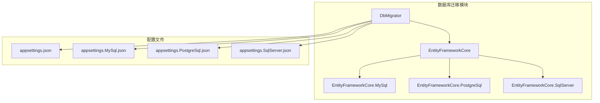
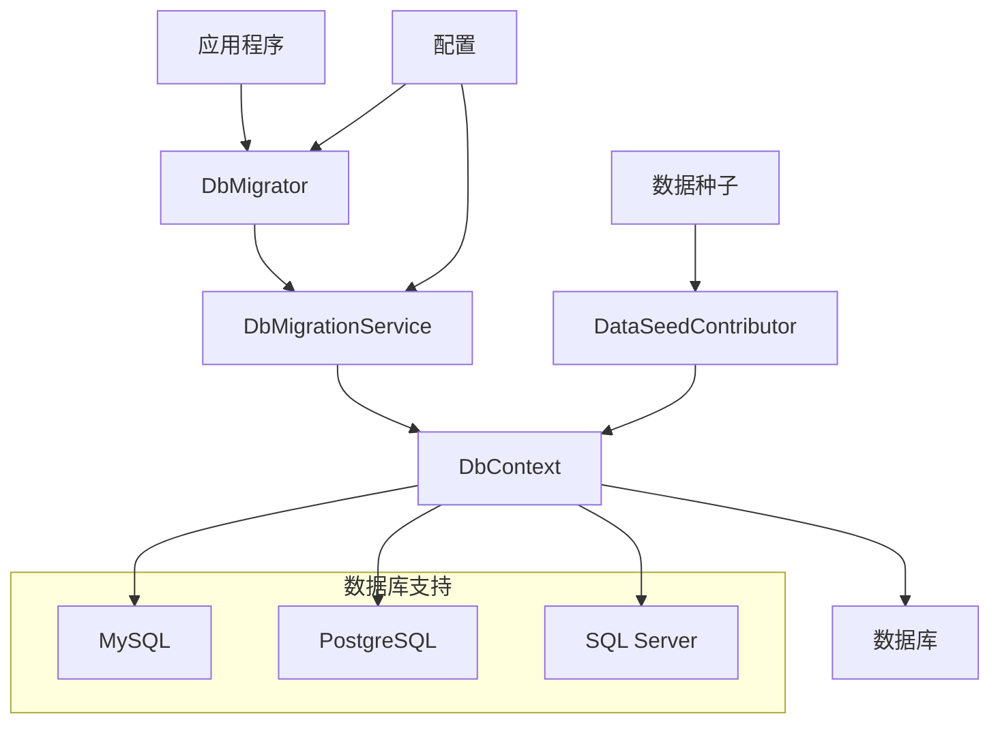
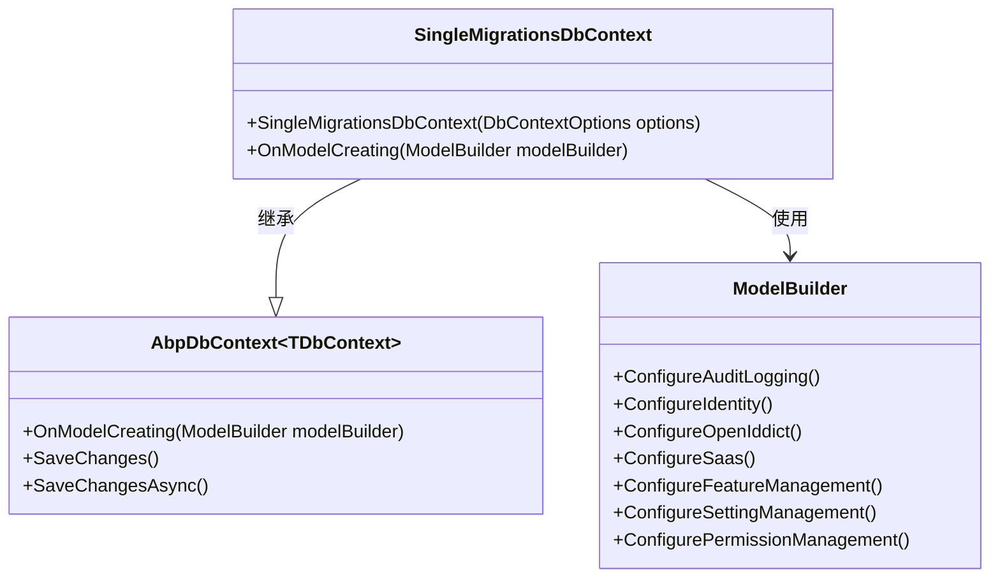
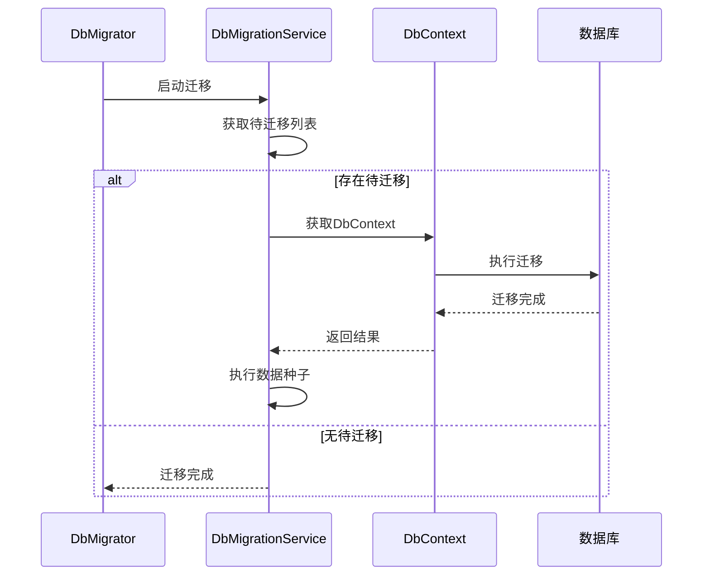
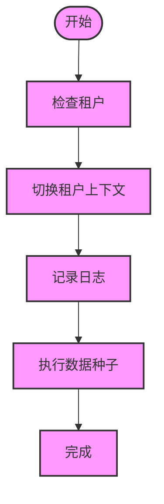
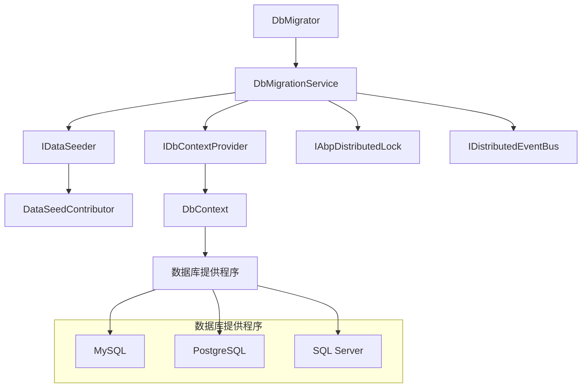

# 数据库迁移与数据管理

<cite>
**本文档引用的文件**
- [SingleMigrationsDbContext.cs](file://aspnet-core/migrations/LY.MicroService.Applications.Single.EntityFrameworkCore/SingleMigrationsDbContext.cs)
- [SingleDbMigrationService.cs](file://aspnet-core/migrations/LY.MicroService.Applications.Single.EntityFrameworkCore/SingleDbMigrationService.cs)
- [SingleMigrationsEntityFrameworkCoreModule.cs](file://aspnet-core/migrations/LY.MicroService.Applications.Single.EntityFrameworkCore/SingleMigrationsEntityFrameworkCoreModule.cs)
- [RolePermissionDataSeedContributor.cs](file://aspnet-core/migrations/LY.MicroService.BackendAdmin.EntityFrameworkCore/RolePermissionDataSeedContributor.cs)
- [appsettings.SqlServer.json](file://aspnet-core/migrations/LY.MicroService.Applications.Single.DbMigrator/appsettings.SqlServer.json)
- [EfCoreRuntimeDbMigratorBase.cs](file://aspnet-core/framework/common/LINGYUN.Abp.Data.DbMigrator/LINGYUN/Abp/Data/DbMigrator/EfCoreRuntimeDbMigratorBase.cs)
</cite>

## 目录
1. [简介](#简介)
2. [项目结构](#项目结构)
3. [核心组件](#核心组件)
4. [架构概述](#架构概述)
5. [详细组件分析](#详细组件分析)
6. [依赖分析](#依赖分析)
7. [性能考虑](#性能考虑)
8. [故障排除指南](#故障排除指南)
9. [结论](#结论)

## 简介
本文档详细介绍了在ABP框架中如何进行数据库迁移与数据管理。重点阐述了如何为新模块创建Entity Framework Core上下文，定义实体模型和数据库表结构，以及如何生成和应用数据库迁移脚本。同时，文档还解释了数据种子（Data Seed）的概念和实现方式，以及如何在模块初始化时填充基础数据。最后，提供了处理多数据库支持（如MySQL、PostgreSQL、SQL Server）的最佳实践。

## 项目结构
本项目采用微服务架构，每个服务都有独立的数据库迁移模块。数据库迁移相关的代码主要位于`aspnet-core/migrations`目录下，每个模块都有对应的EntityFrameworkCore项目来处理数据访问和迁移。

**图示来源**
- [SingleMigrationsDbContext.cs](file://aspnet-core/migrations/LY.MicroService.Applications.Single.EntityFrameworkCore/SingleMigrationsDbContext.cs)
- [appsettings.SqlServer.json](file://aspnet-core/migrations/LY.MicroService.Applications.Single.DbMigrator/appsettings.SqlServer.json)

**节来源**
- [SingleMigrationsDbContext.cs](file://aspnet-core/migrations/LY.MicroService.Applications.Single.EntityFrameworkCore/SingleMigrationsDbContext.cs)
- [appsettings.SqlServer.json](file://aspnet-core/migrations/LY.MicroService.Applications.Single.DbMigrator/appsettings.SqlServer.json)

## 核心组件
数据库迁移系统的核心组件包括：
- **DbContext**: 定义实体模型和数据库表结构
- **DbMigrationService**: 处理数据库迁移逻辑
- **DataSeedContributor**: 负责数据种子的实现
- **DbMigratorModule**: 配置迁移模块的依赖关系

这些组件协同工作，确保数据库结构的正确性和数据的完整性。

**节来源**
- [SingleMigrationsDbContext.cs](file://aspnet-core/migrations/LY.MicroService.Applications.Single.EntityFrameworkCore/SingleMigrationsDbContext.cs)
- [SingleDbMigrationService.cs](file://aspnet-core/migrations/LY.MicroService.Applications.Single.EntityFrameworkCore/SingleDbMigrationService.cs)
- [RolePermissionDataSeedContributor.cs](file://aspnet-core/migrations/LY.MicroService.BackendAdmin.EntityFrameworkCore/RolePermissionDataSeedContributor.cs)

## 架构概述
数据库迁移系统采用分层架构设计，各层职责分明，便于维护和扩展。

**图示来源**
- [SingleDbMigrationService.cs](file://aspnet-core/migrations/LY.MicroService.Applications.Single.EntityFrameworkCore/SingleDbMigrationService.cs)
- [SingleMigrationsDbContext.cs](file://aspnet-core/migrations/LY.MicroService.Applications.Single.EntityFrameworkCore/SingleMigrationsDbContext.cs)

## 详细组件分析

### DbContext分析
DbContext是Entity Framework Core的核心组件，负责定义实体模型和数据库表结构。

**图示来源**
- [SingleMigrationsDbContext.cs](file://aspnet-core/migrations/LY.MicroService.Applications.Single.EntityFrameworkCore/SingleMigrationsDbContext.cs)

**节来源**
- [SingleMigrationsDbContext.cs](file://aspnet-core/migrations/LY.MicroService.Applications.Single.EntityFrameworkCore/SingleMigrationsDbContext.cs)

### 数据库迁移服务分析
数据库迁移服务负责执行实际的迁移操作，包括创建数据库、应用迁移脚本等。

**图示来源**
- [SingleDbMigrationService.cs](file://aspnet-core/migrations/LY.MicroService.Applications.Single.EntityFrameworkCore/SingleDbMigrationService.cs)
- [EfCoreRuntimeDbMigratorBase.cs](file://aspnet-core/framework/common/LINGYUN.Abp.Data.DbMigrator/LINGYUN/Abp/Data/DbMigrator/EfCoreRuntimeDbMigratorBase.cs)

**节来源**
- [SingleDbMigrationService.cs](file://aspnet-core/migrations/LY.MicroService.Applications.Single.EntityFrameworkCore/SingleDbMigrationService.cs)

### 数据种子分析
数据种子用于在数据库初始化时填充基础数据，如角色、权限等。

**图示来源**
- [RolePermissionDataSeedContributor.cs](file://aspnet-core/migrations/LY.MicroService.BackendAdmin.EntityFrameworkCore/RolePermissionDataSeedContributor.cs)

**节来源**
- [RolePermissionDataSeedContributor.cs](file://aspnet-core/migrations/LY.MicroService.BackendAdmin.EntityFrameworkCore/RolePermissionDataSeedContributor.cs)

## 依赖分析
数据库迁移系统的依赖关系清晰，各模块之间通过接口进行通信。

**图示来源**
- [SingleMigrationsEntityFrameworkCoreModule.cs](file://aspnet-core/migrations/LY.MicroService.Applications.Single.EntityFrameworkCore/SingleMigrationsEntityFrameworkCoreModule.cs)
- [SingleDbMigrationService.cs](file://aspnet-core/migrations/LY.MicroService.Applications.Single.EntityFrameworkCore/SingleDbMigrationService.cs)

**节来源**
- [SingleMigrationsEntityFrameworkCoreModule.cs](file://aspnet-core/migrations/LY.MicroService.Applications.Single.EntityFrameworkCore/SingleMigrationsEntityFrameworkCoreModule.cs)

## 性能考虑
在进行数据库迁移时，需要考虑以下性能因素：
- 使用分布式锁避免并发迁移
- 批量处理租户数据以提高效率
- 异步执行迁移操作以避免阻塞
- 合理配置数据库连接池

## 故障排除指南
常见问题及解决方案：
- **迁移失败**: 检查数据库连接字符串和权限
- **数据种子失败**: 确认租户上下文正确切换
- **并发问题**: 确保分布式锁正常工作
- **性能问题**: 优化查询和批量处理

**节来源**
- [SingleDbMigrationService.cs](file://aspnet-core/migrations/LY.MicroService.Applications.Single.EntityFrameworkCore/SingleDbMigrationService.cs)
- [EfCoreRuntimeDbMigratorBase.cs](file://aspnet-core/framework/common/LINGYUN.Abp.Data.DbMigrator/LINGYUN/Abp/Data/DbMigrator/EfCoreRuntimeDbMigratorBase.cs)

## 结论
本文档详细介绍了ABP框架中的数据库迁移与数据管理系统。通过合理的架构设计和组件划分，系统能够有效地管理数据库结构变更和基础数据填充。多数据库支持和分布式锁机制确保了系统的可靠性和可扩展性。建议在实际使用中遵循本文档的最佳实践，以确保数据库迁移的顺利进行。