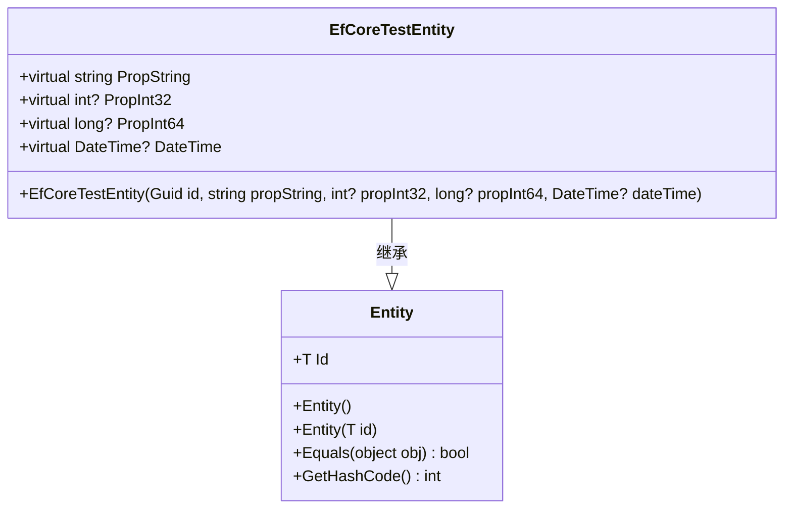
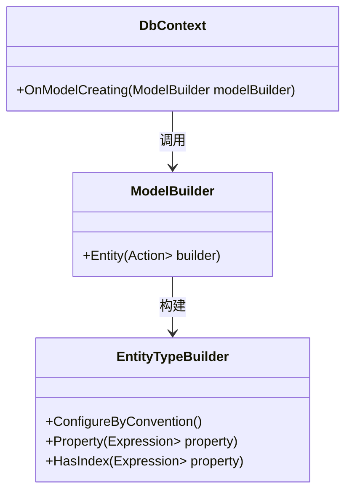
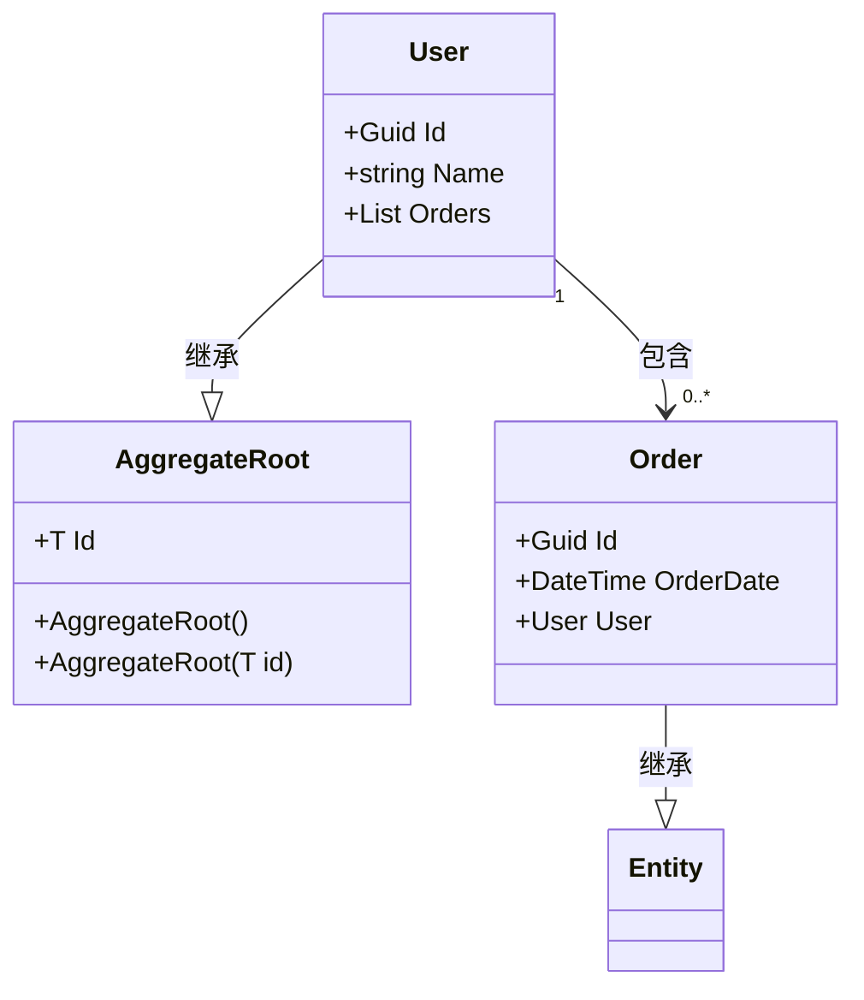
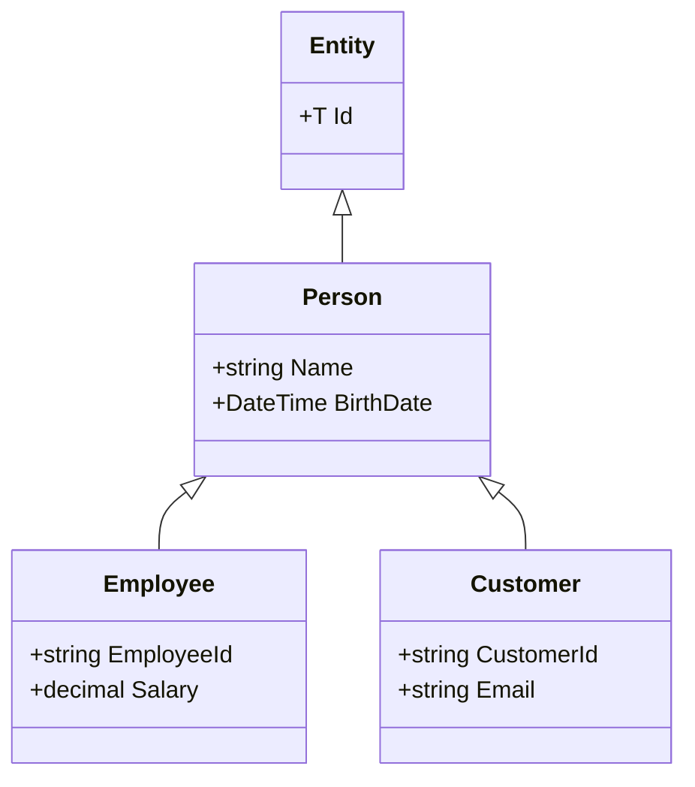
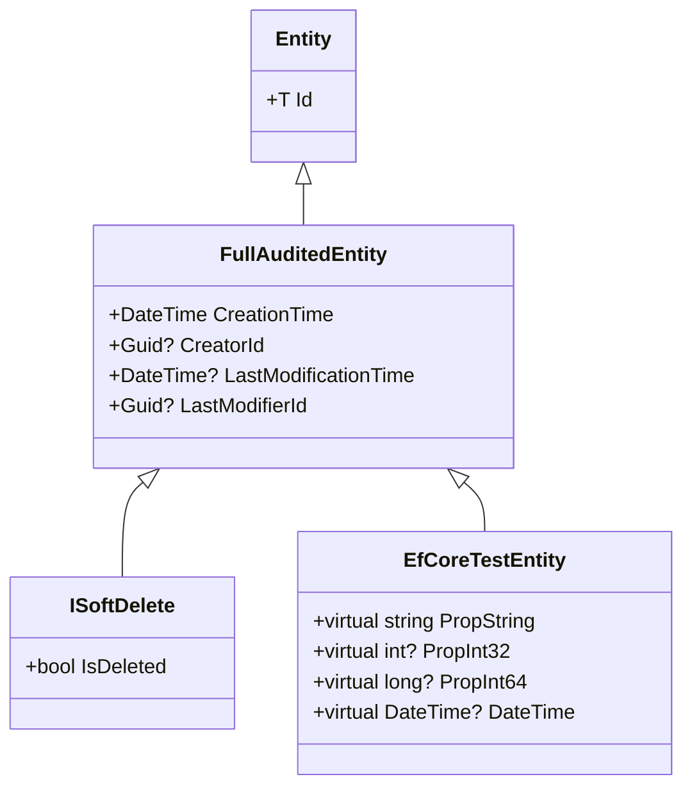
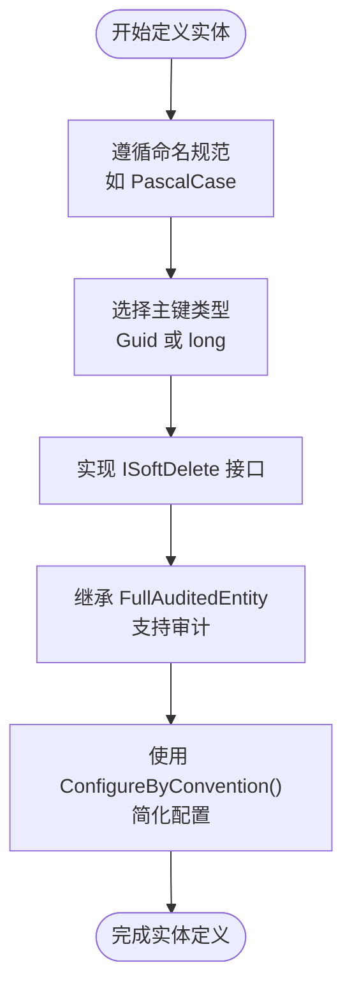
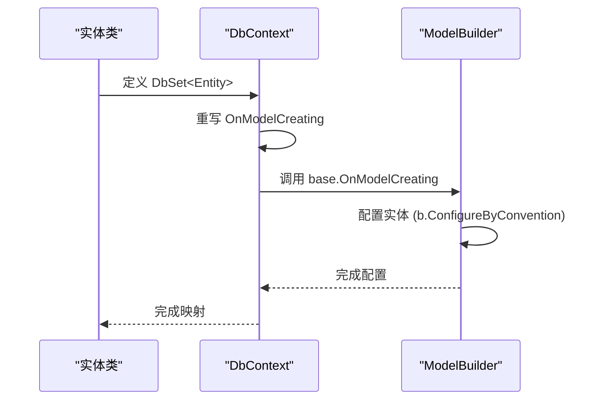

# 数据模型定义

<cite>
**本文档中引用的文件**  
- [EfCoreTestEntity.cs](file://aspnet-core\tests\LINGYUN.Abp.EntityFrameworkCore.Tests\LINGYUN\Abp\EntityFrameworkCore\EfCoreTestEntity.cs)
- [EfCoreTestDbContext.cs](file://aspnet-core\tests\LINGYUN.Abp.EntityFrameworkCore.Tests\LINGYUN\Abp\EntityFrameworkCore\EfCoreTestDbContext.cs)
</cite>

## 目录
1. [简介](#简介)
2. [实体类设计原则](#实体类设计原则)
3. [属性配置与数据库映射](#属性配置与数据库映射)
4. [导航属性与聚合根](#导航属性与聚合根)
5. [继承关系处理](#继承关系处理)
6. [值对象与软删除实现](#值对象与软删除实现)
7. [模块中自定义实体的最佳实践](#模块中自定义实体的最佳实践)
8. [实际示例分析：账户与身份管理模块](#实际示例分析账户与身份管理模块)
9. [结论](#结论)

## 简介
本文件旨在详细阐述在ABP框架下使用Entity Framework Core进行数据模型定义的方法。文档将涵盖实体类的设计原则、属性配置、导航属性设置以及继承关系的处理方式。同时，还将介绍如何通过数据注解和Fluent API进行数据库映射配置，定义值对象和聚合根，并提供在模块中创建自定义实体的最佳实践。

**Section sources**
- [EfCoreTestEntity.cs](file://aspnet-core\tests\LINGYUN.Abp.EntityFrameworkCore.Tests\LINGYUN\Abp\EntityFrameworkCore\EfCoreTestEntity.cs)

## 实体类设计原则
在ABP框架中，实体类通常继承自`Entity<T>`基类，其中`T`为主键类型（如`Guid`或`long`）。实体类应遵循领域驱动设计（DDD）原则，确保单一职责和高内聚性。实体的属性应声明为`virtual`，以便支持延迟加载和代理生成。

**Diagram sources**
- [EfCoreTestEntity.cs](file://aspnet-core\tests\LINGYUN.Abp.EntityFrameworkCore.Tests\LINGYUN\Abp\EntityFrameworkCore\EfCoreTestEntity.cs)

**Section sources**
- [EfCoreTestEntity.cs](file://aspnet-core\tests\LINGYUN.Abp.EntityFrameworkCore.Tests\LINGYUN\Abp\EntityFrameworkCore\EfCoreTestEntity.cs)

## 属性配置与数据库映射
在ABP框架中，可以通过数据注解或Fluent API进行数据库映射配置。Fluent API提供了更灵活和强大的配置能力，推荐在复杂场景下使用。例如，在`OnModelCreating`方法中使用`ConfigureByConvention()`来应用约定配置。

**Diagram sources**
- [EfCoreTestDbContext.cs](file://aspnet-core\tests\LINGYUN.Abp.EntityFrameworkCore.Tests\LINGYUN\Abp\EntityFrameworkCore\EfCoreTestDbContext.cs)

**Section sources**
- [EfCoreTestDbContext.cs](file://aspnet-core\tests\LINGYUN.Abp.EntityFrameworkCore.Tests\LINGYUN\Abp\EntityFrameworkCore\EfCoreTestDbContext.cs)

## 导航属性与聚合根
导航属性用于表示实体之间的关系，如一对多、多对多等。聚合根是聚合的根实体，负责维护聚合内部的一致性。在ABP框架中，聚合根通常继承自`AggregateRoot<T>`类。

[无来源，此图为概念性工作流，不与实际代码结构对应]

[无来源，此部分不分析特定源文件]

## 继承关系处理
ABP框架支持多种继承映射策略，包括每层次一张表（TPH）、每具体类型一张表（TPC）和每类一张表（TPT）。开发者可以根据业务需求选择合适的策略。

[无来源，此图为概念性工作流，不与实际代码结构对应]

[无来源，此部分不分析特定源文件]

## 值对象与软删除实现
值对象是没有标识符的对象，其相等性基于属性值而非身份。软删除通过添加`IsDeleted`字段实现，ABP框架提供了`ISoftDelete`接口来支持这一功能。

**Diagram sources**
- [EfCoreTestEntity.cs](file://aspnet-core\tests\LINGYUN.Abp.EntityFrameworkCore.Tests\LINGYUN\Abp\EntityFrameworkCore\EfCoreTestEntity.cs)

**Section sources**
- [EfCoreTestEntity.cs](file://aspnet-core\tests\LINGYUN.Abp.EntityFrameworkCore.Tests\LINGYUN\Abp\EntityFrameworkCore\EfCoreTestEntity.cs)

## 模块中自定义实体的最佳实践
在模块中创建自定义实体时，应遵循统一的命名规范，选择合适的主键类型（如`Guid`以支持分布式系统），并实现软删除功能。此外，应利用ABP提供的约定配置减少样板代码。

**Diagram sources**
- [EfCoreTestEntity.cs](file://aspnet-core\tests\LINGYUN.Abp.EntityFrameworkCore.Tests\LINGYUN\Abp\EntityFrameworkCore\EfCoreTestEntity.cs)
- [EfCoreTestDbContext.cs](file://aspnet-core\tests\LINGYUN.Abp.EntityFrameworkCore.Tests\LINGYUN\Abp\EntityFrameworkCore\EfCoreTestDbContext.cs)

**Section sources**
- [EfCoreTestEntity.cs](file://aspnet-core\tests\LINGYUN.Abp.EntityFrameworkCore.Tests\LINGYUN\Abp\EntityFrameworkCore\EfCoreTestEntity.cs)
- [EfCoreTestDbContext.cs](file://aspnet-core\tests\LINGYUN.Abp.EntityFrameworkCore.Tests\LINGYUN\Abp\EntityFrameworkCore\EfCoreTestDbContext.cs)

## 实际示例分析账户与身份管理模块
通过对`EfCoreTestEntity`和`EfCoreTestDbContext`的分析，我们可以看到ABP框架中实体定义的实际模式。实体类继承自`Entity<Guid>`，并在`DbContext`中通过`ConfigureByConvention()`方法应用约定配置，从而简化了数据库映射过程。

**Diagram sources**
- [EfCoreTestEntity.cs](file://aspnet-core\tests\LINGYUN.Abp.EntityFrameworkCore.Tests\LINGYUN\Abp\EntityFrameworkCore\EfCoreTestEntity.cs)
- [EfCoreTestDbContext.cs](file://aspnet-core\tests\LINGYUN.Abp.EntityFrameworkCore.Tests\LINGYUN\Abp\EntityFrameworkCore\EfCoreTestDbContext.cs)

**Section sources**
- [EfCoreTestEntity.cs](file://aspnet-core\tests\LINGYUN.Abp.EntityFrameworkCore.Tests\LINGYUN\Abp\EntityFrameworkCore\EfCoreTestEntity.cs)
- [EfCoreTestDbContext.cs](file://aspnet-core\tests\LINGYUN.Abp.EntityFrameworkCore.Tests\LINGYUN\Abp\EntityFrameworkCore\EfCoreTestDbContext.cs)

## 结论
本文档详细介绍了在ABP框架下使用Entity Framework Core进行数据模型定义的方法。通过遵循上述设计原则和最佳实践，开发者可以构建出高效、可维护的数据访问层。未来的工作可以进一步探索性能优化和复杂查询的实现。

[无来源，此部分为总结，不分析特定源文件]