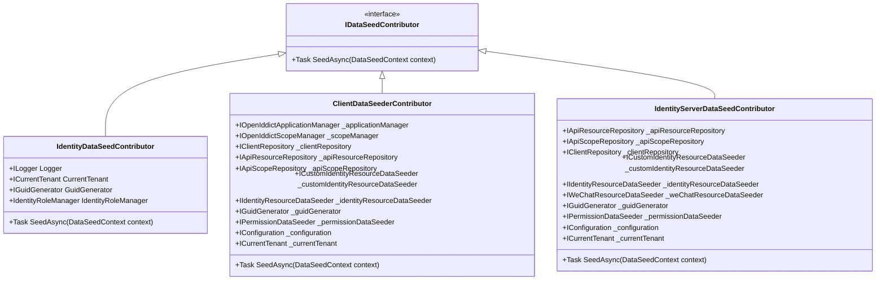
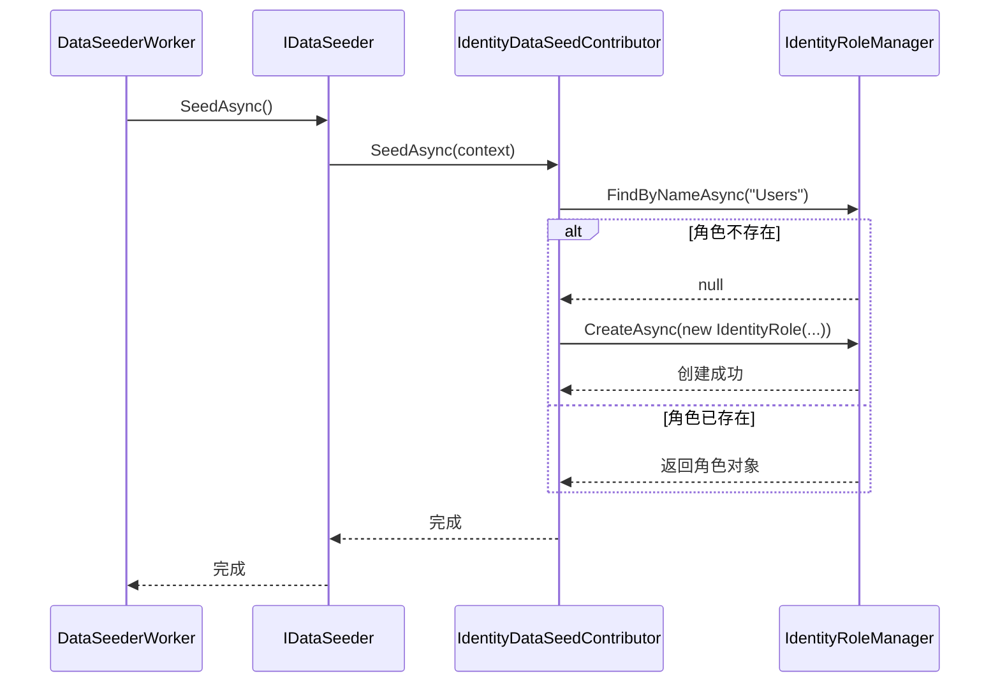
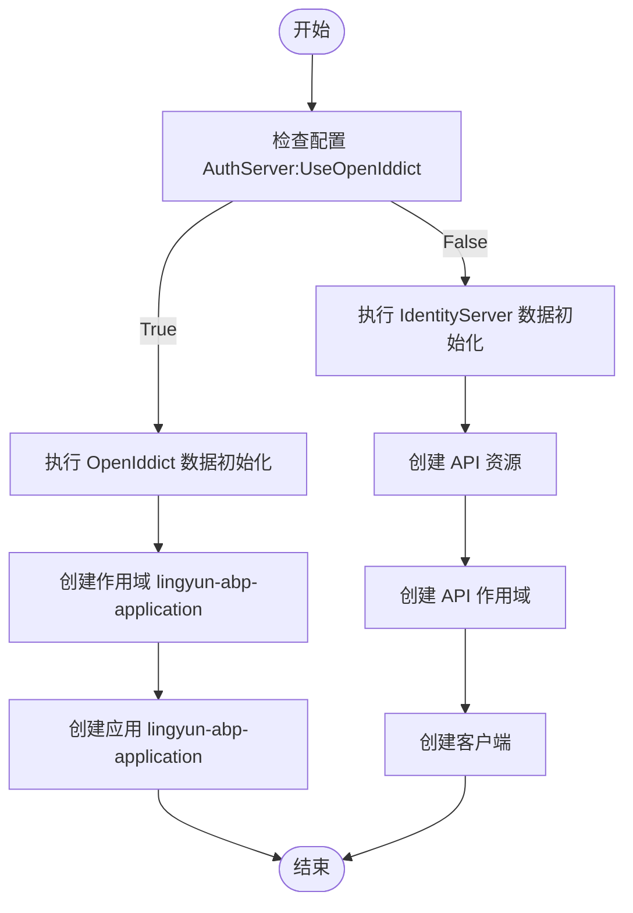
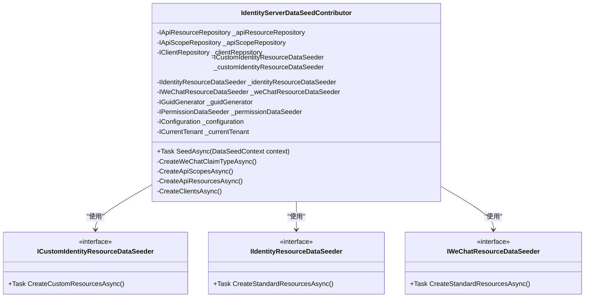
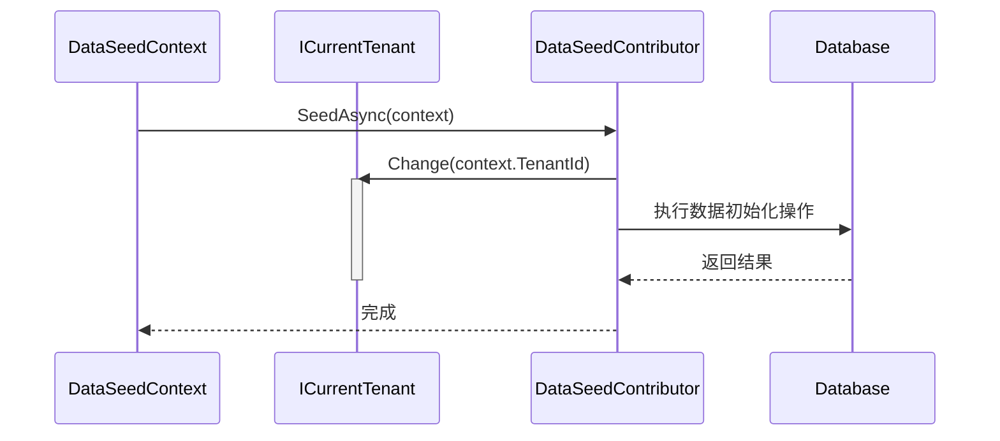
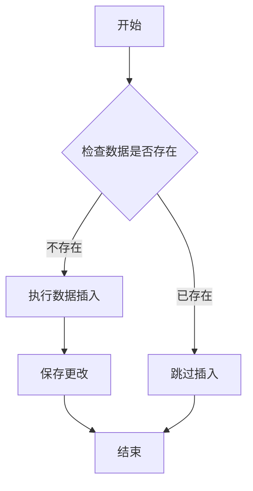
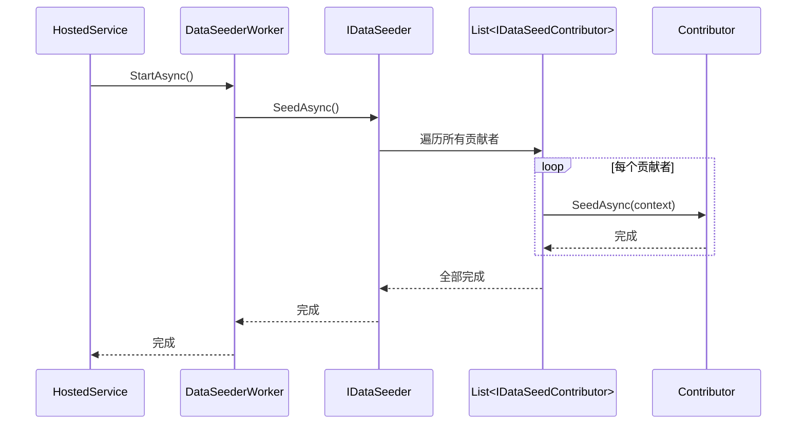
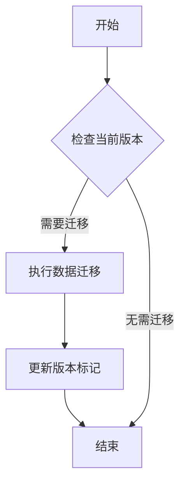

# 数据种子管理

<cite>
**本文档引用的文件**
- [IdentityDataSeedContributor.cs](file://aspnet-core/migrations/LY.MicroService.Applications.Single.EntityFrameworkCore/DataSeeder/IdentityDataSeedContributor.cs)
- [ClientDataSeederContributor.cs](file://aspnet-core/templates/aio/content/migrations/PackageName.CompanyName.ProjectName.AIO.EntityFrameworkCore/DataSeeder/ClientDataSeederContributor.cs)
- [IdentityServerDataSeedContributor.cs](file://aspnet-core/migrations/LY.MicroService.IdentityServer.EntityFrameworkCore/DataSeeder/IdentityServerDataSeedContributor.cs)
- [IdentityServerDataSeederWorker.cs](file://aspnet-core/services/LY.MicroService.IdentityServer/DataSeeder/IdentityServerDataSeederWorker.cs)
- [IdentityServerModule.Seeder.cs](file://aspnet-core/services/LY.MicroService.IdentityServer/IdentityServerModule.Seeder.cs)
</cite>

## 目录
1. [简介](#简介)
2. [数据种子机制概述](#数据种子机制概述)
3. [核心组件分析](#核心组件分析)
4. [多租户环境下的数据初始化](#多租户环境下的数据初始化)
5. [条件性数据填充实现](#条件性数据填充实现)
6. [执行流程与顺序控制](#执行流程与顺序控制)
7. [调试方法与最佳实践](#调试方法与最佳实践)
8. [版本升级时的数据迁移策略](#版本升级时的数据迁移策略)

## 简介
ABP框架提供了一套完整的数据种子（Data Seed）机制，用于在模块初始化时自动填充基础数据。该机制通过`IDataSeedContributor`接口和相关实现类，实现了灵活、可扩展的数据初始化功能。本文档将详细介绍ABP框架中的数据种子管理机制，包括如何定义种子数据提供程序、处理多租户环境下的默认数据初始化、实现条件性数据填充等关键概念。

## 数据种子机制概述
ABP框架的数据种子机制基于`IDataSeedContributor`接口实现，该接口定义了`SeedAsync`方法，用于在系统启动时执行数据初始化逻辑。数据种子贡献者（Data Seed Contributor）通常在模块的预配置阶段注册，并在应用程序启动时由`IDataSeeder`服务调用。

**图表来源**
- [IdentityDataSeedContributor.cs](file://aspnet-core/migrations/LY.MicroService.Applications.Single.EntityFrameworkCore/DataSeeder/IdentityDataSeedContributor.cs)
- [ClientDataSeederContributor.cs](file://aspnet-core/templates/aio/content/migrations/PackageName.CompanyName.ProjectName.AIO.EntityFrameworkCore/DataSeeder/ClientDataSeederContributor.cs)
- [IdentityServerDataSeedContributor.cs](file://aspnet-core/migrations/LY.MicroService.IdentityServer.EntityFrameworkCore/DataSeeder/IdentityServerDataSeedContributor.cs)

**本节来源**
- [IdentityDataSeedContributor.cs](file://aspnet-core/migrations/LY.MicroService.Applications.Single.EntityFrameworkCore/DataSeeder/IdentityDataSeedContributor.cs#L0-L53)
- [ClientDataSeederContributor.cs](file://aspnet-core/templates/aio/content/migrations/PackageName.CompanyName.ProjectName.AIO.EntityFrameworkCore/DataSeeder/ClientDataSeederContributor.cs#L0-L199)

## 核心组件分析
### IdentityDataSeedContributor分析
`IdentityDataSeedContributor`是身份模块的数据种子贡献者，负责在系统初始化时创建默认的角色。该类实现了`IDataSeedContributor`接口，并通过依赖注入获取必要的服务实例。

**图表来源**
- [IdentityDataSeedContributor.cs](file://aspnet-core/migrations/LY.MicroService.Applications.Single.EntityFrameworkCore/DataSeeder/IdentityDataSeedContributor.cs)

**本节来源**
- [IdentityDataSeedContributor.cs](file://aspnet-core/migrations/LY.MicroService.Applications.Single.EntityFrameworkCore/DataSeeder/IdentityDataSeedContributor.cs#L0-L53)

### ClientDataSeederContributor分析
`ClientDataSeederContributor`负责初始化客户端相关的数据，包括OpenIddict应用、API资源、API作用域等。该类根据配置决定使用OpenIddict还是IdentityServer进行数据初始化。

**图表来源**
- [ClientDataSeederContributor.cs](file://aspnet-core/templates/aio/content/migrations/PackageName.CompanyName.ProjectName.AIO.EntityFrameworkCore/DataSeeder/ClientDataSeederContributor.cs)

**本节来源**
- [ClientDataSeederContributor.cs](file://aspnet-core/templates/aio/content/migrations/PackageName.CompanyName.ProjectName.AIO.EntityFrameworkCore/DataSeeder/ClientDataSeederContributor.cs#L0-L199)

### IdentityServerDataSeedContributor分析
`IdentityServerDataSeedContributor`是身份服务器模块的核心数据种子贡献者，负责初始化所有与身份验证和授权相关的数据。

**图表来源**
- [IdentityServerDataSeedContributor.cs](file://aspnet-core/migrations/LY.MicroService.IdentityServer.EntityFrameworkCore/DataSeeder/IdentityServerDataSeedContributor.cs)

**本节来源**
- [IdentityServerDataSeedContributor.cs](file://aspnet-core/migrations/LY.MicroService.IdentityServer.EntityFrameworkCore/DataSeeder/IdentityServerDataSeedContributor.cs#L0-L199)

## 多租户环境下的数据初始化
在多租户环境中，数据种子需要考虑租户上下文的切换。ABP框架通过`ICurrentTenant`服务提供了租户上下文管理功能，数据种子贡献者可以在`SeedAsync`方法中使用`using`语句来临时改变当前租户。

**图表来源**
- [IdentityDataSeedContributor.cs](file://aspnet-core/migrations/LY.MicroService.Applications.Single.EntityFrameworkCore/DataSeeder/IdentityDataSeedContributor.cs)

**本节来源**
- [IdentityDataSeedContributor.cs](file://aspnet-core/migrations/LY.MicroService.Applications.Single.EntityFrameworkCore/DataSeeder/IdentityDataSeedContributor.cs#L38-L53)

## 条件性数据填充实现
数据种子贡献者通常需要实现条件性数据填充，即仅在数据库为空或特定条件满足时才插入数据。这可以通过查询现有数据来判断是否需要执行初始化操作。

**图表来源**
- [IdentityDataSeedContributor.cs](file://aspnet-core/migrations/LY.MicroService.Applications.Single.EntityFrameworkCore/DataSeeder/IdentityDataSeedContributor.cs)

**本节来源**
- [IdentityDataSeedContributor.cs](file://aspnet-core/migrations/LY.MicroService.Applications.Single.EntityFrameworkCore/DataSeeder/IdentityDataSeedContributor.cs#L42-L48)

## 执行流程与顺序控制
数据种子的执行流程由后台工作服务（Background Service）驱动，通过`IDataSeeder`服务协调多个`IDataSeedContributor`的执行顺序。

**图表来源**
- [IdentityServerDataSeederWorker.cs](file://aspnet-core/services/LY.MicroService.IdentityServer/DataSeeder/IdentityServerDataSeederWorker.cs)
- [IdentityServerModule.Seeder.cs](file://aspnet-core/services/LY.MicroService.IdentityServer/IdentityServerModule.Seeder.cs)

**本节来源**
- [IdentityServerDataSeederWorker.cs](file://aspnet-core/services/LY.MicroService.IdentityServer/DataSeeder/IdentityServerDataSeederWorker.cs#L0-L20)
- [IdentityServerModule.Seeder.cs](file://aspnet-core/services/LY.MicroService.IdentityServer/IdentityServerModule.Seeder.cs#L0-L14)

## 调试方法与最佳实践
### 调试方法
1. 在`SeedAsync`方法中添加日志记录，跟踪执行流程
2. 使用断点调试，观察数据查询和插入的过程
3. 检查数据库状态，确认数据是否正确插入

### 最佳实践
1. 始终检查数据是否存在，避免重复插入
2. 使用事务确保数据一致性
3. 合理组织数据种子贡献者的职责，保持单一职责原则
4. 在开发环境中启用数据种子，在生产环境中谨慎使用

**本节来源**
- [IdentityDataSeedContributor.cs](file://aspnet-core/migrations/LY.MicroService.Applications.Single.EntityFrameworkCore/DataSeeder/IdentityDataSeedContributor.cs#L0-L53)
- [ClientDataSeederContributor.cs](file://aspnet-core/templates/aio/content/migrations/PackageName.CompanyName.ProjectName.AIO.EntityFrameworkCore/DataSeeder/ClientDataSeederContributor.cs#L0-L199)

## 版本升级时的数据迁移策略
在系统版本升级时，数据种子机制可以用于执行数据迁移任务。通过在新的数据种子贡献者中添加版本检查逻辑，可以确保只在特定版本升级时执行相应的数据迁移操作。

**图表来源**
- [IdentityServerDataSeedContributor.cs](file://aspnet-core/migrations/LY.MicroService.IdentityServer.EntityFrameworkCore/DataSeeder/IdentityServerDataSeedContributor.cs)

**本节来源**
- [IdentityServerDataSeedContributor.cs](file://aspnet-core/migrations/LY.MicroService.IdentityServer.EntityFrameworkCore/DataSeeder/IdentityServerDataSeedContributor.cs#L0-L199)