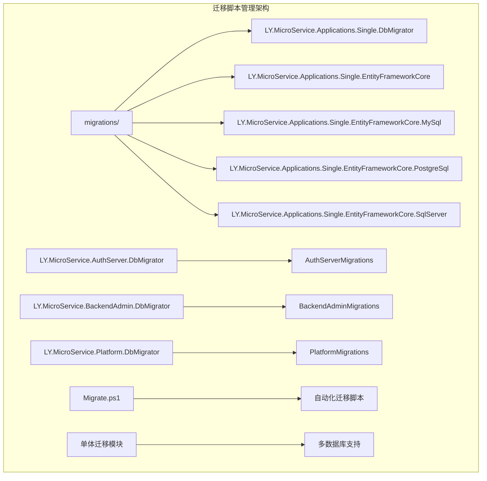
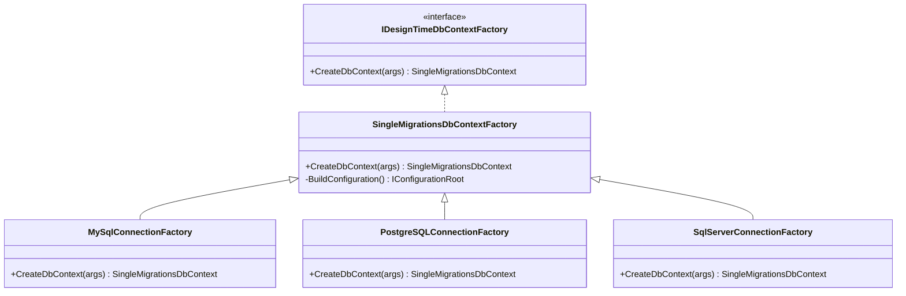
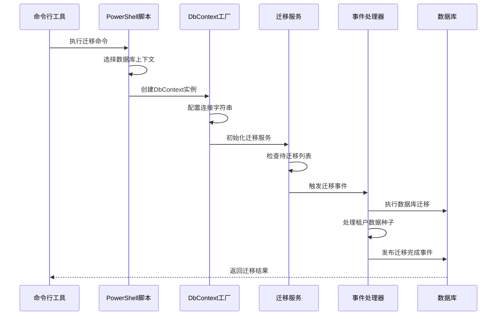
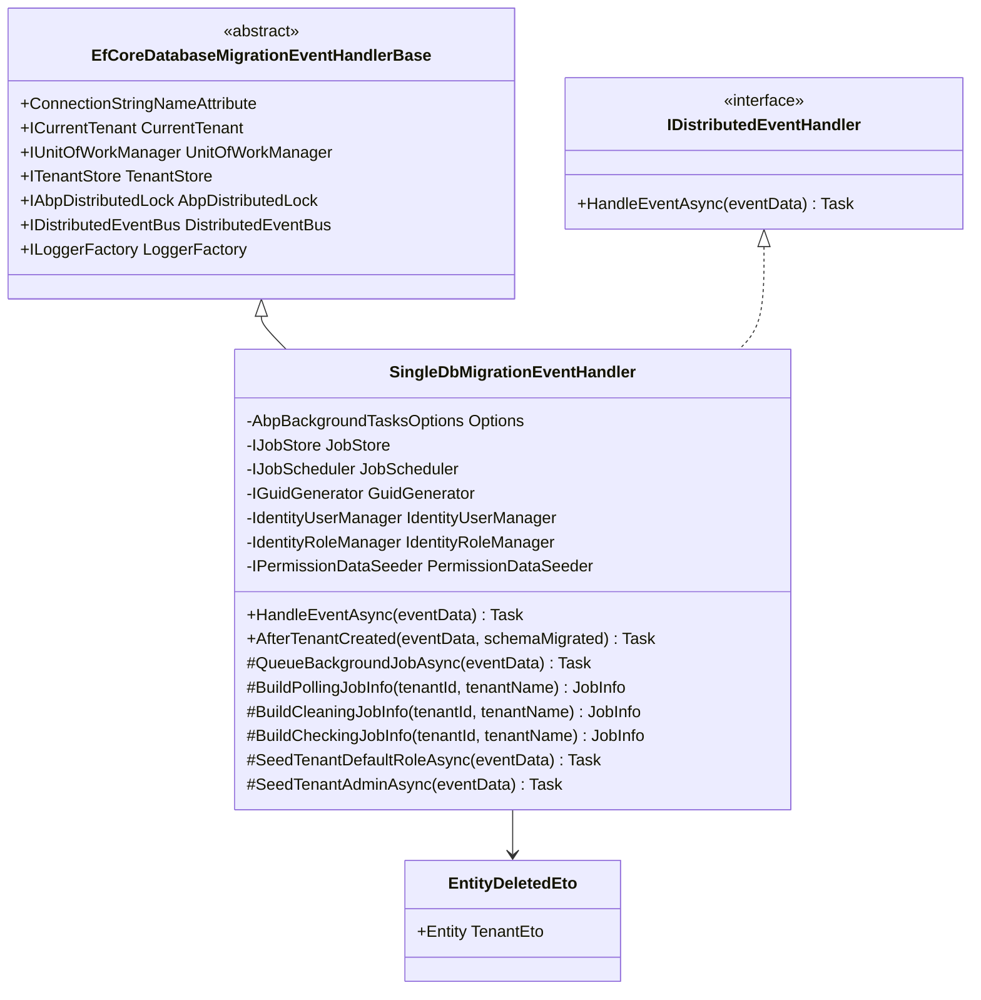
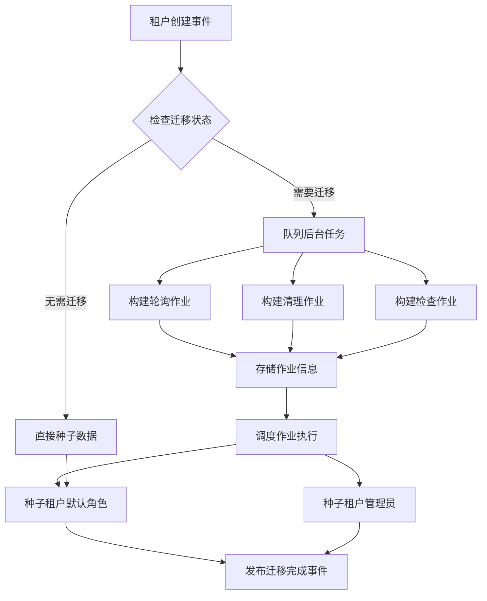
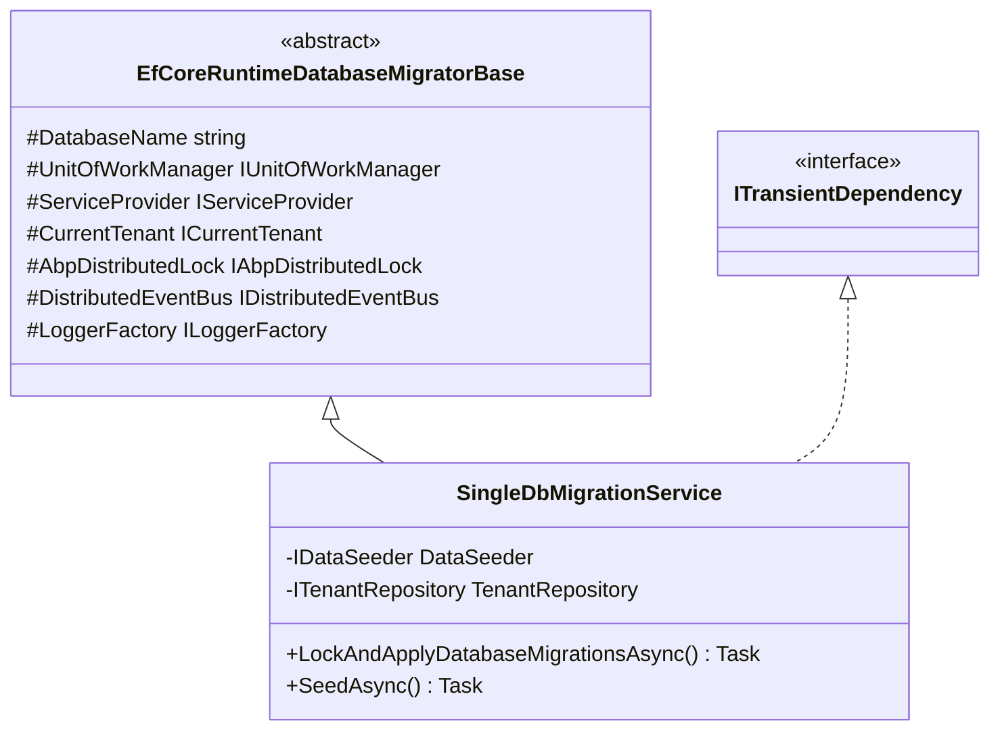
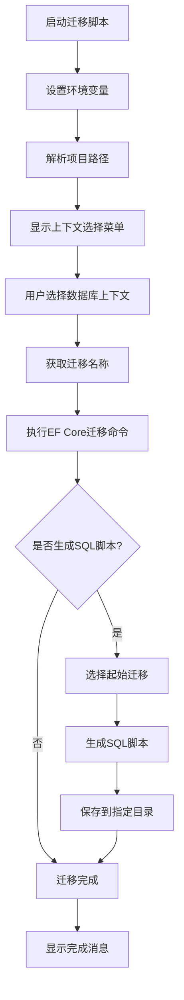
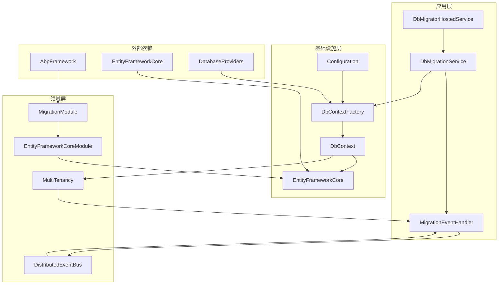

# 迁移脚本管理

<cite>
**本文档引用的文件**
- [SingleDbMigrationEventHandler.cs](file://aspnet-core/migrations/LY.MicroService.Applications.Single.EntityFrameworkCore/SingleDbMigrationEventHandler.cs)
- [SingleDbMigrationService.cs](file://aspnet-core/migrations/LY.MicroService.Applications.Single.EntityFrameworkCore/SingleDbMigrationService.cs)
- [SingleMigrationsDbContextFactory.cs](file://aspnet-core/migrations/LY.MicroService.Applications.Single.EntityFrameworkCore.SqlServer/SingleMigrationsDbContextFactory.cs)
- [appsettings.json](file://aspnet-core/migrations/LY.MicroService.Applications.Single.DbMigrator/appsettings.json)
- [Migrate.ps1](file://aspnet-core/migrations/Migrate.ps1)
- [SingleMigrationsEntityFrameworkCoreModule.cs](file://aspnet-core/migrations/LY.MicroService.Applications.Single.EntityFrameworkCore/SingleMigrationsEntityFrameworkCoreModule.cs)
- [20231012032107_Initial-Single-Project.cs](file://aspnet-core/migrations/LY.MicroService.Applications.Single.EntityFrameworkCore.MySql/Migrations/20231012032107_Initial-Single-Project.cs)
- [20231012032107_Initial-Single-Project.Designer.cs](file://aspnet-core/migrations/LY.MicroService.Applications.Single.EntityFrameworkCore.MySql/Migrations/20231012032107_Initial-Single-Project.Designer.cs)
</cite>

## 目录
1. [简介](#简介)
2. [项目结构](#项目结构)
3. [核心组件](#核心组件)
4. [架构概览](#架构概览)
5. [详细组件分析](#详细组件分析)
6. [依赖关系分析](#依赖关系分析)
7. [性能考虑](#性能考虑)
8. [故障排除指南](#故障排除指南)
9. [结论](#结论)

## 简介

本文档详细介绍了基于Entity Framework Core的迁移脚本管理系统。该系统提供了完整的数据库变更管理解决方案，支持多种数据库（MySQL、PostgreSQL、SQL Server），并通过工厂模式实现了多数据库迁移的统一管理。系统包含迁移事件处理器、迁移服务、配置管理和自动化脚本等功能模块，为企业级应用提供了可靠的数据库版本控制和部署能力。

## 项目结构

迁移脚本管理系统采用分层架构设计，主要包含以下核心目录结构：



**图表来源**
- [Migrate.ps1](file://aspnet-core/migrations/Migrate.ps1#L1-L50)
- [SingleMigrationsEntityFrameworkCoreModule.cs](file://aspnet-core/migrations/LY.MicroService.Applications.Single.EntityFrameworkCore/SingleMigrationsEntityFrameworkCoreModule.cs#L1-L49)

**章节来源**
- [Migrate.ps1](file://aspnet-core/migrations/Migrate.ps1#L1-L214)

## 核心组件

### 单体迁移上下文（SingleMigrationsDbContext）

单体迁移上下文是整个迁移系统的核心，它集成了多个微服务模块的实体框架配置：

```csharp
// 核心依赖模块配置
[DependsOn(
    typeof(AbpSaasEntityFrameworkCoreModule),
    typeof(AbpAuditLoggingEntityFrameworkCoreModule),
    typeof(AbpSettingManagementEntityFrameworkCoreModule),
    typeof(AbpPermissionManagementEntityFrameworkCoreModule),
    typeof(AbpFeatureManagementEntityFrameworkCoreModule),
    typeof(AbpNotificationsEntityFrameworkCoreModule),
    typeof(AbpMessageServiceEntityFrameworkCoreModule),
    typeof(PlatformEntityFrameworkCoreModule),
    typeof(AbpLocalizationManagementEntityFrameworkCoreModule),
    typeof(AbpIdentityEntityFrameworkCoreModule),
    typeof(AbpOpenIddictEntityFrameworkCoreModule),
    typeof(AbpTextTemplatingEntityFrameworkCoreModule),
    typeof(WebhooksManagementEntityFrameworkCoreModule),
    typeof(TaskManagementEntityFrameworkCoreModule),
    typeof(AbpGdprEntityFrameworkCoreModule),
    typeof(AbpWeChatModule),
    typeof(AbpDataDbMigratorModule)
)]
```

### 工厂模式支持多数据库

系统通过工厂模式实现了对多种数据库的支持：



**图表来源**
- [SingleMigrationsDbContextFactory.cs](file://aspnet-core/migrations/LY.MicroService.Applications.Single.EntityFrameworkCore.SqlServer/SingleMigrationsDbContextFactory.cs#L1-L34)

**章节来源**
- [SingleMigrationsEntityFrameworkCoreModule.cs](file://aspnet-core/migrations/LY.MicroService.Applications.Single.EntityFrameworkCore/SingleMigrationsEntityFrameworkCoreModule.cs#L1-L49)
- [SingleMigrationsDbContextFactory.cs](file://aspnet-core/migrations/LY.MicroService.Applications.Single.EntityFrameworkCore.SqlServer/SingleMigrationsDbContextFactory.cs#L1-L34)

## 架构概览

迁移脚本管理系统采用事件驱动的架构模式，通过分布式事件总线实现租户级别的数据库迁移管理：



**图表来源**
- [Migrate.ps1](file://aspnet-core/migrations/Migrate.ps1#L80-L120)
- [SingleDbMigrationService.cs](file://aspnet-core/migrations/LY.MicroService.Applications.Single.EntityFrameworkCore/SingleDbMigrationService.cs#L30-L80)

## 详细组件分析

### 迁移事件处理器（DbMigrationEventHandler）

迁移事件处理器是系统的核心组件之一，负责在数据库迁移过程中执行自定义业务逻辑：



**图表来源**
- [SingleDbMigrationEventHandler.cs](file://aspnet-core/migrations/LY.MicroService.Applications.Single.EntityFrameworkCore/SingleDbMigrationEventHandler.cs#L25-L50)

#### 事件处理流程

迁移事件处理器通过监听分布式事件实现租户生命周期管理：



**图表来源**
- [SingleDbMigrationEventHandler.cs](file://aspnet-core/migrations/LY.MicroService.Applications.Single.EntityFrameworkCore/SingleDbMigrationEventHandler.cs#L60-L120)

### 迁移服务（DbMigrationService）

迁移服务负责协调数据库迁移过程，确保在多租户环境下正确执行迁移操作：



**图表来源**
- [SingleDbMigrationService.cs](file://aspnet-core/migrations/LY.MicroService.Applications.Single.EntityFrameworkCore/SingleDbMigrationService.cs#L15-L35)

#### 分布式锁机制

系统使用分布式锁确保在高并发环境下的迁移安全性：

```csharp
// 分布式锁获取示例
await using (var handle = await DistributedLock.TryAcquireAsync("DatabaseMigration_" + DatabaseName + "_Tenant" + tenant.Id.ToString()))
{
    if (handle is null)
    {
        Logger.LogInformation($"Distributed lock could not be acquired for database migration: {DatabaseName} with tenant: {tenant.Name}. Operation cancelled.");
        return;
    }
    
    Logger.LogInformation($"Distributed lock is acquired for database migration: {DatabaseName} with tenant: {tenant.Name}...");
    
    // 执行迁移逻辑
    using (CurrentTenant.Change(tenant.Id))
    {
        // 创建数据库表
        using var uow = UnitOfWorkManager.Begin(requiresNew: true, isTransactional: false);
        var dbContext = await ServiceProvider.GetRequiredService<IDbContextProvider<SingleMigrationsDbContext>>().GetDbContextAsync();
        
        var pendingMigrations = await dbContext.Database.GetPendingMigrationsAsync();
        
        if (pendingMigrations.Any())
        {
            await dbContext.Database.MigrateAsync();
            schemaMigrated = true;
        }
        
        await uow.CompleteAsync();
        await SeedAsync();
    }
}
```

**章节来源**
- [SingleDbMigrationEventHandler.cs](file://aspnet-core/migrations/LY.MicroService.Applications.Single.EntityFrameworkCore/SingleDbMigrationEventHandler.cs#L25-L242)
- [SingleDbMigrationService.cs](file://aspnet-core/migrations/LY.MicroService.Applications.Single.EntityFrameworkCore/SingleDbMigrationService.cs#L15-L101)

### 自动化迁移脚本

系统提供了PowerShell自动化脚本，简化了迁移操作的复杂性：



**图表来源**
- [Migrate.ps1](file://aspnet-core/migrations/Migrate.ps1#L80-L150)

#### 脚本功能特性

自动化脚本提供了以下核心功能：

1. **多数据库上下文支持**：支持MySQL、PostgreSQL、SQL Server三种数据库
2. **交互式选择界面**：提供友好的用户交互体验
3. **SQL脚本生成**：可选择生成全量或增量SQL脚本
4. **错误处理**：完善的异常捕获和错误提示机制

**章节来源**
- [Migrate.ps1](file://aspnet-core/migrations/Migrate.ps1#L1-L214)

## 依赖关系分析

迁移脚本管理系统的依赖关系呈现清晰的层次结构：



**图表来源**
- [SingleMigrationsEntityFrameworkCoreModule.cs](file://aspnet-core/migrations/LY.MicroService.Applications.Single.EntityFrameworkCore/SingleMigrationsEntityFrameworkCoreModule.cs#L15-L45)

**章节来源**
- [SingleMigrationsEntityFrameworkCoreModule.cs](file://aspnet-core/migrations/LY.MicroService.Applications.Single.EntityFrameworkCore/SingleMigrationsEntityFrameworkCoreModule.cs#L1-L49)

## 性能考虑

### 迁移性能优化策略

1. **批量操作**：通过单元工作模式减少数据库连接开销
2. **分布式锁**：避免并发迁移导致的数据不一致问题
3. **异步处理**：使用异步方法提高系统响应性
4. **缓存机制**：缓存迁移历史记录减少重复查询

### 内存管理

系统采用以下策略优化内存使用：
- 及时释放数据库连接资源
- 使用流式处理大文件
- 合理设置连接池大小

### 并发控制

通过分布式锁机制确保：
- 多实例环境下的数据一致性
- 防止重复迁移操作
- 支持高可用部署场景

## 故障排除指南

### 常见问题及解决方案

#### 1. 迁移失败问题

**症状**：迁移过程中出现异常中断
**原因**：可能是数据库连接问题或权限不足
**解决方案**：
```bash
# 检查数据库连接
dotnet ef database update --project migrations/LY.MicroService.Applications.Single.EntityFrameworkCore.MySql

# 检查迁移历史
dotnet ef migrations list --project migrations/LY.MicroService.Applications.Single.EntityFrameworkCore.MySql
```

#### 2. SQL脚本生成问题

**症状**：生成的SQL脚本不完整或语法错误
**原因**：可能是迁移文件损坏或配置错误
**解决方案**：
```powershell
# 清理并重新生成迁移
Remove-Item -Recurse -Force migrations\LY.MicroService.Applications.Single.EntityFrameworkCore.MySql\Migrations
dotnet ef migrations add InitialCreate --project migrations/LY.MicroService.Applications.Single.EntityFrameworkCore.MySql
```

#### 3. 租户迁移问题

**症状**：租户数据迁移失败
**原因**：可能是租户配置或权限问题
**解决方案**：
- 检查租户表是否存在
- 验证租户权限配置
- 查看迁移日志详情

**章节来源**
- [SingleDbMigrationService.cs](file://aspnet-core/migrations/LY.MicroService.Applications.Single.EntityFrameworkCore/SingleDbMigrationService.cs#L30-L80)

## 结论

迁移脚本管理系统是一个功能完善、架构清晰的企业级解决方案。它通过以下特点为企业提供了可靠的数据库版本控制能力：

1. **多数据库支持**：通过工厂模式实现了对MySQL、PostgreSQL、SQL Server的统一支持
2. **事件驱动架构**：利用分布式事件总线实现租户级别的精细化管理
3. **自动化程度高**：提供完整的PowerShell脚本自动化迁移流程
4. **安全性保障**：通过分布式锁和事务机制确保数据一致性
5. **扩展性强**：模块化设计便于功能扩展和维护

该系统特别适用于微服务架构下的数据库版本管理需求，能够有效支持企业级应用的持续集成和部署流程。通过合理的配置和使用，可以显著提升数据库变更管理的效率和可靠性。