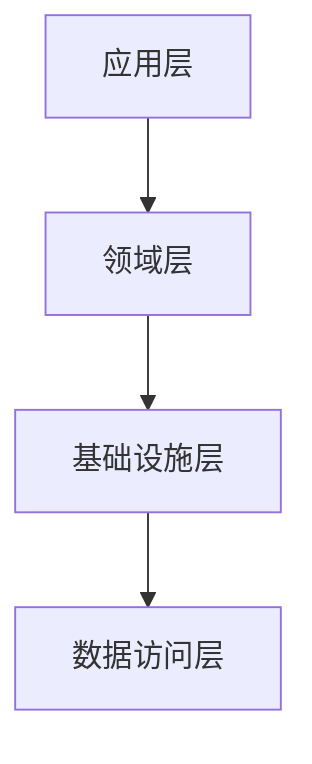

# 作用域服务注册

<cite>
**本文档引用的文件**   
- [MicroServiceApplicationsSingleModule.cs](file://aspnet-core/services/LY.MicroService.Applications.Single/MicroServiceApplicationsSingleModule.cs)
- [SingleMigrationsEntityFrameworkCoreMySqlModule.cs](file://aspnet-core/migrations/LY.MicroService.Applications.Single.EntityFrameworkCore.MySql/SingleMigrationsEntityFrameworkCoreMySqlModule.cs)
- [AbpEntityFrameworkCoreTestModule.cs](file://aspnet-core/tests/LINGYUN.Abp.EntityFrameworkCore.Tests/LINGYUN/Abp/EntityFrameworkCore/AbpEntityFrameworkCoreTestModule.cs)
- [Program.cs](file://aspnet-core/services/LY.MicroService.Applications.Single/Program.cs)
</cite>

## 目录
1. [介绍](#介绍)
2. [项目结构](#项目结构)
3. [核心组件](#核心组件)
4. [架构概述](#架构概述)
5. [详细组件分析](#详细组件分析)
6. [依赖分析](#依赖分析)
7. [性能考虑](#性能考虑)
8. [故障排除指南](#故障排除指南)
9. [结论](#结论)

## 介绍
本文档详细阐述了ABP框架中作用域服务（Scoped）的注册机制和生命周期特性。作用域服务在同一个请求或作用域内共享同一个实例，这种设计模式在Web应用程序中特别有用，因为它可以在整个请求处理过程中保持状态一致性，同时避免了单例服务可能带来的并发问题。

## 项目结构
ABP框架中的作用域服务注册主要通过模块化的方式实现，每个模块都可以在其`ConfigureServices`方法中注册自己的服务。项目结构遵循典型的分层架构，包括应用层、领域层、基础设施层等。

**图表来源**
- [MicroServiceApplicationsSingleModule.cs](file://aspnet-core/services/LY.MicroService.Applications.Single/MicroServiceApplicationsSingleModule.cs#L369-L451)

## 核心组件
作用域服务的核心在于其生命周期管理。在ABP框架中，通过`IServiceCollection.AddScoped`方法注册