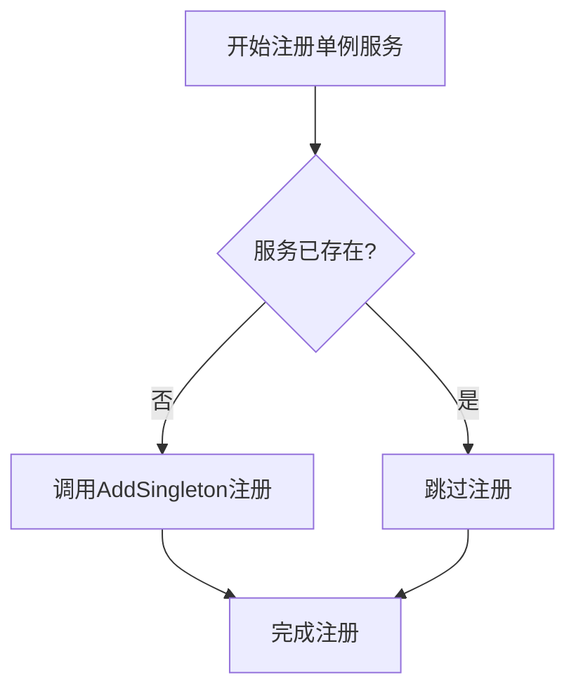
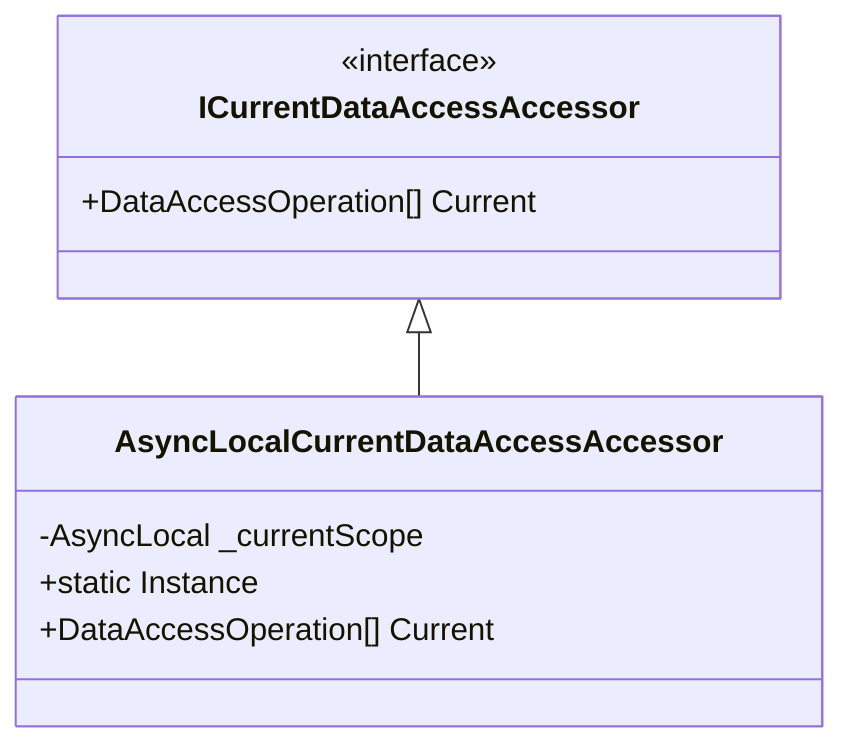

# 单例服务注册

<cite>
**本文档中引用的文件**  
- [AbpBackgroundWorkersHangfireModule.cs](file://aspnet-core/framework/common/LINGYUN.Abp.BackgroundWorkers.Hangfire/LINGYUN/Abp/BackgroundWorkers/Hangfire/AbpBackgroundWorkersHangfireModule.cs)
- [ServiceCollectionExtensions.cs](file://aspnet-core/framework/common/LINGYUN.Abp.EventBus.CAP/Microsoft/Extensions/DependencyInjection/ServiceCollectionExtensions.cs)
- [AbpIPLocationModule.cs](file://aspnet-core/framework/common/LINGYUN.Abp.IP.Location/LINGYUN/Abp/IP/Location/AbpIPLocationModule.cs)
- [AbpIP2RegionModule.cs](file://aspnet-core/framework/common/LINGYUN.Abp.IP2Region/LINGYUN/Abp/IP2Region/AbpIP2RegionModule.cs)
- [AbpIdGeneratorModule.cs](file://aspnet-core/framework/common/LINGYUN.Abp.IdGenerator/LINGYUN/Abp/IdGenerator/AbpIdGeneratorModule.cs)
- [AsyncLocalCurrentDataAccessAccessor.cs](file://aspnet-core/framework/data-protection/LINGYUN.Abp.DataProtection.Abstractions/LINGYUN/Abp/DataProtection/AsyncLocalCurrentDataAccessAccessor.cs)
- [AbpTestsBaseModule.cs](file://aspnet-core/tests/LINGYUN.Abp.TestBase/LINGYUN/Abp/Tests/AbpTestsBaseModule.cs)
</cite>

## 目录
1. [引言](#引言)
2. [单例服务生命周期行为](#单例服务生命周期行为)
3. [IServiceCollection.AddSingleton方法使用说明](#iservicecollectionaddsingleton方法使用说明)
4. [无状态工具类与共享资源服务注册实例](#无状态工具类与共享资源服务注册实例)
5. [线程安全问题与多线程环境下的实现方式](#线程安全问题与多线程环境下的实现方式)
6. [适用场景分析](#适用场景分析)
7. [潜在风险警告](#潜在风险警告)
8. [结论](#结论)

## 引言
在ABP框架中，单例服务（Singleton）是一种重要的依赖注入模式，它确保在整个应用程序生命周期内只创建一个服务实例。这种模式对于需要全局共享状态或资源的服务特别有用，如缓存管理、配置读取等。本文档将深入探讨单例服务的注册机制、生命周期管理、线程安全性以及最佳实践。

## 单例服务生命周期行为
单例服务的生命周期从应用程序启动时开始，在整个应用运行期间始终保持活跃，并且仅被实例化一次。这意味着无论多少次请求该服务，容器都会返回同一个实例。这一特性使得单例服务非常适合用于存储和管理跨请求的共享数据或资源。

当应用程序关闭时，单例服务才会被销毁。因此，开发者必须注意避免在单例服务中持有大量内存引用或未释放的非托管资源，以防止内存泄漏。

**Section sources**
- [AbpBackgroundWorkersHangfireModule.cs](file://aspnet-core/framework/common/LINGYUN.Abp.BackgroundWorkers.Hangfire/LINGYUN/Abp/BackgroundWorkers/Hangfire/AbpBackgroundWorkersHangfireModule.cs#L15)

## IServiceCollection.AddSingleton方法使用说明
`IServiceCollection.AddSingleton` 方法是注册单例服务的核心API。通过此方法，可以将指定类型的服务注册为单例模式。有两种常见用法：

1. **直接注册类型映射**：`services.AddSingleton<IInterface, Implementation>()`
2. **提供工厂函数**：`services.AddSingleton<IInterface>(provider => new Implementation(...))`

此外，还存在 `TryAddSingleton` 方法，它会在服务尚未注册的情况下才进行注册，避免重复注册导致异常。



**Diagram sources**
- [ServiceCollectionExtensions.cs](file://aspnet-core/framework/common/LINGYUN.Abp.EventBus.CAP/Microsoft/Extensions/DependencyInjection/ServiceCollectionExtensions.cs#L23-L24)

**Section sources**
- [ServiceCollectionExtensions.cs](file://aspnet-core/framework/common/LINGYUN.Abp.EventBus.CAP/Microsoft/Extensions/DependencyInjection/ServiceCollectionExtensions.cs#L23-L24)

## 无状态工具类与共享资源服务注册实例
以下是一些典型的单例服务注册示例：

### IP地理位置解析器
```csharp
context.Services.AddSingleton<ICurrentIPLocationAccessor>(AsyncLocalCurrentIPLocationAccessor.Instance);
```
此处注册了一个静态实例作为单例服务，适用于无需状态保持的访问器对象。

### IP2Region搜索器
```csharp
context.Services.AddSingleton<ISearcher, AbpSearcher>((serviceProvider) =>
{
    var virtualFileProvider = serviceProvider.GetRequiredService<IVirtualFileProvider>();
    var xdbFile = virtualFileProvider.GetFileInfo("/LINGYUN/Abp/IP2Region/Resources/ip2region.xdb");
    var searcher = new AbpSearcher(CachePolicy.File, xdbFile.CreateReadStream());
    return searcher;
});
```
该示例展示了如何通过工厂函数初始化一个基于文件流的搜索器，并将其注册为单例，确保所有组件共享同一份索引数据。

### 分布式ID生成器
```csharp
context.Services.TryAddSingleton<IDistributedIdGenerator>(SnowflakeIdGenerator.Create(snowflakeIdOptions));
```
使用雪花算法生成唯一ID的服务被注册为单例，保证全局唯一性和高性能。

**Section sources**
- [AbpIPLocationModule.cs](file://aspnet-core/framework/common/LINGYUN.Abp.IP.Location/LINGYUN/Abp/IP/Location/AbpIPLocationModule.cs#L9)
- [AbpIP2RegionModule.cs](file://aspnet-core/framework/common/LINGYUN.Abp.IP2Region/LINGYUN/Abp/IP2Region/AbpIP2RegionModule.cs#L20)
- [AbpIdGeneratorModule.cs](file://aspnet-core/framework/common/LINGYUN.Abp.IdGenerator/LINGYUN/Abp/IdGenerator/AbpIdGeneratorModule.cs#L14)

## 线程安全问题与多线程环境下的实现方式
由于单例服务被多个线程共享，因此必须考虑线程安全问题。常见的解决方案包括：

- 使用线程安全的数据结构（如 `ConcurrentDictionary`）
- 利用锁机制（如 `lock` 关键字或 `SemaphoreSlim`）
- 采用不可变对象设计
- 借助 `AsyncLocal<T>` 实现异步上下文隔离

例如，在 `AsyncLocalCurrentDataAccessAccessor` 中，使用了 `AsyncLocal<DataAccessOperation[]>` 来确保在异步操作中每个逻辑调用链拥有独立的状态副本，从而避免竞态条件。



**Diagram sources**
- [AsyncLocalCurrentDataAccessAccessor.cs](file://aspnet-core/framework/data-protection/LINGYUN.Abp.DataProtection.Abstractions/LINGYUN/Abp/DataProtection/AsyncLocalCurrentDataAccessAccessor.cs#L0-L19)

**Section sources**
- [AsyncLocalCurrentDataAccessAccessor.cs](file://aspnet-core/framework/data-protection/LINGYUN.Abp.DataProtection.Abstractions/LINGYUN/Abp/DataProtection/AsyncLocalCurrentDataAccessAccessor.cs#L0-L19)

## 适用场景分析
单例服务适用于以下典型场景：

- **缓存服务**：如Redis客户端、内存缓存管理器
- **配置管理器**：全局配置读取与监听
- **日志记录器**：集中式日志输出
- **消息队列生产者**：共享的消息发送通道
- **第三方API客户端**：如微信、支付宝SDK实例
- **定时任务调度器**：Quartz.NET调度核心

这些场景共同特点是：资源开销大、需全局共享、无状态或状态可同步。

**Section sources**
- [AbpIP2RegionModule.cs](file://aspnet-core/framework/common/LINGYUN.Abp.IP2Region/LINGYUN/Abp/IP2Region/AbpIP2RegionModule.cs#L20)
- [AbpIdGeneratorModule.cs](file://aspnet-core/framework/common/LINGYUN.Abp.IdGenerator/LINGYUN/Abp/IdGenerator/AbpIdGeneratorModule.cs#L14)

## 潜在风险警告
尽管单例模式带来便利，但也伴随着一些潜在风险：

- **内存泄漏**：若单例持有了大量对象引用而未及时清理，可能导致内存无法回收。
- **状态污染**：有状态的单例在多线程环境下容易出现数据竞争和不一致。
- **测试困难**：单例难以mock，影响单元测试的隔离性。
- **生命周期僵硬**：无法按需重建实例，灵活性差。

建议始终优先使用无状态的单例服务，并谨慎管理其持有的外部资源。对于可能变化的状态，应结合分布式锁或并发集合来保障线程安全。

**Section sources**
- [AbpTestsBaseModule.cs](file://aspnet-core/tests/LINGYUN.Abp.TestBase/LINGYUN/Abp/Tests/AbpTestsBaseModule.cs#L25)

## 结论
单例服务是构建高效、稳定系统的重要基石之一。正确理解和运用 `IServiceCollection.AddSingleton` 方法，不仅能提升性能，还能简化资源共享逻辑。然而，开发者也必须警惕由此带来的线程安全和内存管理挑战。遵循“无状态优先、线程安全设计、资源及时释放”的原则，方能充分发挥单例模式的优势，构建健壮的企业级应用。