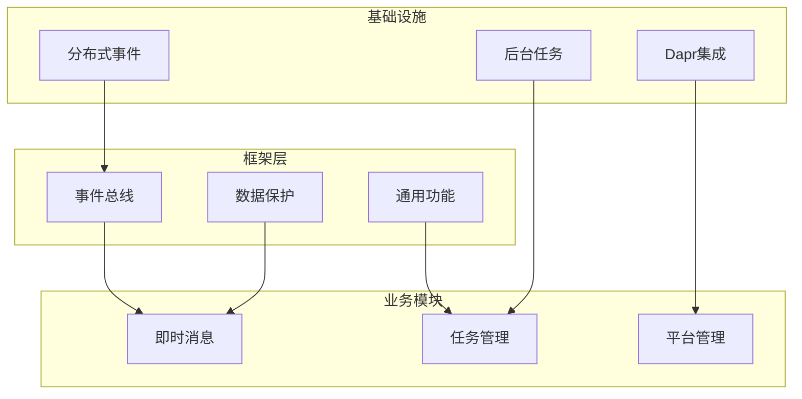
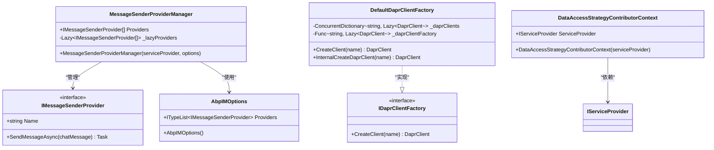
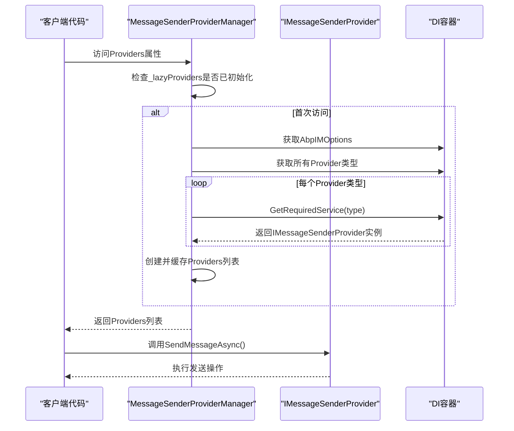
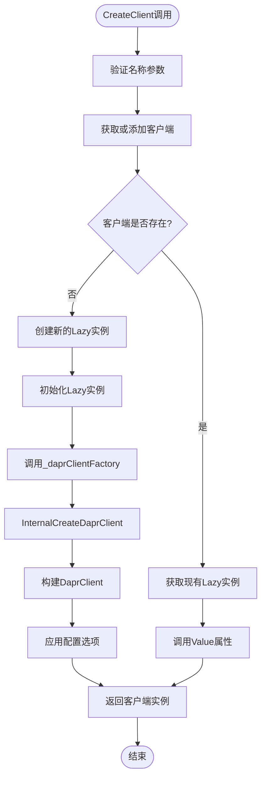
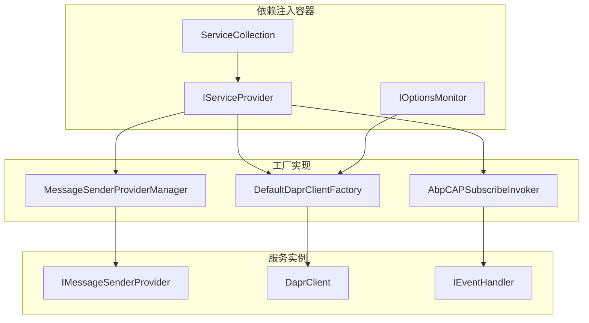

# 服务工厂模式

<cite>
**本文档中引用的文件**
- [MessageSenderProviderManager.cs](file://aspnet-core/modules/realtime-message/LINGYUN.Abp.IM/LINGYUN/Abp/IM/Messages/MessageSenderProviderManager.cs)
- [AbpIMOptions.cs](file://aspnet-core/modules/realtime-message/LINGYUN.Abp.IM/LINGYUN/Abp/IM/AbpIMOptions.cs)
- [IMessageSenderProvider.cs](file://aspnet-core/modules/realtime-message/LINGYUN.Abp.IM/LINGYUN/Abp/IM/Messages/IMessageSenderProvider.cs)
- [IMessageSenderProviderManager.cs](file://aspnet-core/modules/realtime-message/LINGYUN.Abp.IM/LINGYUN/Abp/IM/Messages/IMessageSenderProviderManager.cs)
- [DefaultDaprClientFactory.cs](file://aspnet-core/framework/dapr/LINGYUN.Abp.Dapr/Dapr/Client/DefaultDaprClientFactory.cs)
- [IDaprClientFactory.cs](file://aspnet-core/framework/dapr/LINGYUN.Abp.Dapr/Dapr/Client/IDaprClientFactory.cs)
- [AbpCAPSubscribeInvoker.cs](file://aspnet-core/framework/common/LINGYUN.Abp.EventBus.CAP/LINGYUN/Abp/EventBus/CAP/AbpCAPSubscribeInvoker.cs)
- [DataAccessStrategyContributorContext.cs](file://aspnet-core/framework/data-protection/LINGYUN.Abp.DataProtection/LINGYUN/Abp/DataProtection/DataAccessStrategyContributorContext.cs)
- [DynamicOptionsProvider.cs](file://aspnet-core/framework/common/LINGYUN.Abp.Core/DynamicOptionsProvider.cs)
- [ServiceInvocationJob.cs](file://aspnet-core/modules/task-management/LINGYUN.Abp.BackgroundTasks.Jobs/LINGYUN/Abp/BackgroundTasks/Jobs/ServiceInvocationJob.cs)
</cite>

## 目录
1. [简介](#简介)
2. [项目结构概述](#项目结构概述)
3. [核心组件分析](#核心组件分析)
4. [架构概览](#架构概览)
5. [详细组件分析](#详细组件分析)
6. [依赖关系分析](#依赖关系分析)
7. [性能考虑](#性能考虑)
8. [故障排除指南](#故障排除指南)
9. [结论](#结论)

## 简介

服务工厂模式是一种创建型设计模式，它通过抽象对象的创建过程来解耦客户端代码和具体实现类之间的依赖关系。在ABP Next Admin框架中，工厂模式被广泛应用于各种场景，包括消息发送器、Dapr客户端、事件处理器等组件的动态创建和管理。

本文档将深入探讨ABP Next Admin框架中服务工厂模式的实现，重点关注如何使用工厂模式创建复杂服务实例，特别是在需要条件创建或依赖外部配置的情况下。我们将展示IProvider和工厂委托的使用方法，以及如何通过工厂方法动态决定服务实例的创建逻辑。

## 项目结构概述

ABP Next Admin框架采用模块化架构，工厂模式在多个模块中都有体现：



**图表来源**
- [MessageSenderProviderManager.cs](file://aspnet-core/modules/realtime-message/LINGYUN.Abp.IM/LINGYUN/Abp/IM/Messages/MessageSenderProviderManager.cs#L1-L33)
- [DefaultDaprClientFactory.cs](file://aspnet-core/framework/dapr/LINGYUN.Abp.Dapr/Dapr/Client/DefaultDaprClientFactory.cs#L1-L99)

## 核心组件分析

### 工厂模式的核心概念

在ABP Next Admin框架中，工厂模式主要体现在以下几个方面：

1. **服务提供者工厂**：负责根据配置动态创建不同类型的服务实例
2. **依赖注入集成**：与ASP.NET Core的依赖注入容器深度集成
3. **延迟初始化**：使用Lazy<T>实现按需创建，提高性能
4. **多态支持**：支持多种实现类型的统一管理

**章节来源**
- [MessageSenderProviderManager.cs](file://aspnet-core/modules/realtime-message/LINGYUN.Abp.IM/LINGYUN/Abp/IM/Messages/MessageSenderProviderManager.cs#L1-L33)
- [DefaultDaprClientFactory.cs](file://aspnet-core/framework/dapr/LINGYUN.Abp.Dapr/Dapr/Client/DefaultDaprClientFactory.cs#L1-L99)

## 架构概览

ABP Next Admin中的工厂模式架构采用了分层设计，确保了良好的可扩展性和可维护性：



**图表来源**
- [MessageSenderProviderManager.cs](file://aspnet-core/modules/realtime-message/LINGYUN.Abp.IM/LINGYUN/Abp/IM/Messages/MessageSenderProviderManager.cs#L10-L33)
- [DefaultDaprClientFactory.cs](file://aspnet-core/framework/dapr/LINGYUN.Abp.Dapr/Dapr/Client/DefaultDaprClientFactory.cs#L10-L99)
- [DataAccessStrategyContributorContext.cs](file://aspnet-core/framework/data-protection/LINGYUN.Abp.DataProtection/LINGYUN/Abp/DataProtection/DataAccessStrategyContributorContext.cs#L5-L11)

## 详细组件分析

### 消息发送器工厂模式

消息发送器工厂是ABP Next Admin中工厂模式的一个典型应用，展示了如何通过配置驱动的工厂模式创建不同类型的发送器实例。

#### MessageSenderProviderManager 实现

```csharp
public class MessageSenderProviderManager : IMessageSenderProviderManager, ISingletonDependency
{
    public List<IMessageSenderProvider> Providers => _lazyProviders.Value;

    protected AbpIMOptions Options { get; }

    private readonly Lazy<List<IMessageSenderProvider>> _lazyProviders;

    public MessageSenderProviderManager(
        IServiceProvider serviceProvider,
        IOptions<AbpIMOptions> options)
    {
        Options = options.Value;

        _lazyProviders = new Lazy<List<IMessageSenderProvider>>(
            () => Options
                .Providers
                .Select(type => serviceProvider.GetRequiredService(type) as IMessageSenderProvider)
                .ToList(),
            true
        );
    }
}
```

这个实现展示了几个关键的设计模式：

1. **延迟初始化**：使用Lazy<T>确保只有在首次访问时才创建所有提供者实例
2. **依赖注入**：通过IServiceProvider获取具体的实现类型
3. **配置驱动**：从AbpIMOptions中读取要创建的提供者类型列表
4. **单例模式**：作为ISingletonDependency注册，确保整个应用程序生命周期内只有一个实例

#### 工作流程图



**图表来源**
- [MessageSenderProviderManager.cs](file://aspnet-core/modules/realtime-message/LINGYUN.Abp.IM/LINGYUN/Abp/IM/Messages/MessageSenderProviderManager.cs#L18-L33)

**章节来源**
- [MessageSenderProviderManager.cs](file://aspnet-core/modules/realtime-message/LINGYUN.Abp.IM/LINGYUN/Abp/IM/Messages/MessageSenderProviderManager.cs#L1-L33)
- [AbpIMOptions.cs](file://aspnet-core/modules/realtime-message/LINGYUN.Abp.IM/LINGYUN/Abp/IM/AbpIMOptions.cs#L1-L18)

### Dapr客户端工厂模式

Dapr客户端工厂展示了更复杂的工厂模式实现，包括并发安全、配置管理和资源池化。

#### DefaultDaprClientFactory 实现

```csharp
public class DefaultDaprClientFactory : IDaprClientFactory
{
    private readonly AbpSystemTextJsonSerializerOptions _systemTextJsonSerializerOptions;
    private readonly IOptionsMonitor<DaprClientFactoryOptions> _daprClientFactoryOptions;

    private readonly Func<string, Lazy<DaprClient>> _daprClientFactory;
    internal readonly ConcurrentDictionary<string, Lazy<DaprClient>> _daprClients;
    internal readonly ConcurrentDictionary<string, JsonSerializerOptions> _jsonSerializerOptions;

    public DefaultDaprClientFactory(
        IOptions<AbpSystemTextJsonSerializerOptions> systemTextJsonSerializerOptions,
        IOptionsMonitor<DaprClientFactoryOptions> daprClientFactoryOptions)
    {
        // 初始化配置和字典
        _daprClients = new ConcurrentDictionary<string, Lazy<DaprClient>>();
        _jsonSerializerOptions = new ConcurrentDictionary<string, JsonSerializerOptions>();

        _daprClientFactory = (name) =>
        {
            return new Lazy<DaprClient>(() =>
            {
                return InternalCreateDaprClient(name);
            }, LazyThreadSafetyMode.ExecutionAndPublication);
        };
    }

    public DaprClient CreateClient(string name)
    {
        var client = _daprClients.GetOrAdd(name, _daprClientFactory).Value;
        
        // 应用配置选项
        var options = _daprClientFactoryOptions.Get(name);
        for (var i = 0; i < options.DaprClientActions.Count; i++)
        {
            options.DaprClientActions[i](client);
        }

        return client;
    }
}
```

这个实现包含了以下高级特性：

1. **并发安全**：使用ConcurrentDictionary确保线程安全
2. **延迟初始化**：每个客户端都使用Lazy<T>进行延迟创建
3. **配置管理**：通过IOptionsMonitor动态管理配置
4. **资源池化**：同一个名称的客户端只会创建一次
5. **扩展点**：支持通过DaprClientActions扩展客户端行为

#### 工厂创建流程



**图表来源**
- [DefaultDaprClientFactory.cs](file://aspnet-core/framework/dapr/LINGYUN.Abp.Dapr/Dapr/Client/DefaultDaprClientFactory.cs#L35-L99)

**章节来源**
- [DefaultDaprClientFactory.cs](file://aspnet-core/framework/dapr/LINGYUN.Abp.Dapr/Dapr/Client/DefaultDaprClientFactory.cs#L1-L99)
- [IDaprClientFactory.cs](file://aspnet-core/framework/dapr/LINGYUN.Abp.Dapr/Dapr/Client/IDaprClientFactory.cs#L1-L6)

### 事件处理器工厂模式

CAP事件总线中的工厂模式展示了如何在分布式环境中动态创建事件处理器实例。

#### AbpCAPSubscribeInvoker 实现

```csharp
protected virtual object GetInstance(IServiceProvider provider, ConsumerContext context)
{
    var srvType = context.ConsumerDescriptor.ServiceTypeInfo?.AsType();
    var implType = context.ConsumerDescriptor.ImplTypeInfo.AsType();

    object obj = null;
    if (srvType != null)
    {
        obj = provider.GetServices(srvType).FirstOrDefault(o => o.GetType() == implType);
    }

    if (obj == null)
    {
        obj = ActivatorUtilities.GetServiceOrCreateInstance(provider, implType);
    }

    return obj;
}
```

这个实现展示了事件处理器工厂的关键特性：

1. **类型检查**：优先查找已注册的相同类型实例
2. **回退机制**：如果找不到匹配实例，则使用ActivatorUtilities创建新实例
3. **依赖注入**：完全依赖IServiceProvider进行实例解析
4. **灵活性**：支持运行时动态创建实例

**章节来源**
- [AbpCAPSubscribeInvoker.cs](file://aspnet-core/framework/common/LINGYUN.Abp.EventBus.CAP/LINGYUN/Abp/EventBus/CAP/AbpCAPSubscribeInvoker.cs#L246-L276)

## 依赖关系分析

ABP Next Admin中的工厂模式与依赖注入容器形成了紧密的集成关系：



**图表来源**
- [MessageSenderProviderManager.cs](file://aspnet-core/modules/realtime-message/LINGYUN.Abp.IM/LINGYUN/Abp/IM/Messages/MessageSenderProviderManager.cs#L18-L33)
- [DefaultDaprClientFactory.cs](file://aspnet-core/framework/dapr/LINGYUN.Abp.Dapr/Dapr/Client/DefaultDaprClientFactory.cs#L18-L33)

**章节来源**
- [MessageSenderProviderManager.cs](file://aspnet-core/modules/realtime-message/LINGYUN.Abp.IM/LINGYUN/Abp/IM/Messages/MessageSenderProviderManager.cs#L1-L33)
- [DefaultDaprClientFactory.cs](file://aspnet-core/framework/dapr/LINGYUN.Abp.Dapr/Dapr/Client/DefaultDaprClientFactory.cs#L1-L99)

## 性能考虑

工厂模式在ABP Next Admin中实现了多项性能优化策略：

### 延迟初始化优化

```csharp
private readonly Lazy<List<IMessageSenderProvider>> _lazyProviders;

// 使用Lazy<T>确保只在首次访问时创建实例
_lazyProviders = new Lazy<List<IMessageSenderProvider>>(
    () => Options
        .Providers
        .Select(type => serviceProvider.GetRequiredService(type) as IMessageSenderProvider)
        .ToList(),
    true
);
```

### 并发安全优化

```csharp
internal readonly ConcurrentDictionary<string, Lazy<DaprClient>> _daprClients;

// 使用ConcurrentDictionary确保线程安全
var client = _daprClients.GetOrAdd(name, _daprClientFactory).Value;
```

### 内存管理优化

1. **单例模式**：工厂本身通常作为单例注册，减少内存占用
2. **延迟创建**：只有在真正需要时才创建服务实例
3. **资源池化**：避免重复创建相同的客户端实例

## 故障排除指南

### 常见问题及解决方案

#### 1. 服务未正确注册到DI容器

**症状**：工厂无法找到指定的服务类型

**解决方案**：
```csharp
// 确保服务已正确注册
services.AddSingleton<IMessageSenderProvider, EmailMessageSenderProvider>();
services.AddSingleton<IMessageSenderProvider, SmsMessageSenderProvider>();
```

#### 2. 配置错误导致工厂创建失败

**症状**：工厂在创建实例时抛出异常

**解决方案**：
```csharp
// 检查配置是否正确
public AbpIMOptions()
{
    Providers = new TypeList<IMessageSenderProvider>();
    // 添加必要的提供者类型
    Providers.Add(typeof(EmailMessageSenderProvider));
}
```

#### 3. 并发访问问题

**症状**：多线程环境下出现异常

**解决方案**：
```csharp
// 使用LazyThreadSafetyMode.ExecutionAndPublication确保线程安全
_daprClientFactory = (name) =>
{
    return new Lazy<DaprClient>(() => InternalCreateDaprClient(name), 
        LazyThreadSafetyMode.ExecutionAndPublication);
};
```

**章节来源**
- [MessageSenderProviderManager.cs](file://aspnet-core/modules/realtime-message/LINGYUN.Abp.IM/LINGYUN/Abp/IM/Messages/MessageSenderProviderManager.cs#L22-L33)
- [DefaultDaprClientFactory.cs](file://aspnet-core/framework/dapr/LINGYUN.Abp.Dapr/Dapr/Client/DefaultDaprClientFactory.cs#L28-L33)

## 结论

ABP Next Admin框架中的服务工厂模式展现了现代软件架构中工厂模式的最佳实践。通过深入分析其实现，我们可以总结出以下关键要点：

### 主要优势

1. **解耦合**：工厂模式成功地将客户端代码与具体实现类解耦
2. **可扩展性**：通过配置驱动的方式轻松添加新的服务实现
3. **性能优化**：延迟初始化和资源池化显著提升了系统性能
4. **可测试性**：依赖注入使得工厂模式易于单元测试和模拟

### 最佳实践建议

1. **合理使用延迟初始化**：仅在确实需要时才创建昂贵的资源
2. **确保线程安全**：在多线程环境中使用适当的同步机制
3. **配置驱动设计**：让工厂行为由配置决定，提高灵活性
4. **错误处理**：实现健壮的回退机制，确保系统稳定性

### 常见反模式避免

1. **过度工厂化**：不要为简单的对象创建额外的工厂层
2. **循环依赖**：确保工厂不会形成循环依赖关系
3. **硬编码**：避免在工厂中硬编码具体实现类型
4. **缺乏配置**：提供足够的配置选项以支持不同的部署场景

通过遵循这些原则和最佳实践，开发者可以在ABP Next Admin框架中有效地使用工厂模式，构建出既灵活又高性能的应用程序架构。