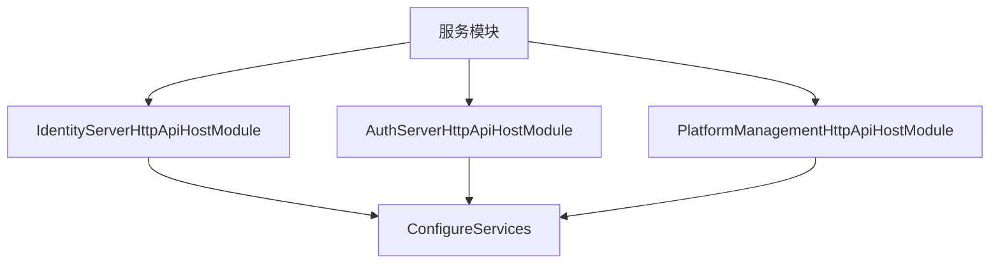
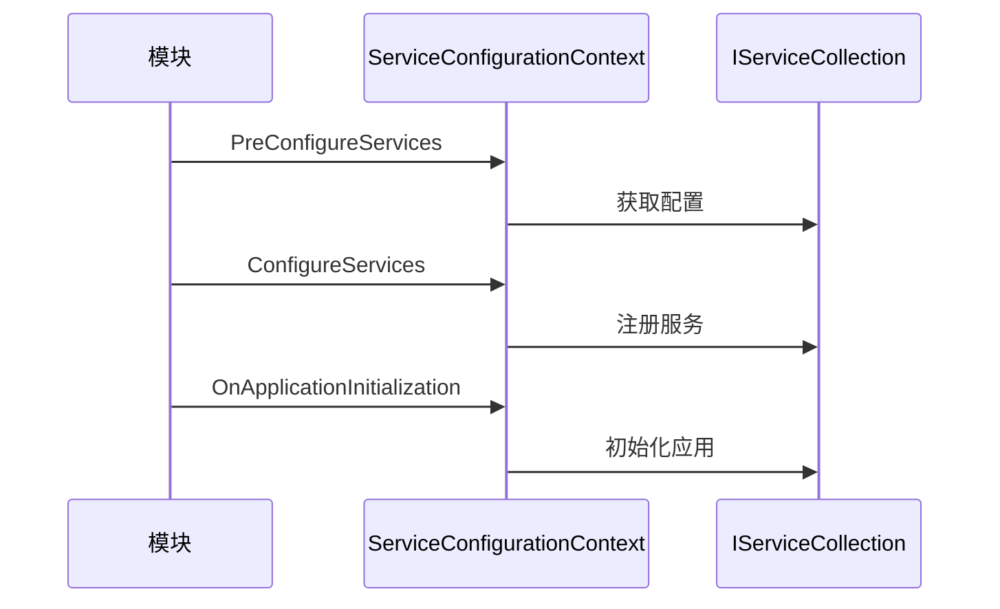
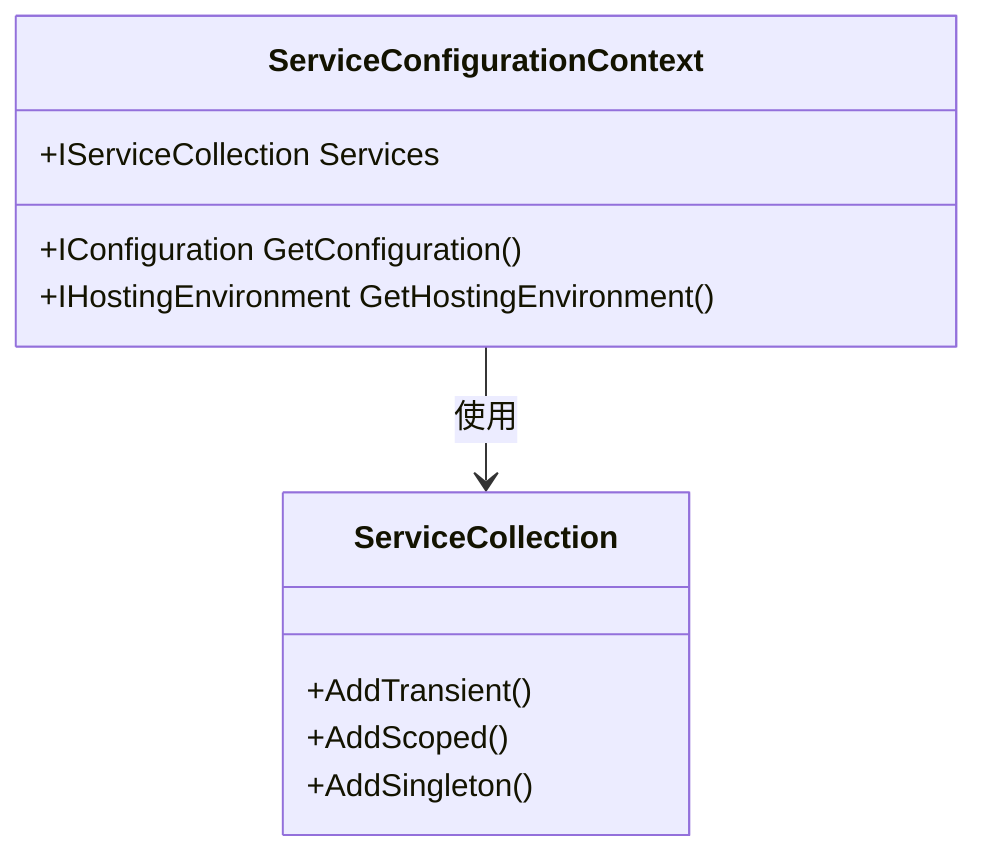
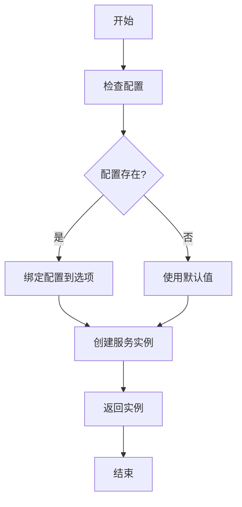
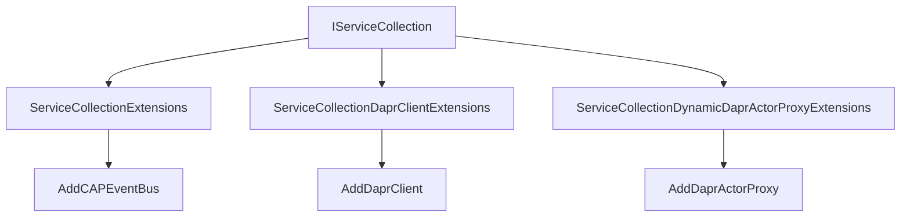

# 服务注册与依赖注入

<cite>
**本文档引用的文件**  
- [IdentityServerHttpApiHostModule.cs](file://aspnet-core/services/LY.MicroService.IdentityServer.HttpApi.Host/IdentityServerHttpApiHostModule.cs)
- [MicroServiceApplicationsSingleModule.Configure.cs](file://aspnet-core/services/LY.AIO.Applications.Single/MicroServiceApplicationsSingleModule.Configure.cs)
- [ServiceCollectionExtensions.cs](file://aspnet-core/framework/common/LINGYUN.Abp.EventBus.CAP/Microsoft/Extensions/DependencyInjection/ServiceCollectionExtensions.cs)
- [ServiceCollectionDaprClientExtensions.cs](file://aspnet-core/framework/dapr/LINGYUN.Abp.Dapr/Microsoft/Extensions/DependencyInjection/ServiceCollectionDaprClientExtensions.cs)
- [AbpModule.cs](file://aspnet-core/framework/common/LINGYUN.Abp.Core/Volo/Abp/Modularity/AbpModule.cs)
</cite>

## 目录
1. [引言](#引言)
2. [项目结构](#项目结构)
3. [核心组件](#核心组件)
4. [架构概述](#架构概述)
5. [详细组件分析](#详细组件分析)
6. [依赖分析](#依赖分析)
7. [性能考虑](#性能考虑)
8. [故障排除指南](#故障排除指南)
9. [结论](#结论)

## 引言
本文档详细介绍了在ABP框架中如何进行服务注册与依赖注入。文档涵盖了服务生命周期管理、工厂模式创建复杂服务实例、服务接口与实现分离的最佳实践，以及装饰器模式的应用等内容。

## 项目结构
该项目采用模块化架构，主要分为框架、迁移、模块、服务、网关等部分。服务注册与依赖注入主要在各个服务模块的`Module`类中完成。

**图示来源**  
- [IdentityServerHttpApiHostModule.cs](file://aspnet-core/services/LY.MicroService.IdentityServer.HttpApi.Host/IdentityServerHttpApiHostModule.cs)
- [AuthServerHttpApiHostModule.cs](file://aspnet-core/services/LY.MicroService.AuthServer.HttpApi.Host/AuthServerHttpApiHostModule.cs)
- [PlatformManagementHttpApiHostModule.cs](file://aspnet-core/services/LY.MicroService.PlatformManagement.HttpApi.Host/PlatformManagementHttpApiHostModule.cs)

**本节来源**  
- [IdentityServerHttpApiHostModule.cs](file://aspnet-core/services/LY.MicroService.IdentityServer.HttpApi.Host/IdentityServerHttpApiHostModule.cs)

## 核心组件
服务注册与依赖注入的核心组件包括`AbpModule`基类、`ServiceConfigurationContext`、各种`Configure`方法等。这些组件共同构成了ABP框架的服务注册体系。

**本节来源**  
- [AbpModule.cs](file://aspnet-core/framework/common/LINGYUN.Abp.Core/Volo/Abp/Modularity/AbpModule.cs)
- [IdentityServerHttpApiHostModule.cs](file://aspnet-core/services/LY.MicroService.IdentityServer.HttpApi.Host/IdentityServerHttpApiHostModule.cs)

## 架构概述
ABP框架的服务注册采用模块化方式，每个模块通过继承`AbpModule`类并重写`ConfigureServices`方法来注册服务。服务注册分为预配置(`PreConfigureServices`)和正式配置(`ConfigureServices`)两个阶段。

**图示来源**  
- [IdentityServerHttpApiHostModule.cs](file://aspnet-core/services/LY.MicroService.IdentityServer.HttpApi.Host/IdentityServerHttpApiHostModule.cs)
- [AbpModule.cs](file://aspnet-core/framework/common/LINGYUN.Abp.Core/Volo/Abp/Modularity/AbpModule.cs)

## 详细组件分析
### 服务注册方法分析
在ABP框架中，服务注册主要通过`ConfigureServices`方法完成。该方法接收`ServiceConfigurationContext`参数，通过`context.Services`访问`IServiceCollection`进行服务注册。

#### 服务生命周期管理
ABP框架支持三种服务生命周期：瞬态(Transient)、作用域(Scoped)和单例(Singleton)。服务生命周期的选择对应用程序性能有重要影响。

**图示来源**  
- [ServiceCollectionExtensions.cs](file://aspnet-core/framework/common/LINGYUN.Abp.EventBus.CAP/Microsoft/Extensions/DependencyInjection/ServiceCollectionExtensions.cs)
- [IdentityServerHttpApiHostModule.cs](file://aspnet-core/services/LY.MicroService.IdentityServer.HttpApi.Host/IdentityServerHttpApiHostModule.cs)

#### 工厂模式创建复杂服务实例
对于需要复杂初始化逻辑的服务，可以使用工厂模式创建实例。通过`AddSingleton`或`AddScoped`方法的重载，传入工厂函数来创建服务实例。

**图示来源**  
- [MicroServiceApplicationsSingleModule.Configure.cs](file://aspnet-core/services/LY.AIO.Applications.Single/MicroServiceApplicationsSingleModule.Configure.cs)
- [ServiceCollectionExtensions.cs](file://aspnet-core/framework/common/LINGYUN.Abp.EventBus.CAP/Microsoft/Extensions/DependencyInjection/ServiceCollectionExtensions.cs)

### 最佳实践
#### 服务接口与实现分离
遵循依赖倒置原则，将服务接口与实现分离，通过接口进行依赖注入。

#### 条件注册
根据配置或环境条件决定是否注册某些服务。

#### 装饰器模式应用
使用装饰器模式增强服务功能，如添加缓存、日志等横切关注点。

**本节来源**  
- [MicroServiceApplicationsSingleModule.Configure.cs](file://aspnet-core/services/LY.AIO.Applications.Single/MicroServiceApplicationsSingleModule.Configure.cs)
- [ServiceCollectionDaprClientExtensions.cs](file://aspnet-core/framework/dapr/LINGYUN.Abp.Dapr/Microsoft/Extensions/DependencyInjection/ServiceCollectionDaprClientExtensions.cs)

## 依赖分析
服务注册依赖于`IServiceCollection`接口，通过扩展方法提供各种服务注册功能。不同模块之间通过`[DependsOn]`特性声明依赖关系。

**图示来源**  
- [ServiceCollectionExtensions.cs](file://aspnet-core/framework/common/LINGYUN.Abp.EventBus.CAP/Microsoft/Extensions/DependencyInjection/ServiceCollectionExtensions.cs)
- [ServiceCollectionDaprClientExtensions.cs](file://aspnet-core/framework/dapr/LINGYUN.Abp.Dapr/Microsoft/Extensions/DependencyInjection/ServiceCollectionDaprClientExtensions.cs)
- [ServiceCollectionDynamicDaprActorProxyExtensions.cs](file://aspnet-core/framework/dapr/LINGYUN.Abp.Dapr.Actors/Microsoft/Extensions/DependencyInjection/ServiceCollectionDynamicDaprActorProxyExtensions.cs)

**本节来源**  
- [ServiceCollectionExtensions.cs](file://aspnet-core/framework/common/LINGYUN.Abp.EventBus.CAP/Microsoft/Extensions/DependencyInjection/ServiceCollectionExtensions.cs)

## 性能考虑
服务生命周期的选择对性能有重要影响。单例服务在整个应用程序生命周期内只创建一次，适合无状态的服务；作用域服务在每个请求范围内创建一次，适合需要保持状态的服务；瞬态服务每次请求都创建新实例，适合轻量级服务。

## 故障排除指南
常见问题包括服务未注册、生命周期选择不当、循环依赖等。通过检查`ConfigureServices`方法中的注册代码和依赖关系可以解决这些问题。

**本节来源**  
- [IdentityServerHttpApiHostModule.cs](file://aspnet-core/services/LY.MicroService.IdentityServer.HttpApi.Host/IdentityServerHttpApiHostModule.cs)
- [MicroServiceApplicationsSingleModule.Configure.cs](file://aspnet-core/services/LY.AIO.Applications.Single/MicroServiceApplicationsSingleModule.Configure.cs)

## 结论
ABP框架提供了强大而灵活的服务注册与依赖注入机制。通过合理使用各种注册方法和生命周期，可以构建高性能、可维护的应用程序。