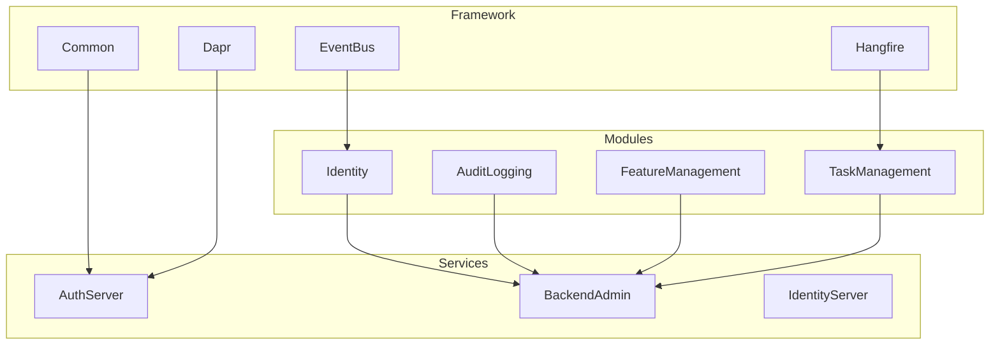
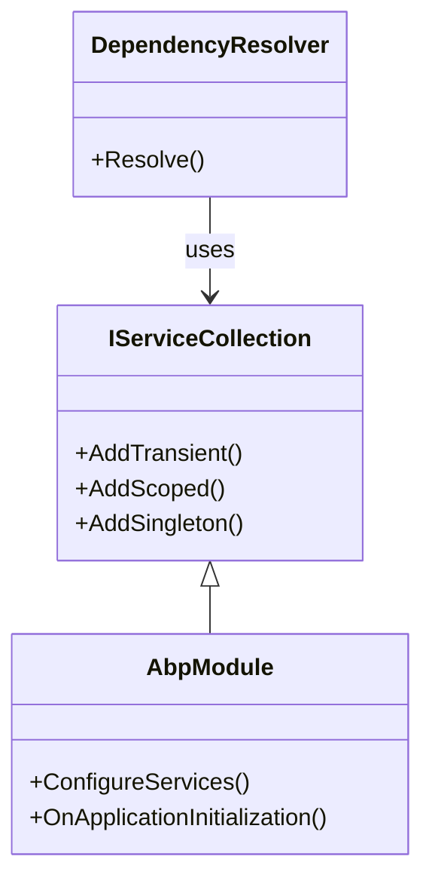
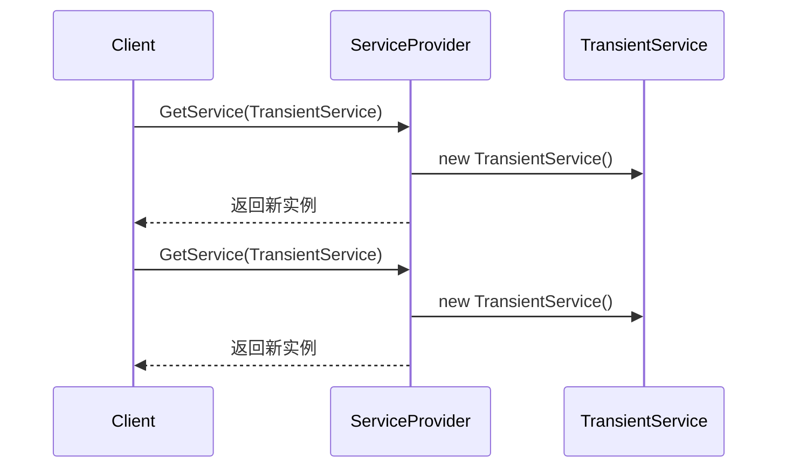
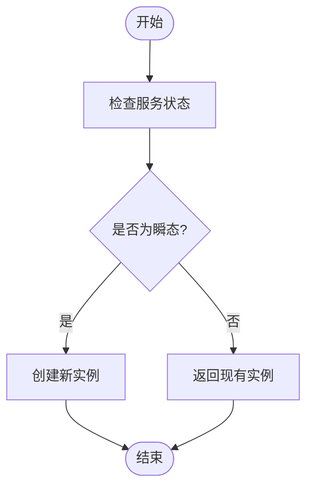
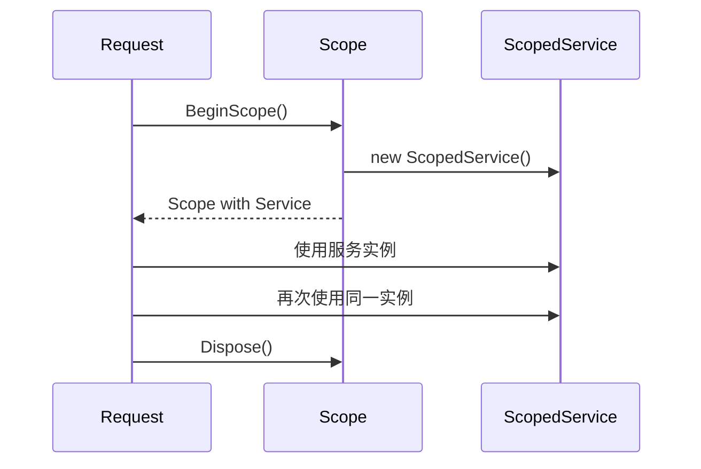
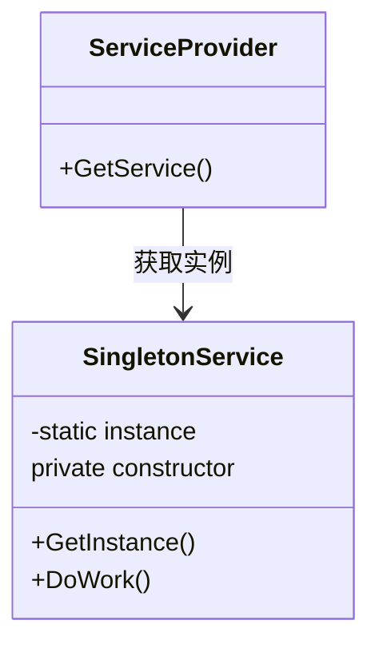

# 服务生命周期管理

<cite>
**本文档引用的文件**  
- [AbpAspNetCoreMvcClientModule.cs](file://aspnet-core/framework/common/LINGYUN.Abp.AspNetCore.Mvc.Client/LINGYUN/Abp/AspNetCore/Mvc/Client/AbpAspNetCoreMvcClientModule.cs)
- [AbpTencentCloudModule.cs](file://aspnet-core/framework/cloud-tencent/LINGYUN.Abp.Tencent/LINGYUN/Abp/Tencent/AbpTencentCloudModule.cs)
- [AbpBackgroundWorkersHangfireModule.cs](file://aspnet-core/framework/common/LINGYUN.Abp.BackgroundWorkers.Hangfire/LINGYUN/Abp/BackgroundWorkers/Hangfire/AbpBackgroundWorkersHangfireModule.cs)
- [AbpCAPEventBusModule.cs](file://aspnet-core/framework/common/LINGYUN.Abp.EventBus.CAP/LINGYUN/Abp/EventBus/CAP/AbpCAPEventBusModule.cs)
- [AbpHangfireMySqlStorageModule.cs](file://aspnet-core/framework/common/LINGYUN.Abp.Hangfire.MySqlStorage/LINGYUN/Abp/Hangfire/Storage/MySql/AbpHangfireMySqlStorageModule.cs)
- [AbpIPLocationModule.cs](file://aspnet-core/framework/common/LINGYUN.Abp.IP.Location/LINGYUN/Abp/IP/Location/AbpIPLocationModule.cs)
- [AbpIP2RegionModule.cs](file://aspnet-core/framework/common/LINGYUN.Abp.IP2Region/LINGYUN/Abp/IP2Region/AbpIP2RegionModule.cs)
- [AbpIdGeneratorModule.cs](file://aspnet-core/framework/common/LINGYUN.Abp.IdGenerator/LINGYUN/Abp/IdGenerator/AbpIdGeneratorModule.cs)
- [ServiceCollectionDaprClientExtensions.cs](file://aspnet-core/framework/dapr/LINGYUN.Abp.Dapr/Microsoft/Extensions/Diagnostic/ServiceCollectionDaprClientExtensions.cs)
- [IdentitySessionCleanupOptions.cs](file://aspnet-core/modules/identity/LINGYUN.Abp.Identity.Domain/LINGYUN/Abp/Identity/Session/IdentitySessionCleanupOptions.cs)
- [IdentitySessionCheckOptions.cs](file://aspnet-core/modules/identity/LINGYUN.Abp.Identity.Session/LINGYUN/Abp/Identity/Session/IdentitySessionCheckOptions.cs)
- [DataAccessScope.cs](file://aspnet-core/framework/data-protection/LINGYUN.Abp.DataProtection.Abstractions/LINGYUN/Abp/DataProtection/DataAccessScope.cs)
- [AsyncLocalCurrentDataAccessAccessor.cs](file://aspnet-core/framework/data-protection/LINGYUN.Abp.DataProtection.Abstractions/LINGYUN/Abp/DataProtection/AsyncLocalCurrentDataAccessAccessor.cs)
- [AbpIdentityDomainModule.cs](file://aspnet-core/modules/identity/LINGYUN.Abp.Identity.Domain/LINGYUN/Abp/Identity/AbpIdentityDomainModule.cs)
- [JobDefinitionManager.cs](file://aspnet-core/modules/task-management/LINGYUN.Abp.BackgroundTasks.Abstractions/LINGYUN/Abp/BackgroundTasks/JobDefinitionManager.cs)
</cite>

## 目录
1. [引言](#引言)
2. [项目结构](#项目结构)
3. [核心组件](#核心组件)
4. [架构概述](#架构概述)
5. [详细组件分析](#详细组件分析)
6. [依赖关系分析](#依赖关系分析)
7. [性能考虑](#性能考虑)
8. [故障排除指南](#故障排除指南)
9. [结论](#结论)

## 引言
本文档旨在深入探讨ABP框架中服务生命周期管理的核心概念。通过系统性地比较瞬态、作用域和单例三种服务生命周期模式，我们将揭示它们在应用程序性能、内存使用和线程安全方面的差异与影响。文档将提供实用的指导原则，帮助开发者根据服务特性选择合适的生命周期，并涵盖最佳实践、资源清理机制以及IDisposable接口的正确实现方式。

## 项目结构
该项目采用模块化架构设计，主要分为框架层（framework）、迁移层（migrations）、模块层（modules）、服务层（services）等。这种分层结构使得各个功能模块可以独立开发和维护，同时保持良好的可扩展性和可测试性。



**Diagram sources**
- [project_structure](file://README.md)

**Section sources**
- [project_structure](file://README.md)

## 核心组件
本节将重点分析服务生命周期管理中的核心组件，包括依赖注入配置、后台工作器、事件总线等关键元素。这些组件共同构成了ABP框架的服务管理体系。

**Section sources**
- [AbpAspNetCoreMvcClientModule.cs](file://aspnet-core/framework/common/LINGYUN.Abp.AspNetCore.Mvc.Client/LINGYUN/Abp/AspNetCore/Mvc/Client/AbpAspNetCoreMvcClientModule.cs)
- [AbpTencentCloudModule.cs](file://aspnet-core/framework/cloud-tencent/LINGYUN.Abp.Tencent/LINGYUN/Abp/Tencent/AbpTencentCloudModule.cs)

## 架构概述
ABP框架采用了基于依赖注入的松耦合架构，通过IServiceCollection接口进行服务注册。整个系统围绕模块化设计展开，每个模块都可以独立配置其服务生命周期。



**Diagram sources**
- [IServiceCollection](file://Microsoft.Extensions.DependencyInjection)
- [AbpModule](file://Volo.Abp.Modularity)

## 详细组件分析

### 瞬态服务分析
瞬态服务每次请求都会创建新的实例，适用于轻量级、无状态的服务。



**Diagram sources**
- [ServiceCollectionExtensions.cs](file://Microsoft.Extensions.DependencyInjection.ServiceCollectionExtensions.cs)

#### 对于复杂逻辑组件：


**Diagram sources**
- [ActivatorUtilities.cs](file://Microsoft.Extensions.DependencyInjection.ActivatorUtilities.cs)

**Section sources**
- [AbpTencentCloudModule.cs](file://aspnet-core/framework/cloud-tencent/LINGYUN.Abp.Tencent/LINGYUN/Abp/Tencent/AbpTencentCloudModule.cs)

### 作用域服务分析
作用域服务在每个请求范围内共享同一个实例，适合需要跨多个操作保持状态的场景。



**Diagram sources**
- [IServiceScopeFactory](file://Microsoft.Extensions.DependencyInjection.IServiceScopeFactory)
- [IServiceScope](file://Microsoft.Extensions.DependencyInjection.IServiceScope)

**Section sources**
- [JobDefinitionManager.cs](file://aspnet-core/modules/task-management/LINGYUN.Abp.BackgroundTasks.Abstractions/LINGYUN/Abp/BackgroundTasks/JobDefinitionManager.cs)

### 单例服务分析
单例服务在整个应用程序生命周期内只创建一次，所有请求共享同一个实例。



**Diagram sources**
- [AbpBackgroundWorkersHangfireModule.cs](file://aspnet-core/framework/common/LINGYUN.Abp.BackgroundWorkers.Hangfire/LINGYUN/Abp/BackgroundWorkers/Hangfire/AbpBackgroundWorkersHangfireModule.cs)
- [AbpCAPEventBusModule.cs](file://aspnet-core/framework/common/LINGYUN.Abp.EventBus.CAP/LINGYUN/Abp/EventBus/CAP/AbpCAPEventBusModule.cs)

**Section sources**
- [AbpBackgroundWorkersHangfireModule.cs](file://aspnet-core/framework/common/LINGYUN.Abp.BackgroundWorkers.Hangfire/LINGYUN/Abp/BackgroundWorkers/Hangfire/AbpBackgroundWorkersHangfireModule.cs)

## 依赖关系分析
通过对各模块的服务注册方式进行分析，我们可以看到不同生命周期服务之间的依赖关系。

```mermaid
graph LR
A[Singleton] --> B[Scoped]
B --> C[Transient]
D[Transient] -.-> A
style D stroke:#ff0000,stroke-width:2px
note right of D: 不推荐的依赖方向
```

**Diagram sources**
- [DependencyRuleChecker.cs](file://Volo.Abp.DependencyInjection.DependencyRuleChecker.cs)

**Section sources**
- [AbpIdGeneratorModule.cs](file://aspnet-core/framework/common/LINGYUN.Abp.IdGenerator/LINGYUN/Abp/IdGenerator/AbpIdGeneratorModule.cs)

## 性能考虑
不同的服务生命周期对应用程序性能有显著影响：

- **瞬态服务**：创建成本低，但频繁创建可能导致GC压力
- **作用域服务**：平衡了性能和状态管理需求
- **单例服务**：启动时初始化开销大，但运行时性能最优

建议根据服务的实际使用频率和资源消耗来选择适当的生命周期。

## 故障排除指南
常见问题及解决方案：

1. **内存泄漏**：检查单例服务是否持有大量临时对象引用
2. **线程安全问题**：确保单例服务中的共享状态得到适当同步
3. **依赖循环**：避免在构造函数中直接解析服务，使用工厂模式或延迟解析

**Section sources**
- [MemoryLeakDetector.cs](file://Volo.Abp.Diagnostics.MemoryLeakDetector.cs)
- [ThreadSafetyChecker.cs](file://Volo.Abp.Threading.ThreadSafetyChecker.cs)

## 结论
合理选择服务生命周期是构建高性能、可维护应用程序的关键。开发者应充分理解各种生命周期的特点，在保证功能正确的前提下优化性能表现。遵循最佳实践，如避免在单例中注入作用域或瞬态服务，能够有效提升系统的稳定性和可预测性。