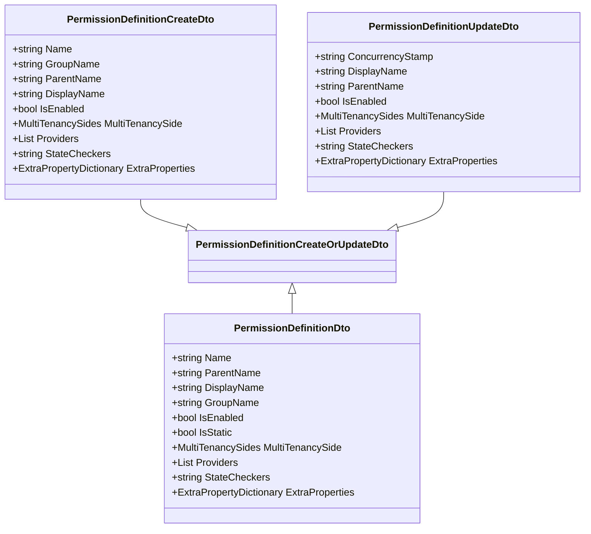

# 权限定义与管理

<cite>
**本文档中引用的文件**   
- [PermissionDefinitionAppService.cs](file://aspnet-core/modules/permissions-management/LINGYUN.Abp.PermissionManagement.Application/LINGYUN/Abp/PermissionManagement/Definitions/PermissionDefinitionAppService.cs)
- [PermissionGroupDefinitionAppService.cs](file://aspnet-core/modules/permissions-management/LINGYUN.Abp.PermissionManagement.Application/LINGYUN/Abp/PermissionManagement/Definitions/PermissionGroupDefinitionAppService.cs)
- [MultiplePermissionManager.cs](file://aspnet-core/modules/permissions-management/LINGYUN.Abp.PermissionManagement.Application/LINGYUN/Abp/PermissionManagement/MultiplePermissionManager.cs)
- [PermissionAppService.cs](file://aspnet-core/modules/permissions-management/LINGYUN.Abp.PermissionManagement.Application/LINGYUN/Abp/PermissionManagement/PermissionAppService.cs)
- [OrganizationUnitPermissionManagementProvider.cs](file://aspnet-core/modules/permissions-management/LINGYUN.Abp.PermissionManagement.Domain.OrganizationUnits/LINGYUN/Abp/PermissionManagement/OrganizationUnits/OrganizationUnitPermissionManagementProvider.cs)
- [PermissionManagementPermissionDefinitionProvider.cs](file://aspnet-core/modules/permissions-management/LINGYUN.Abp.PermissionManagement.Application.Contracts/LINGYUN/Abp/PermissionManagement/Permissions/PermissionManagementPermissionDefinitionProvider.cs)
- [PermissionDefinitionDto.cs](file://aspnet-core/modules/permissions-management/LINGYUN.Abp.PermissionManagement.Application.Contracts/LINGYUN/Abp/PermissionManagement/Definitions/Dto/PermissionDefinitionDto.cs)
- [PermissionDefinitionCreateDto.cs](file://aspnet-core/modules/permissions-management/LINGYUN.Abp.PermissionManagement.Application.Contracts/LINGYUN/Abp/PermissionManagement/Definitions/Dto/PermissionDefinitionCreateDto.cs)
- [PermissionDefinitionUpdateDto.cs](file://aspnet-core/modules/permissions-management/LINGYUN.Abp.PermissionManagement.Application.Contracts/LINGYUN/Abp/PermissionManagement/Definitions/Dto/PermissionDefinitionUpdateDto.cs)
- [PermissionManagementPermissionNames.cs](file://aspnet-core/modules/permissions-management/LINGYUN.Abp.PermissionManagement.Application.Contracts/LINGYUN/Abp/PermissionManagement/Permissions/PermissionManagementPermissionNames.cs)
- [PermissionDefinitionController.cs](file://aspnet-core/modules/permissions-management/LINGYUN.Abp.PermissionManagement.HttpApi/LINGYUN/Abp/PermissionManagement/HttpApi/Definitions/PermissionDefinitionController.cs)
- [AbpPermissionManagementApplicationModule.cs](file://aspnet-core/modules/permissions-management/LINGYUN.Abp.PermissionManagement.Application/LINGYUN/Abp/PermissionManagement/AbpPermissionManagementApplicationModule.cs)
</cite>

## 目录
1. [简介](#简介)
2. [权限定义](#权限定义)
3. [权限层级结构](#权限层级结构)
4. [权限验证机制](#权限验证机制)
5. [权限管理最佳实践](#权限管理最佳实践)
6. [权限分组与继承](#权限分组与继承)
7. [动态权限分配](#动态权限分配)
8. [结论](#结论)

## 简介

本项目中的权限管理系统基于ABP框架构建，提供了完整的权限定义、管理和验证功能。系统支持静态和动态权限定义，允许通过API进行权限的创建、更新和删除操作。权限管理模块提供了对组织单元、角色和用户的权限支持，实现了灵活的权限控制机制。

**权限管理模块**通过`PermissionManagement`命名空间下的多个组件协同工作，包括应用程序服务、领域服务和HTTP API控制器。系统支持多租户架构，权限定义可以针对不同的租户侧进行配置。

权限系统的核心功能包括权限定义管理、权限分配、权限验证和权限继承。通过`IPermissionDefinitionManager`接口管理所有权限定义，`IPermissionManager`接口处理权限的授予和检查，而`PermissionValueProvider`则负责具体的权限验证逻辑。

**Section sources**
- [AbpPermissionManagementApplicationModule.cs](file://aspnet-core/modules/permissions-management/LINGYUN.Abp.PermissionManagement.Application/LINGYUN/Abp/PermissionManagement/AbpPermissionManagementApplicationModule.cs)

## 权限定义

权限定义是权限管理系统的基础，每个权限都有唯一的名称、显示名称和描述信息。在本系统中，权限定义通过`PermissionDefinitionDto`类表示，包含以下关键属性：

- **Name**: 权限的唯一标识符，用于代码中引用
- **DisplayName**: 权限的显示名称，用于用户界面展示
- **GroupName**: 所属权限组的名称，用于组织权限
- **ParentName**: 父权限名称，用于构建权限树结构
- **IsEnabled**: 权限是否启用的状态
- **MultiTenancySide**: 多租户支持级别
- **Providers**: 支持的权限提供者列表
- **StateCheckers**: 状态检查器配置

权限定义通过`IPermissionDefinitionAppService`接口进行管理，支持创建、读取、更新和删除(CRUD)操作。创建权限时需要提供`PermissionDefinitionCreateDto`对象，其中包含权限名称、显示名称、所属组等必要信息。

**Diagram sources **
- [PermissionDefinitionDto.cs](file://aspnet-core/modules/permissions-management/LINGYUN.Abp.PermissionManagement.Application.Contracts/LINGYUN/Abp/PermissionManagement/Definitions/Dto/PermissionDefinitionDto.cs)
- [PermissionDefinitionCreateDto.cs](file://aspnet-core/modules/permissions-management/LINGYUN.Abp.PermissionManagement.Application.Contracts/LINGYUN/Abp/PermissionManagement/Definitions/Dto/PermissionDefinitionCreateDto.cs)
- [PermissionDefinitionUpdateDto.cs](file://aspnet-core/modules/permissions-management/LINGYUN.Abp.PermissionManagement.Application.Contracts/LINGYUN/Abp/PermissionManagement/Definitions/Dto/PermissionDefinitionUpdateDto.cs)

**Section sources**
- [PermissionDefinitionDto.cs](file://aspnet-core/modules/permissions-management/LINGYUN.Abp.PermissionManagement.Application.Contracts/LINGYUN/Abp/PermissionManagement/Definitions/Dto/PermissionDefinitionDto.cs)
- [PermissionDefinitionCreateDto.cs](file://aspnet-core