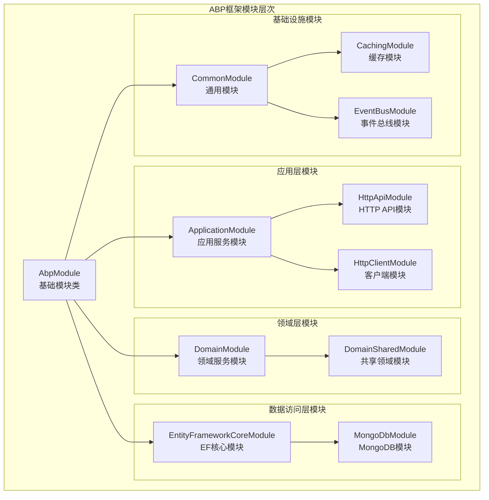
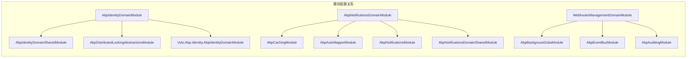
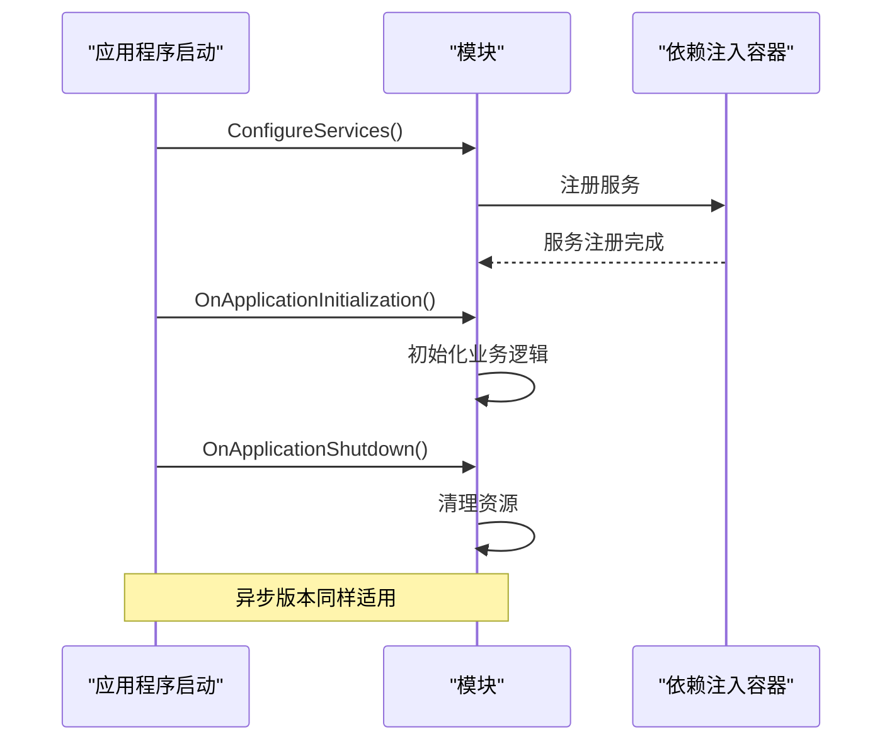
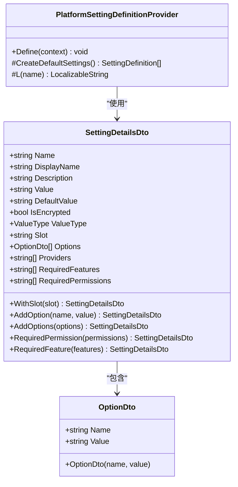

# ABP框架模块创建详细指南

<cite>
**本文档引用的文件**
- [AbpNotificationsDomainModule.cs](file://aspnet-core/modules/realtime-notifications/LINGYUN.Abp.Notifications.Domain/LINGYUN/Abp/Notifications/AbpNotificationsDomainModule.cs)
- [AbpIdentityDomainModule.cs](file://aspnet-core/modules/identity/LINGYUN.Abp.Identity.Domain/LINGYUN/Abp/Identity/AbpIdentityDomainModule.cs)
- [AbpCommonModule.cs](file://aspnet-core/framework/common/LINGYUN.Abp.Core/AbpCommonModule.cs)
- [PlatformSettingDefinitionProvider.cs](file://aspnet-core/modules/platform/LINGYUN.Platform.Domain/LINGYUN/Platform/Settings/PlatformSettingDefinitionProvider.cs)
- [SettingDetailsDto.cs](file://aspnet-core/framework/settings/LINGYUN.Abp.SettingManagement.Application.Contracts/LINGYUN/Abp/SettingManagement/Dto/SettingDetailsDto.cs)
- [OptionDto.cs](file://aspnet-core/framework/settings/LINGYUN.Abp.SettingManagement.Application.Contracts/LINGYUN/Abp/SettingManagement/Dto/OptionDto.cs)
- [WebhooksManagementDomainModule.cs](file://aspnet-core/modules/webhooks/LINGYUN.Abp.WebhooksManagement.Domain/LINGYUN/Abp/WebhooksManagement/WebhooksManagementDomainModule.cs)
</cite>

## 目录
1. [简介](#简介)
2. [模块基础概念](#模块基础概念)
3. [模块类定义](#模块类定义)
4. [模块依赖关系](#模块依赖关系)
5. [模块生命周期方法](#模块生命周期方法)
6. [模块配置选项](#模块配置选项)
7. [模块创建模板](#模块创建模板)
8. [最佳实践](#最佳实践)
9. [故障排除](#故障排除)
10. [总结](#总结)

## 简介

ABP框架是一个基于.NET的模块化应用程序开发框架，它提供了强大的模块系统来帮助开发者构建可扩展的企业级应用程序。模块是ABP框架的核心组件，它们封装了特定的功能领域，并通过依赖注入和服务定位器模式进行交互。

本指南将详细介绍如何在ABP框架中定义新的模块类，包括模块类的属性、生命周期方法的使用，模块依赖关系的声明方式，以及模块配置选项的定义和使用方法。

## 模块基础概念

### 什么是ABP模块？

ABP模块是应用程序的基本构建单元，每个模块都代表应用程序中的一个功能领域或业务模块。模块具有以下特点：

- **独立性**：每个模块都有自己的功能边界
- **可重用性**：模块可以在不同的应用程序中重复使用
- **可扩展性**：模块可以添加新的功能而不需要修改现有代码
- **松耦合**：模块之间通过接口进行通信，降低耦合度

### 模块层次结构



**图表来源**
- [AbpCommonModule.cs](file://aspnet-core/framework/common/LINGYUN.Abp.Core/AbpCommonModule.cs#L1-L8)

## 模块类定义

### 基础模块类

所有ABP模块都必须继承自`AbpModule`基类。这是模块系统的核心基类，提供了模块生命周期管理和依赖注入支持。

```csharp
// 基础模块类定义
public class AbpCommonModule : AbpModule
{
    // 模块实现
}
```

### 模块特性

模块类通常使用`[DependsOn]`特性来声明与其他模块的依赖关系：

```csharp
[DependsOn(
    typeof(AbpCachingModule),
    typeof(AbpAutoMapperModule),
    typeof(AbpNotificationsModule),
    typeof(AbpNotificationsDomainSharedModule))]
public class AbpNotificationsDomainModule : AbpModule
{
    // 模块实现
}
```

**章节来源**
- [AbpNotificationsDomainModule.cs](file://aspnet-core/modules/realtime-notifications/LINGYUN.Abp.Notifications.Domain/LINGYUN/Abp/Notifications/AbpNotificationsDomainModule.cs#L1-L15)

## 模块依赖关系

### 依赖声明方式

ABP框架使用`[DependsOn]`特性来声明模块之间的依赖关系。这种声明式依赖管理确保了模块加载的正确顺序。

```csharp
[DependsOn(
    typeof(AbpIdentityDomainSharedModule),
    typeof(AbpDistributedLockingAbstractionsModule),
    typeof(Volo.Abp.Identity.AbpIdentityDomainModule))]
public class AbpIdentityDomainModule : AbpModule
{
    // 模块实现
}
```

### 依赖关系类型

1. **直接依赖**：当前模块直接使用的其他模块
2. **间接依赖**：被当前模块依赖的模块所依赖的模块
3. **循环依赖**：避免出现循环依赖关系

### 依赖关系图



**图表来源**
- [AbpIdentityDomainModule.cs](file://aspnet-core/modules/identity/LINGYUN.Abp.Identity.Domain/LINGYUN/Abp/Identity/AbpIdentityDomainModule.cs#L17-L21)
- [AbpNotificationsDomainModule.cs](file://aspnet-core/modules/realtime-notifications/LINGYUN.Abp.Notifications.Domain/LINGYUN/Abp/Notifications/AbpNotificationsDomainModule.cs#L11-L15)

**章节来源**
- [AbpIdentityDomainModule.cs](file://aspnet-core/modules/identity/LINGYUN.Abp.Identity.Domain/LINGYUN/Abp/Identity/AbpIdentityDomainModule.cs#L17-L21)
- [AbpNotificationsDomainModule.cs](file://aspnet-core/modules/realtime-notifications/LINGYUN.Abp.Notifications.Domain/LINGYUN/Abp/Notifications/AbpNotificationsDomainModule.cs#L11-L15)

## 模块生命周期方法

### 生命周期概述

ABP框架提供了多个生命周期方法，允许模块在应用程序的不同阶段执行初始化和清理操作：



**图表来源**
- [AbpNotificationsDomainModule.cs](file://aspnet-core/modules/realtime-notifications/LINGYUN.Abp.Notifications.Domain/LINGYUN/Abp/Notifications/AbpNotificationsDomainModule.cs#L25-L55)

### 核心生命周期方法

#### 1. ConfigureServices()

这是模块配置服务的主要入口点：

```csharp
public override void ConfigureServices(ServiceConfigurationContext context)
{
    if (context.Services.IsDataMigrationEnvironment())
    {
        Configure<AbpNotificationsManagementOptions>(options =>
        {
            options.SaveStaticNotificationsToDatabase = false;
            options.IsDynamicNotificationsStoreEnabled = false;
        });
    }

    Configure<AbpAutoMapperOptions>(options =>
    {
        options.AddProfile<AbpNotificationsDomainAutoMapperProfile>(validate: true);
    });
}
```

#### 2. OnApplicationInitialization()

同步初始化方法：

```csharp
public override void OnApplicationInitialization(ApplicationInitializationContext context)
{
    AsyncHelper.RunSync(() => OnApplicationInitializationAsync(context));
}
```

#### 3. OnApplicationInitializationAsync()

异步初始化方法：

```csharp
public override Task OnApplicationInitializationAsync(ApplicationInitializationContext context)
{
    return context.ServiceProvider
        .GetRequiredService<NotificationDefinitionInitializer>()
        .InitializeDynamicNotifications(_cancellationTokenSource.Token);
}
```

#### 4. OnApplicationShutdownAsync()

应用程序关闭时的清理方法：

```csharp
public override Task OnApplicationShutdownAsync(ApplicationShutdownContext context)
{
    _cancellationTokenSource.Cancel();
    return Task.CompletedTask;
}
```

### 生命周期方法使用场景

1. **数据迁移环境检测**：在数据迁移环境中禁用某些功能
2. **服务注册**：注册模块特有的服务
3. **配置验证**：验证模块配置的有效性
4. **后台任务启动**：启动需要长时间运行的任务
5. **资源清理**：释放占用的资源

**章节来源**
- [AbpNotificationsDomainModule.cs](file://aspnet-core/modules/realtime-notifications/LINGYUN.Abp.Notifications.Domain/LINGYUN/Abp/Notifications/AbpNotificationsDomainModule.cs#L17-L55)
- [AbpIdentityDomainModule.cs](file://aspnet-core/modules/identity/LINGYUN.Abp.Identity.Domain/LINGYUN/Abp/Identity/AbpIdentityDomainModule.cs#L23-L56)

## 模块配置选项

### 配置选项体系

ABP框架提供了灵活的配置系统，允许模块定义和管理各种配置选项：



**图表来源**
- [SettingDetailsDto.cs](file://aspnet-core/framework/settings/LINGYUN.Abp.SettingManagement.Application.Contracts/LINGYUN/Abp/SettingManagement/Dto/SettingDetailsDto.cs#L1-L76)
- [OptionDto.cs](file://aspnet-core/framework/settings/LINGYUN.Abp.SettingManagement.Application.Contracts/LINGYUN/Abp/SettingManagement/Dto/OptionDto.cs#L1-L17)

### 配置选项定义

#### 1. 设置详情对象

`SettingDetailsDto`类提供了丰富的配置选项定义能力：

```csharp
public class SettingDetailsDto
{
    public string Name { get; set; }
    public string DisplayName { get; set; }
    public string Description { get; set; }
    public string Value { get; set; }
    public string DefaultValue { get; set; }
    public bool IsEncrypted { get; set; }
    public ValueType ValueType { get; set; }
    public string Slot { get; set; }
    public List<OptionDto> Options { get; set; } = new List<OptionDto>();
    public List<string> Providers { get; set; } = new List<string>();
    public List<string> RequiredFeatures { get; set; } = new List<string>();
    public List<string> RequiredPermissions { get; set; } = new List<string>();
}
```

#### 2. 选项定义

`OptionDto`类用于定义配置选项的值：

```csharp
public class OptionDto
{
    public string Name { get; set; }
    public string Value { get; set; }

    public OptionDto(string name, string value)
    {
        Name = name;
        Value = value;
    }
}
```

#### 3. 设置定义提供者

通过继承`SettingDefinitionProvider`类来定义模块的默认设置：

```csharp
public class PlatformSettingDefinitionProvider : SettingDefinitionProvider
{
    public override void Define(ISettingDefinitionContext context)
    {
        context.Add(CreateDefaultSettings());
    }

    protected SettingDefinition[] CreateDefaultSettings()
    {
        return new SettingDefinition[0];
    }

    protected LocalizableString L(string name)
    {
        return LocalizableString.Create<PlatformResource>(name);
    }
}
```

### 配置选项使用方法

#### 1. 添加单个选项

```csharp
var setting = new SettingDetailsDto()
    .AddOption("Option1", "Value1")
    .AddOption("Option2", "Value2");
```

#### 2. 添加多个选项

```csharp
var options = new List<OptionDto>
{
    new OptionDto("Option1", "Value1"),
    new OptionDto("Option2", "Value2")
};

var setting = new SettingDetailsDto()
    .AddOptions(options);
```

#### 3. 设置权限要求

```csharp
var setting = new SettingDetailsDto()
    .RequiredPermission("Setting.Manage", "Setting.View");
```

#### 4. 设置功能要求

```csharp
var setting = new SettingDetailsDto()
    .RequiredFeature("Feature1", "Feature2");
```

**章节来源**
- [SettingDetailsDto.cs](file://aspnet-core/framework/settings/LINGYUN.Abp.SettingManagement.Application.Contracts/LINGYUN/Abp/SettingManagement/Dto/SettingDetailsDto.cs#L1-L76)
- [OptionDto.cs](file://aspnet-core/framework/settings/LINGYUN.Abp.SettingManagement.Application.Contracts/LINGYUN/Abp/SettingManagement/Dto/OptionDto.cs#L1-L17)
- [PlatformSettingDefinitionProvider.cs](file://aspnet-core/modules/platform/LINGYUN.Platform.Domain/LINGYUN/Platform/Settings/PlatformSettingDefinitionProvider.cs#L1-L23)

## 模块创建模板

### 基础模块模板

以下是创建新ABP模块的标准模板：

```csharp
using Microsoft.Extensions.DependencyInjection;
using Volo.Abp;
using Volo.Abp.Modularity;

namespace YourNamespace.Modules
{
    [DependsOn(
        typeof(AbpCoreModule),
        typeof(AbpAutoMapperModule),
        typeof(AbpValidationModule))]
    public class YourModuleNameModule : AbpModule
    {
        public override void ConfigureServices(ServiceConfigurationContext context)
        {
            // 1. 配置服务注册
            ConfigureYourServices(context);
            
            // 2. 配置模块特定选项
            ConfigureModuleOptions(context);
            
            // 3. 配置依赖项
            ConfigureDependencies(context);
        }
        
        public override void OnApplicationInitialization(ApplicationInitializationContext context)
        {
            // 同步初始化逻辑
            InitializeApplication(context);
        }
        
        public override Task OnApplicationInitializationAsync(ApplicationInitializationContext context)
        {
            // 异步初始化逻辑
            return InitializeApplicationAsync(context);
        }
        
        public override Task OnApplicationShutdownAsync(ApplicationShutdownContext context)
        {
            // 应用程序关闭时的清理逻辑
            return CleanupResourcesAsync(context);
        }
        
        private void ConfigureYourServices(ServiceConfigurationContext context)
        {
            // 注册服务
            context.Services.AddScoped<IMyService, MyService>();
        }
        
        private void ConfigureModuleOptions(ServiceConfigurationContext context)
        {
            // 配置模块选项
            Configure<YourModuleOptions>(options =>
            {
                options.Property1 = "Value1";
                options.Property2 = true;
            });
        }
        
        private void ConfigureDependencies(ServiceConfigurationContext context)
        {
            // 配置依赖关系
        }
        
        private void InitializeApplication(ApplicationInitializationContext context)
        {
            // 应用程序初始化逻辑
        }
        
        private async Task InitializeApplicationAsync(ApplicationInitializationContext context)
        {
            // 异步应用程序初始化逻辑
        }
        
        private async Task CleanupResourcesAsync(ApplicationShutdownContext context)
        {
            // 资源清理逻辑
        }
    }
}
```

### 项目结构组织

推荐的模块项目结构：

```
YourModule/
├── Application/
│   ├── Contracts/
│   │   └── IYourService.cs
│   ├── Services/
│   │   └── YourService.cs
│   └── YourModuleApplicationModule.cs
├── Domain/
│   ├── Entities/
│   │   └── YourEntity.cs
│   ├── Repositories/
│   │   └── IYourRepository.cs
│   ├── Services/
│   │   └── YourDomainService.cs
│   ├── Shared/
│   │   └── YourDomainSharedModule.cs
│   └── YourModuleDomainModule.cs
├── EntityFrameworkCore/
│   ├── DbContexts/
│   │   └── YourDbContext.cs
│   ├── Migrations/
│   ├── Repositories/
│   │   └── EfCoreYourRepository.cs
│   └── YourModuleEntityFrameworkCoreModule.cs
├── HttpApi/
│   ├── Controllers/
│   │   └── YourController.cs
│   └── YourModuleHttpApiModule.cs
└── YourModule.csproj
```

### 命名规范

1. **模块名称**：使用描述性名称，如`YourModuleNameModule`
2. **命名空间**：使用公司或组织名称作为根命名空间
3. **文件夹结构**：按照功能层次组织文件夹
4. **类名**：使用模块名称加后缀的方式命名类

## 最佳实践

### 1. 模块设计原则

#### 单一职责原则
每个模块应该专注于一个特定的功能领域，避免功能混杂。

#### 开闭原则
模块应该对扩展开放，对修改关闭。通过接口和抽象类实现可扩展性。

#### 依赖倒置原则
高层模块不应该依赖低层模块，都应该依赖于抽象。

### 2. 依赖管理

#### 正确声明依赖
```csharp
[DependsOn(
    typeof(AbpCoreModule),           // 必需的核心模块
    typeof(AbpAutoMapperModule),     // 映射模块
    typeof(AbpValidationModule))]    // 验证模块
```

#### 避免循环依赖
- 使用接口解耦
- 通过事件机制通信
- 使用中介者模式

### 3. 配置管理

#### 分层配置
```csharp
// 应用程序级别配置
Configure<AppOptions>(options =>
{
    options.Property1 = "AppValue1";
});

// 模块级别配置
Configure<YourModuleOptions>(options =>
{
    options.Property1 = "ModuleValue1";
});
```

#### 配置验证
```csharp
Configure<YourModuleOptions>(options =>
{
    if (string.IsNullOrEmpty(options.RequiredProperty))
    {
        throw new ArgumentException("RequiredProperty is mandatory");
    }
});
```

### 4. 生命周期管理

#### 异步操作处理
```csharp
public override async Task OnApplicationInitializationAsync(ApplicationInitializationContext context)
{
    // 异步初始化
    await InitializeAsync(context);
    
    // 启动后台任务
    await StartBackgroundTasksAsync(context);
}
```

#### 资源清理
```csharp
public override async Task OnApplicationShutdownAsync(ApplicationShutdownContext context)
{
    // 取消所有正在进行的操作
    _cancellationTokenSource.Cancel();
    
    // 清理资源
    await DisposeResourcesAsync();
}
```

### 5. 错误处理

#### 异常捕获
```csharp
public override async Task OnApplicationInitializationAsync(ApplicationInitializationContext context)
{
    try
    {
        await InitializeAsync(context);
    }
    catch (Exception ex)
    {
        Logger.LogError(ex, "Failed to initialize module: {ModuleName}", nameof(YourModuleNameModule));
        throw;
    }
}
```

#### 日志记录
```csharp
private readonly ILogger<YourModuleNameModule> _logger;

public YourModuleNameModule(ILogger<YourModuleNameModule> logger)
{
    _logger = logger;
}

private void InitializeApplication(ApplicationInitializationContext context)
{
    _logger.LogInformation("Initializing {ModuleName}", nameof(YourModuleNameModule));
}
```

## 故障排除

### 常见问题及解决方案

#### 1. 模块加载失败

**问题**：模块无法正常加载或初始化

**解决方案**：
- 检查`[DependsOn]`特性中的依赖是否正确
- 确保所有必需的服务都已注册
- 验证配置选项的有效性

```csharp
// 检查依赖关系
[DependsOn(
    typeof(AbpCoreModule),           // 确保核心模块存在
    typeof(AbpAutoMapperModule))]    // 确保映射模块存在
```

#### 2. 服务注册冲突

**问题**：相同的服务被多次注册

**解决方案**：
- 使用条件注册
- 检查服务生命周期

```csharp
if (!context.Services.Any(s => s.ServiceType == typeof(IMyService)))
{
    context.Services.AddScoped<IMyService, MyService>();
}
```

#### 3. 配置选项未生效

**问题**：模块配置选项没有按预期工作

**解决方案**：
- 检查配置键名是否正确
- 验证配置优先级
- 确保配置在正确的时机被读取

```csharp
// 在正确的时机读取配置
public override void OnApplicationInitialization(ApplicationInitializationContext context)
{
    var options = context.ServiceProvider.GetRequiredService<IOptions<YourModuleOptions>>().Value;
    // 使用配置选项
}
```

#### 4. 异步操作超时

**问题**：异步初始化操作超时

**解决方案**：
- 增加超时时间
- 使用取消令牌
- 分批处理大量数据

```csharp
public override async Task OnApplicationInitializationAsync(ApplicationInitializationContext context)
{
    var timeout = TimeSpan.FromMinutes(5);
    using var cts = new CancellationTokenSource(timeout);
    
    await InitializeAsync(context, cts.Token);
}
```

### 调试技巧

#### 1. 启用详细日志
```csharp
ConfigureLogging(builder =>
{
    builder.SetMinimumLevel(LogLevel.Debug);
    builder.AddConsole();
});
```

#### 2. 模块初始化跟踪
```csharp
public override void OnApplicationInitialization(ApplicationInitializationContext context)
{
    Logger.LogInformation("Starting initialization of {ModuleName}", nameof(YourModuleNameModule));
    
    // 初始化逻辑
    
    Logger.LogInformation("Completed initialization of {ModuleName}", nameof(YourModuleNameModule));
}
```

#### 3. 依赖注入验证
```csharp
public override void ConfigureServices(ServiceConfigurationContext context)
{
    // 验证必需的服务
    context.Services.AddHostedService<YourBackgroundService>();
    
    // 检查服务注册
    var serviceProvider = context.Services.BuildServiceProvider();
    var service = serviceProvider.GetService<IMyService>();
    Debug.Assert(service != null, "IMyService is not registered");
}
```

## 总结

ABP框架的模块系统为构建可扩展、可维护的企业级应用程序提供了强大的基础。通过本指南介绍的内容，您可以：

1. **理解模块基础概念**：掌握ABP模块的设计理念和架构
2. **掌握模块创建方法**：学会如何定义模块类和声明依赖关系
3. **熟悉生命周期管理**：了解模块在应用程序生命周期中的各个阶段
4. **掌握配置选项使用**：学会定义和使用模块配置选项
5. **遵循最佳实践**：采用推荐的设计模式和编码规范
6. **解决常见问题**：具备排查和解决模块相关问题的能力

模块化开发不仅提高了代码的可重用性和可维护性，还促进了团队协作和项目的长期发展。通过合理使用ABP框架的模块系统，您可以构建出高质量、高性能的企业级应用程序。

记住，模块设计的关键在于清晰的职责分离、合理的依赖管理和良好的错误处理。持续学习和实践这些概念，您将能够充分发挥ABP框架模块系统的强大功能。