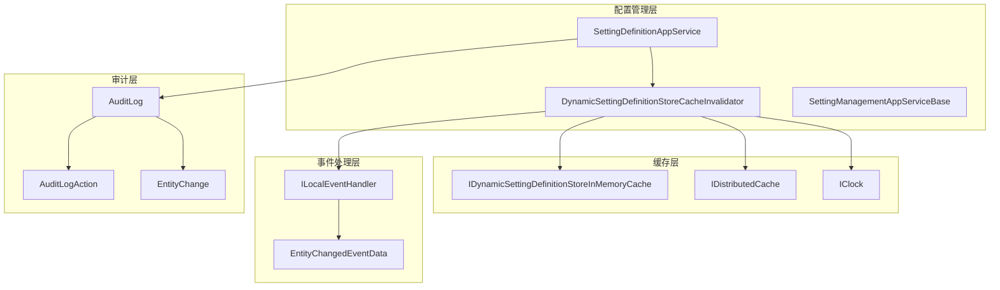
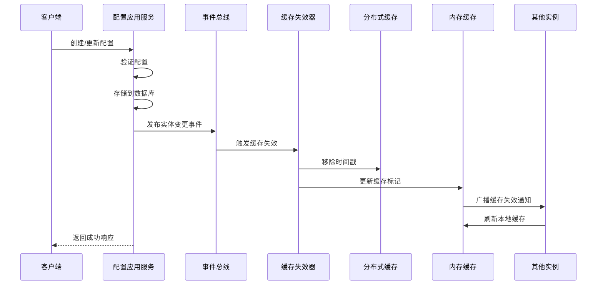
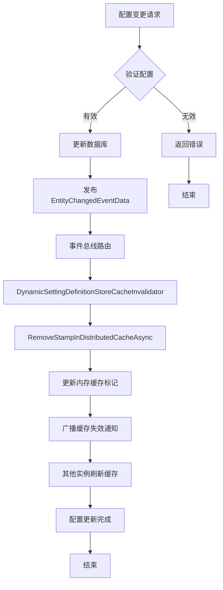
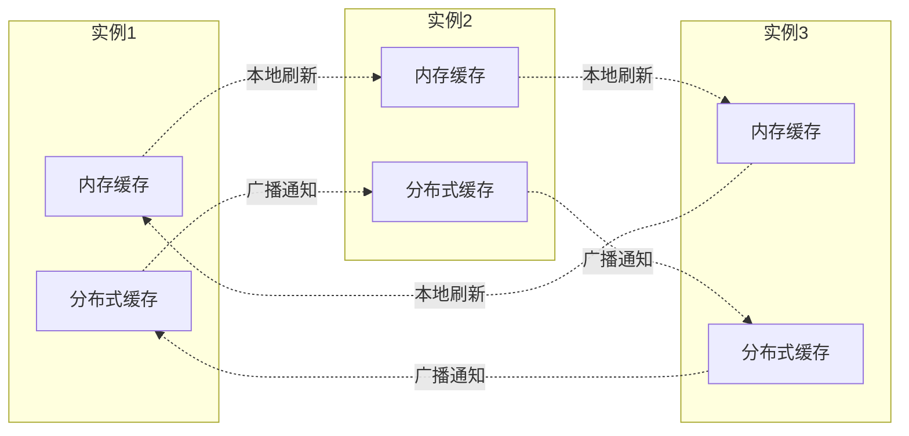
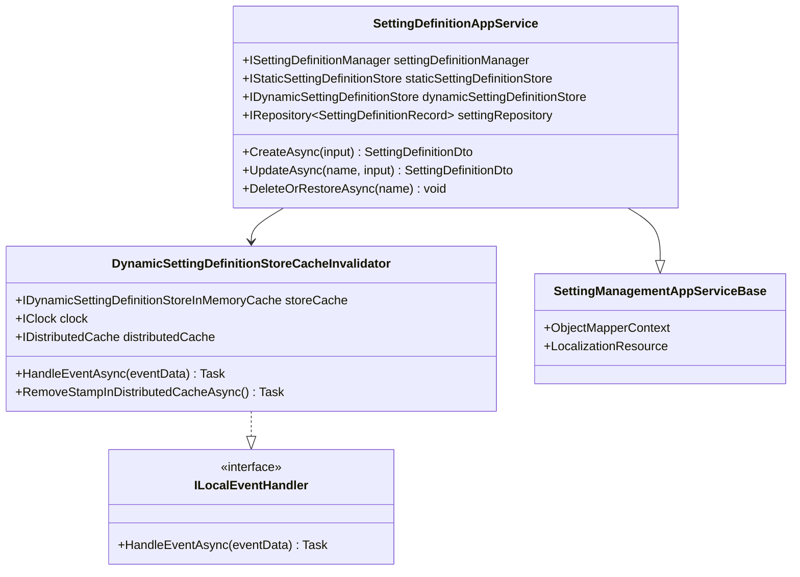

# 动态更新

<cite>
**本文档引用的文件**
- [SettingDefinitionAppService.cs](file://aspnet-core/modules/settings/LINGYUN.Abp.SettingManagement.Application/LINGYUN/Abp/SettingManagement/SettingDefinitionAppService.cs)
- [DynamicSettingDefinitionStoreCacheInvalidator.cs](file://aspnet-core/modules/settings/LINGYUN.Abp.SettingManagement.Application/LINGYUN/Abp/SettingManagement/DynamicSettingDefinitionStoreCacheInvalidator.cs)
- [SettingManagementAppServiceBase.cs](file://aspnet-core/modules/settings/LINGYUN.Abp.SettingManagement.Application/LINGYUN/Abp/SettingManagement/SettingManagementAppServiceBase.cs)
- [WebhooksManagementOptions.cs](file://aspnet-core/modules/webhooks/LINGYUN.Abp.WebhooksManagement.Domain/LINGYUN/Abp/WebhooksManagement/WebhooksManagementOptions.cs)
- [DataAccessStrategyStateSynchronizer.cs](file://aspnet-core/modules/data-protection/LINGYUN.Abp.DataProtectionManagement.Domain/LINGYUN/Abp/DataProtectionManagement/DataAccessStrategyStateSynchronizer.cs)
- [AuditLog.cs](file://aspnet-core/framework/auditing/LINGYUN.Abp.AuditLogging/LINGYUN/Abp/AuditLogging/AuditLog.cs)
- [AuditLogInfoToAuditLogConverter.cs](file://aspnet-core/framework/auditing/LINGYUN.Abp.AuditLogging.Elasticsearch/LINGYUN/Abp/AuditLogging/Elasticsearch/AuditLogInfoToAuditLogConverter.cs)
</cite>

## 目录
1. [简介](#简介)
2. [项目结构](#项目结构)
3. [核心组件](#核心组件)
4. [架构概览](#架构概览)
5. [详细组件分析](#详细组件分析)
6. [依赖关系分析](#依赖关系分析)
7. [性能考虑](#性能考虑)
8. [故障排除指南](#故障排除指南)
9. [结论](#结论)

## 简介

本文档详细介绍了ABP Next Admin框架中模块配置动态更新系统的完整实现。该系统提供了强大的配置变更通知机制、实时配置刷新策略以及分布式环境下的配置同步方案。通过事件驱动的架构设计，系统能够实现在配置修改后立即通知相关组件，并确保集群中所有实例的配置一致性。

该系统的核心特性包括：
- 实时配置变更通知机制
- 主动轮询和事件驱动的更新策略
- 分布式缓存失效和同步机制
- 完整的配置变更审计日志
- 多租户环境下的配置隔离

## 项目结构

配置管理系统采用分层架构设计，主要包含以下核心模块：



**图表来源**
- [SettingDefinitionAppService.cs](file://aspnet-core/modules/settings/LINGYUN.Abp.SettingManagement.Application/LINGYUN/Abp/SettingManagement/SettingDefinitionAppService.cs#L1-L256)
- [DynamicSettingDefinitionStoreCacheInvalidator.cs](file://aspnet-core/modules/settings/LINGYUN.Abp.SettingManagement.Application/LINGYUN/Abp/SettingManagement/DynamicSettingDefinitionStoreCacheInvalidator.cs#L1-L59)

**章节来源**
- [SettingDefinitionAppService.cs](file://aspnet-core/modules/settings/LINGYUN.Abp.SettingManagement.Application/LINGYUN/Abp/SettingManagement/SettingDefinitionAppService.cs#L1-L256)
- [DynamicSettingDefinitionStoreCacheInvalidator.cs](file://aspnet-core/modules/settings/LINGYUN.Abp.SettingManagement.Application/LINGYUN/Abp/SettingManagement/DynamicSettingDefinitionStoreCacheInvalidator.cs#L1-L59)

## 核心组件

### 配置定义应用服务 (SettingDefinitionAppService)

配置定义应用服务是整个配置管理系统的核心控制器，负责处理配置定义的创建、更新、删除和查询操作。

```csharp
[Authorize(SettingManagementPermissions.Definition.Default)]
public class SettingDefinitionAppService : SettingManagementAppServiceBase, ISettingDefinitionAppService
{
    private readonly IStringEncryptionService _stringEncryptionService;
    private readonly ISettingDefinitionManager _settingDefinitionManager;
    private readonly IStaticSettingDefinitionStore _staticSettingDefinitionStore;
    private readonly IDynamicSettingDefinitionStore _dynamicSettingDefinitionStore;
    private readonly ILocalizableStringSerializer _localizableStringSerializer;
    private readonly IRepository<SettingDefinitionRecord, Guid> _settingRepository;
}
```

该服务的主要职责包括：
- 配置定义的静态和动态存储管理
- 配置验证和加密处理
- 权限控制和安全检查
- 数据传输对象转换

### 动态设置定义存储缓存失效器 (DynamicSettingDefinitionStoreCacheInvalidator)

缓存失效器是实现配置动态更新的关键组件，它监听配置实体的变化并触发相应的缓存失效操作。

```csharp
public class DynamicSettingDefinitionStoreCacheInvalidator :
    ILocalEventHandler<EntityChangedEventData<SettingDefinitionRecord>>,
    ITransientDependency
{
    private readonly IDynamicSettingDefinitionStoreInMemoryCache _storeCache;
    private readonly IClock _clock;
    private readonly IDistributedCache _distributedCache;
    private readonly AbpDistributedCacheOptions _cacheOptions;
}
```

**章节来源**
- [SettingDefinitionAppService.cs](file://aspnet-core/modules/settings/LINGYUN.Abp.SettingManagement.Application/LINGYUN/Abp/SettingManagement/SettingDefinitionAppService.cs#L18-L31)
- [DynamicSettingDefinitionStoreCacheInvalidator.cs](file://aspnet-core/modules/settings/LINGYUN.Abp.SettingManagement.Application/LINGYUN/Abp/SettingManagement/DynamicSettingDefinitionStoreCacheInvalidator.cs#L14-L31)

## 架构概览

配置动态更新系统采用事件驱动的微服务架构，通过分布式事件总线实现组件间的松耦合通信。



**图表来源**
- [SettingDefinitionAppService.cs](file://aspnet-core/modules/settings/LINGYUN.Abp.SettingManagement.Application/LINGYUN/Abp/SettingManagement/SettingDefinitionAppService.cs#L33-L80)
- [DynamicSettingDefinitionStoreCacheInvalidator.cs](file://aspnet-core/modules/settings/LINGYUN.Abp.SettingManagement.Application/LINGYUN/Abp/SettingManagement/DynamicSettingDefinitionStoreCacheInvalidator.cs#L33-L58)

## 详细组件分析

### 配置变更通知机制

配置变更通知机制通过ABP框架的事件总线系统实现，当配置实体发生变化时，系统会自动触发相应的事件处理器。



**图表来源**
- [SettingDefinitionAppService.cs](file://aspnet-core/modules/settings/LINGYUN.Abp.SettingManagement.Application/LINGYUN/Abp/SettingManagement/SettingDefinitionAppService.cs#L33-L80)
- [DynamicSettingDefinitionStoreCacheInvalidator.cs](file://aspnet-core/modules/settings/LINGYUN.Abp.SettingManagement.Application/LINGYUN/Abp/SettingManagement/DynamicSettingDefinitionStoreCacheInvalidator.cs#L33-L58)

### 配置刷新策略

系统支持两种主要的配置刷新策略：主动轮询和事件驱动。

#### 事件驱动刷新策略

事件驱动策略是最优的选择，它利用分布式事件总线实现实时通知：

```csharp
public async virtual Task HandleEventAsync(EntityChangedEventData<SettingDefinitionRecord> eventData)
{
    await RemoveStampInDistributedCacheAsync();
}

protected async virtual Task RemoveStampInDistributedCacheAsync()
{
    using (await _storeCache.SyncSemaphore.LockAsync())
    {
        var cacheKey = GetCommonStampCacheKey();
        await _distributedCache.RemoveAsync(cacheKey);
        _storeCache.CacheStamp = Guid.NewGuid().ToString();
        _storeCache.LastCheckTime = _clock.Now.AddMinutes(-5);
    }
}
```

#### 主动轮询刷新策略

对于某些场景，系统也支持主动轮询机制：

```csharp
// Webhooks管理选项中的轮询配置
public TimeSpan WebhooksCacheRefreshInterval { get; set; } = TimeSpan.FromSeconds(30);
public TimeSpan WebhooksCacheStampTimeOut { get; set; } = TimeSpan.FromMinutes(2);
public TimeSpan WebhooksCacheStampExpiration { get; set; } = TimeSpan.FromMinutes(30);
```

### 分布式环境下的配置同步

在分布式环境中，系统通过以下机制确保配置的一致性：



**图表来源**
- [DynamicSettingDefinitionStoreCacheInvalidator.cs](file://aspnet-core/modules/settings/LINGYUN.Abp.SettingManagement.Application/LINGYUN/Abp/SettingManagement/DynamicSettingDefinitionStoreCacheInvalidator.cs#L33-L58)

### 配置变更审计日志

系统提供了完整的配置变更审计日志功能，记录每次配置变更的详细信息：

```csharp
public class AuditLog
{
    public Guid Id { get; set; }
    public string? ApplicationName { get; set; }
    public Guid? TenantId { get; set; }
    public Guid? UserId { get; set; }
    public string? UserName { get; set; }
    public DateTime ExecutionTime { get; set; }
    public int ExecutionDuration { get; set; }
    public string? ClientIpAddress { get; set; }
    public string? BrowserInfo { get; set; }
    public List<EntityChange> EntityChanges { get; set; }
    public List<AuditLogAction> Actions { get; set; }
    public ExtraPropertyDictionary ExtraProperties { get; set; }
}
```

审计日志包含以下关键信息：
- 变更时间戳和执行时长
- 操作用户和客户端信息
- 实体变更详情
- 操作动作列表
- 扩展属性和异常信息

**章节来源**
- [SettingDefinitionAppService.cs](file://aspnet-core/modules/settings/LINGYUN.Abp.SettingManagement.Application/LINGYUN/Abp/SettingManagement/SettingDefinitionAppService.cs#L33-L256)
- [DynamicSettingDefinitionStoreCacheInvalidator.cs](file://aspnet-core/modules/settings/LINGYUN.Abp.SettingManagement.Application/LINGYUN/Abp/SettingManagement/DynamicSettingDefinitionStoreCacheInvalidator.cs#L33-L58)
- [AuditLog.cs](file://aspnet-core/framework/auditing/LINGYUN.Abp.AuditLogging/LINGYUN/Abp/AuditLogging/AuditLog.cs#L51-L97)

## 依赖关系分析

配置管理系统具有清晰的依赖层次结构：



**图表来源**
- [SettingDefinitionAppService.cs](file://aspnet-core/modules/settings/LINGYUN.Abp.SettingManagement.Application/LINGYUN/Abp/SettingManagement/SettingDefinitionAppService.cs#L18-L31)
- [DynamicSettingDefinitionStoreCacheInvalidator.cs](file://aspnet-core/modules/settings/LINGYUN.Abp.SettingManagement.Application/LINGYUN/Abp/SettingManagement/DynamicSettingDefinitionStoreCacheInvalidator.cs#L14-L31)
- [SettingManagementAppServiceBase.cs](file://aspnet-core/modules/settings/LINGYUN.Abp.SettingManagement.Application/LINGYUN/Abp/SettingManagement/SettingManagementAppServiceBase.cs#L6-L12)

**章节来源**
- [SettingDefinitionAppService.cs](file://aspnet-core/modules/settings/LINGYUN.Abp.SettingManagement.Application/LINGYUN/Abp/SettingManagement/SettingDefinitionAppService.cs#L18-L31)
- [DynamicSettingDefinitionStoreCacheInvalidator.cs](file://aspnet-core/modules/settings/LINGYUN.Abp.SettingManagement.Application/LINGYUN/Abp/SettingManagement/DynamicSettingDefinitionStoreCacheInvalidator.cs#L14-L31)

## 性能考虑

### 缓存优化策略

系统采用了多层缓存策略来提升性能：

1. **内存缓存**：用于快速访问最近使用的配置
2. **分布式缓存**：用于跨实例共享缓存失效状态
3. **时间戳机制**：通过时间戳检测缓存是否需要刷新

### 锁机制优化

为了防止并发问题，系统使用信号量锁来保护缓存更新操作：

```csharp
protected async virtual Task RemoveStampInDistributedCacheAsync()
{
    using (await _storeCache.SyncSemaphore.LockAsync())
    {
        // 缓存更新逻辑
    }
}
```

### 轮询间隔调优

不同组件可以根据实际需求调整轮询间隔：

- Webhooks管理：30秒刷新间隔
- 通知管理：30分钟过期时间
- 功能限制：2分钟超时时间

## 故障排除指南

### 常见问题及解决方案

#### 缓存失效不生效

**症状**：配置更新后，其他实例仍然使用旧的配置值。

**解决方案**：
1. 检查分布式缓存连接是否正常
2. 验证事件总线配置是否正确
3. 确认缓存失效器是否正确注册

#### 配置变更审计日志缺失

**症状**：配置变更没有被记录到审计日志中。

**解决方案**：
1. 检查审计模块是否启用
2. 验证审计日志存储配置
3. 确认权限设置是否允许审计记录

#### 分布式环境同步延迟

**症状**：在分布式环境中，配置变更通知存在延迟。

**解决方案**：
1. 调整轮询间隔参数
2. 优化网络连接质量
3. 检查事件总线性能

**章节来源**
- [DynamicSettingDefinitionStoreCacheInvalidator.cs](file://aspnet-core/modules/settings/LINGYUN.Abp.SettingManagement.Application/LINGYUN/Abp/SettingManagement/DynamicSettingDefinitionStoreCacheInvalidator.cs#L33-L58)
- [WebhooksManagementOptions.cs](file://aspnet-core/modules/webhooks/LINGYUN.Abp.WebhooksManagement.Domain/LINGYUN/Abp/WebhooksManagement/WebhooksManagementOptions.cs#L15-L37)

## 结论

ABP Next Admin框架的配置动态更新系统提供了一个完整、高效且可扩展的解决方案。通过事件驱动的架构设计，系统实现了配置变更的实时通知和自动同步，确保了分布式环境下的配置一致性。

系统的主要优势包括：
- 实时配置变更通知机制
- 灵活的刷新策略选择
- 完整的审计日志支持
- 高性能的缓存优化
- 强大的分布式同步能力

该系统为现代微服务架构提供了坚实的配置管理基础，能够满足复杂业务场景下的配置管理需求。