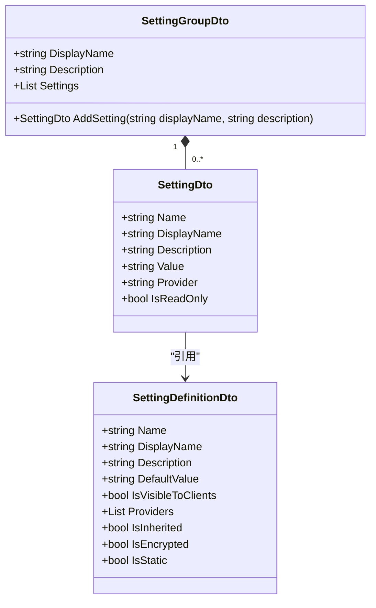
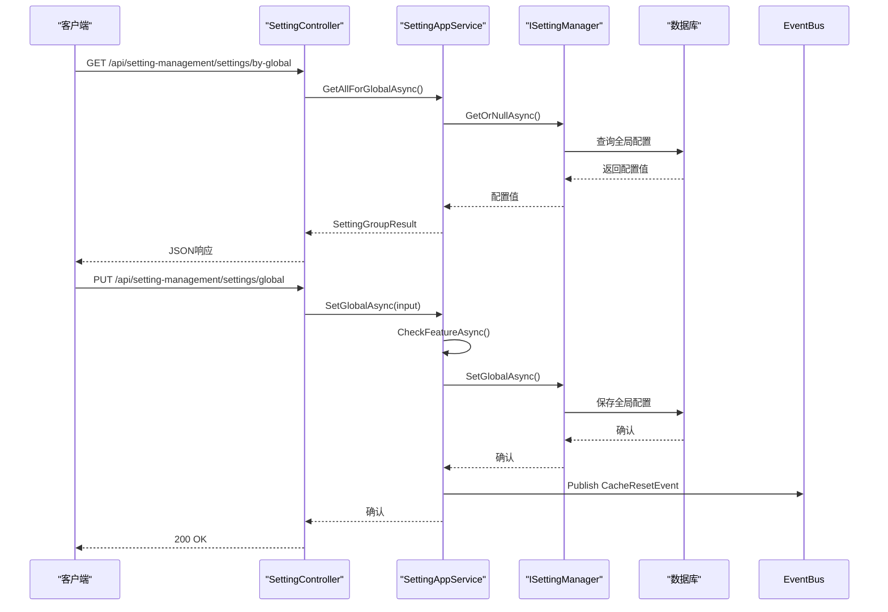
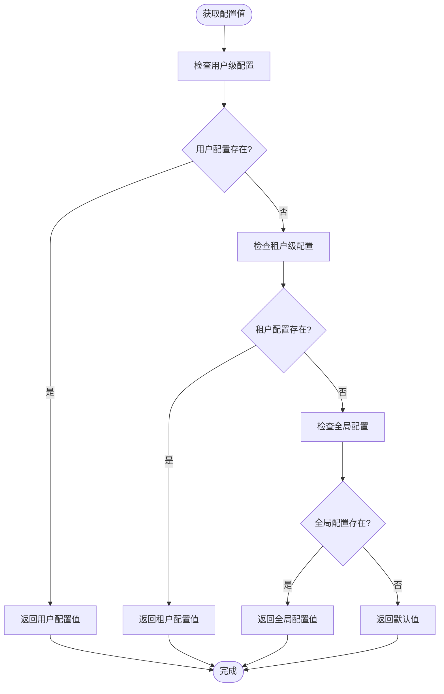
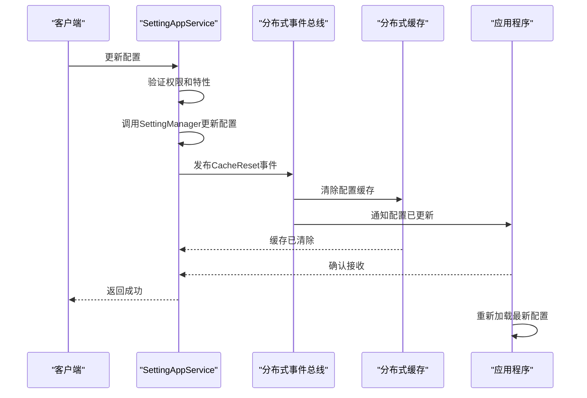

# 模块配置管理

<cite>
**本文档引用的文件**  
- [SettingAppService.cs](file://aspnet-core\modules\settings\LINGYUN.Abp.SettingManagement.Application\LINGYUN\Abp\SettingManagement\SettingAppService.cs)
- [ISettingAppService.cs](file://aspnet-core\framework\settings\LINGYUN.Abp.SettingManagement.Application.Contracts\LINGYUN\Abp\SettingManagement\ISettingAppService.cs)
- [IReadonlySettingAppService.cs](file://aspnet-core\framework\settings\LINGYUN.Abp.SettingManagement.Application.Contracts\LINGYUN\Abp\SettingManagement\IReadonlySettingAppService.cs)
- [SettingManagementMergeOptions.cs](file://aspnet-core\framework\settings\LINGYUN.Abp.SettingManagement.Application.Contracts\LINGYUN\Abp\SettingManagement\SettingManagementMergeOptions.cs)
- [SettingDefinitionDto.cs](file://aspnet-core\modules\settings\LINGYUN.Abp.SettingManagement.Application\LINGYUN\Abp\SettingManagement\Dto\SettingDefinitionDto.cs)
- [SettingGroupDto.cs](file://aspnet-core\framework\settings\LINGYUN.Abp.SettingManagement.Application.Contracts\LINGYUN\Abp\SettingManagement\Dto\SettingGroupDto.cs)
- [AbpSettingManagementApplicationModule.cs](file://aspnet-core\modules\settings\LINGYUN.Abp.SettingManagement.Application\LINGYUN\Abp\SettingManagement\AbpSettingManagementApplicationModule.cs)
</cite>

## 目录
1. [简介](#简介)
2. [配置类设计与默认值设置](#配置类设计与默认值设置)
3. [配置存储与读取机制](#配置存储与读取机制)
4. [配置层级覆盖规则](#配置层级覆盖规则)
5. [配置变更通知与动态刷新](#配置变更通知与动态刷新)
6. [结论](#结论)

## 简介
本项目基于ABP框架构建了完善的模块配置管理系统，实现了从配置定义、存储、读取到动态刷新的完整生命周期管理。系统支持多层级配置管理，包括全局、租户和用户级别的配置，并通过事件总线实现配置变更的实时通知与缓存刷新。配置系统与ABP的特性管理、权限管理深度集成，确保了配置操作的安全性和灵活性。

## 配置类设计与默认值设置

配置系统通过`SettingDefinitionDto`类定义配置项的元数据，包括名称、显示名称、描述、默认值、可见性、提供者列表、继承性、加密性和静态性等属性。每个配置项都通过`SettingGroupDto`组织成逻辑组，便于前端展示和管理。

配置项的默认值在定义时通过`DefaultValue`属性设置，系统在初始化时会自动应用这些默认值。配置组通过`SettingGroupDto`的构造函数接收显示名称和描述，配置项通过`AddSetting`方法添加到组中。

**图示来源**  
- [SettingDefinitionDto.cs](file://aspnet-core\modules\settings\LINGYUN.Abp.SettingManagement.Application\LINGYUN\Abp\SettingManagement\Dto\SettingDefinitionDto.cs#L0-L28)
- [SettingGroupDto.cs](file://aspnet-core\framework\settings\LINGYUN.Abp.SettingManagement.Application.Contracts\LINGYUN\Abp\SettingManagement\Dto\SettingGroupDto.cs#L0-L29)

**本节来源**  
- [SettingDefinitionDto.cs](file://aspnet-core\modules\settings\LINGYUN.Abp.SettingManagement.Application\LINGYUN\Abp\SettingManagement\Dto\SettingDefinitionDto.cs#L0-L28)
- [SettingGroupDto.cs](file://aspnet-core\framework\settings\LINGYUN.Abp.SettingManagement.Application.Contracts\LINGYUN\Abp\SettingManagement\Dto\SettingGroupDto.cs#L0-L29)

## 配置存储与读取机制

配置系统通过ABP的设置管理基础设施实现配置的持久化存储。系统使用`ISettingManager`接口进行配置的读写操作，支持多种提供者（Provider）机制，包括全局设置提供者、租户设置提供者和用户设置提供者。

配置数据存储在数据库的`AbpSettings`表中，通过`SettingValueProvider`机制实现不同层级配置的分离存储。系统提供了`ISettingAppService`和`IReadonlySettingAppService`接口，分别用于配置的写入和读取操作。

**图示来源**  
- [ISettingAppService.cs](file://aspnet-core\framework\settings\LINGYUN.Abp.SettingManagement.Application.Contracts\LINGYUN\Abp\SettingManagement\ISettingAppService.cs#L0-L11)
- [SettingAppService.cs](file://aspnet-core\modules\settings\LINGYUN.Abp.SettingManagement.Application\LINGYUN\Abp\SettingManagement\SettingAppService.cs#L0-L553)

**本节来源**  
- [ISettingAppService.cs](file://aspnet-core\framework\settings\LINGYUN.Abp.SettingManagement.Application.Contracts\LINGYUN\Abp\SettingManagement\ISettingAppService.cs#L0-L11)
- [IReadonlySettingAppService.cs](file://aspnet-core\framework\settings\LINGYUN.Abp.SettingManagement.Application.Contracts\LINGYUN\Abp\SettingManagement\IReadonlySettingAppService.cs#L0-L11)
- [SettingAppService.cs](file://aspnet-core\modules\settings\LINGYUN.Abp.SettingManagement.Application\LINGYUN\Abp\SettingManagement\SettingAppService.cs#L0-L553)

## 配置层级覆盖规则

配置系统实现了多层级的配置覆盖机制，遵循"用户 > 租户 > 全局"的优先级顺序。系统通过`SettingManagementMergeOptions`配置选项管理不同层级的配置提供者，支持灵活的配置扩展和合并。

当获取配置值时，系统会按照优先级顺序查询各个提供者，返回第一个匹配的值。这种机制确保了高优先级的配置能够覆盖低优先级的配置，同时保持了配置的继承性和可扩展性。

**图示来源**  
- [SettingManagementMergeOptions.cs](file://aspnet-core\framework\settings\LINGYUN.Abp.SettingManagement.Application.Contracts\LINGYUN\Abp\SettingManagement\SettingManagementMergeOptions.cs#L0-L12)
- [SettingAppService.cs](file://aspnet-core\modules\settings\LINGYUN.Abp.SettingManagement.Application\LINGYUN\Abp\SettingManagement\SettingAppService.cs#L0-L553)

**本节来源**  
- [SettingManagementMergeOptions.cs](file://aspnet-core\framework\settings\LINGYUN.Abp.SettingManagement.Application.Contracts\LINGYUN\Abp\SettingManagement\SettingManagementMergeOptions.cs#L0-L12)
- [SettingAppService.cs](file://aspnet-core\modules\settings\LINGYUN.Abp.SettingManagement.Application\LINGYUN\Abp\SettingManagement\SettingAppService.cs#L0-L553)

## 配置变更通知与动态刷新

配置系统通过事件总线实现配置变更的实时通知和动态刷新。当配置被更新时，系统会发布`CurrentApplicationConfigurationCacheResetEventData`事件，触发所有相关服务的缓存刷新。

这种机制确保了配置变更能够立即生效，而无需重启应用程序。前端应用可以通过订阅配置变更事件，实现界面的动态更新，提供更好的用户体验。

**图示来源**  
- [SettingAppService.cs](file://aspnet-core\modules\settings\LINGYUN.Abp.SettingManagement.Application\LINGYUN\Abp\SettingManagement\SettingAppService.cs#L0-L553)
- [AbpSettingManagementApplicationModule.cs](file://aspnet-core\modules\settings\LINGYUN.Abp.SettingManagement.Application\LINGYUN\Abp\SettingManagement\AbpSettingManagementApplicationModule.cs#L0-L41)

**本节来源**  
- [SettingAppService.cs](file://aspnet-core\modules\settings\LINGYUN.Abp.SettingManagement.Application\LINGYUN\Abp\SettingManagement\SettingAppService.cs#L0-L553)
- [AbpSettingManagementApplicationModule.cs](file://aspnet-core\modules\settings\LINGYUN.Abp.SettingManagement.Application\LINGYUN\Abp\SettingManagement\AbpSettingManagementApplicationModule.cs#L0-L41)

## 结论
ABP Next Admin的模块配置管理系统提供了一套完整、灵活且安全的配置管理解决方案。系统通过清晰的配置类设计、多层级的存储机制、优先级覆盖规则和实时的变更通知，满足了复杂应用场景下的配置管理需求。该系统不仅支持基本的配置读写操作，还与ABP框架的特性管理、权限管理和事件总线深度集成，为构建可扩展的企业级应用提供了坚实的基础。