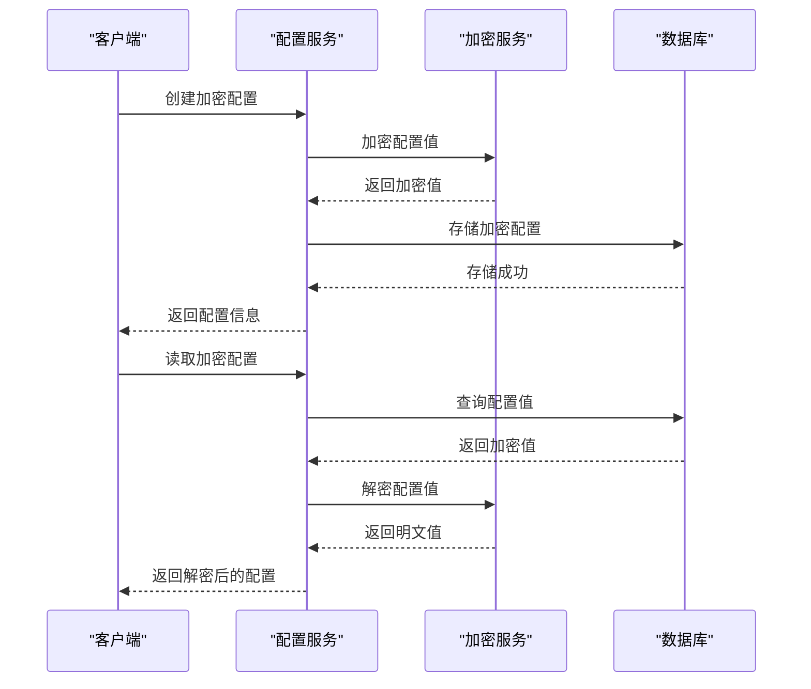
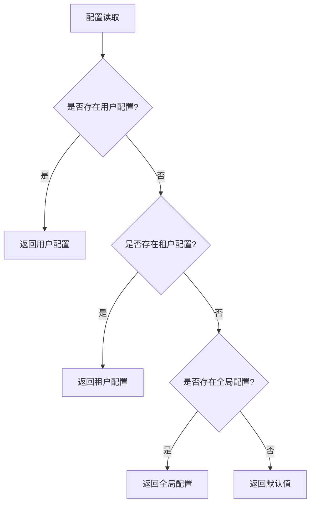

# 配置存储

<cite>
**本文档引用的文件**
- [AliyunSettingProvider.cs](file://aspnet-core/framework/cloud-aliyun/LINGYUN.Abp.Aliyun/LINGYUN/Abp/Aliyun/Settings/AliyunSettingProvider.cs)
- [VueVbenAdminSettingDefinitionProvider.cs](file://aspnet-core/modules/platform/LINGYUN.Platform.Settings.VueVbenAdmin/LINGYUN/Platform/Settings/VueVbenAdmin/VueVbenAdminSettingDefinitionProvider.cs)
- [ISettingAppService.cs](file://aspnet-core/framework/settings/LINGYUN.Abp.SettingManagement.Application.Contracts/LINGYUN/Abp/SettingManagement/ISettingAppService.cs)
- [SettingDefinitionDto.cs](file://aspnet-core/modules/settings/LINGYUN.Abp.SettingManagement.Application/LINGYUN/Abp/SettingManagement/Dto/SettingDefinitionDto.cs)
- [SettingDefinitionAppService.cs](file://aspnet-core/modules/settings/LINGYUN.Abp.SettingManagement.Application/LINGYUN/Abp/SettingManagement/SettingDefinitionAppService.cs)
- [SettingDto.cs](file://aspnet-core/framework/settings/LINGYUN.Abp.SettingManagement.Application.Contracts/LINGYUN/Abp/SettingManagement/Dto/SettingDto.cs)
- [20231012032107_Initial-Single-Project.Designer.cs](file://aspnet-core/migrations/LY.MicroService.Applications.Single.EntityFrameworkCore.MySql/Migrations/20231012032107_Initial-Single-Project.Designer.cs)
</cite>

## 目录
1. [简介](#简介)
2. [配置数据持久化机制](#配置数据持久化机制)
3. [设置值加密存储策略](#设置值加密存储策略)
4. [多租户环境下的配置隔离](#多租户环境下的配置隔离)
5. [性能优化与缓存策略](#性能优化与缓存策略)
6. [配置管理API接口](#配置管理api接口)
7. [数据库存储结构](#数据库存储结构)
8. [总结](#总结)

## 简介
本项目基于ABP框架实现了完整的配置管理系统，支持配置数据的持久化存储、加密保护、多租户隔离和性能优化。系统通过ABP的设置管理模块，将配置信息存储在数据库中，并提供灵活的API接口进行配置的读取和更新。配置系统支持全局、租户和用户级别的配置管理，确保不同层级的配置能够正确继承和覆盖。

## 配置数据持久化机制
ABP框架的设置系统通过实体框架（Entity Framework Core）将配置数据持久化到数据库中。系统定义了两种主要的数据库表来存储配置信息：`AbpSettingDefinitions`用于存储配置定义，`AbpSettings`用于存储配置值。配置定义表包含配置项的元数据，如名称、默认值、显示名称、描述等；配置值表则存储实际的配置值，支持不同提供者（如全局、租户、用户）的配置值存储。

配置系统支持多种配置提供者，包括默认值提供者、配置文件提供者、全局设置提供者和租户设置提供者。这些提供者按照优先级顺序进行配置值的查找和合并，确保配置的灵活性和可扩展性。当应用程序启动时，系统会从数据库中加载所有配置定义，并将其缓存到内存中，以提高配置读取的性能。

**配置数据持久化流程：**
1. 应用程序启动时，从数据库加载配置定义
2. 配置定义被缓存到内存中
3. 当需要读取配置时，按优先级顺序从不同提供者获取配置值
4. 配置值的更新会持久化到数据库

**本节来源**
- [SettingDefinitionAppService.cs](file://aspnet-core/modules/settings/LINGYUN.Abp.SettingManagement.Application/LINGYUN/Abp/SettingManagement/SettingDefinitionAppService.cs#L90-L123)
- [20231012032107_Initial-Single-Project.Designer.cs](file://aspnet-core/migrations/LY.MicroService.Applications.Single.EntityFrameworkCore.MySql/Migrations/20231012032107_Initial-Single-Project.Designer.cs#L4823-L4840)

## 设置值加密存储策略
为了保护敏感配置信息，系统实现了配置值的加密存储机制。在配置定义中，可以通过设置`IsEncrypted`属性来指定某个配置项是否需要加密存储。当`IsEncrypted`为`true`时，配置值在存储到数据库之前会被加密，读取时会自动解密。

加密功能由`_stringEncryptionService`服务提供，该服务使用安全的加密算法对配置值进行加密和解密。在创建或更新配置定义时，如果`IsEncrypted`属性为`true`，系统会自动调用加密服务对默认值进行加密。当通过API获取配置值时，系统会自动检测配置项的加密状态，并在返回给客户端之前进行解密。

这种加密机制确保了敏感配置信息（如API密钥、密码等）在数据库中的安全存储，即使数据库被非法访问，攻击者也无法直接获取明文配置值。

**图表来源**
- [SettingDefinitionAppService.cs](file://aspnet-core/modules/settings/LINGYUN.Abp.SettingManagement.Application/LINGYUN/Abp/SettingManagement/SettingDefinitionAppService.cs#L179-L183)
- [SettingDefinitionDto.cs](file://aspnet-core/modules/settings/LINGYUN.Abp.SettingManagement.Application/LINGYUN/Abp/SettingManagement/Dto/SettingDefinitionDto.cs#L25)

**本节来源**
- [AliyunSettingProvider.cs](file://aspnet-core/framework/cloud-aliyun/LINGYUN.Abp.Aliyun/LINGYUN/Abp/Aliyun/Settings/AliyunSettingProvider.cs#L34-L63)
- [VueVbenAdminSettingDefinitionProvider.cs](file://aspnet-core/modules/platform/LINGYUN.Platform.Settings.VueVbenAdmin/LINGYUN/Platform/Settings/VueVbenAdmin/VueVbenAdminSettingDefinitionProvider.cs#L385-L409)

## 多租户环境下的配置隔离
在多租户环境中，系统通过租户ID来隔离不同租户的配置数据。每个租户都有独立的配置空间，确保配置数据的相互独立。系统支持三种级别的配置：全局配置、租户配置和用户配置。全局配置对所有租户生效，租户配置仅对特定租户生效，用户配置则针对特定用户。

当读取配置时，系统会按照以下优先级顺序进行查找：
1. 用户配置（最高优先级）
2. 租户配置
3. 全局配置
4. 默认值（最低优先级）

这种优先级机制确保了配置的灵活性，允许租户和用户根据需要覆盖上级配置。在数据库中，`AbpSettings`表通过`ProviderName`和`ProviderKey`字段来区分不同提供者的配置值。对于租户配置，`ProviderName`为`TenantSettingValueProvider`，`ProviderKey`为租户ID；对于用户配置，`ProviderName`为`UserSettingValueProvider`，`ProviderKey`为用户ID。

**图表来源**
- [ISettingAppService.cs](file://aspnet-core/framework/settings/LINGYUN.Abp.SettingManagement.Application.Contracts/LINGYUN/Abp/SettingManagement/ISettingAppService.cs#L0-L9)
- [20231012032107_Initial-Single-Project.Designer.cs](file://aspnet-core/migrations/LY.MicroService.Applications.Single.EntityFrameworkCore.MySql/Migrations/20231012032107_Initial-Single-Project.Designer.cs#L4823-L4840)

**本节来源**
- [SettingDefinitionAppService.cs](file://aspnet-core/modules/settings/LINGYUN.Abp.SettingManagement.Application/LINGYUN/Abp/SettingManagement/SettingDefinitionAppService.cs#L90-L123)
- [20231012032107_Initial-Single-Project.Designer.cs](file://aspnet-core/migrations/LY.MicroService.Applications.Single.EntityFrameworkCore.MySql/Migrations/20231012032107_Initial-Single-Project.Designer.cs#L4823-L4840)

## 性能优化与缓存策略
为了提高配置系统的性能，系统实现了多层缓存机制。首先，配置定义在应用程序启动时被加载到内存中，并在整个应用程序生命周期内保持缓存。其次，配置值的读取也通过ABP框架的缓存机制进行优化，避免频繁的数据库查询。

系统使用ABP框架提供的`ICacheManager`服务来管理配置缓存。当配置值被读取时，系统首先检查缓存中是否存在该配置，如果存在则直接返回缓存值，否则从数据库查询并将其存入缓存。缓存的过期策略可以根据需要进行配置，确保配置更新能够及时生效。

此外，系统还支持配置的批量读取和更新，减少数据库交互次数。通过`GetAllForCurrentTenantAsync`和`SetCurrentTenantAsync`等API，可以一次性获取或更新多个配置项，提高操作效率。

**本节来源**
- [SettingDefinitionAppService.cs](file://aspnet-core/modules/settings/LINGYUN.Abp.SettingManagement.Application/LINGYUN/Abp/SettingManagement/SettingDefinitionAppService.cs#L90-L123)
- [SettingDto.cs](file://aspnet-core/framework/settings/LINGYUN.Abp.SettingManagement.Application.Contracts/LINGYUN/Abp/SettingManagement/Dto/SettingDto.cs#L0-L63)

## 配置管理API接口
系统提供了RESTful API接口来管理配置，支持配置的创建、读取、更新和删除操作。主要API接口包括：

- `GET /api/setting-management/settings/by-global`：获取全局配置
- `PUT /api/setting-management/settings/by-global`：设置全局配置
- `GET /api/setting-management/settings/by-current-user`：获取当前用户配置
- `PUT /api/setting-management/settings/by-current-user`：设置当前用户配置
- `GET /api/setting-management/definitions/{name}`：获取特定配置定义
- `PUT /api/setting-management/definitions/{name}`：更新特定配置定义

这些API接口通过ABP框架的模块化设计实现，位于`LINGYUN.Abp.SettingManagement.HttpApi`模块中。接口使用标准的HTTP方法和状态码，便于前端应用集成。所有写操作都需要相应的权限验证，确保配置的安全性。

**本节来源**
- [ISettingAppService.cs](file://aspnet-core/framework/settings/LINGYUN.Abp.SettingManagement.Application.Contracts/LINGYUN/Abp/SettingManagement/ISettingAppService.cs#L0-L9)
- [SettingDefinitionAppService.cs](file://aspnet-core/modules/settings/LINGYUN.Abp.SettingManagement