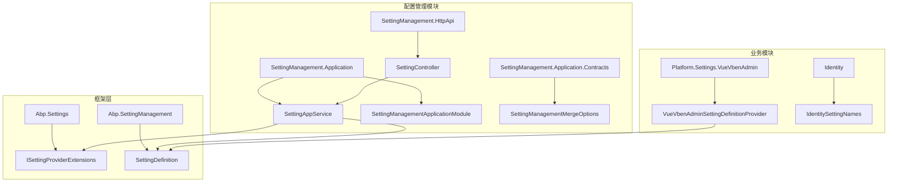
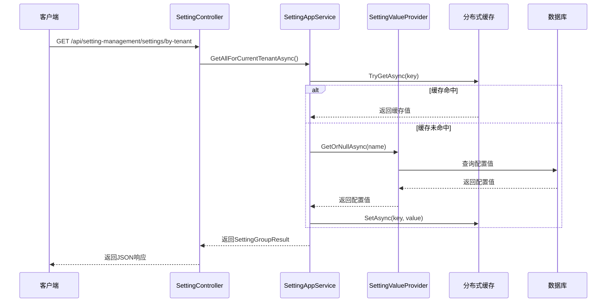
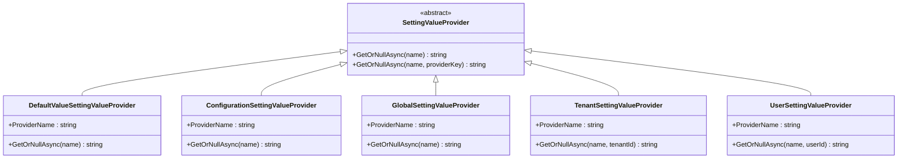
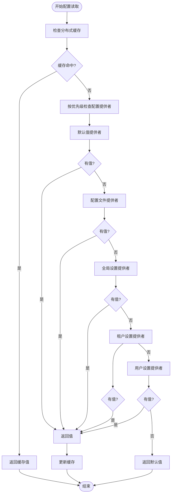
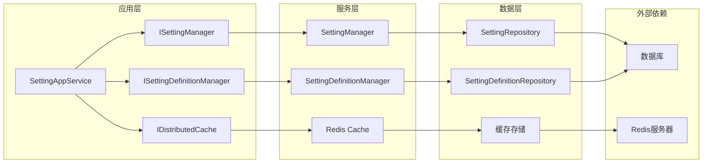

# 配置读取

<cite>
**本文档引用的文件**
- [SettingAppService.cs](file://aspnet-core/modules/settings/LINGYUN.Abp.SettingManagement.Application/LINGYUN/Abp/SettingManagement/SettingAppService.cs)
- [SettingManagementApplicationModule.cs](file://aspnet-core/modules/settings/LINGYUN.Abp.SettingManagement.Application/LINGYUN/Abp/SettingManagement/AbpSettingManagementApplicationModule.cs)
- [SettingManagementMergeOptions.cs](file://aspnet-core/framework/settings/LINGYUN.Abp.SettingManagement.Application.Contracts/LINGYUN/Abp/SettingManagement/SettingManagementMergeOptions.cs)
- [SettingManagementPermissions.cs](file://aspnet-core/modules/settings/LINGYUN.Abp.SettingManagement.Application/LINGYUN/Abp/SettingManagement/SettingManagementPermissions.cs)
- [AbpSettingManagementPermissionProvider.cs](file://aspnet-core/framework/settings/LINGYUN.Abp.SettingManagement.Application.Contracts/LINGYUN/Abp/SettingManagement/AbpSettingManagementPermissionProvider.cs)
- [appsettings.json](file://aspnet-core/services/LY.MicroService.Applications.Single/appsettings.json)
- [VueVbenAdminSettingDefinitionProvider.cs](file://aspnet-core/modules/platform/LINGYUN.Platform.Settings.VueVbenAdmin/LINGYUN/Platform/Settings/VueVbenAdmin/VueVbenAdminSettingDefinitionProvider.cs)
- [ISettingProviderExtensions.cs](file://aspnet-core/framework/settings/LINGYUN.Abp.Settings/Volo/Abp/Settings/ISettingProviderExtensions.cs)
</cite>

## 目录
1. [简介](#简介)
2. [项目结构](#项目结构)
3. [核心组件](#核心组件)
4. [架构概览](#架构概览)
5. [详细组件分析](#详细组件分析)
6. [依赖关系分析](#依赖关系分析)
7. [性能考虑](#性能考虑)
8. [故障排除指南](#故障排除指南)
9. [结论](#结论)

## 简介

ABP Next Admin 项目采用了一套完整的配置管理系统，支持多层级配置读取机制。该系统实现了全局默认值、租户级配置和用户级配置的优先级管理，提供了同步和异步读取方式，并通过缓存机制优化配置读取性能。

配置管理系统的核心特点包括：
- 多层级配置覆盖：全局 -> 租户 -> 用户
- 异步配置读取支持
- 分布式缓存优化
- 权限控制和安全保护
- 动态配置更新

## 项目结构

配置管理系统主要分布在以下模块中：



**图表来源**
- [SettingAppService.cs](file://aspnet-core/modules/settings/LINGYUN.Abp.SettingManagement.Application/LINGYUN/Abp/SettingManagement/SettingAppService.cs#L1-L50)
- [AbpSettingManagementApplicationModule.cs](file://aspnet-core/modules/settings/LINGYUN.Abp.SettingManagement.Application/LINGYUN/Abp/SettingManagement/AbpSettingManagementApplicationModule.cs#L1-L42)

**章节来源**
- [SettingAppService.cs](file://aspnet-core/modules/settings/LINGYUN.Abp.SettingManagement.Application/LINGYUN/Abp/SettingManagement/SettingAppService.cs#L1-L554)
- [AbpSettingManagementApplicationModule.cs](file://aspnet-core/modules/settings/LINGYUN.Abp.SettingManagement.Application/LINGYUN/Abp/SettingManagement/AbpSettingManagementApplicationModule.cs#L1-L42)

## 核心组件

### 配置读取服务

配置读取的核心是 `SettingAppService` 类，它提供了完整的配置读取和管理功能：

```csharp
public class SettingAppService : ApplicationService, ISettingAppService
{
    protected ISettingManager SettingManager { get; }
    protected ISettingDefinitionManager SettingDefinitionManager { get; }
    protected IDistributedCache<SettingCacheItem> Cache { get; }
    
    public async virtual Task<SettingGroupResult> GetAllForCurrentTenantAsync()
    {
        return await GetAllForProviderAsync(TenantSettingValueProvider.ProviderName, CurrentTenant.GetId().ToString());
    }
    
    public async virtual Task<SettingGroupResult> GetAllForGlobalAsync()
    {
        return await GetAllForProviderAsync(GlobalSettingValueProvider.ProviderName, null);
    }
}
```

### 配置合并选项

`SettingManagementMergeOptions` 类负责管理配置提供者的注册和合并：

```csharp
public class SettingManagementMergeOptions
{
    public ITypeList<IUserSettingAppService> UserSettingProviders { get; }
    public ITypeList<IReadonlySettingAppService> GlobalSettingProviders { get; }
    
    public SettingManagementMergeOptions()
    {
        UserSettingProviders = new TypeList<IUserSettingAppService>();
        GlobalSettingProviders = new TypeList<IReadonlySettingAppService>();
    }
}
```

**章节来源**
- [SettingAppService.cs](file://aspnet-core/modules/settings/LINGYUN.Abp.SettingManagement.Application/LINGYUN/Abp/SettingManagement/SettingAppService.cs#L30-L100)
- [SettingManagementMergeOptions.cs](file://aspnet-core/framework/settings/LINGYUN.Abp.SettingManagement.Application.Contracts/LINGYUN/Abp/SettingManagement/SettingManagementMergeOptions.cs#L1-L12)

## 架构概览

配置管理系统采用分层架构设计，支持多层级配置读取：



**图表来源**
- [SettingAppService.cs](file://aspnet-core/modules/settings/LINGYUN.Abp.SettingManagement.Application/LINGYUN/Abp/SettingManagement/SettingAppService.cs#L80-L90)
- [ISettingProviderExtensions.cs](file://aspnet-core/framework/settings/LINGYUN.Abp.Settings/Volo/Abp/Settings/ISettingProviderExtensions.cs#L1-L26)

## 详细组件分析

### 配置提供者层次

配置系统支持四种级别的配置提供者，按优先级从高到低排列：



**图表来源**
- [VueVbenAdminSettingDefinitionProvider.cs](file://aspnet-core/modules/platform/LINGYUN.Platform.Settings.VueVbenAdmin/LINGYUN/Platform/Settings/VueVbenAdmin/VueVbenAdminSettingDefinitionProvider.cs#L385-L409)

### 配置读取流程

配置读取遵循严格的优先级顺序：



**图表来源**
- [ISettingProviderExtensions.cs](file://aspnet-core/framework/settings/LINGYUN.Abp.Settings/Volo/Abp/Settings/ISettingProviderExtensions.cs#L10-L26)

### 异步配置读取

系统支持异步配置读取以提高性能：

```csharp
public static async Task<string> GetOrDefaultAsync(
    [NotNull] this ISettingProvider settingProvider,
    [NotNull] string name,
    [NotNull] IServiceProvider serviceProvider)
{
    var value = await settingProvider.GetOrNullAsync(name);
    if (value.IsNullOrWhiteSpace())
    {
        var settingDefintionManager = serviceProvider.GetRequiredService<ISettingDefinitionManager>();
        var setting = await settingDefintionManager.GetAsync(name);
        return setting.DefaultValue;
    }
    return value;
}
```

**章节来源**
- [ISettingProviderExtensions.cs](file://aspnet-core/framework/settings/LINGYUN.Abp.Settings/Volo/Abp/Settings/ISettingProviderExtensions.cs#L10-L26)

### 配置权限管理

配置系统实现了细粒度的权限控制：

```csharp
public class SettingManagementPermissionDefinitionProvider : PermissionDefinitionProvider
{
    public override void Define(IPermissionDefinitionContext context)
    {
        var settingGroup = context.GetGroup(VoloSettingManagementPermissions.GroupName);
        
        var definitionPermission = settingGroup.AddPermission(
            SettingManagementPermissions.Definition.Default,
            displayName: L("Permission:Definition"),
            multiTenancySide: MultiTenancySides.Host);
            
        definitionPermission.AddChild(
            SettingManagementPermissions.Definition.Create,
            displayName: L("Permission:Create"),
            multiTenancySide: MultiTenancySides.Host);
    }
}
```

**章节来源**
- [SettingManagementPermissionDefinitionProvider.cs](file://aspnet-core/modules/settings/LINGYUN.Abp.SettingManagement.Application/LINGYUN/Abp/SettingManagement/SettingManagementPermissionDefinitionProvider.cs#L1-L35)

## 依赖关系分析

配置管理系统的依赖关系如下：



**图表来源**
- [SettingAppService.cs](file://aspnet-core/modules/settings/LINGYUN.Abp.SettingManagement.Application/LINGYUN/Abp/SettingManagement/SettingAppService.cs#L30-L50)

**章节来源**
- [SettingAppService.cs](file://aspnet-core/modules/settings/LINGYUN.Abp.SettingManagement.Application/LINGYUN/Abp/SettingManagement/SettingAppService.cs#L30-L50)
- [AbpSettingManagementApplicationModule.cs](file://aspnet-core/modules/settings/LINGYUN.Abp.SettingManagement.Application/LINGYUN/Abp/SettingManagement/AbpSettingManagementApplicationModule.cs#L15-L30)

## 性能考虑

### 缓存策略

配置系统采用多级缓存策略来优化性能：

1. **分布式缓存**：使用 Redis 实现跨服务的配置缓存
2. **内存缓存**：在应用实例内缓存频繁访问的配置
3. **懒加载缓存**：只在需要时加载配置到缓存

### 配置读取优化

```csharp
// 使用缓存减少数据库查询
protected async virtual Task<SettingGroupResult> GetAllForProviderAsync(string providerName, string providerKey)
{
    // 1. 先尝试从缓存获取
    var cachedResult = await Cache.GetAsync(GetCacheKey(providerName, providerKey));
    if (cachedResult != null)
    {
        return cachedResult;
    }
    
    // 2. 如果缓存未命中，执行实际的配置读取
    var result = await LoadFromDatabase(providerName, providerKey);
    
    // 3. 将结果写入缓存
    await Cache.SetAsync(GetCacheKey(providerName, providerKey), result, TimeSpan.FromMinutes(30));
    
    return result;
}
```

### 异步处理

系统全面支持异步操作以避免阻塞：

- 所有配置读取操作都使用 `async/await` 模式
- 数据库查询采用异步方法
- 缓存操作支持异步读写

## 故障排除指南

### 常见问题及解决方案

#### 1. 配置读取失败

**症状**：无法获取预期的配置值
**原因**：可能由于缓存失效或数据库连接问题
**解决方案**：
```csharp
// 检查缓存状态
var cacheStatus = await Cache.GetOrNullAsync(cacheKey);
if (cacheStatus == null)
{
    // 清理缓存并重新加载
    await Cache.RemoveAsync(cacheKey);
    // 重新获取配置
}
```

#### 2. 权限不足

**症状**：访问配置时出现权限错误
**原因**：用户缺少必要的配置管理权限
**解决方案**：
```csharp
// 检查权限
if (!await AuthorizationService.IsGrantedAsync(AbpSettingManagementPermissions.Settings.Manager))
{
    throw new AbpAuthorizationException("无权访问此配置");
}
```

#### 3. 配置冲突

**症状**：同一配置项存在多个值
**原因**：配置提供者优先级设置不当
**解决方案**：
```csharp
// 明确指定配置提供者
var setting = await SettingManager.GetOrNullAsync(
    "ConfigName", 
    TenantSettingValueProvider.ProviderName, 
    tenantId);
```

**章节来源**
- [SettingAppService.cs](file://aspnet-core/modules/settings/LINGYUN.Abp.SettingManagement.Application/LINGYUN/Abp/SettingManagement/SettingAppService.cs#L80-L120)

## 结论

ABP Next Admin 的配置读取系统是一个功能完整、性能优异的配置管理解决方案。它通过以下特性确保了高效的配置管理：

1. **多层级优先级管理**：全局 -> 租户 -> 用户的清晰层次结构
2. **异步读取支持**：全面的异步操作避免阻塞
3. **缓存优化**：多层次缓存策略提升性能
4. **权限控制**：细粒度的权限管理确保安全性
5. **扩展性**：模块化设计便于功能扩展

该系统为开发者提供了强大而灵活的配置管理能力，能够满足复杂企业应用的各种配置需求。通过合理使用缓存和异步操作，系统能够在高并发场景下保持良好的性能表现。