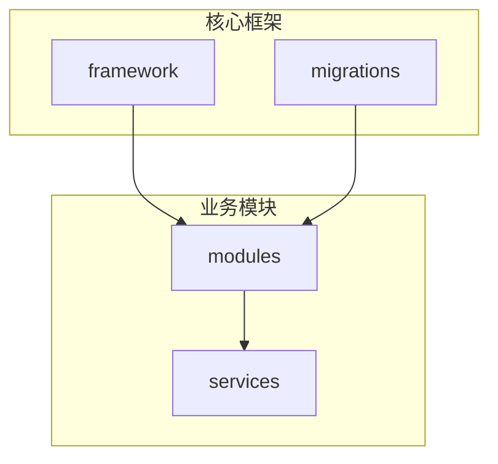
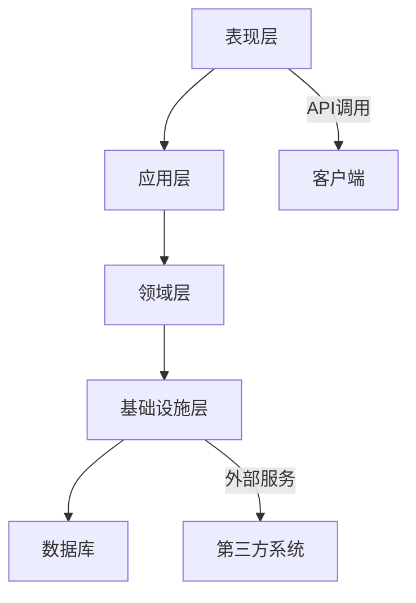
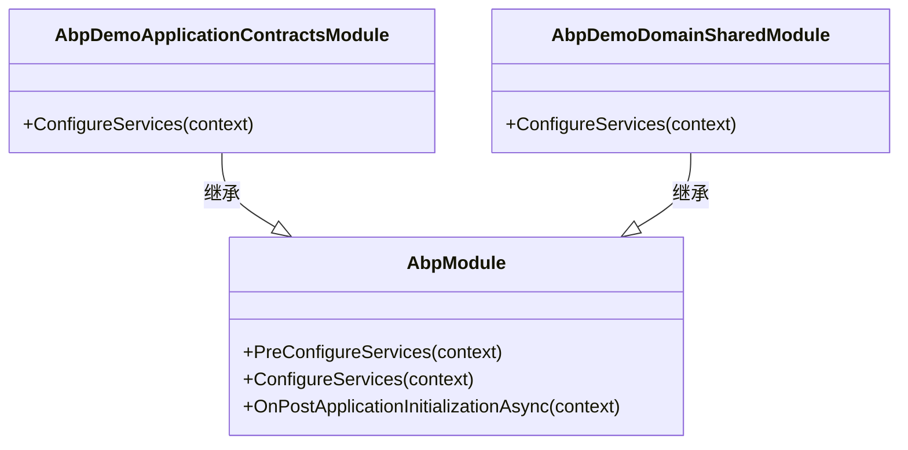
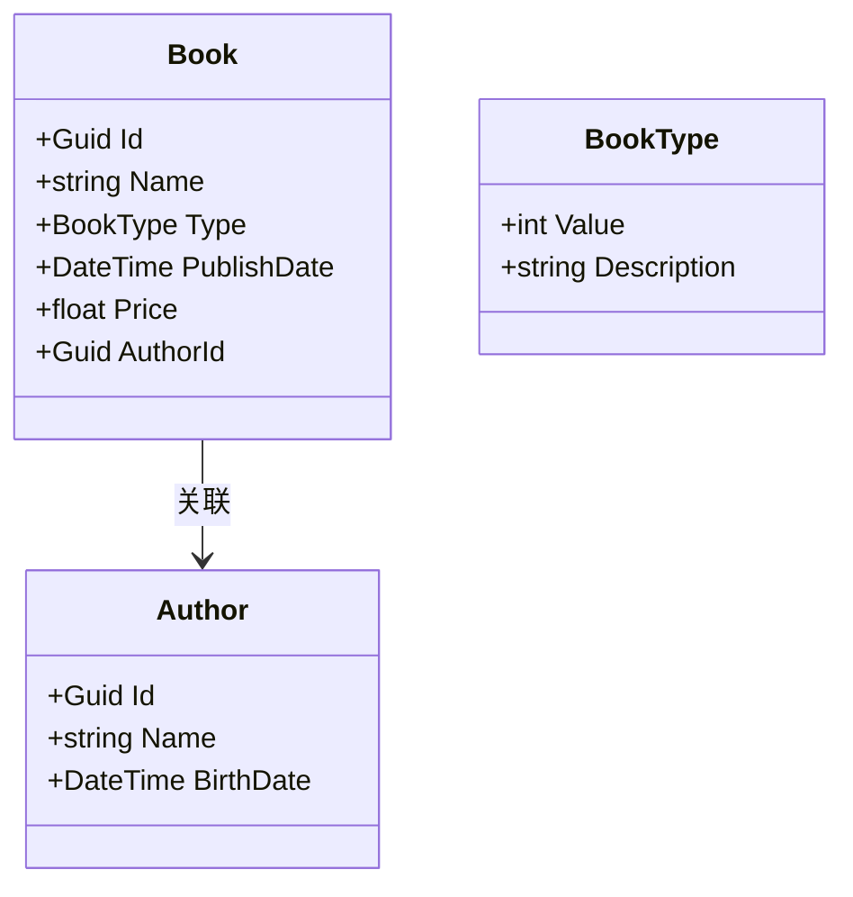
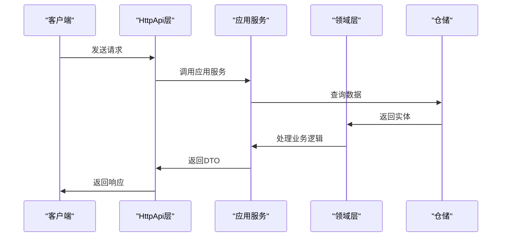
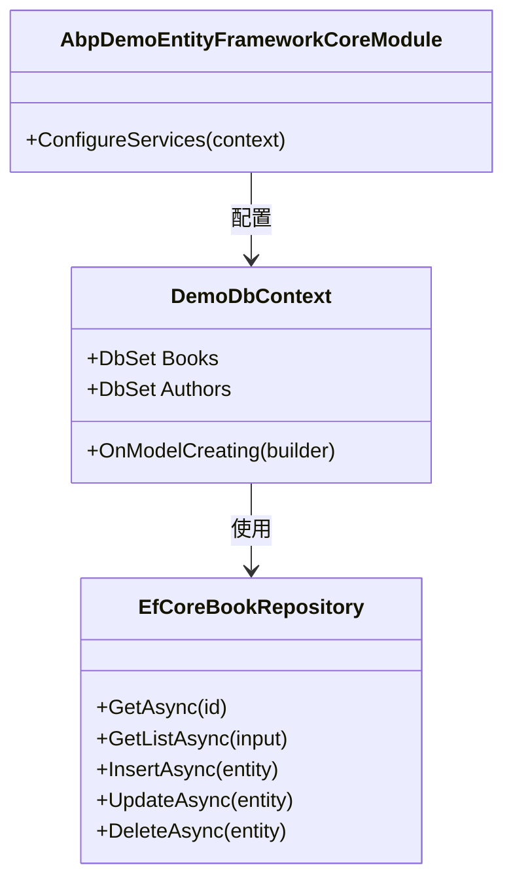
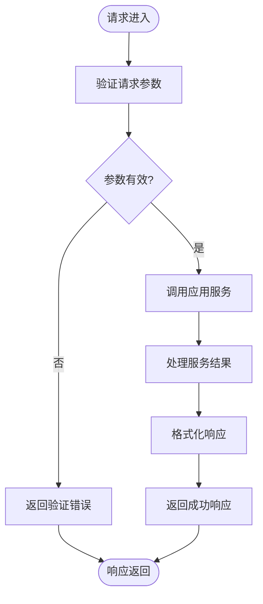

# 自定义模块开发

<cite>
**本文档引用的文件**  
- [MicroServiceApplicationsSingleModule.cs](file://aspnet-core/services/LY.MicroService.Applications.Single/MicroServiceApplicationsSingleModule.cs)
- [AbpDemoApplicationContractsModule.cs](file://aspnet-core/modules/demo/LINGYUN.Abp.Demo.Application.Contracts/LINGYUN/Abp/Demo/AbpDemoApplicationContractsModule.cs)
- [AbpDemoDomainSharedModule.cs](file://aspnet-core/modules/demo/LINGYUN.Abp.Demo.Domain.Shared/LINGYUN/Abp/Demo/AbpDemoDomainSharedModule.cs)
- [AbpDemoDomainModule.cs](file://aspnet-core/modules/demo/LINGYUN.Abp.Demo.Domain/LINGYUN/Abp/Demo/AbpDemoDomainModule.cs)
- [AbpDemoEntityFrameworkCoreModule.cs](file://aspnet-core/modules/demo/LINGYUN.Abp.Demo.EntityFrameworkCore/LINGYUN/Abp/Demo/EntityFrameworkCore/AbpDemoEntityFrameworkCoreModule.cs)
- [AbpDemoHttpApiModule.cs](file://aspnet-core/modules/demo/LINGYUN.Abp.Demo.HttpApi/LINGYUN/Abp/Demo/AbpDemoHttpApiModule.cs)
- [AbpDemoApplicationModule.cs](file://aspnet-core/modules/demo/LINGYUN.Abp.Demo.Application/LINGYUN/Abp/Demo/AbpDemoApplicationModule.cs)
- [Book.cs](file://aspnet-core/modules/demo/LINGYUN.Abp.Demo.Domain/LINGYUN/Abp/Demo/Books/Book.cs)
- [BookAppService.cs](file://aspnet-core/modules/demo/LINGYUN.Abp.Demo.Application/LINGYUN/Abp/Demo/Books/BookAppService.cs)
- [DemoDbContext.cs](file://aspnet-core/modules/demo/LINGYUN.Abp.Demo.EntityFrameworkCore/LINGYUN/Abp/Demo/EntityFrameworkCore/DemoDbContext.cs)
- [20240929080118_Add-Demo-Module.cs](file://aspnet-core/migrations/LY.MicroService.Applications.Single.EntityFrameworkCore.MySql/Migrations/20240929080118_Add-Demo-Module.cs)
</cite>

## 目录
1. [简介](#简介)
2. [项目结构](#项目结构)
3. [核心组件](#核心组件)
4. [架构概述](#架构概述)
5. [详细组件分析](#详细组件分析)
6. [依赖分析](#依赖分析)
7. [性能考虑](#性能考虑)
8. [故障排除指南](#故障排除指南)
9. [结论](#结论)

## 简介
本文档详细介绍了在ABP框架基础上创建自定义功能模块的完整开发流程。文档涵盖了模块定义、依赖注入、服务注册、数据库迁移等关键开发环节，重点说明了模块间的依赖关系管理、版本控制和生命周期管理。通过一个完整的示例，展示了从零开始创建模块的全过程，包括Application、Domain、EntityFrameworkCore、HttpApi等各层的实现细节。同时，文档还解释了模块配置、权限定义、数据种子等关键概念的实现方式。

## 项目结构
ABP框架的项目结构遵循分层架构设计，主要分为framework、migrations、modules、services等核心目录。modules目录包含了所有自定义业务模块，每个模块都遵循标准的分层结构，包括Application、Domain、EntityFrameworkCore、HttpApi等子模块。这种结构化的组织方式使得模块开发更加清晰和可维护。

**图示来源**
- [MicroServiceApplicationsSingleModule.cs](file://aspnet-core/services/LY.MicroService.Applications.Single/MicroServiceApplicationsSingleModule.cs#L0-L451)

**本节来源**
- [MicroServiceApplicationsSingleModule.cs](file://aspnet-core/services/LY.MicroService.Applications.Single/MicroServiceApplicationsSingleModule.cs#L0-L451)

## 核心组件
ABP框架的核心组件包括模块系统、依赖注入容器、服务注册机制和数据库迁移工具。模块系统通过继承AbpModule类来定义，使用[DependsOn]特性声明模块间的依赖关系。依赖注入容器负责管理所有服务的生命周期，服务注册机制允许在ConfigureServices方法中配置各种服务。数据库迁移工具则通过Entity Framework Core的迁移功能实现数据结构的版本控制。

**本节来源**
- [MicroServiceApplicationsSingleModule.cs](file://aspnet-core/services/LY.MicroService.Applications.Single/MicroServiceApplicationsSingleModule.cs#L0-L451)
- [AbpCommonModule.cs](file://aspnet-core/framework/common/LINGYUN.Abp.Core/AbpCommonModule.cs#L0-L6)

## 架构概述
ABP框架采用分层架构设计，主要包括表现层、应用层、领域层和基础设施层。表现层负责处理HTTP请求和响应，应用层实现业务逻辑，领域层包含核心业务实体和领域服务，基础设施层提供数据访问和外部服务集成。各层之间通过接口进行通信，确保了松耦合和高内聚的设计原则。

**图示来源**
- [AbpDemoHttpApiModule.cs](file://aspnet-core/modules/demo/LINGYUN.Abp.Demo.HttpApi/LINGYUN/Abp/Demo/AbpDemoHttpApiModule.cs#L0-L28)
- [AbpDemoApplicationModule.cs](file://aspnet-core/modules/demo/LINGYUN.Abp.Demo.Application/LINGYUN/Abp/Demo/AbpDemoApplicationModule.cs#L0-L27)

## 详细组件分析

### 模块定义分析
在ABP框架中，每个模块都通过继承AbpModule类来定义。模块类使用[DependsOn]特性声明其依赖的其他模块，确保模块加载顺序的正确性。模块的生命周期包括PreConfigureServices、ConfigureServices和OnPostApplicationInitializationAsync等阶段，允许在不同阶段进行服务配置和初始化。

**图示来源**
- [AbpDemoApplicationContractsModule.cs](file://aspnet-core/modules/demo/LINGYUN.Abp.Demo.Application.Contracts/LINGYUN/Abp/Demo/AbpDemoApplicationContractsModule.cs#L0-L17)
- [AbpDemoDomainSharedModule.cs](file://aspnet-core/modules/demo/LINGYUN.Abp.Demo.Domain.Shared/LINGYUN/Abp/Demo/AbpDemoDomainSharedModule.cs#L0-L31)

**本节来源**
- [AbpDemoApplicationContractsModule.cs](file://aspnet-core/modules/demo/LINGYUN.Abp.Demo.Application.Contracts/LINGYUN/Abp/Demo/AbpDemoApplicationContractsModule.cs#L0-L17)
- [AbpDemoDomainSharedModule.cs](file://aspnet-core/modules/demo/LINGYUN.Abp.Demo.Domain.Shared/LINGYUN/Abp/Demo/AbpDemoDomainSharedModule.cs#L0-L31)

### 领域层分析
领域层包含业务实体和领域服务，是应用程序的核心。业务实体继承自AuditedAggregateRoot等基类，实现了数据审计功能。领域服务负责处理复杂的业务逻辑，通过仓储接口与数据访问层交互。领域层还包含值对象和领域事件，支持领域驱动设计的最佳实践。

**图示来源**
- [Book.cs](file://aspnet-core/modules/demo/LINGYUN.Abp.Demo.Domain/LINGYUN/Abp/Demo/Books/Book.cs#L0-L40)
- [AbpDemoDomainModule.cs](file://aspnet-core/modules/demo/LINGYUN.Abp.Demo.Domain/LINGYUN/Abp/Demo/AbpDemoDomainModule.cs#L0-L48)

**本节来源**
- [Book.cs](file://aspnet-core/modules/demo/LINGYUN.Abp.Demo.Domain/LINGYUN/Abp/Demo/Books/Book.cs#L0-L40)
- [AbpDemoDomainModule.cs](file://aspnet-core/modules/demo/LINGYUN.Abp.Demo.Domain/LINGYUN/Abp/Demo/AbpDemoDomainModule.cs#L0-L48)

### 应用层分析
应用层实现业务用例，作为表现层和领域层之间的桥梁。应用服务通过依赖注入获取领域服务和仓储实例，执行具体的业务逻辑。应用服务方法通常返回DTO对象，将领域实体转换为适合传输的数据结构。应用层还负责权限验证、数据验证和异常处理。

**图示来源**
- [BookAppService.cs](file://aspnet-core/modules/demo/LINGYUN.Abp.Demo.Application/LINGYUN/Abp/Demo/Books/BookAppService.cs#L0-L199)
- [AbpDemoApplicationModule.cs](file://aspnet-core/modules/demo/LINGYUN.Abp.Demo.Application/LINGYUN/Abp/Demo/AbpDemoApplicationModule.cs#L0-L27)

**本节来源**
- [BookAppService.cs](file://aspnet-core/modules/demo/LINGYUN.Abp.Demo.Application/LINGYUN/Abp/Demo/Books/BookAppService.cs#L0-L199)
- [AbpDemoApplicationModule.cs](file://aspnet-core/modules/demo/LINGYUN.Abp.Demo.Application/LINGYUN/Abp/Demo/AbpDemoApplicationModule.cs#L0-L27)

### 数据访问层分析
数据访问层基于Entity Framework Core实现，包含DbContext和仓储实现。DbContext定义了数据模型的映射关系，通过OnModelCreating方法配置实体关系。仓储实现提供了对数据的CRUD操作，支持分页、排序和过滤。数据迁移通过Code First方式管理，确保数据库结构与代码模型保持同步。

**图示来源**
- [DemoDbContext.cs](file://aspnet-core/modules/demo/LINGYUN.Abp.Demo.EntityFrameworkCore/LINGYUN/Abp/Demo/EntityFrameworkCore/DemoDbContext.cs#L0-L30)
- [AbpDemoEntityFrameworkCoreModule.cs](file://aspnet-core/modules/demo/LINGYUN.Abp.Demo.EntityFrameworkCore/LINGYUN/Abp/Demo/EntityFrameworkCore/AbpDemoEntityFrameworkCoreModule.cs#L0-L25)

**本节来源**
- [DemoDbContext.cs](file://aspnet-core/modules/demo/LINGYUN.Abp.Demo.EntityFrameworkCore/LINGYUN/Abp/Demo/EntityFrameworkCore/DemoDbContext.cs#L0-L30)
- [AbpDemoEntityFrameworkCoreModule.cs](file://aspnet-core/modules/demo/LINGYUN.Abp.Demo.EntityFrameworkCore/LINGYUN/Abp/Demo/EntityFrameworkCore/AbpDemoEntityFrameworkCoreModule.cs#L0-L25)

### 表现层分析
表现层负责处理HTTP请求和响应，通过控制器暴露API端点。控制器依赖应用服务执行业务逻辑，将结果转换为适当的响应格式。表现层还负责请求验证、错误处理和响应包装。ABP框架提供了丰富的特性支持，如[Authorize]用于权限控制，[Route]用于路由配置。

**图示来源**
- [AbpDemoHttpApiModule.cs](file://aspnet-core/modules/demo/LINGYUN.Abp.Demo.HttpApi/LINGYUN/Abp/Demo/AbpDemoHttpApiModule.cs#L0-L28)
- [BookAppService.cs](file://aspnet-core/modules/demo/LINGYUN.Abp.Demo.Application/LINGYUN/Abp/Demo/Books/BookAppService.cs#L0-L199)

**本节来源**
- [AbpDemoHttpApiModule.cs](file://aspnet-core/modules/demo/LINGYUN.Abp.Demo.HttpApi/LINGYUN/Abp/Demo/AbpDemoHttpApiModule.cs#L0-L28)
- [BookAppService.cs](file://aspnet-core/modules/demo/LINGYUN.Abp.Demo.Application/LINGYUN/Abp/Demo/Books/BookAppService.cs#L0-L199)

## 依赖分析
ABP框架的模块依赖关系通过[DependsOn]特性显式声明，确保模块加载顺序的正确性。每个模块可以依赖多个其他模块，形成复杂的依赖图。依赖注入容器负责解析这些依赖关系，在运行时正确初始化所有服务。模块间的依赖管理遵循单一职责原则，每个模块只关注特定的业务功能。

```mermaid
graph TD
A[AbpDemoApplicationContractsModule] --> B[AbpDddApplicationContractsModule]
A --> C[AbpAuthorizationAbstractionsModule]
A --> D[AbpExporterApplicationContractsModule]
A --> E[AbpDataProtectionAbstractionsModule]
A --> F[AbpDemoDomainSharedModule]
G[AbpDemoApplicationModule] --> H[AbpDddApplicationModule]
G --> I[AbpDemoDomainModule]
G --> J[AbpDemoApplicationContractsModule]
G --> K[AbpExporterApplicationModule]
G --> L[AbpDataProtectionModule]
M[AbpDemoDomainModule] --> N[AbpDddDomainModule]
M --> O[AbpDemoDomainSharedModule]
M --> P[AbpDataProtectionModule]
M --> Q[AbpAutoMapperModule]
R[AbpDemoEntityFrameworkCoreModule] --> S[AbpDemoDomainModule]
R --> T[AbpDataProtectionEntityFrameworkCoreModule]
U[AbpDemoHttpApiModule] --> V[AbpAspNetCoreMvcModule]
U --> W[AbpDemoApplicationContractsModule]
```

**图示来源**
- [AbpDemoApplicationContractsModule.cs](file://aspnet-core/modules/demo/LINGYUN.Abp.Demo.Application.Contracts/LINGYUN/Abp/Demo/AbpDemoApplicationContractsModule.cs#L0-L17)
- [AbpDemoApplicationModule.cs](file://aspnet-core/modules/demo/LINGYUN.Abp.Demo.Application/LINGYUN/Abp/Demo/AbpDemoApplicationModule.cs#L0-L27)
- [AbpDemoDomainModule.cs](file://aspnet-core/modules/demo/LINGYUN.Abp.Demo.Domain/LINGYUN/Abp/Demo/AbpDemoDomainModule.cs#L0-L48)
- [AbpDemoEntityFrameworkCoreModule.cs](file://aspnet-core/modules/demo/LINGYUN.Abp.Demo.EntityFrameworkCore/LINGYUN/Abp/Demo/EntityFrameworkCore/AbpDemoEntityFrameworkCoreModule.cs#L0-L25)
- [AbpDemoHttpApiModule.cs](file://aspnet-core/modules/demo/LINGYUN.Abp.Demo.HttpApi/LINGYUN/Abp/Demo/AbpDemoHttpApiModule.cs#L0-L28)

**本节来源**
- [AbpDemoApplicationContractsModule.cs](file://aspnet-core/modules/demo/LINGYUN.Abp.Demo.Application.Contracts/LINGYUN/Abp/Demo/AbpDemoApplicationContractsModule.cs#L0-L17)
- [AbpDemoApplicationModule.cs](file://aspnet-core/modules/demo/LINGYUN.Abp.Demo.Application/LINGYUN/Abp/Demo/AbpDemoApplicationModule.cs#L