# 技术栈与依赖

<cite>
**本文档引用的文件**
- [README.md](file://README.md)
- [docker-compose.yml](file://docker-compose.yml)
- [docker-compose.middleware.yml](file://docker-compose.middleware.yml)
- [docker-compose.override.configuration.yml](file://docker-compose.override.configuration.yml)
- [AbpCAPEventBusModule.cs](file://aspnet-core/framework/common/LINGYUN.Abp.EventBus.CAP/modules/common/LINGYUN.Abp.EventBus.CAP/AbpCAPEventBusModule.cs)
- [README.md](file://aspnet-core/framework/common/LINGYUN.Abp.EventBus.CAP/README.md)
- [IDbSchemaMigrator.cs](file://aspnet-core/framework/common/LINGYUN.Abp.Data.DbMigrator/LINGYUN/Abp/Data/DbMigrator/IDbSchemaMigrator.cs)
- [README.md](file://aspnet-core/framework/common/LINGYUN.Abp.Data.DbMigrator/README.md)
- [package.json](file://apps/vben5/package.json)
</cite>

## 目录
1. [项目概述](#项目概述)
2. [核心技术栈](#核心技术栈)
3. [ABP框架架构](#abp框架架构)
4. [容器化技术](#容器化技术)
5. [分布式事件总线](#分布式事件总线)
6. [数据访问层](#数据访问层)
7. [中间件集成](#中间件集成)
8. [前端技术栈](#前端技术栈)
9. [技术选型优势](#技术选型优势)
10. [总结](#总结)

## 项目概述

abp-next-admin是一个基于ABP框架的现代化企业级后台管理系统，采用微服务架构设计，集成了多种先进的技术栈。该项目结合了ABP框架的强大功能与Vue.js前端框架的优势，为企业级应用开发提供了完整的解决方案。

## 核心技术栈

### 后端技术栈

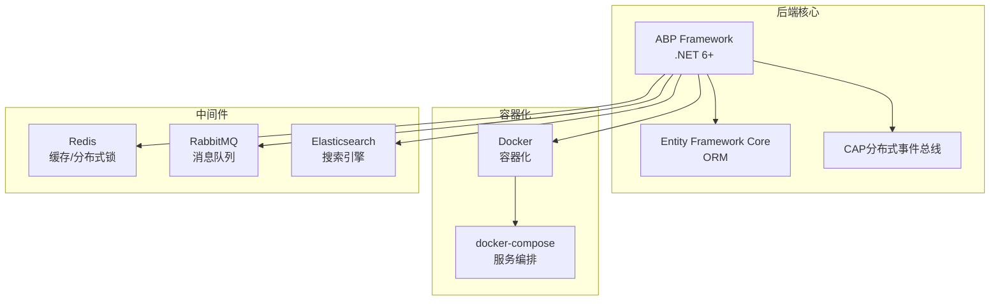

**图表来源**
- [README.md](file://README.md#L1-L50)
- [docker-compose.yml](file://docker-compose.yml#L1-L50)

### 前端技术栈

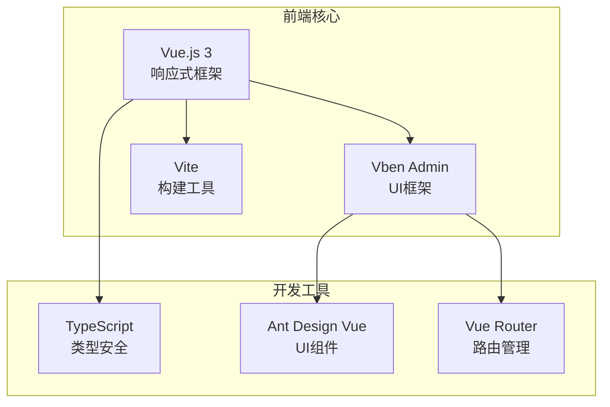

**图表来源**
- [README.md](file://README.md#L110-L127)
- [package.json](file://apps/vben5/package.json#L1-L50)

## ABP框架架构

ABP框架是整个项目的核心，它提供了完整的微服务架构解决方案。

### ABP框架特性

1. **模块化设计**: 采用模块化架构，每个功能模块都可以独立开发和部署
2. **多数据库支持**: 支持MySQL、SQL Server、PostgreSQL等多种数据库
3. **多租户支持**: 内置多租户架构，支持SaaS模式
4. **身份认证**: 集成IdentityServer和OpenIddict，支持OAuth2和OpenID Connect
5. **权限管理**: 基于角色的权限控制(RBAC)
6. **审计日志**: 自动记录操作审计和安全日志

### ABP模块结构

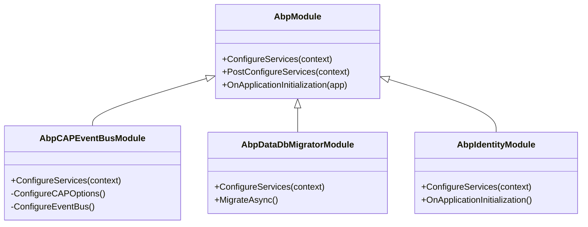

**图表来源**
- [AbpCAPEventBusModule.cs](file://aspnet-core/framework/common/LINGYUN.Abp.EventBus.CAP/modules/common/LINGYUN.Abp.EventBus.CAP/AbpCAPEventBusModule.cs#L1-L39)

**章节来源**
- [README.md](file://README.md#L1-L100)
- [AbpCAPEventBusModule.cs](file://aspnet-core/framework/common/LINGYUN.Abp.EventBus.CAP/modules/common/LINGYUN.Abp.EventBus.CAP/AbpCAPEventBusModule.cs#L1-L39)

## 容器化技术

### Docker容器化架构

项目采用Docker进行容器化部署，通过docker-compose实现服务编排。

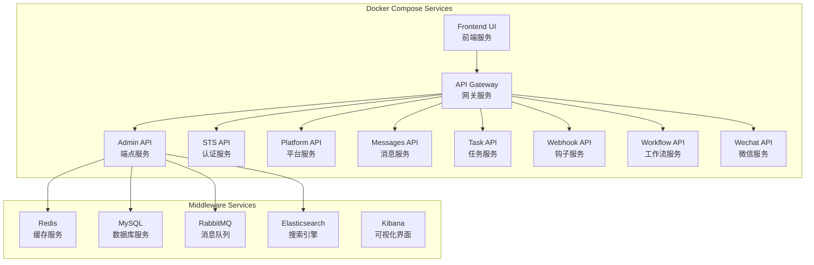

**图表来源**
- [docker-compose.yml](file://docker-compose.yml#L1-L244)
- [docker-compose.middleware.yml](file://docker-compose.middleware.yml#L1-L115)

### 容器编排配置

项目使用多个docker-compose文件进行配置管理：

1. **主配置文件**: `docker-compose.yml` - 定义核心服务
2. **中间件配置**: `docker-compose.middleware.yml` - 中间件服务
3. **配置覆盖**: `docker-compose.override.configuration.yml` - 环境配置

**章节来源**
- [docker-compose.yml](file://docker-compose.yml#L1-L244)
- [docker-compose.middleware.yml](file://docker-compose.middleware.yml#L1-L115)
- [docker-compose.override.configuration.yml](file://docker-compose.override.configuration.yml#L1-L614)

## 分布式事件总线

### CAP分布式事件总线

CAP是项目中实现服务间通信的核心组件，基于RabbitMQ实现分布式事件总线。

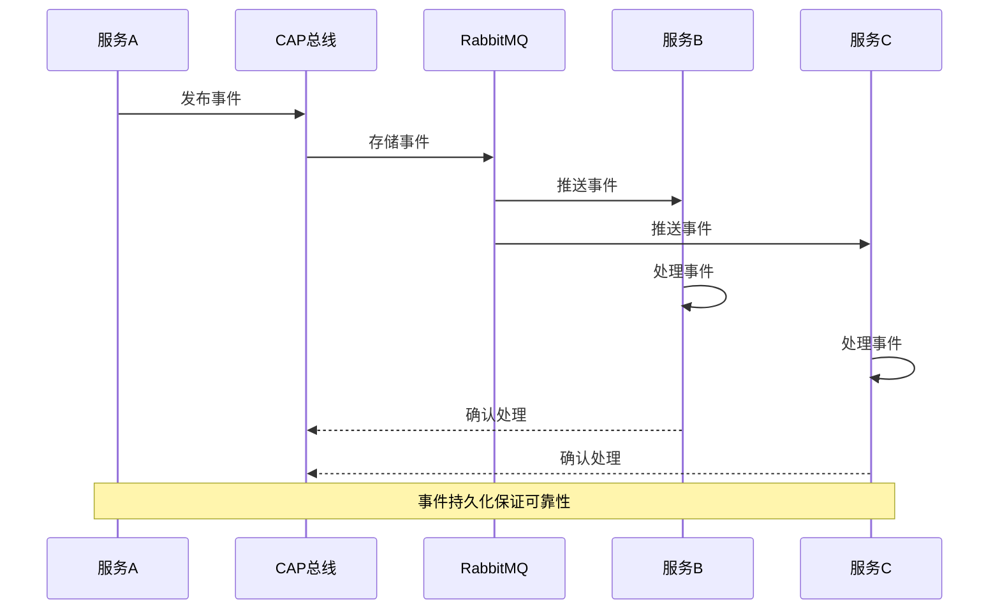

**图表来源**
- [AbpCAPEventBusModule.cs](file://aspnet-core/framework/common/LINGYUN.Abp.EventBus.CAP/modules/common/LINGYUN.Abp.EventBus.CAP/AbpCAPEventBusModule.cs#L1-L39)

### CAP配置特点

1. **事件持久化**: 确保事件不会丢失
2. **重试机制**: 支持失败事件的自动重试
3. **多租户支持**: 支持多租户环境下的事件隔离
4. **自定义处理器**: 支持自定义事件处理器

### CAP使用场景

- 用户注册通知
- 订单状态变更
- 系统监控告警
- 日志收集处理
- 异步任务调度

**章节来源**
- [README.md](file://README.md#L1-L50)
- [AbpCAPEventBusModule.cs](file://aspnet-core/framework/common/LINGYUN.Abp.EventBus.CAP/modules/common/LINGYUN.Abp.EventBus.CAP/AbpCAPEventBusModule.cs#L1-L39)
- [README.md](file://aspnet-core/framework/common/LINGYUN.Abp.EventBus.CAP/README.md#L1-L23)

## 数据访问层

### Entity Framework Core

项目采用Entity Framework Core作为ORM框架，提供强大的数据访问能力。

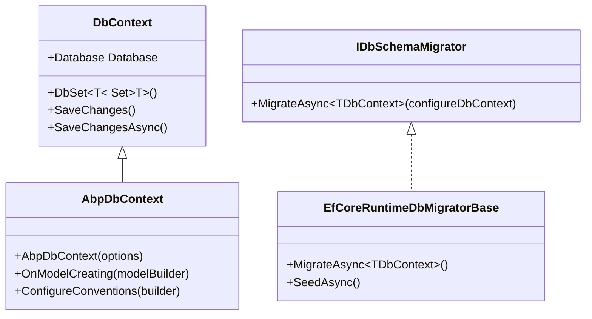

**图表来源**
- [IDbSchemaMigrator.cs](file://aspnet-core/framework/common/LINGYUN.Abp.Data.DbMigrator/LINGYUN/Abp/Data/DbMigrator/IDbSchemaMigrator.cs#L1-L13)

### 数据库迁移

项目提供了完整的数据库迁移解决方案：

1. **运行时迁移**: 支持运行时动态迁移
2. **分布式锁**: 防止并发迁移冲突
3. **种子数据**: 支持初始数据填充
4. **多数据库支持**: 支持多种数据库提供商

### 数据库配置

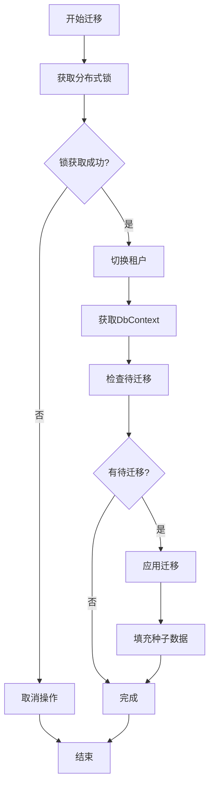

**图表来源**
- [IDbSchemaMigrator.cs](file://aspnet-core/framework/common/LINGYUN.Abp.Data.DbMigrator/LINGYUN/Abp/Data/DbMigrator/IDbSchemaMigrator.cs#L1-L13)

**章节来源**
- [README.md](file://README.md#L1-L100)
- [IDbSchemaMigrator.cs](file://aspnet-core/framework/common/LINGYUN.Abp.Data.DbMigrator/LINGYUN/Abp/Data/DbMigrator/IDbSchemaMigrator.cs#L1-L13)
- [README.md](file://aspnet-core/framework/common/LINGYUN.Abp.Data.DbMigrator/README.md#L1-L57)

## 中间件集成

### Redis缓存与分布式锁

项目集成了Redis作为缓存和分布式锁解决方案。

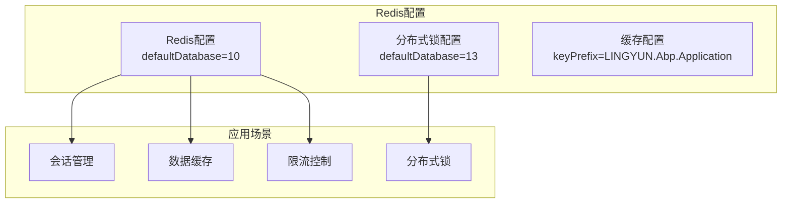

**图表来源**
- [docker-compose.override.configuration.yml](file://docker-compose.override.configuration.yml#L48-L54)

### RabbitMQ消息队列

RabbitMQ作为消息中间件，支持CAP分布式事件总线。

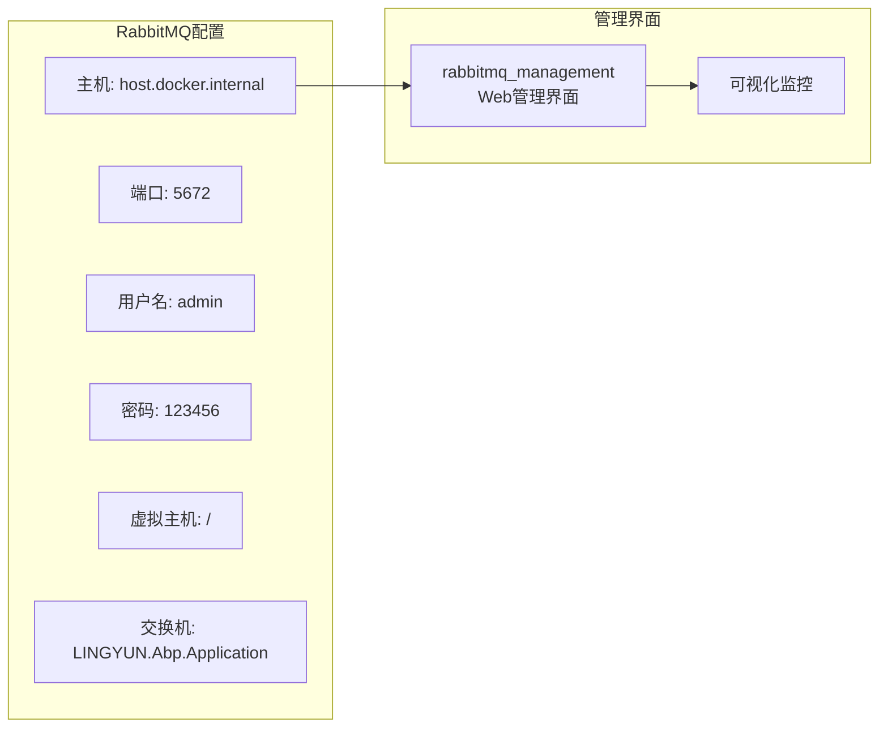

**图表来源**
- [docker-compose.override.configuration.yml](file://docker-compose.override.configuration.yml#L35-L40)

### Elasticsearch搜索引擎

Elasticsearch提供全文搜索和日志分析功能。

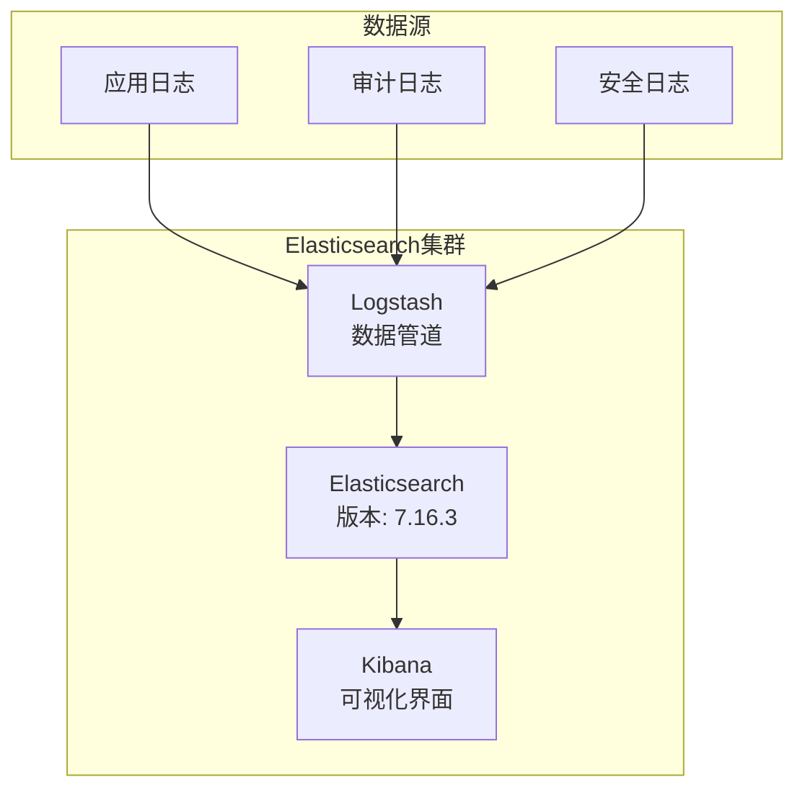

**图表来源**
- [docker-compose.middleware.yml](file://docker-compose.middleware.yml#L55-L115)

### 中间件配置详解

项目通过环境变量配置所有中间件：

1. **Redis配置**: `Redis__Configuration=host.docker.internal,defaultDatabase=10`
2. **RabbitMQ配置**: `CAP__RabbitMQ__HostName=host.docker.internal`
3. **Elasticsearch配置**: `Elasticsearch__NodeUris=http://host.docker.internal:9200`
4. **分布式锁**: `DistributedLock__Redis__Configuration=host.docker.internal,defaultDatabase=13`

**章节来源**
- [docker-compose.override.configuration.yml](file://docker-compose.override.configuration.yml#L35-L112)
- [docker-compose.middleware.yml](file://docker-compose.middleware.yml#L1-L115)

## 前端技术栈

### Vue.js 3 + Vben Admin

前端采用Vue.js 3和Vben Admin框架构建现代化的管理界面。

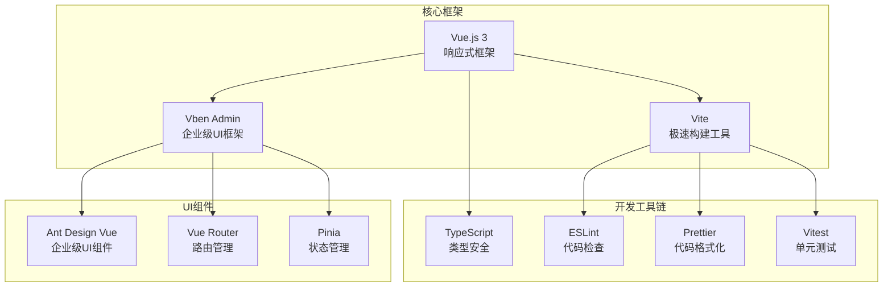

**图表来源**
- [README.md](file://README.md#L110-L127)
- [package.json](file://apps/vben5/package.json#L1-L50)

### 前端项目结构

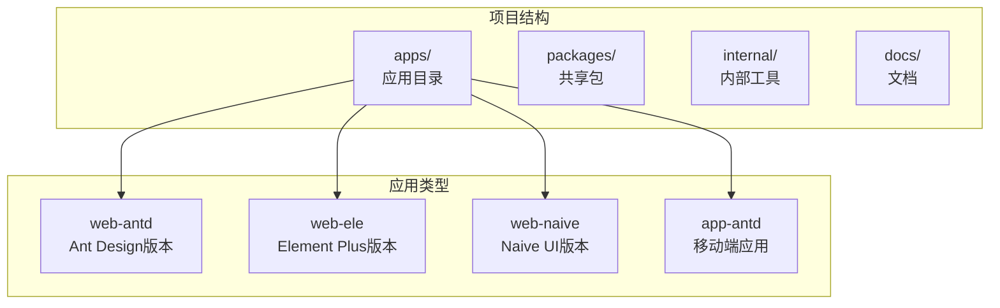

**图表来源**
- [package.json](file://apps/vben5/package.json#L1-L50)

### 前端技术特性

1. **TypeScript支持**: 完整的类型安全保障
2. **组件化开发**: 高度模块化的组件体系
3. **主题定制**: 支持多套主题切换
4. **国际化**: 完善的多语言支持
5. **权限控制**: 基于角色的权限管理
6. **动态路由**: 支持后端动态路由配置

**章节来源**
- [README.md](file://README.md#L110-L127)
- [package.json](file://apps/vben5/package.json#L1-L125)

## 技术选型优势

### 后端技术优势

1. **ABP框架优势**
   - 企业级功能完整
   - 微服务架构原生支持
   - 多数据库无缝切换
   - 完善的安全机制

2. **CAP分布式事件总线**
   - 高可靠的消息传递
   - 支持事务一致性
   - 易于扩展和维护
   - 成熟的社区支持

3. **Entity Framework Core**
   - 强大的ORM功能
   - 多数据库支持
   - 迁移自动化
   - 性能优化完善

### 前端技术优势

1. **Vue.js 3**
   - 响应式编程模型
   - Composition API
   - 性能优化优秀
   - 生态系统丰富

2. **Vben Admin**
   - 企业级UI设计
   - 完善的功能模块
   - 主题定制灵活
   - 开发体验优秀

3. **现代化工具链**
   - Vite构建速度极快
   - TypeScript类型安全
   - ESLint代码质量保障
   - 组件化开发模式

### 容器化优势

1. **Docker容器化**
   - 环境一致性保证
   - 快速部署和扩展
   - 资源隔离和管理
   - 微服务架构支持

2. **docker-compose服务编排**
   - 服务依赖管理
   - 网络配置简化
   - 环境变量统一管理
   - 健康检查机制

## 总结

abp-next-admin项目通过精心选择的技术栈，构建了一个现代化的企业级后台管理系统。项目的主要技术优势包括：

1. **完整的微服务架构**: 基于ABP框架的成熟解决方案
2. **可靠的分布式通信**: CAP事件总线确保服务间通信
3. **高效的数据访问**: Entity Framework Core提供强大ORM支持
4. **现代化的前端体验**: Vue.js + Vben Admin打造优秀用户体验
5. **完善的容器化部署**: Docker + docker-compose实现一键部署

这种技术组合不仅保证了系统的稳定性和可扩展性，也为后续的功能扩展和维护提供了良好的基础。项目适合需要快速构建企业级管理系统的开发团队，特别是对微服务架构有需求的项目。