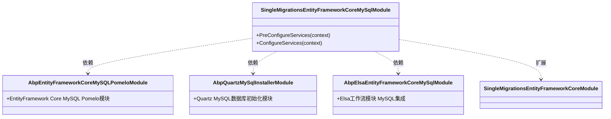

# 多数据库支持

<cite>
**本文档引用的文件**
- [appsettings.MySql.json](file://aspnet-core/migrations/LY.MicroService.Applications.Single.DbMigrator/appsettings.MySql.json)
- [appsettings.PostgreSql.json](file://aspnet-core/migrations/LY.MicroService.Applications.Single.DbMigrator/appsettings.PostgreSql.json)
- [appsettings.SqlServer.json](file://aspnet-core/migrations/LY.MicroService.Applications.Single.DbMigrator/appsettings.SqlServer.json)
- [SingleMigrationsEntityFrameworkCoreModule.cs](file://aspnet-core/migrations/LY.MicroService.Applications.Single.EntityFrameworkCore/SingleMigrationsEntityFrameworkCoreModule.cs)
- [SingleMigrationsEntityFrameworkCoreMySqlModule.cs](file://aspnet-core/migrations/LY.MicroService.Applications.Single.EntityFrameworkCore.MySql/SingleMigrationsEntityFrameworkCoreMySqlModule.cs)
- [SingleMigrationsEntityFrameworkCorePostgreSqlModule.cs](file://aspnet-core/migrations/LY.MicroService.Applications.Single.EntityFrameworkCore.PostgreSql/SingleMigrationsEntityFrameworkCorePostgreSqlModule.cs)
- [SingleMigrationsEntityFrameworkCoreSqlServerModule.cs](file://aspnet-core/migrations/LY.MicroService.Applications.Single.EntityFrameworkCore.SqlServer/SingleMigrationsEntityFrameworkCoreSqlServerModule.cs)
- [SingleDbMigrationService.cs](file://aspnet-core/migrations/LY.MicroService.Applications.Single.EntityFrameworkCore/SingleDbMigrationService.cs)
- [SingleDbMigrationEventHandler.cs](file://aspnet-core/migrations/LY.MicroService.Applications.Single.EntityFrameworkCore/SingleDbMigrationEventHandler.cs)
- [Migrate.ps1](file://aspnet-core/migrations/Migrate.ps1)
</cite>

## 目录
1. [简介](#简介)
2. [项目结构](#项目结构)
3. [核心组件](#核心组件)
4. [架构概述](#架构概述)
5. [详细组件分析](#详细组件分析)
6. [依赖分析](#依赖分析)
7. [性能考虑](#性能考虑)
8. [故障排除指南](#故障排除指南)
9. [结论](#结论)
10. [附录](#附录)（如有必要）

## 简介
本文档全面介绍了ABP框架在abp-next-admin项目中对MySQL、PostgreSQL和SQL Server三种数据库系统的支持机制。文档详细阐述了多数据库配置方式、驱动集成策略、兼容性处理方案，以及不同数据库的特有配置、性能优化策略和迁移脚本差异。为系统架构师提供了数据库选型建议和切换指南，帮助开发者理解并有效利用该框架的多数据库支持能力。

## 项目结构
该项目采用模块化设计，通过独立的Entity Framework Core模块来支持不同的数据库系统。核心的数据库迁移和管理功能位于`aspnet-core/migrations`目录下，其中包含多个专门的项目来处理不同数据库的迁移。

**图表来源**
- [appsettings.MySql.json](file://aspnet-core/migrations/LY.MicroService.Applications.Single.DbMigrator/appsettings.MySql.json)
- [appsettings.PostgreSql.json](file://aspnet-core/migrations/LY.MicroService.Applications.Single.DbMigrator/appsettings.PostgreSql.json)
- [appsettings.SqlServer.json](file://aspnet-core/migrations/LY.MicroService.Applications.Single.DbMigrator/appsettings.SqlServer.json)
- [SingleMigrationsEntityFrameworkCoreMySqlModule.cs](file://aspnet-core/migrations/LY.MicroService.Applications.Single.EntityFrameworkCore.MySql/SingleMigrationsEntityFrameworkCoreMySqlModule.cs)
- [SingleMigrationsEntityFrameworkCorePostgreSqlModule.cs](file://aspnet-core/migrations/LY.MicroService.Applications.Single.EntityFrameworkCore.PostgreSql/SingleMigrationsEntityFrameworkCorePostgreSqlModule.cs)
- [SingleMigrationsEntityFrameworkCoreSqlServerModule.cs](file://aspnet-core/migrations/LY.MicroService.Applications.Single.EntityFrameworkCore.SqlServer/SingleMigrationsEntityFrameworkCoreSqlServerModule.cs)
- [Migrate.ps1](file://aspnet-core/migrations/Migrate.ps1)

## 核心组件
本项目的核心是通过Entity Framework Core实现多数据库支持。系统设计了一个基础的迁移模块`LY.MicroService.Applications.Single.EntityFrameworkCore`，该模块定义了通用的数据库上下文和迁移服务。在此基础上，为每种数据库类型创建了专门的扩展模块，这些模块依赖于基础模块并提供特定于数据库的配置和驱动集成。

**章节来源**
- [SingleMigrationsEntityFrameworkCoreModule.cs](file://aspnet-core/migrations/LY.MicroService.Applications.Single.EntityFrameworkCore/SingleMigrationsEntityFrameworkCoreModule.cs)
- [SingleDbMigrationService.cs](file://aspnet-core/migrations/LY.MicroService.Applications.Single.EntityFrameworkCore/SingleDbMigrationService.cs)

## 架构概述
系统的多数据库支持架构基于分层设计模式，将通用功能与特定实现分离。核心架构由基础EF Core模块、数据库特定模块、配置系统和迁移工具链组成。

**图表来源**
- [SingleMigrationsEntityFrameworkCoreModule.cs](file://aspnet-core/migrations/LY.MicroService.Applications.Single.EntityFrameworkCore/SingleMigrationsEntityFrameworkCoreModule.cs)
- [SingleMigrationsEntityFrameworkCoreMySqlModule.cs](file://aspnet-core/migrations/LY.MicroService.Applications.Single.EntityFrameworkCore.MySql/SingleMigrationsEntityFrameworkCoreMySqlModule.cs)
- [SingleMigrationsEntityFrameworkCorePostgreSqlModule.cs](file://aspnet-core/migrations/LY.MicroService.Applications.Single.EntityFrameworkCore.PostgreSql/SingleMigrationsEntityFrameworkCorePostgreSqlModule.cs)
- [SingleMigrationsEntityFrameworkCoreSqlServerModule.cs](file://aspnet-core/migrations/LY.MicroService.Applications.Single.EntityFrameworkCore.SqlServer/SingleMigrationsEntityFrameworkCoreSqlServerModule.cs)

## 详细组件分析
### MySQL 支持分析
MySQL支持通过专门的`LY.MicroService.Applications.Single.EntityFrameworkCore.MySql`模块实现，该模块集成了Pomelo.EntityFrameworkCore.MySql驱动，并针对MySQL特性进行了优化配置。

#### MySQL 模块配置

**图表来源**
- [SingleMigrationsEntityFrameworkCoreMySqlModule.cs](file://aspnet-core/migrations/LY.MicroService.Applications.Single.EntityFrameworkCore.MySql/SingleMigrationsEntityFrameworkCoreMySqlModule.cs)

**章节来源**
- [SingleMigrationsEntityFrameworkCoreMySqlModule.cs](file://aspnet-core/migrations/LY.MicroService.Applications.Single.EntityFrameworkCore.MySql/SingleMigrationsEntityFrameworkCoreMySqlModule.cs)

### PostgreSQL 支持分析
PostgreSQL支持通过`LY.MicroService.Applications.Single.EntityFrameworkCore.PostgreSql`模块实现，该模块使用Npgsql驱动，并针对PostgreSQL的时间戳行为进行了特殊配置。

#### PostgreSQL 模块配置

**图表来源**
- [SingleMigrationsEntityFrameworkCorePostgreSqlModule.cs](file://aspnet-core/migrations/LY.MicroService.Applications.Single.EntityFrameworkCore.PostgreSql/SingleMigrationsEntityFrameworkCorePostgreSqlModule.cs)

**章节来源**
- [SingleMigrationsEntityFrameworkCorePostgreSqlModule.cs](file://aspnet-core/migrations/LY.MicroService.Applications.Single.EntityFrameworkCore.PostgreSql/SingleMigrationsEntityFrameworkCorePostgreSqlModule.cs)

### SQL Server 支持分析
SQL Server支持通过`LY.MicroService.Applications.Single.EntityFrameworkCore.SqlServer`模块实现，该模块集成了SQL Server的EF Core驱动，并支持CAP（分布式事务）和Quartz调度器的SQL Server集成。

#### SQL Server 模块配置

**图表来源**
- [SingleMigrationsEntityFrameworkCoreSqlServerModule.cs](file://aspnet-core/migrations/LY.MicroService.Applications.Single.EntityFrameworkCore.SqlServer/SingleMigrationsEntityFrameworkCoreSqlServerModule.cs)

**章节来源**
- [SingleMigrationsEntityFrameworkCoreSqlServerModule.cs](file://aspnet-core/migrations/LY.MicroService.Applications.Single.EntityFrameworkCore.SqlServer/SingleMigrationsEntityFrameworkCoreSqlServerModule.cs)

### 数据库迁移服务分析
数据库迁移服务是多数据库支持的核心组件，负责管理数据库模式的变更和数据迁移。

#### 迁移服务流程

**图表来源**
- [SingleDbMigrationService.cs](file://aspnet-core/migrations/LY.MicroService.Applications.Single.EntityFrameworkCore/SingleDbMigrationService.cs)

**章节来源**
- [SingleDbMigrationService.cs](file://aspnet-core/migrations/LY.MicroService.Applications.Single.EntityFrameworkCore/SingleDbMigrationService.cs)

## 依赖分析
系统的多数据库支持依赖于多个关键组件和模块，形成了清晰的依赖关系链。

**图表来源**
- [SingleMigrationsEntityFrameworkCoreModule.cs](file://aspnet-core/migrations/LY.MicroService.Applications.Single.EntityFrameworkCore/SingleMigrationsEntityFrameworkCoreModule.cs)
- [SingleMigrationsEntityFrameworkCoreMySqlModule.cs](file://aspnet-core/migrations/LY.MicroService.Applications.Single.EntityFrameworkCore.MySql/SingleMigrationsEntityFrameworkCoreMySqlModule.cs)
- [SingleMigrationsEntityFrameworkCorePostgreSqlModule.cs](file://aspnet-core/migrations/LY.MicroService.Applications.Single.EntityFrameworkCore.PostgreSql/SingleMigrationsEntityFrameworkCorePostgreSqlModule.cs)
- [SingleMigrationsEntityFrameworkCoreSqlServerModule.cs](file://aspnet-core/migrations/LY.MicroService.Applications.Single.EntityFrameworkCore.SqlServer/SingleMigrationsEntityFrameworkCoreSqlServerModule.cs)

**章节来源**
- [SingleMigrationsEntityFrameworkCoreModule.cs](file://aspnet-core/migrations/LY.MicroService.Applications.Single.EntityFrameworkCore/SingleMigrationsEntityFrameworkCoreModule.cs)
- [SingleMigrationsEntityFrameworkCoreMySqlModule.cs](file://aspnet-core/migrations/LY.MicroService.Applications.Single.EntityFrameworkCore.MySql/SingleMigrationsEntityFrameworkCoreMySqlModule.cs)
- [SingleMigrationsEntityFrameworkCorePostgreSqlModule.cs](file://aspnet-core/migrations/LY.MicroService.Applications.Single.EntityFrameworkCore.PostgreSql/SingleMigrationsEntityFrameworkCorePostgreSqlModule.cs)
- [SingleMigrationsEntityFrameworkCoreSqlServerModule.cs](file://aspnet-core/migrations/LY.MicroService.Applications.Single.EntityFrameworkCore.SqlServer/SingleMigrationsEntityFrameworkCoreSqlServerModule.cs)

## 性能考虑
在多数据库支持架构下，性能优化需要考虑不同数据库的特性和限制。MySQL配置中启用了`TranslateParameterizedCollectionsToConstants`选项，这是为了解决Pomelo驱动在处理参数化集合时的性能问题。PostgreSQL配置中设置了`Npgsql.EnableLegacyTimestampBehavior`开关，以确保时间戳行为的兼容性。SQL Server由于其企业级特性，在处理复杂查询和大规模数据时通常表现最佳，但需要更多的资源。

对于CAP（分布式事务）集成，MySQL和SQL Server都配置了相应的存储选项，而PostgreSQL通过通用的EF Core支持实现。在高并发场景下，建议使用SQL Server或PostgreSQL，因为它们在事务处理和锁管理方面更为成熟。MySQL适合读密集型应用，通过适当的索引优化可以获得良好的性能表现。

## 故障排除指南
在使用多数据库支持时，可能会遇到一些常见问题。首先，确保选择了正确的数据库上下文模块，这可以通过`Migrate.ps1`脚本中的菜单选择来完成。如果遇到迁移失败，检查连接字符串配置是否正确，特别是用户名、密码和服务器地址。

对于MySQL，如果出现字符集或排序规则问题，可以在连接字符串中添加`Charset=utf8mb4;`参数。PostgreSQL的时间戳问题可以通过设置`Npgsql.EnableLegacyTimestampBehavior`开关来解决。SQL Server的证书信任问题可以通过在连接字符串中添加`TrustServerCertificate=True`来临时解决。

在执行迁移时，如果遇到锁冲突，检查分布式锁的配置，确保Redis或其他分布式锁服务正常运行。对于CAP集成问题，检查`CAP:IsEnabled`配置项是否正确设置，并确保CAP的数据库配置与主数据库配置一致。

**章节来源**
- [appsettings.MySql.json](file://aspnet-core/migrations/LY.MicroService.Applications.Single.DbMigrator/appsettings.MySql.json)
- [appsettings.PostgreSql.json](file://aspnet-core/migrations/LY.MicroService.Applications.Single.DbMigrator/appsettings.PostgreSql.json)
- [appsettings.SqlServer.json](file://aspnet-core/migrations/LY.MicroService.Applications.Single.DbMigrator/appsettings.SqlServer.json)
- [SingleMigrationsEntityFrameworkCoreMySqlModule.cs](file://aspnet-core/migrations/LY.MicroService.Applications.Single.EntityFrameworkCore.MySql/SingleMigrationsEntityFrameworkCoreMySqlModule.cs)
- [SingleMigrationsEntityFrameworkCorePostgreSqlModule.cs](file://aspnet-core/migrations/LY.MicroService.Applications.Single.EntityFrameworkCore.PostgreSql/SingleMigrationsEntityFrameworkCorePostgreSqlModule.cs)
- [SingleMigrationsEntityFrameworkCoreSqlServerModule.cs](file://aspnet-core/migrations/LY.MicroService.Applications.Single.EntityFrameworkCore.SqlServer/SingleMigrationsEntityFrameworkCoreSqlServerModule.cs)

## 结论
abp-next-admin项目通过模块化设计实现了对MySQL、PostgreSQL和SQL Server的全面支持。这种设计模式使得系统能够灵活地适应不同的数据库环境，同时保持代码的清晰和可维护性。通过独立的配置文件和专门的EF Core模块，开发者可以轻松地在不同数据库之间切换，而无需修改核心业务逻辑。

对于系统架构师而言，选择数据库时应考虑应用的具体需求。MySQL适合成本敏感和读密集型的应用，PostgreSQL适合需要复杂查询和高级特性的应用，而SQL Server则适合需要企业级支持和集成的大型应用。迁移脚本`Migrate.ps1`提供了一个用户友好的界面来管理数据库迁移，大大简化了开发和部署流程。

## 附录
### 数据库连接字符串参考
- **MySQL**: `Server=127.0.0.1;Database=Platform-V70;User Id=root;Password=123456;SslMode=None`
- **PostgreSQL**: `Host=127.0.0.1;Database=Platform-V70;Username=postgres;Password=123456;SslMode=Prefer`
- **SQL Server**: `Server=127.0.0.1;Database=Platform-V70;User Id=sa;Password=yourStrong(!)Password;TrustServerCertificate=True`

### 数据库模块依赖关系
| 模块 | 依赖的核心模块 | 特有依赖 |
|------|----------------|----------|
| MySQL | AbpEntityFrameworkCoreMySQLPomeloModule | AbpQuartzMySqlInstallerModule, AbpElsaEntityFrameworkCoreMySqlModule |
| PostgreSQL | AbpEntityFrameworkCorePostgreSqlModule | AbpElsaEntityFrameworkCorePostgreSqlModule |
| SQL Server | AbpEntityFrameworkCoreSqlServerModule | AbpQuartzSqlServerInstallerModule, AbpElsaEntityFrameworkCoreSqlServerModule |