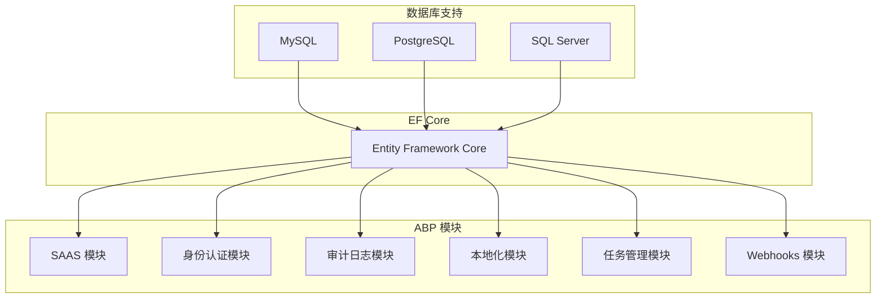
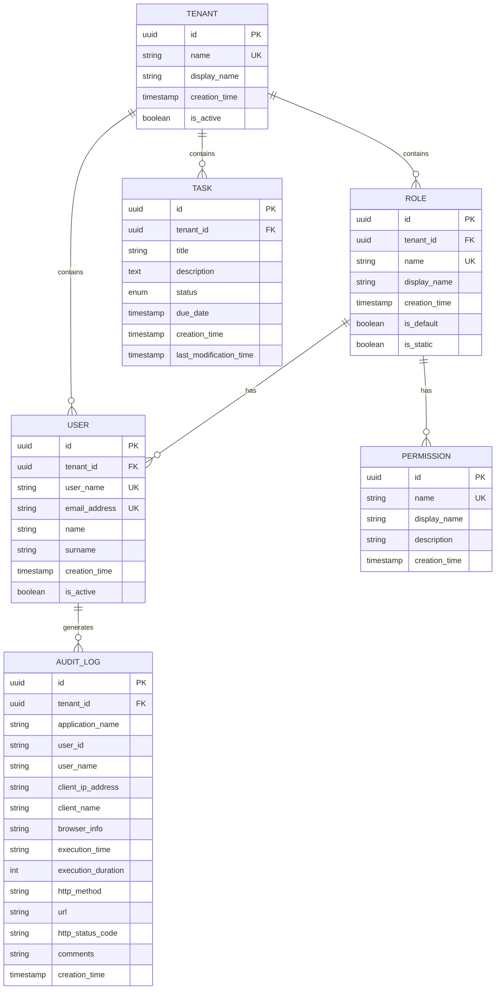

# 数据库设计

<cite>
**本文档引用的文件**   
- [SingleMigrationsEntityFrameworkCoreModule.cs](file://aspnet-core/migrations/LY.MicroService.Applications.Single.EntityFrameworkCore/SingleMigrationsEntityFrameworkCoreModule.cs)
- [SingleMigrationsDbContext.cs](file://aspnet-core/migrations/LY.MicroService.Applications.Single.EntityFrameworkCore/SingleMigrationsDbContext.cs)
- [SingleDbMigrationService.cs](file://aspnet-core/migrations/LY.MicroService.Applications.Single.EntityFrameworkCore/SingleDbMigrationService.cs)
- [SingleMigrationsEntityFrameworkCoreMySqlModule.cs](file://aspnet-core/migrations/LY.MicroService.Applications.Single.EntityFrameworkCore.MySql/SingleMigrationsEntityFrameworkCoreMySqlModule.cs)
- [SingleMigrationsEntityFrameworkCorePostgreSqlModule.cs](file://aspnet-core/migrations/LY.MicroService.Applications.Single.EntityFrameworkCore.PostgreSql/SingleMigrationsEntityFrameworkCorePostgreSqlModule.cs)
- [SingleMigrationsEntityFrameworkCoreSqlServerModule.cs](file://aspnet-core/migrations/LY.MicroService.Applications.Single.EntityFrameworkCore.SqlServer/SingleMigrationsEntityFrameworkCoreSqlServerModule.cs)
- [appsettings.json](file://aspnet-core/migrations/LY.MicroService.Applications.Single.DbMigrator/appsettings.json)
- [appsettings.MySql.json](file://aspnet-core/migrations/LY.MicroService.Applications.Single.DbMigrator/appsettings.MySql.json)
- [appsettings.PostgreSql.json](file://aspnet-core/migrations/LY.MicroService.Applications.Single.DbMigrator/appsettings.PostgreSql.json)
- [appsettings.SqlServer.json](file://aspnet-core/migrations/LY.MicroService.Applications.Single.DbMigrator/appsettings.SqlServer.json)
- [appsettings.SqlServer.json](file://aspnet-core/services/LY.MicroService.Applications.Single/appsettings.SqlServer.json)
- [template.json](file://aspnet-core/templates/micro/content/.template.config/template.json)
</cite>

## 目录
1. [引言](#引言)
2. [数据库架构概述](#数据库架构概述)
3. [实体关系模型](#实体关系模型)
4. [多数据库支持配置](#多数据库支持配置)
5. [数据库迁移机制](#数据库迁移机制)
6. [数据一致性与事务管理](#数据一致性与事务管理)
7. [性能优化策略](#性能优化策略)
8. [数据库维护与优化指南](#数据库维护与优化指南)
9. [结论](#结论)

## 引言
本文档全面介绍ABP Next Admin项目的数据库设计，涵盖实体关系模型、表结构设计、索引策略、数据库迁移机制、多数据库支持配置、数据一致性、事务管理和性能优化方案。文档旨在为数据库管理员提供详细的维护和优化指导，确保系统的稳定性和高效性。

## 数据库架构概述
ABP Next Admin项目采用模块化设计，支持多数据库系统，包括MySQL、PostgreSQL和SQL Server。项目通过Entity Framework Core（EF Core）实现数据库操作，利用ABP框架的模块化特性，将不同功能模块的数据库操作分离，确保系统的可扩展性和可维护性。



**图源**
- [SingleMigrationsEntityFrameworkCoreModule.cs](file://aspnet-core/migrations/LY.MicroService.Applications.Single.EntityFrameworkCore/SingleMigrationsEntityFrameworkCoreModule.cs)
- [SingleMigrationsDbContext.cs](file://aspnet-core/migrations/LY.MicroService.Applications.Single.EntityFrameworkCore/SingleMigrationsDbContext.cs)

## 实体关系模型
项目中的实体关系模型设计遵循ABP框架的最佳实践，确保数据的一致性和完整性。主要实体包括租户（Tenant）、用户（User）、角色（Role）、权限（Permission）、审计日志（AuditLog）、任务（Task）等。



**图源**
- [SingleMigrationsDbContext.cs](file://aspnet-core/migrations/LY.MicroService.Applications.Single.EntityFrameworkCore/SingleMigrationsDbContext.cs)
- [SingleMigrationsEntityFrameworkCoreModule.cs](file://aspnet-core/migrations/LY.MicroService.Applications.Single.EntityFrameworkCore/SingleMigrationsEntityFrameworkCoreModule.cs)

## 多数据库支持配置
项目通过配置文件和模块化设计支持多种数据库系统。每种数据库系统都有对应的配置文件和模块，确保在不同数据库环境下的兼容性和性能优化。

### MySQL 配置
MySQL 配置文件 `appsettings.MySql.json` 定义了连接字符串和其他相关配置。

```json
{
  "ConnectionStrings": {
    "Default": "Server=127.0.0.1;Database=Platform-V70;User Id=root;Password=123456;SslMode=None"
  }
}
```

### PostgreSQL 配置
PostgreSQL 配置文件 `appsettings.PostgreSql.json` 定义了连接字符串和其他相关配置。

```json
{
  "ConnectionStrings": {
    "Default": "Host=127.0.0.1;Database=Platform-V70;Username=postgres;Password=123456;SslMode=Prefer"
  }
}
```

### SQL Server 配置
SQL Server 配置文件 `appsettings.SqlServer.json` 定义了连接字符串和其他相关配置。

```json
{
  "ConnectionStrings": {
    "Default": "Server=127.0.0.1;Database=Platform-V70;User Id=sa;Password=P@ssw@rd!;Encrypt=false"
  }
}
```

**图源**
- [appsettings.MySql.json](file://aspnet-core/migrations/LY.MicroService.Applications.Single.DbMigrator/appsettings.MySql.json)
- [appsettings.PostgreSql.json](file://aspnet-core/migrations/LY.MicroService.Applications.Single.DbMigrator/appsettings.PostgreSql.json)
- [appsettings.SqlServer.json](file://aspnet-core/migrations/LY.MicroService.Applications.Single.DbMigrator/appsettings.SqlServer.json)

## 数据库迁移机制
项目使用EF Core的迁移功能来管理数据库结构的变化。迁移过程包括创建迁移文件、应用迁移和回滚迁移。

### 迁移文件创建
使用 `dotnet ef migrations add` 命令创建新的迁移文件。例如，创建一个名为 `InitialCreate` 的迁移文件：

```bash
dotnet ef migrations add InitialCreate
```

### 迁移应用
使用 `dotnet ef database update` 命令应用迁移。例如，应用所有未应用的迁移：

```bash
dotnet ef database update
```

### 迁移回滚
使用 `dotnet ef database update` 命令回滚到指定的迁移。例如，回滚到 `InitialCreate` 迁移：

```bash
dotnet ef database update InitialCreate
```

### 迁移服务
`SingleDbMigrationService` 类负责在应用程序启动时自动应用数据库迁移。该服务通过分布式锁确保在多实例环境中迁移的原子性。

```csharp
public class SingleDbMigrationService : EfCoreRuntimeDatabaseMigratorBase<SingleMigrationsDbContext>, ITransientDependency
{
    protected async override Task LockAndApplyDatabaseMigrationsAsync()
    {
        await base.LockAndApplyDatabaseMigrationsAsync();

        var tenants = await TenantRepository.GetListAsync();
        foreach (var tenant in tenants.Where(x => x.IsActive))
        {
            Logger.LogInformation($"Trying to acquire the distributed lock for database migration: {DatabaseName} with tenant: {tenant.Name}.");

            var schemaMigrated = false;

            await using (var handle = await DistributedLock.TryAcquireAsync("DatabaseMigration_" + DatabaseName + "_Tenant" + tenant.Id.ToString()))
            {
                if (handle is null)
                {
                    Logger.LogInformation($"Distributed lock could not be acquired for database migration: {DatabaseName} with tenant: {tenant.Name}. Operation cancelled.");
                    return;
                }

                Logger.LogInformation($"Distributed lock is acquired for database migration: {DatabaseName} with tenant: {tenant.Name}...");

                using (CurrentTenant.Change(tenant.Id))
                {
                    // Create database tables if needed
                    using var uow = UnitOfWorkManager.Begin(requiresNew: true, isTransactional: false);
                    var dbContext = await ServiceProvider
                        .GetRequiredService<IDbContextProvider<SingleMigrationsDbContext>>()
                        .GetDbContextAsync();

                    var pendingMigrations = await dbContext
                        .Database
                        .GetPendingMigrationsAsync();

                    if (pendingMigrations.Any())
                    {
                        await dbContext.Database.MigrateAsync();
                        schemaMigrated = true;
                    }

                    await uow.CompleteAsync();

                    await SeedAsync();

                    if (schemaMigrated || AlwaysSeedTenantDatabases)
                    {
                        await DistributedEventBus.PublishAsync(
                            new AppliedDatabaseMigrationsEto
                            {
                                DatabaseName = DatabaseName,
                                TenantId = tenant.Id
                            }
                        );
                    }
                }
            }

            Logger.LogInformation($"Distributed lock has been released for database migration: {DatabaseName} with tenant: {tenant.Name}...");
        }
    }

    protected async override Task SeedAsync()
    {
        await DataSeeder.SeedAsync(CurrentTenant.Id);
    }
}
```

**图源**
- [SingleDbMigrationService.cs](file://aspnet-core/migrations/LY.MicroService.Applications.Single.EntityFrameworkCore/SingleDbMigrationService.cs)
- [SingleMigrationsDbContext.cs](file://aspnet-core/migrations/LY.MicroService.Applications.Single.EntityFrameworkCore/SingleMigrationsDbContext.cs)

## 数据一致性与事务管理
项目通过EF Core的事务管理功能确保数据的一致性。事务管理包括显式事务和隐式事务。

### 显式事务
显式事务通过 `DbContext.Database.BeginTransaction()` 方法创建。例如：

```csharp
using (var transaction = context.Database.BeginTransaction())
{
    try
    {
        // Perform database operations
        context.Users.Add(new User { Name = "John Doe" });
        context.SaveChanges();

        context.Roles.Add(new Role { Name = "Admin" });
        context.SaveChanges();

        transaction.Commit();
    }
    catch (Exception)
    {
        transaction.Rollback();
        throw;
    }
}
```

### 隐式事务
隐式事务通过 `DbContext.SaveChanges()` 方法自动创建。例如：

```csharp
context.Users.Add(new User { Name = "John Doe" });
context.Roles.Add(new Role { Name = "Admin" });
context.SaveChanges();
```

**图源**
- [SingleMigrationsDbContext.cs](file://aspnet-core/migrations/LY.MicroService.Applications.Single.EntityFrameworkCore/SingleMigrationsDbContext.cs)
- [SingleDbMigrationService.cs](file://aspnet-core/migrations/LY.MicroService.Applications.Single.EntityFrameworkCore/SingleDbMigrationService.cs)

## 性能优化策略
项目通过多种策略优化数据库性能，包括索引优化、查询优化和缓存机制。

### 索引优化
为常用查询字段创建索引，提高查询性能。例如，为 `User` 表的 `UserName` 和 `EmailAddress` 字段创建唯一索引：

```csharp
modelBuilder.Entity<User>()
    .HasIndex(u => u.UserName)
    .IsUnique();

modelBuilder.Entity<User>()
    .HasIndex(u => u.EmailAddress)
    .IsUnique();
```

### 查询优化
使用EF Core的查询优化功能，减少不必要的数据库访问。例如，使用 `Include` 方法进行懒加载：

```csharp
var users = context.Users
    .Include(u => u.Roles)
    .ToList();
```

### 缓存机制
使用分布式缓存（如Redis）缓存常用数据，减少数据库访问。例如，使用 `IDistributedCache` 接口缓存用户信息：

```csharp
public class UserService
{
    private readonly IDistributedCache _cache;
    private readonly IUserRepository _userRepository;

    public UserService(IDistributedCache cache, IUserRepository userRepository)
    {
        _cache = cache;
        _userRepository = userRepository;
    }

    public async Task<User> GetUserAsync(Guid userId)
    {
        var cacheKey = $"user_{userId}";
        var user = await _cache.GetStringAsync(cacheKey);
        if (user == null)
        {
            user = await _userRepository.GetAsync(userId);
            await _cache.SetStringAsync(cacheKey, JsonSerializer.Serialize(user), new DistributedCacheEntryOptions
            {
                AbsoluteExpirationRelativeToNow = TimeSpan.FromMinutes(30)
            });
        }
        return JsonSerializer.Deserialize<User>(user);
    }
}
```

**图源**
- [SingleMigrationsDbContext.cs](file://aspnet-core/migrations/LY.MicroService.Applications.Single.EntityFrameworkCore/SingleMigrationsDbContext.cs)
- [SingleDbMigrationService.cs](file://aspnet-core/migrations/LY.MicroService.Applications.Single.EntityFrameworkCore/SingleDbMigrationService.cs)

## 数据库维护与优化指南
### 定期备份
定期备份数据库，确保数据安全。建议使用自动化脚本定期执行备份操作。

### 监控性能
使用数据库监控工具（如SQL Server Profiler、MySQL Performance Schema）监控数据库性能，及时发现和解决性能瓶颈。

### 优化查询
定期审查和优化查询语句，避免全表扫描和不必要的JOIN操作。使用查询计划分析工具（如SQL Server Management Studio的执行计划）优化查询性能。

### 索引维护
定期检查和维护索引，删除不再使用的索引，重建碎片化的索引。使用数据库提供的索引维护工具（如SQL Server的索引重建和重组）。

### 数据清理
定期清理过期和无用的数据，减少数据库存储空间和提高查询性能。例如，定期删除超过一定时间的审计日志记录。

**图源**
- [SingleMigrationsDbContext.cs](file://aspnet-core/migrations/LY.MicroService.Applications.Single.EntityFrameworkCore/SingleMigrationsDbContext.cs)
- [SingleDbMigrationService.cs](file://aspnet-core/migrations/LY.MicroService.Applications.Single.EntityFrameworkCore/SingleDbMigrationService.cs)

## 结论
ABP Next Admin项目的数据库设计充分考虑了模块化、多数据库支持、数据一致性和性能优化。通过EF Core的迁移功能和事务管理，确保了数据库结构的灵活性和数据的一致性。通过索引优化、查询优化和缓存机制，提高了数据库的性能。希望本文档能为数据库管理员提供有价值的参考，确保系统的稳定性和高效性。