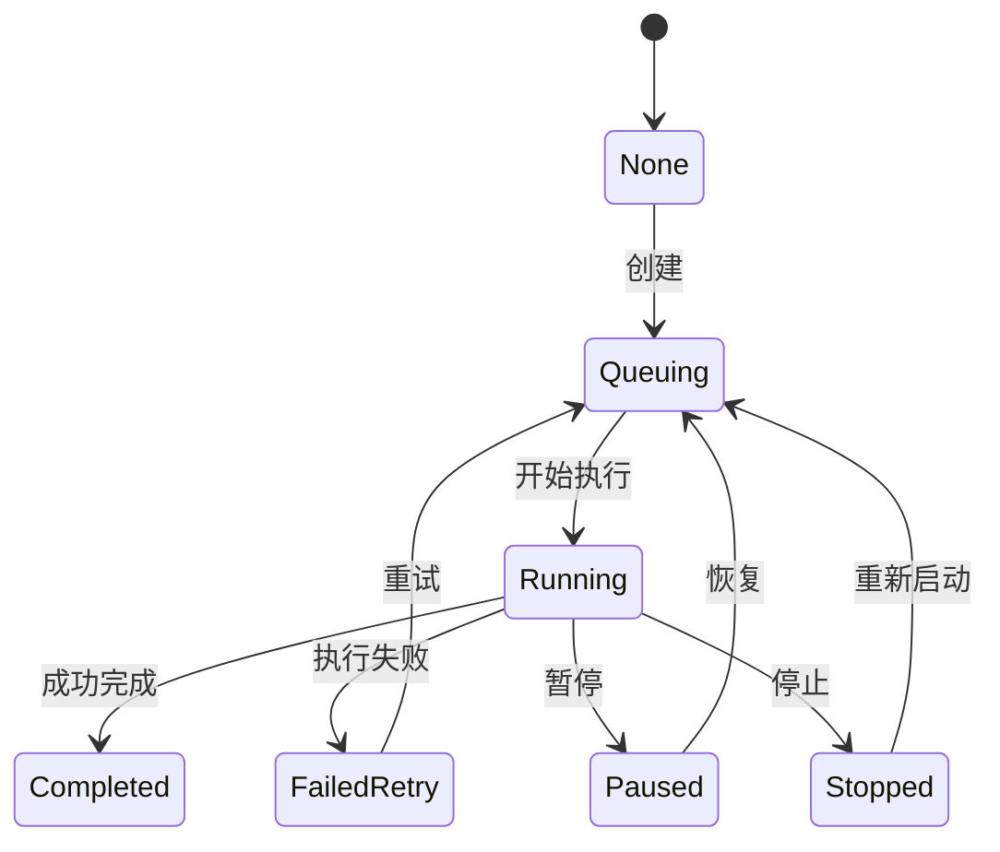
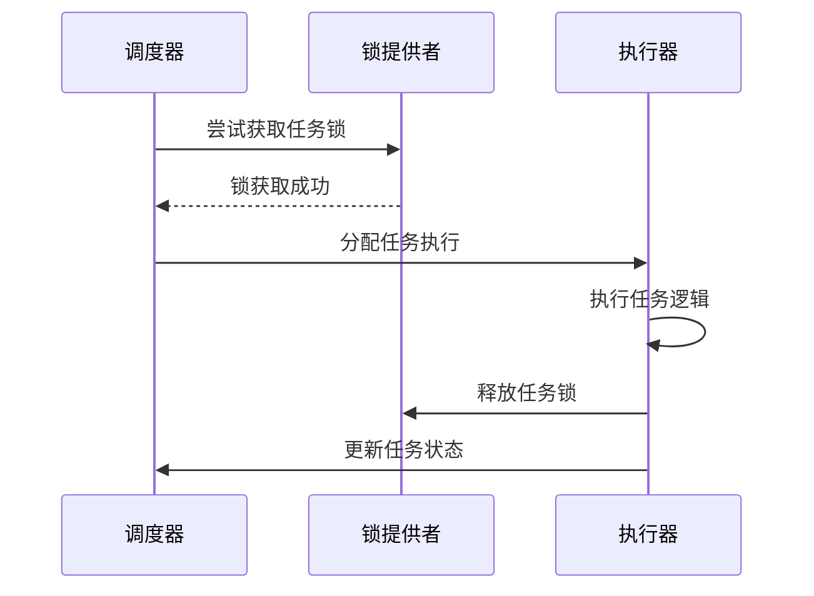
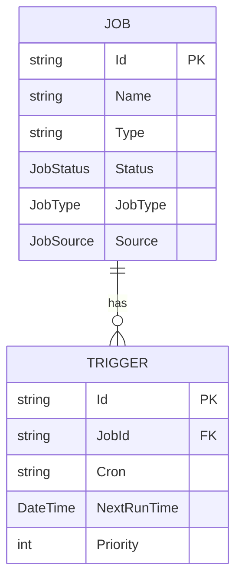

# 作业实体

<cite>
**本文档引用的文件**
- [JobInfo.cs](file://aspnet-core\modules\task-management\LINGYUN.Abp.BackgroundTasks.Abstractions\LINGYUN\Abp\BackgroundTasks\JobInfo.cs)
- [SingleDbMigrationEventHandler.cs](file://aspnet-core\migrations\LY.MicroService.Applications.Single.EntityFrameworkCore\SingleDbMigrationEventHandler.cs)
- [TaskManagementDbMigrationEventHandler.cs](file://aspnet-core\migrations\LY.MicroService.TaskManagement.EntityFrameworkCore\TaskManagementDbMigrationEventHandler.cs)
- [types.gen.ts](file://apps\react-admin\src\api\gen\types.gen.ts)
- [index.ts](file://apps\vue\src\api\task-management\jobs\model\index.ts)
- [job-infos.ts](file://apps\vben5\packages\@abp\tasks\src\types\job-infos.ts)
</cite>

## 目录
1. [引言](#引言)
2. [作业实体属性设计](#作业实体属性设计)
3. [任务状态机实现机制](#任务状态机实现机制)
4. [任务并发控制与分布式锁](#任务并发控制与分布式锁)
5. [作业与触发器关系管理](#作业与触发器关系管理)
6. [自定义作业类型开发指南](#自定义作业类型开发指南)
7. [结论](#结论)

## 引言
本文档详细说明了ABP框架中作业实体（Job）的设计与实现。作业实体是后台任务管理系统的核心组成部分，负责定义、调度和执行各种周期性或一次性任务。文档将深入解析作业实体的属性设计、状态机机制、并发控制策略以及与触发器的关系管理，为开发人员提供完整的自定义作业开发指导。

## 作业实体属性设计

作业实体通过`JobInfo`类进行定义，包含任务名称、类型、执行程序集、执行方法等核心字段。该类位于`LINGYUN.Abp.BackgroundTasks`命名空间下，是任务管理系统的基础数据结构。

### 核心字段说明

- **Id**: 任务标识，唯一标识一个作业实例
- **Name**: 任务名称，用于识别和显示任务
- **Group**: 任务分组，用于分类管理相关任务
- **Type**: 执行程序集和类的全限定名，指定任务的具体实现
- **Args**: 任务参数，以键值对形式存储执行所需参数
- **Cron**: Cron表达式，定义周期性任务的执行计划
- **Interval**: 间隔时间（秒），用于简单周期任务
- **Priority**: 任务优先级，影响调度顺序
- **JobType**: 任务类型，区分一次性、周期性等任务
- **Source**: 作业来源，标识用户创建或系统内置任务
- **TenantId**: 租户标识，支持多租户环境

### 执行控制字段

- **Status**: 当前任务状态
- **BeginTime/EndTime**: 任务执行的起止时间
- **LastRunTime/NextRunTime**: 上次和下次执行时间
- **TriggerCount**: 触发次数统计
- **TryCount/MaxTryCount**: 失败重试机制
- **MaxCount**: 最大执行次数限制
- **IsAbandoned**: 标记是否已放弃执行
- **LockTimeOut**: 分布式锁超时时间

**作业实体属性设计来源**
- [JobInfo.cs](file://aspnet-core\modules\task-management\LINGYUN.Abp.BackgroundTasks.Abstractions\LINGYUN\Abp\BackgroundTasks\JobInfo.cs#L1-L162)

## 任务状态机实现机制

作业实体实现了完整的状态机机制，通过`JobStatus`枚举定义了任务的生命周期状态。状态机确保任务在不同执行阶段的正确流转和管理。

### 状态定义



### 状态转换规则

- **None (-1)**: 初始状态，任务刚创建但未激活
- **Queuing (5)**: 等待执行状态，任务已加入调度队列
- **Running (10)**: 正在执行状态，任务正在运行中
- **FailedRetry (15)**: 失败待重试状态，执行失败但可重试
- **Paused (20)**: 暂停状态，任务被手动暂停
- **Stopped (30)**: 停止状态，任务被终止

状态转换由任务调度器和执行器共同管理，确保状态变更的原子性和一致性。例如，当任务执行成功时，状态从`Running`变为`Completed`；执行失败时根据重试策略决定是进入`FailedRetry`还是直接变为`Stopped`。

**任务状态机实现机制来源**
- [types.gen.ts](file://apps\react-admin\src\api\gen\types.gen.ts#L1750-L1758)
- [index.ts](file://apps\vue\src\api\task-management\jobs\model\index.ts#L0-L8)
- [job-infos.ts](file://apps\vben5\packages\@abp\tasks\src\types\job-infos.ts#L6-L14)

## 任务并发控制与分布式锁

系统通过分布式锁机制确保任务在集群环境下的安全执行，防止同一任务被多个节点同时执行。

### 并发控制策略

- **LockTimeOut**: 定义任务独占执行的超时时长（秒）
- **NodeName**: 指定运行节点，实现任务亲和性调度
- **IsEnabled**: 控制任务是否启用，实现全局开关

### 分布式锁实现

系统在`DefaultJobLockProvider`中实现了分布式锁机制，确保任务执行的互斥性。当任务开始执行时，会尝试获取分布式锁，获取成功后更新`Status`为`Running`并记录`BeginTime`。执行完成后释放锁并更新最终状态。

锁的超时时间由`LockTimeOut`属性控制，设置为0或负数表示不启用锁机制。这种设计既保证了高并发环境下的安全性，又提供了足够的灵活性。



**任务并发控制与分布式锁来源**
- [JobInfo.cs](file://aspnet-core\modules\task-management\LINGYUN.Abp.BackgroundTasks.Abstractions\LINGYUN\Abp\BackgroundTasks\JobInfo.cs#L1-L162)
- [DefaultJobLockProvider.cs](file://aspnet-core\modules\task-management\LINGYUN.Abp.BackgroundTasks\LINGYUN\Abp\BackgroundTasks\DefaultJobLockProvider.cs)

## 作业与触发器关系管理

作业与触发器之间存在一对多关系，一个作业可以有多个触发器，实现灵活的调度策略。

### 关系模型



### 级联删除机制

当删除作业时，系统会自动删除所有关联的触发器，确保数据一致性。这一机制通过数据库外键约束和业务逻辑双重保障实现。

### 状态同步机制

作业状态与触发器状态保持同步：
- 作业暂停时，所有触发器停止触发
- 作业启用时，触发器根据调度计划重新激活
- 作业删除时，触发器级联删除
- 作业参数更新时，触发器配置同步更新

这种设计确保了作业和触发器之间的状态一致性，避免了调度异常。

**作业与触发器关系管理来源**
- [JobInfo.cs](file://aspnet-core\modules\task-management\LINGYUN.Abp.BackgroundTasks.Abstractions\LINGYUN\Abp\BackgroundTasks\JobInfo.cs#L1-L162)
- [TaskManagementMigrationsDbContextModelSnapshot.cs](file://aspnet-core\migrations\LY.MicroService.TaskManagement.EntityFrameworkCore\Migrations\TaskManagementMigrationsDbContextModelSnapshot.cs#L126-L161)

## 自定义作业类型开发指南

开发人员可以轻松创建自定义作业类型，系统提供了完整的注册和执行机制。

### 自定义作业处理器注册

1. 创建继承自`JobRunnable`的作业类
2. 实现`ExecuteAsync`方法定义具体逻辑
3. 在模块中通过`JobDefinitionManager`注册作业定义

```csharp
public class CustomJob : JobRunnable
{
    public override async Task ExecuteAsync(JobExecutionContext context)
    {
        // 自定义任务逻辑
        await Task.Delay(1000);
    }
}
```

### 参数验证实现

通过`JobDefinition`配置参数验证规则：

```csharp
context.Add(
    new JobDefinition(
        "CustomJob",
        typeof(CustomJob),
        displayName: "自定义任务",
        description: "这是一个自定义后台任务")
    .AddParameter("param1", typeof(string), isRequired: true)
    .AddParameter("param2", typeof(int), isRequired: false, defaultValue: 100));
```

### 作业类型分类

系统支持三种主要作业类型：
- **Once (0)**: 一次性任务，执行一次后结束
- **Period (1)**: 周期性任务，按Cron表达式或间隔时间重复执行
- **Persistent (2)**: 持久化任务，长期运行的服务型任务

作业来源分类：
- **User (0)**: 用户创建的自定义任务
- **System (10)**: 系统内置的管理任务
- **None (-1)**: 未指定来源

**自定义作业类型开发指南来源**
- [JobInfo.cs](file://aspnet-core\modules\task-management\LINGYUN.Abp.BackgroundTasks.Abstractions\LINGYUN\Abp\BackgroundTasks\JobInfo.cs#L1-L162)
- [JobType.cs](file://apps\react-admin\src\api\gen\types.gen.ts#L1760-L1764)
- [JobSource.cs](file://apps\react-admin\src\api\gen\types.gen.ts#L1744-L1748)

## 结论
作业实体是ABP后台任务管理系统的核心，通过精心设计的属性结构、状态机机制、并发控制策略和关系管理，提供了强大而灵活的任务调度能力。开发人员可以基于此框架轻松实现各种复杂的后台任务需求，同时确保系统的稳定性和可维护性。通过遵循本文档的指导，可以有效利用作业实体的各项特性，构建高效可靠的后台任务处理系统。