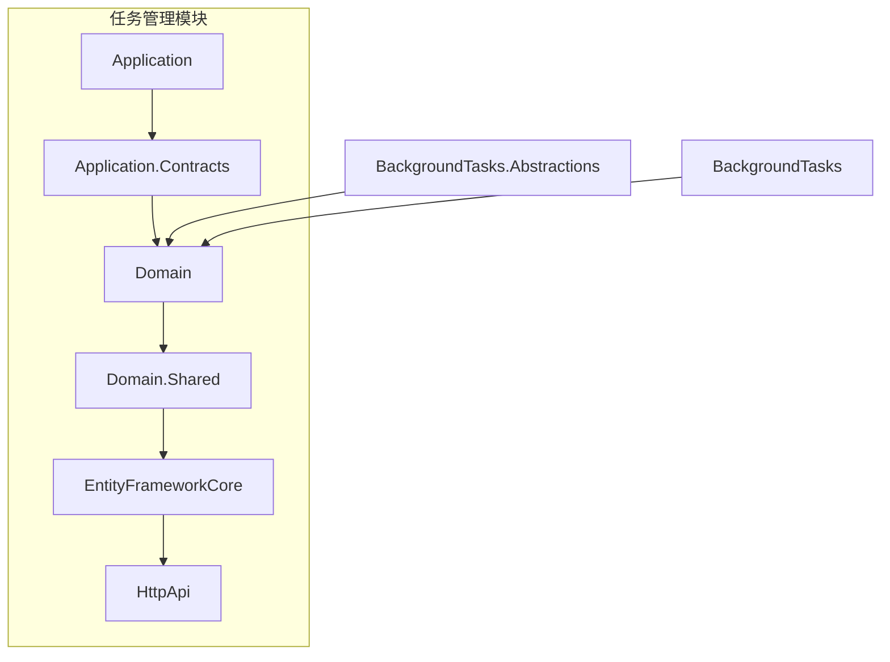
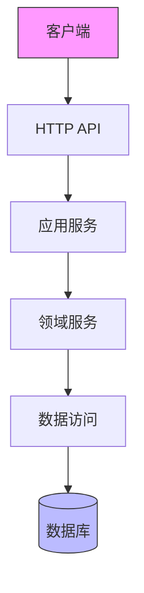
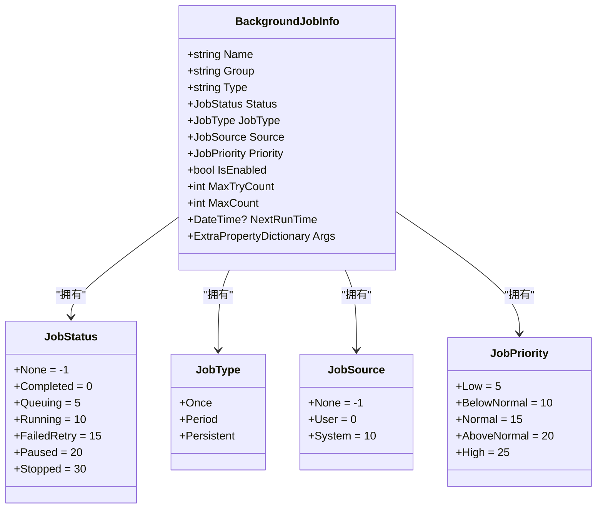
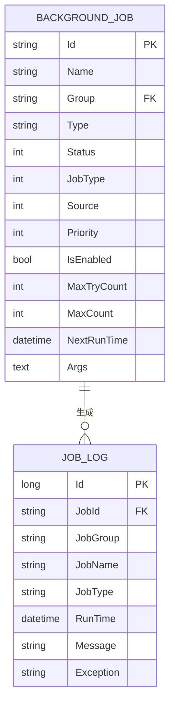
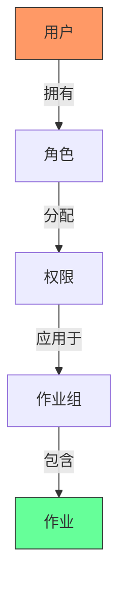
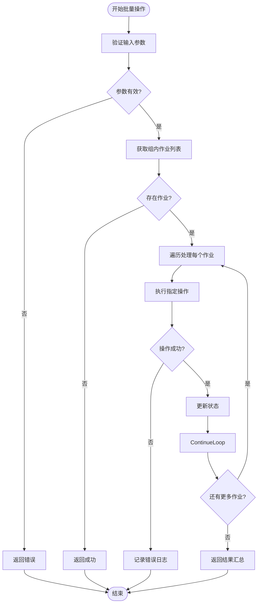
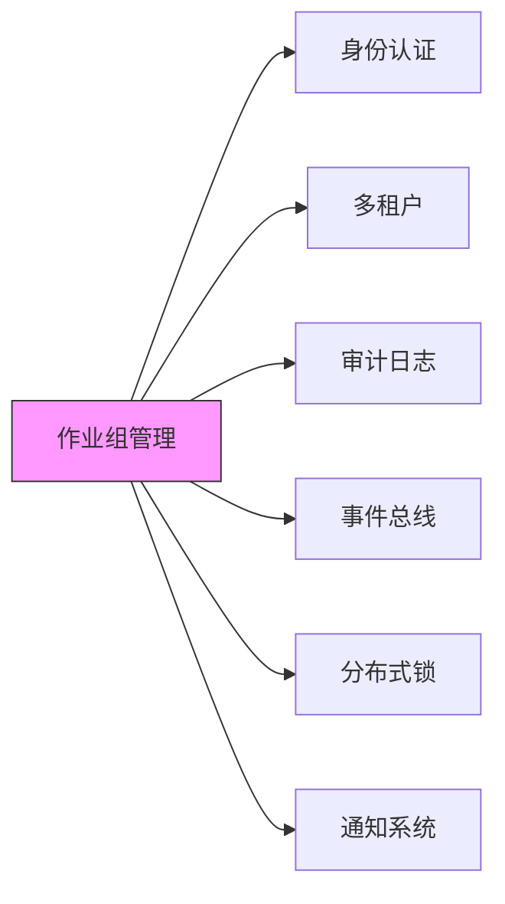

# 作业组

<cite>
**本文档引用的文件**
- [BackgroundJobInfoDto.cs](file://aspnet-core/modules/task-management/LINGYUN.Abp.TaskManagement.Application.Contracts/LINGYUN/Abp/TaskManagement/BackgroundJobInfoDto.cs)
- [TaskManagementMigrationsDbContextModelSnapshot.cs](file://aspnet-core/migrations/LY.MicroService.TaskManagement.EntityFrameworkCore/Migrations/TaskManagementMigrationsDbContextModelSnapshot.cs)
- [JobDefinition.cs](file://aspnet-core/modules/task-management/LINGYUN.Abp.BackgroundTasks.Abstractions/LINGYUN/Abp/BackgroundTasks/JobDefinition.cs)
- [JobSource.cs](file://aspnet-core/modules/task-management/LINGYUN.Abp.BackgroundTasks.Abstractions/LINGYUN/Abp/BackgroundTasks/JobSource.cs)
- [JobStatus.cs](file://aspnet-core/modules/task-management/LINGYUN.Abp.BackgroundTasks.Abstractions/LINGYUN/Abp/BackgroundTasks/JobStatus.cs)
- [JobType.cs](file://aspnet-core/modules/task-management/LINGYUN.Abp.BackgroundTasks.Abstractions/LINGYUN/Abp/BackgroundTasks/JobType.cs)
- [JobPriority.cs](file://aspnet-core/modules/task-management/LINGYUN.Abp.BackgroundTasks.Abstractions/LINGYUN/Abp/BackgroundTasks/JobPriority.cs)
- [README.md](file://aspnet-core/modules/task-management/LINGYUN.Abp.TaskManagement.Domain/README.md)
</cite>

## 目录
1. [引言](#引言)
2. [项目结构](#项目结构)
3. [核心组件](#核心组件)
4. [架构概述](#架构概述)
5. [详细组件分析](#详细组件分析)
6. [依赖关系分析](#依赖关系分析)
7. [性能考虑](#性能考虑)
8. [故障排除指南](#故障排除指南)
9. [结论](#结论)

## 引言
本文档全面介绍作业组管理的设计目的和使用场景。作业组是后台任务管理系统中的核心概念，用于对作业进行分类、权限控制、批量操作和资源隔离。通过作业组，系统管理员可以更有效地组织和管理大量的后台作业。

## 项目结构
作业组功能主要位于任务管理模块中，该模块提供了完整的后台作业生命周期管理能力。

**图示来源**
- [README.md](file://aspnet-core/modules/task-management/LINGYUN.Abp.TaskManagement.Domain/README.md)

**本节来源**
- [README.md](file://aspnet-core/modules/task-management/LINGYUN.Abp.TaskManagement.Domain/README.md)

## 核心组件
作业组管理的核心在于作业实体的设计和实现，其中包含分组、权限、配额等关键属性。

**本节来源**
- [BackgroundJobInfoDto.cs](file://aspnet-core/modules/task-management/LINGYUN.Abp.TaskManagement.Application.Contracts/LINGYUN/Abp/TaskManagement/BackgroundJobInfoDto.cs)
- [TaskManagementMigrationsDbContextModelSnapshot.cs](file://aspnet-core/migrations/LY.MicroService.TaskManagement.EntityFrameworkCore/Migrations/TaskManagementMigrationsDbContextModelSnapshot.cs)

## 架构概述
作业组管理系统采用分层架构设计，从数据存储到应用服务再到API接口，形成了完整的管理体系。

**图示来源**
- [BackgroundJobInfoDto.cs](file://aspnet-core/modules/task-management/LINGYUN.Abp.TaskManagement.Application.Contracts/LINGYUN/Abp/TaskManagement/BackgroundJobInfoDto.cs)
- [TaskManagementMigrationsDbContextModelSnapshot.cs](file://aspnet-core/migrations/LY.MicroService.TaskManagement.EntityFrameworkCore/Migrations/TaskManagementMigrationsDbContextModelSnapshot.cs)

## 详细组件分析
### 作业组实体分析
作业组作为作业分类的基础，其设计支持灵活的层级结构和无限级分类。

#### 类图展示

**图示来源**
- [BackgroundJobInfoDto.cs](file://aspnet-core/modules/task-management/LINGYUN.Abp.TaskManagement.Application.Contracts/LINGYUN/Abp/TaskManagement/BackgroundJobInfoDto.cs)
- [JobStatus.cs](file://aspnet-core/modules/task-management/LINGYUN.Abp.BackgroundTasks.Abstractions/LINGYUN/Abp/BackgroundTasks/JobStatus.cs)
- [JobType.cs](file://aspnet-core/modules/task-management/LINGYUN.Abp.BackgroundTasks.Abstractions/LINGYUN/Abp/BackgroundTasks/JobType.cs)
- [JobSource.cs](file://aspnet-core/modules/task-management/LINGYUN.Abp.BackgroundTasks.Abstractions/LINGYUN/Abp/BackgroundTasks/JobSource.cs)
- [JobPriority.cs](file://aspnet-core/modules/task-management/LINGYUN.Abp.BackgroundTasks.Abstractions/LINGYUN/Abp/BackgroundTasks/JobPriority.cs)

#### 作业组与作业关系

**图示来源**
- [TaskManagementMigrationsDbContextModelSnapshot.cs](file://aspnet-core/migrations/LY.MicroService.TaskManagement.EntityFrameworkCore/Migrations/TaskManagementMigrationsDbContextModelSnapshot.cs)

**本节来源**
- [BackgroundJobInfoDto.cs](file://aspnet-core/modules/task-management/LINGYUN.Abp.TaskManagement.Application.Contracts/LINGYUN/Abp/TaskManagement/BackgroundJobInfoDto.cs)
- [TaskManagementMigrationsDbContextModelSnapshot.cs](file://aspnet-core/migrations/LY.MicroService.TaskManagement.EntityFrameworkCore/Migrations/TaskManagementMigrationsDbContextModelSnapshot.cs)

### 权限控制机制
作业组实现了细粒度的权限控制，支持基于角色的访问控制(RBAC)模型。

**本节来源**
- [README.md](file://aspnet-core/modules/task-management/LINGYUN.Abp.TaskManagement.Domain/README.md)

### 批量操作流程
作业组支持对组内所有作业执行批量操作，如启动、停止、删除等。

**本节来源**
- [README.md](file://aspnet-core/modules/task-management/LINGYUN.Abp.TaskManagement.Domain/README.md)

## 依赖关系分析
作业组管理功能依赖于多个基础模块和服务。

**图示来源**
- [README.md](file://aspnet-core/modules/task-management/LINGYUN.Abp.TaskManagement.Domain/README.md)

**本节来源**
- [README.md](file://aspnet-core/modules/task-management/LINGYUN.Abp.TaskManagement.Domain/README.md)

## 性能考虑
作业组管理在设计时充分考虑了性能因素，特别是在大规模作业场景下的表现。

- **索引优化**: 在`Name`和`Group`字段上创建了复合索引，确保查询效率
- **批量操作**: 支持事务性批量操作，减少数据库往返次数
- **缓存策略**: 对频繁访问的作业定义信息进行缓存
- **异步处理**: 所有耗时操作均采用异步模式执行

作业组名称的最大长度为100个字符，这在保证灵活性的同时也控制了存储开销。对于超大规模的作业管理系统，建议合理规划作业组结构，避免单个组内包含过多作业。

## 故障排除指南
### 常见问题及解决方案
- **问题**: 无法创建新的作业组
  - **原因**: 可能是权限不足或组名已存在
  - **解决方案**: 检查当前用户权限，确认组名唯一性

- **问题**: 批量操作部分失败
  - **原因**: 组内某些作业处于不可操作状态
  - **解决方案**: 查看具体失败的作业及其状态，针对性处理

- **问题**: 作业组查询性能低下
  - **原因**: 组内作业数量过多或缺少适当索引
  - **解决方案**: 考虑拆分大型作业组，确保数据库索引完整

**本节来源**
- [BackgroundJobInfoDto.cs](file://aspnet-core/modules/task-management/LINGYUN.Abp.TaskManagement.Application.Contracts/LINGYUN/Abp/TaskManagement/BackgroundJobInfoDto.cs)
- [README.md](file://aspnet-core/modules/task-management/LINGYUN.Abp.TaskManagement.Domain/README.md)

## 结论
作业组管理为后台任务系统提供了强大的组织和管理能力。通过合理的分组设计，不仅可以实现有效的权限控制和资源隔离，还能大大提高批量操作的效率。系统支持无限级分类结构，满足复杂业务场景的需求。配额管理和监控功能则确保了系统的稳定运行。对于系统管理员而言，掌握作业组的最佳实践将有助于构建更加高效和可靠的后台任务管理体系。