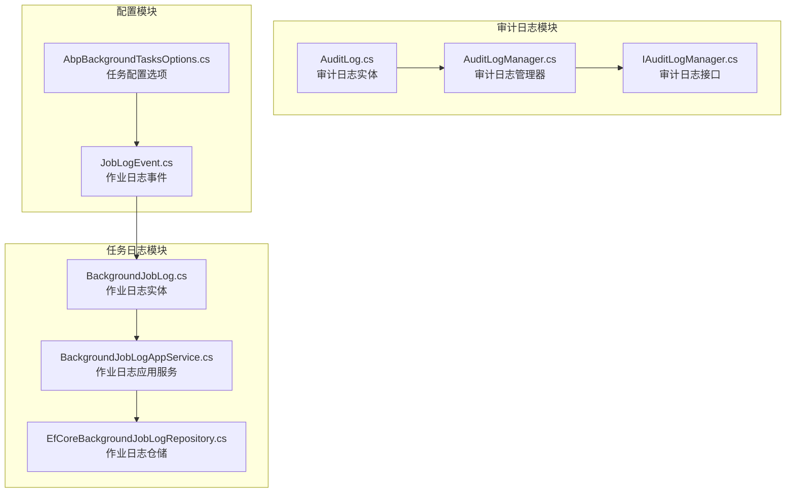
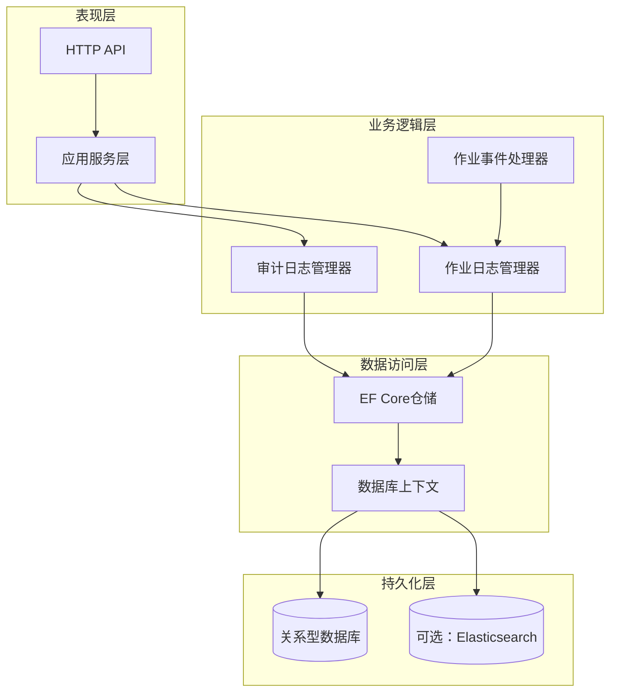
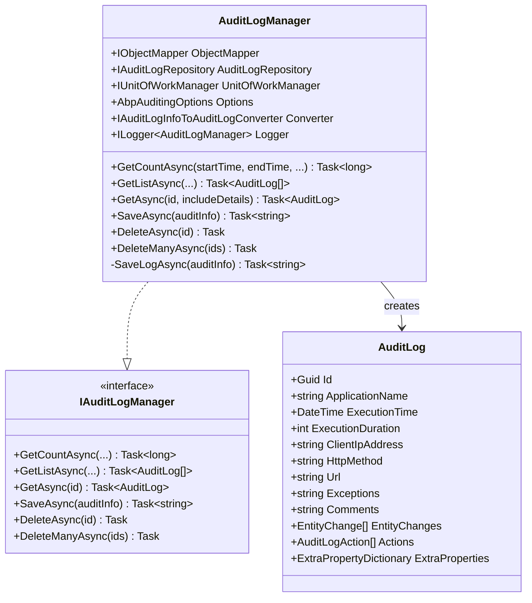
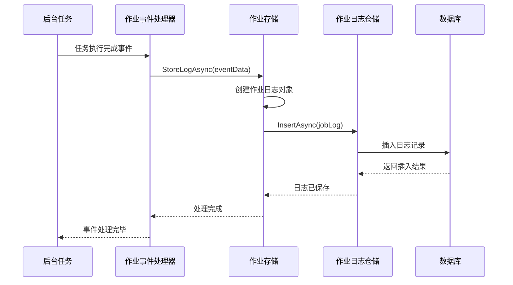
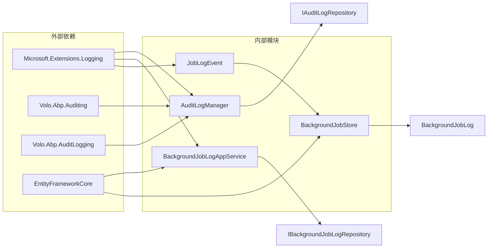

# 执行日志

<cite>
**本文档中引用的文件**
- [AuditLog.cs](file://aspnet-core/framework/auditing/LINGYUN.Abp.AuditLogging/LINGYUN/Abp/AuditLogging/AuditLog.cs)
- [AuditLogManager.cs](file://aspnet-core/framework/auditing/LINGYUN.Abp.AuditLogging.EntityFrameworkCore/LINGYUN/Abp/AuditLogging/EntityFrameworkCore/AuditLogManager.cs)
- [BackgroundJobLog.cs](file://aspnet-core/modules/task-management/LINGYUN.Abp.TaskManagement.Domain/LINGYUN/Abp/TaskManagement/BackgroundJobLog.cs)
- [BackgroundJobLogAppService.cs](file://aspnet-core/modules/task-management/LINGYUN.Abp.TaskManagement.Application/LINGYUN/Abp/TaskManagement/BackgroundJobLogAppService.cs)
- [EfCoreBackgroundJobLogRepository.cs](file://aspnet-core/modules/task-management/LINGYUN.Abp.TaskManagement.EntityFrameworkCore/LINGYUN/Abp/TaskManagement/EntityFrameworkCore/EfCoreBackgroundJobLogRepository.cs)
- [AbpBackgroundTasksOptions.cs](file://aspnet-core/modules/task-management/LINGYUN.Abp.BackgroundTasks/LINGYUN/Abp/BackgroundTasks/AbpBackgroundTasksOptions.cs)
- [JobLogEvent.cs](file://aspnet-core/modules/task-management/LINGYUN.Abp.BackgroundTasks/LINGYUN/Abp/BackgroundTasks/Internal/JobLogEvent.cs)
- [BackgroundJobStore.cs](file://aspnet-core/modules/task-management/LINGYUN.Abp.TaskManagement.Domain/LINGYUN/Abp/TaskManagement/BackgroundJobStore.cs)
</cite>

## 目录
1. [简介](#简介)
2. [项目结构](#项目结构)
3. [核心组件](#核心组件)
4. [架构概览](#架构概览)
5. [详细组件分析](#详细组件分析)
6. [依赖关系分析](#依赖关系分析)
7. [性能考虑](#性能考虑)
8. [故障排除指南](#故障排除指南)
9. [结论](#结论)

## 简介

执行日志系统是ABP Next Admin框架中的重要组成部分，负责记录和管理各种类型的作业执行过程。该系统提供了完整的审计日志功能和专门的任务执行日志记录，支持批量写入、多维度查询、分页处理以及自动归档等功能。

系统主要包含两个核心日志类型：
- **审计日志（AuditLog）**：记录应用程序级别的操作审计信息
- **作业日志（BackgroundJobLog）**：专门记录后台任务的执行详情

这些日志系统为监控系统集成、问题诊断和合规性要求提供了强大的数据支持。

## 项目结构

执行日志系统的文件组织结构如下：



**图表来源**
- [AuditLog.cs](file://aspnet-core/framework/auditing/LINGYUN.Abp.AuditLogging/LINGYUN/Abp/AuditLogging/AuditLog.cs#L1-L121)
- [BackgroundJobLog.cs](file://aspnet-core/modules/task-management/LINGYUN.Abp.TaskManagement.Domain/LINGYUN/Abp/TaskManagement/BackgroundJobLog.cs#L1-L49)

## 核心组件

### 审计日志实体（AuditLog）

审计日志实体是整个审计系统的核心数据结构，包含了详细的执行信息：

```csharp
public class AuditLog : IHasExtraProperties
{
    public Guid Id { get; set; }
    public string? ApplicationName { get; set; }
    public Guid? UserId { get; set; }
    public string? UserName { get; set; }
    public Guid? TenantId { get; set; }
    public DateTime ExecutionTime { get; set; }
    public int ExecutionDuration { get; set; }
    public string? ClientIpAddress { get; set; }
    public string? ClientName { get; set; }
    public string? ClientId { get; set; }
    public string? CorrelationId { get; set; }
    public string? BrowserInfo { get; set; }
    public string? HttpMethod { get; set; }
    public string? Url { get; set; }
    public string? Exceptions { get; set; }
    public string? Comments { get; set; }
    public int? HttpStatusCode { get; set; }
    // 集合属性
    public List<EntityChange> EntityChanges { get; set; }
    public List<AuditLogAction> Actions { get; set; }
    public ExtraPropertyDictionary ExtraProperties { get; set; }
}
```

### 作业日志实体（BackgroundJobLog）

作业日志实体专门用于记录后台任务的执行情况：

```csharp
public class BackgroundJobLog : Entity<long>, IMultiTenant
{
    public virtual Guid? TenantId { get; protected set; }
    public virtual string JobId { get; set; }
    public virtual string JobName { get; protected set; }
    public virtual string JobGroup { get; protected set; }
    public virtual string JobType { get; protected set; }
    public virtual string Message { get; protected set; }
    public virtual DateTime RunTime { get; protected set; }
    public virtual string Exception { get; protected set; }
    
    public BackgroundJobLog SetMessage(string message, Exception ex)
    {
        Message = message.Length > BackgroundJobLogConsts.MaxMessageLength 
            ? message.Substring(0, BackgroundJobLogConsts.MaxMessageLength - 1) 
            : message;
        
        if (ex != null)
        {
            var errMsg = ex.ToString();
            Exception = errMsg.Length > BackgroundJobLogConsts.MaxExceptionLength
                ? errMsg.Substring(0, BackgroundJobLogConsts.MaxExceptionLength - 1)
                : errMsg;
        }
        return this;
    }
}
```

**章节来源**
- [AuditLog.cs](file://aspnet-core/framework/auditing/LINGYUN.Abp.AuditLogging/LINGYUN/Abp/AuditLogging/AuditLog.cs#L1-L121)
- [BackgroundJobLog.cs](file://aspnet-core/modules/task-management/LINGYUN.Abp.TaskManagement.Domain/LINGYUN/Abp/TaskManagement/BackgroundJobLog.cs#L1-L49)

## 架构概览

执行日志系统采用分层架构设计，确保了良好的可扩展性和维护性：



**图表来源**
- [AuditLogManager.cs](file://aspnet-core/framework/auditing/LINGYUN.Abp.AuditLogging.EntityFrameworkCore/LINGYUN/Abp/AuditLogging/EntityFrameworkCore/AuditLogManager.cs#L1-L190)
- [BackgroundJobLogAppService.cs](file://aspnet-core/modules/task-management/LINGYUN.Abp.TaskManagement.Application/LINGYUN/Abp/TaskManagement/BackgroundJobLogAppService.cs#L1-L72)

## 详细组件分析

### 审计日志管理系统

审计日志管理系统提供了完整的CRUD操作和高级查询功能：



**图表来源**
- [AuditLogManager.cs](file://aspnet-core/framework/auditing/LINGYUN.Abp.AuditLogging.EntityFrameworkCore/LINGYUN/Abp/AuditLogging/EntityFrameworkCore/AuditLogManager.cs#L15-L190)
- [AuditLog.cs](file://aspnet-core/framework/auditing/LINGYUN.Abp.AuditLogging/LINGYUN/Abp/AuditLogging/AuditLog.cs#L1-L121)

#### 批量写入策略

审计日志系统采用了事务性批量写入策略，确保数据一致性和性能：

```csharp
public async virtual Task<string> SaveAsync(
    AuditLogInfo auditInfo,
    CancellationToken cancellationToken = default)
{
    if (!Options.HideErrors)
    {
        return await SaveLogAsync(auditInfo, cancellationToken);
    }

    try
    {
        return await SaveLogAsync(auditInfo, cancellationToken);
    }
    catch (Exception ex)
    {
        Logger.LogWarning("Could not save the audit log object: " + Environment.NewLine + auditInfo.ToString());
        Logger.LogException(ex, LogLevel.Error);
    }
    return "";
}

protected async virtual Task<string> SaveLogAsync(
    AuditLogInfo auditInfo,
    CancellationToken cancellationToken = default)
{
    using (var uow = UnitOfWorkManager.Begin(true))
    {
        var auditLog = await AuditLogRepository.InsertAsync(
            await Converter.ConvertAsync(auditInfo),
            false,
            cancellationToken);
        await uow.CompleteAsync();

        return auditLog.Id.ToString();
    }
}
```

### 作业日志管理系统

作业日志管理系统提供了专门针对后台任务的日志记录和查询功能：



**图表来源**
- [JobLogEvent.cs](file://aspnet-core/modules/task-management/LINGYUN.Abp.BackgroundTasks/LINGYUN/Abp/BackgroundTasks/Internal/JobLogEvent.cs#L1-L31)
- [BackgroundJobStore.cs](file://aspnet-core/modules/task-management/LINGYUN.Abp.TaskManagement.Domain/LINGYUN/Abp/TaskManagement/BackgroundJobStore.cs#L140-L160)

#### 查询接口和分页实现

作业日志系统提供了灵活的查询接口和高效的分页实现：

```csharp
public async virtual Task<PagedResultDto<BackgroundJobLogDto>> GetListAsync(BackgroundJobLogGetListInput input)
{
    var specification = new BackgroundJobLogGetListSpecification(input);
    
    var totalCount = await BackgroundJobLogRepository.GetCountAsync(specification);
    var backgroundJobLogs = await BackgroundJobLogRepository.GetListAsync(
        specification, input.Sorting, input.MaxResultCount, input.SkipCount);

    return new PagedResultDto<BackgroundJobLogDto>(totalCount,
        ObjectMapper.Map<List<BackgroundJobLog>, List<BackgroundJobLogDto>>(backgroundJobLogs));
}

private class BackgroundJobLogGetListSpecification : Volo.Abp.Specifications.Specification<BackgroundJobLog>
{
    protected BackgroundJobLogGetListInput Input { get; }
    
    public override Expression<Func<BackgroundJobLog, bool>> ToExpression()
    {
        Expression<Func<BackgroundJobLog, bool>> expression = _ => true;

        return expression
            .AndIf(!Input.JobId.IsNullOrWhiteSpace(), x => x.JobId.Equals(Input.JobId))
            .AndIf(!Input.Type.IsNullOrWhiteSpace(), x => x.JobType.Contains(Input.Type))
            .AndIf(!Input.Group.IsNullOrWhiteSpace(), x => x.JobGroup.Equals(Input.Group))
            .AndIf(!Input.Name.IsNullOrWhiteSpace(), x => x.JobName.Equals(Input.Name))
            .AndIf(!Input.Filter.IsNullOrWhiteSpace(), x => x.JobName.Contains(Input.Filter) ||
                x.JobGroup.Contains(Input.Filter) || x.JobType.Contains(Input.Filter) || x.Message.Contains(Input.Filter))
            .AndIf(Input.HasExceptions.HasValue, x => !string.IsNullOrWhiteSpace(x.Exception))
            .AndIf(Input.BeginRunTime.HasValue, x => x.RunTime >= Input.BeginRunTime)
            .AndIf(Input.EndRunTime.HasValue, x => x.RunTime <= Input.EndRunTime);
    }
}
```

**章节来源**
- [BackgroundJobLogAppService.cs](file://aspnet-core/modules/task-management/LINGYUN.Abp.TaskManagement.Application/LINGYUN/Abp/TaskManagement/BackgroundJobLogAppService.cs#L25-L71)

### 日志归档和清理策略

系统提供了完善的日志归档和清理策略配置：

```csharp
public class AbpBackgroundTasksOptions
{
    public bool JobCleanEnabled { get; set; } = false;
    public int MaxJobCleanCount { get; set; } = 1000;
    public TimeSpan JobExpiratime { get; set; } = TimeSpan.FromDays(15d);
    public string JobCleanCronExpression { get; set; } = "0 0/10 * * * ? *";
    
    public void Configure(Action<AbpBackgroundTasksOptions> configureAction)
    {
        configureAction(this);
    }
}
```

清理策略支持：
- 基于时间的自动清理
- 存储空间管理
- 可配置的清理频率
- 批量清理操作

**章节来源**
- [AbpBackgroundTasksOptions.cs](file://aspnet-core/modules/task-management/LINGYUN.Abp.BackgroundTasks/LINGYUN/Abp/BackgroundTasks/AbpBackgroundTasksOptions.cs#L125-L148)

## 依赖关系分析

执行日志系统的依赖关系图展示了各组件之间的交互：



**图表来源**
- [AuditLogManager.cs](file://aspnet-core/framework/auditing/LINGYUN.Abp.AuditLogging.EntityFrameworkCore/LINGYUN/Abp/AuditLogging/EntityFrameworkCore/AuditLogManager.cs#L1-L20)
- [BackgroundJobLogAppService.cs](file://aspnet-core/modules/task-management/LINGYUN.Abp.TaskManagement.Application/LINGYUN/Abp/TaskManagement/BackgroundJobLogAppService.cs#L1-L15)

**章节来源**
- [AuditLogManager.cs](file://aspnet-core/framework/auditing/LINGYUN.Abp.AuditLogging.EntityFrameworkCore/LINGYUN/Abp/AuditLogging/EntityFrameworkCore/AuditLogManager.cs#L1-L190)
- [BackgroundJobLogAppService.cs](file://aspnet-core/modules/task-management/LINGYUN.Abp.TaskManagement.Application/LINGYUN/Abp/TaskManagement/BackgroundJobLogAppService.cs#L1-L72)

## 性能考虑

### 批量写入优化

系统通过以下方式优化批量写入性能：

1. **事务批处理**：使用单元工作模式确保原子性
2. **异步操作**：所有I/O操作都是异步的
3. **连接池管理**：合理利用数据库连接池
4. **内存优化**：及时释放不需要的对象

### 查询性能优化

1. **索引策略**：在关键查询字段上建立适当索引
2. **分页查询**：避免一次性加载大量数据
3. **查询缓存**：对频繁查询的结果进行缓存
4. **延迟加载**：按需加载关联数据

### 存储空间管理

1. **日志轮转**：定期归档旧日志
2. **压缩存储**：对历史日志进行压缩
3. **分区策略**：按时间分区存储日志
4. **清理策略**：自动删除过期日志

## 故障排除指南

### 常见问题及解决方案

#### 1. 日志写入失败

**症状**：审计日志或作业日志无法正常写入数据库

**可能原因**：
- 数据库连接问题
- 事务超时
- 内存不足
- 权限不足

**解决方案**：
```csharp
// 检查数据库连接
try
{
    await AuditLogRepository.InsertAsync(auditLog);
}
catch (DbException ex)
{
    Logger.LogError($"Database connection failed: {ex.Message}");
    // 实现重试逻辑
}
```

#### 2. 查询性能问题

**症状**：日志查询响应缓慢

**可能原因**：
- 缺少适当的索引
- 查询条件过于宽泛
- 分页参数设置不当

**解决方案**：
```csharp
// 使用具体的时间范围
var logs = await GetListAsync(
    startTime: DateTime.Now.AddDays(-7),
    endTime: DateTime.Now,
    maxResultCount: 100,
    skipCount: 0
);
```

#### 3. 存储空间不足

**症状**：磁盘空间不足导致日志写入失败

**可能原因**：
- 日志清理策略未启用
- 清理频率设置过低
- 日志文件过大

**解决方案**：
```csharp
// 启用自动清理
options.JobCleanEnabled = true;
options.JobExpiratime = TimeSpan.FromDays(30);
options.JobCleanCronExpression = "0 0 1 * * ?"; // 每天凌晨1点清理
```

**章节来源**
- [AuditLogManager.cs](file://aspnet-core/framework/auditing/LINGYUN.Abp.AuditLogging.EntityFrameworkCore/LINGYUN/Abp/AuditLogging/EntityFrameworkCore/AuditLogManager.cs#L130-L170)

## 结论

执行日志系统为ABP Next Admin框架提供了全面的日志记录和管理能力。通过审计日志和作业日志的双重保障，系统能够满足企业级应用对日志记录的各种需求。

### 主要特性总结

1. **完整的数据结构设计**：包含执行时间、持续时间、执行结果、异常信息等关键字段
2. **高性能批量写入**：采用事务性批处理和异步操作
3. **灵活的查询接口**：支持多维度查询和分页处理
4. **自动化的归档清理**：基于时间和存储空间的智能管理
5. **监控系统集成**：为系统监控和问题诊断提供数据支持

### 最佳实践建议

1. **合理配置清理策略**：根据业务需求设置合适的保留期限
2. **监控系统性能**：定期检查日志系统的性能指标
3. **备份重要日志**：对关键业务日志进行定期备份
4. **权限控制**：严格控制日志访问权限
5. **定期维护**：定期清理过期日志和优化数据库

通过遵循这些最佳实践，可以确保执行日志系统长期稳定运行，并为企业提供可靠的审计和监控支持。