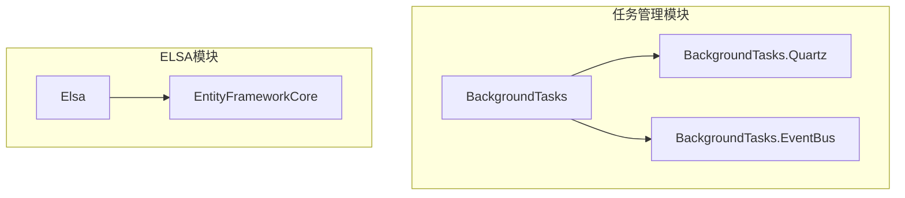
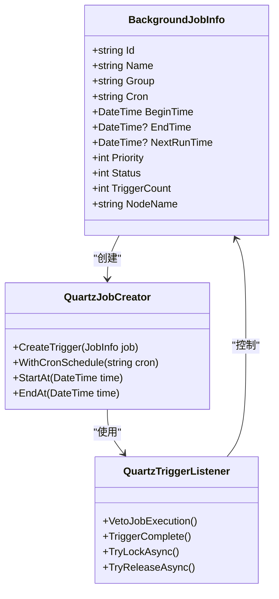
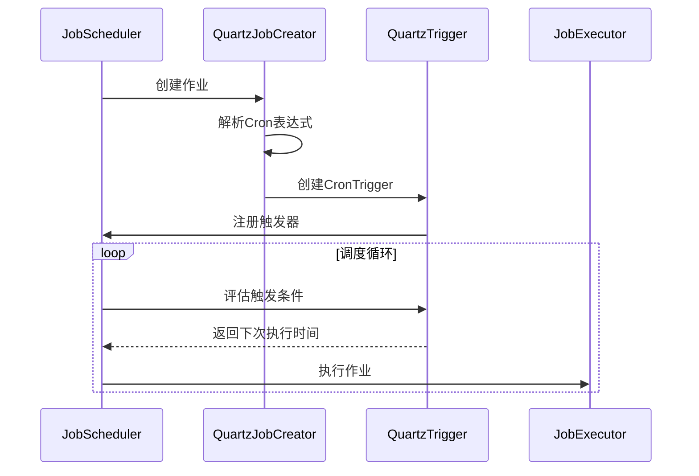
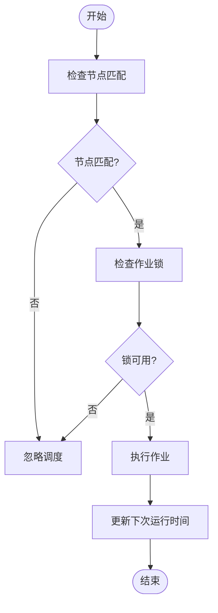

# 触发器实体

<cite>
**本文档引用的文件**
- [JobInfo.cs](file://aspnet-core\modules\task-management\LINGYUN.Abp.TaskManagement.Domain\LINGYUN\Abp\TaskManagement\BackgroundJobInfo.cs)
- [QuartzJobCreator.cs](file://aspnet-core\modules\task-management\LINGYUN.Abp.BackgroundTasks.Quartz\LINGYUN\Abp\BackgroundTasks\Quartz\QuartzJobCreator.cs)
- [JobEventTrigger.cs](file://aspnet-core\modules\task-management\LINGYUN.Abp.BackgroundTasks\LINGYUN\Abp\BackgroundTasks\JobEventTrigger.cs)
- [JobTriggerEventData.cs](file://aspnet-core\modules\task-management\LINGYUN.Abp.BackgroundTasks.EventBus\LINGYUN\Abp\BackgroundTasks\EventBus\JobTriggerEventData.cs)
- [QuartzTriggerListener.cs](file://aspnet-core\modules\task-management\LINGYUN.Abp.BackgroundTasks.Quartz\LINGYUN\Abp\BackgroundTasks\Quartz\QuartzTriggerListener.cs)
- [FixedEntityFrameworkTriggerStore.cs](file://aspnet-core\modules\elsa\LINGYUN.Abp.Elsa.EntityFrameworkCore\LINGYUN\Abp\Elsa\EntityFrameworkCore\Stores\FixedEntityFrameworkTriggerStore.cs)
</cite>

## 目录
1. [简介](#简介)
2. [项目结构](#项目结构)
3. [核心组件](#核心组件)
4. [架构概述](#架构概述)
5. [详细组件分析](#详细组件分析)
6. [依赖分析](#依赖分析)
7. [性能考虑](#性能考虑)
8. [故障排除指南](#故障排除指南)
9. [结论](#结论)

## 简介
本文档详细介绍了ABP框架中触发器实体的设计与实现，重点涵盖Cron表达式、简单触发器、日历间隔触发器等不同类型的触发器机制。文档还深入探讨了触发器与作业的绑定机制，包括触发条件评估、执行时间计算和错过触发策略。此外，文档化了分布式环境下触发器状态同步机制和时钟漂移处理方案，并提供了触发器依赖关系的实现细节，包括触发链和条件触发的实现方式，为开发人员提供自定义触发器类型的扩展指导。

## 项目结构
触发器相关功能主要分布在任务管理模块和ELSA工作流模块中，核心实现位于`task-management`和`elsa`子模块。数据库迁移文件显示了触发器相关实体的持久化结构，包括Cron表达式、开始时间、描述等关键字段。



**Diagram sources**
- [BackgroundJobInfo.cs](file://aspnet-core\modules\task-management\LINGYUN.Abp.TaskManagement.Domain\LINGYUN\Abp\TaskManagement\BackgroundJobInfo.cs)
- [FixedEntityFrameworkTriggerStore.cs](file://aspnet-core\modules\elsa\LINGYUN.Abp.Elsa.EntityFrameworkCore\LINGYUN\Abp\Elsa\EntityFrameworkCore\Stores\FixedEntityFrameworkTriggerStore.cs)

**Section sources**
- [BackgroundJobInfo.cs](file://aspnet-core\modules\task-management\LINGYUN.Abp.TaskManagement.Domain\LINGYUN\Abp\TaskManagement\BackgroundJobInfo.cs)
- [QuartzJobCreator.cs](file://aspnet-core\modules\task-management\LINGYUN.Abp.BackgroundTasks.Quartz\LINGYUN\Abp\BackgroundTasks\Quartz\QuartzJobCreator.cs)

## 核心组件
触发器实体的核心组件包括作业信息(BackgroundJobInfo)、Quartz作业创建器(QuartzJobCreator)、作业事件触发器(JobEventTrigger)和触发器监听器(QuartzTriggerListener)。这些组件共同实现了复杂的调度功能，支持Cron表达式、一次性触发和持久化触发等多种模式。

**Section sources**
- [JobInfo.cs](file://aspnet-core\modules\task-management\LINGYUN.Abp.TaskManagement.Domain\LINGYUN\Abp\TaskManagement\BackgroundJobInfo.cs)
- [QuartzJobCreator.cs](file://aspnet-core\modules\task-management\LINGYUN.Abp.BackgroundTasks.Quartz\LINGYUN\Abp\BackgroundTasks\Quartz\QuartzJobCreator.cs)

## 架构概述
系统采用Quartz.NET作为底层调度引擎，通过ABP框架的模块化设计实现了触发器的抽象和扩展。触发器与作业的绑定通过数据映射实现，支持分布式环境下的节点协调和锁机制。



**Diagram sources**
- [JobInfo.cs](file://aspnet-core\modules\task-management\LINGYUN.Abp.TaskManagement.Domain\LINGYUN\Abp\TaskManagement\BackgroundJobInfo.cs)
- [QuartzJobCreator.cs](file://aspnet-core\modules\task-management\LINGYUN.Abp.BackgroundTasks.Quartz\LINGYUN\Abp\BackgroundTasks\Quartz\QuartzJobCreator.cs)
- [QuartzTriggerListener.cs](file://aspnet-core\modules\task-management\LINGYUN.Abp.BackgroundTasks.Quartz\LINGYUN\Abp\BackgroundTasks\Quartz\QuartzTriggerListener.cs)

## 详细组件分析

### 触发器类型实现
系统支持多种触发器类型，包括基于Cron表达式的周期性触发器、简单触发器和日历间隔触发器。Cron表达式存储在作业信息的Cron字段中，长度限制为50个字符。

#### Cron表达式触发器


**Diagram sources**
- [QuartzJobCreator.cs](file://aspnet-core\modules\task-management\LINGYUN.Abp.BackgroundTasks.Quartz\LINGYUN\Abp\BackgroundTasks\Quartz\QuartzJobCreator.cs)
- [JobInfo.cs](file://aspnet-core\modules\task-management\LINGYUN.Abp.TaskManagement.Domain\LINGYUN\Abp\TaskManagement\BackgroundJobInfo.cs)

#### 简单触发器
简单触发器用于一次性或有限次数的执行，通过设置开始时间和结束时间来控制执行周期。

**Section sources**
- [QuartzJobCreator.cs](file://aspnet-core\modules\task-management\LINGYUN.Abp.BackgroundTasks.Quartz\LINGYUN\Abp\BackgroundTasks\Quartz\QuartzJobCreator.cs)

### 触发器与作业绑定机制
触发器与作业的绑定通过Quartz框架的JobDataMap实现，将作业信息的关键属性传递给调度器。

#### 触发条件评估流程


**Diagram sources**
- [QuartzTriggerListener.cs](file://aspnet-core\modules\task-management\LINGYUN.Abp.BackgroundTasks.Quartz\LINGYUN\Abp\BackgroundTasks\Quartz\QuartzTriggerListener.cs)

### 分布式环境处理
在分布式环境下，系统通过作业锁机制确保同一作业不会在多个节点上同时执行。

#### 分布式锁机制
```mermaid
classDiagram
    class IJobLockProvider {
        +TryLockAsync(key, timeout)
        +TryReleaseAsync(key)
    }
    
    class DefaultJobLockProvider {
        +Redis锁实现
        +锁键格式: p