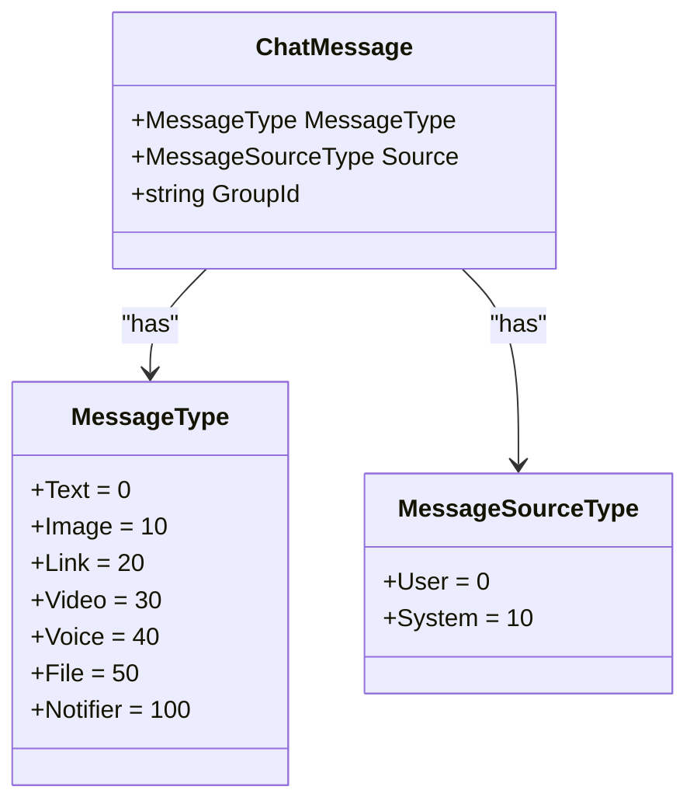
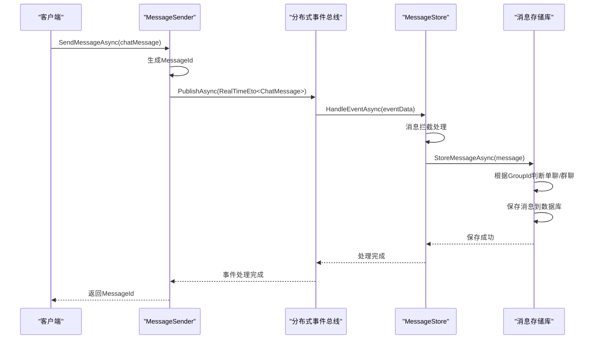
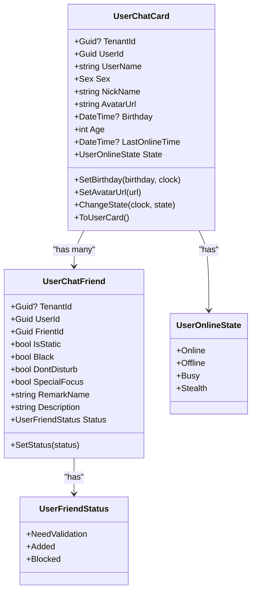
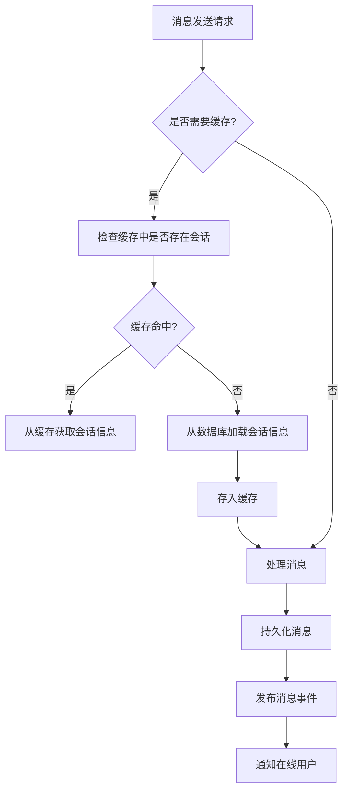

# 会话实体设计

<cite>
**本文档引用的文件**   
- [ChatMessage.cs](file://aspnet-core/modules/realtime-message/LINGYUN.Abp.IM/LINGYUN/Abp/IM/Messages/ChatMessage.cs)
- [UserChatCard.cs](file://aspnet-core/modules/realtime-message/LINGYUN.Abp.MessageService.Domain/LINGYUN/Abp/MessageService/Chat/UserChatCard.cs)
- [MessageStore.cs](file://aspnet-core/modules/realtime-message/LINGYUN.Abp.MessageService.Domain/LINGYUN/Abp/MessageService/Chat/MessageStore.cs)
- [UserChatFriend.cs](file://aspnet-core/modules/realtime-message/LINGYUN.Abp.MessageService.Domain/LINGYUN/Abp/MessageService/Chat/UserChatFriend.cs)
- [MessageType.cs](file://aspnet-core/modules/realtime-message/LINGYUN.Abp.IM/LINGYUN/Abp/IM/Messages/MessageType.cs)
- [MessageSourceType.cs](file://aspnet-core/modules/realtime-message/LINGYUN.Abp.IM/LINGYUN/Abp/IM/Messages/MessageSourceType.cs)
- [UserOnlineState.cs](file://aspnet-core/modules/realtime-message/LINGYUN.Abp.IM/LINGYUN/Abp/IM/UserOnlineState.cs)
- [UserFriendStatus.cs](file://aspnet-core/modules/realtime-message/LINGYUN.Abp.IM/LINGYUN/Abp/IM/Contract/UserFriendStatus.cs)
</cite>

## 目录
1. [简介](#简介)
2. [会话实体字段定义](#会话实体字段定义)
3. [会话类型设计](#会话类型设计)
4. [会话生命周期管理](#会话生命周期管理)
5. [会话与消息关联关系](#会话与消息关联关系)
6. [会话成员管理](#会话成员管理)
7. [会话元数据存储](#会话元数据存储)
8. [性能优化策略](#性能优化策略)
9. [会话功能扩展指导](#会话功能扩展指导)
10. [结论](#结论)

## 简介
本文档详细说明了实时消息模块中会话实体的设计与实现。系统通过`ChatMessage`实体表示消息会话，支持单聊、群聊等多种会话类型，并提供了完整的会话生命周期管理机制。会话实体与用户卡片、好友关系等元数据紧密关联，形成了完整的实时通信解决方案。

**文档来源**
- [ChatMessage.cs](file://aspnet-core/modules/realtime-message/LINGYUN.Abp.IM/LINGYUN/Abp/IM/Messages/ChatMessage.cs)
- [UserChatCard.cs](file://aspnet-core/modules/realtime-message/LINGYUN.Abp.MessageService.Domain/LINGYUN/Abp/MessageService/Chat/UserChatCard.cs)

## 会话实体字段定义
会话实体主要由`ChatMessage`类定义，包含以下核心字段：

| 字段名称 | 数据类型 | 约束条件 | 业务规则 |
|---------|--------|---------|---------|
| TenantId | Guid? | 可为空 | 租户标识，支持多租户架构 |
| GroupId | string | 可为空 | 群组标识，为空表示单聊会话 |
| MessageId | string | 必填 | 消息唯一标识，由系统自动生成 |
| FormUserId | Guid | 必填 | 发送者用户标识 |
| FormUserName | string | 必填 | 发送者用户名 |
| ToUserId | Guid? | 可为空 | 接收用户标识，群聊时可为空 |
| Content | string | 必填 | 消息内容，不进行审计记录 |
| SendTime | DateTime | 必填 | 消息发送时间，使用系统时钟 |
| IsAnonymous | bool | 必填 | 是否匿名发送，存储在扩展字段中 |
| MessageType | MessageType | 必填 | 消息类型，默认为文本消息 |
| Source | MessageSourceType | 必填 | 消息来源，默认为用户发送 |

**会话实体字段定义来源**
- [ChatMessage.cs](file://aspnet-core/modules/realtime-message/LINGYUN.Abp.IM/LINGYUN/Abp/IM/Messages/ChatMessage.cs#L15-L60)

## 会话类型设计
系统支持多种会话类型，通过`MessageType`和`MessageSourceType`枚举进行区分：



**会话类型设计来源**
- [MessageType.cs](file://aspnet-core/modules/realtime-message/LINGYUN.Abp.IM/LINGYUN/Abp/IM/Messages/MessageType.cs#L2-L35)
- [MessageSourceType.cs](file://aspnet-core/modules/realtime-message/LINGYUN.Abp.IM/LINGYUN/Abp/IM/Messages/MessageSourceType.cs#L2-L8)
- [ChatMessage.cs](file://aspnet-core/modules/realtime-message/LINGYUN.Abp.IM/LINGYUN/Abp/IM/Messages/ChatMessage.cs#L59-L61)

## 会话生命周期管理
会话的创建、更新和关闭通过`MessageStore`服务进行管理，完整的生命周期流程如下：



**会话生命周期管理来源**
- [MessageSender.cs](file://aspnet-core/modules/realtime-message/LINGYUN.Abp.IM/LINGYUN/Abp/IM/Messages/MessageSender.cs#L20-L33)
- [ChatMessageEventHandler.cs](file://aspnet-core/services/LY.MicroService.RealtimeMessage.HttpApi.Host/EventBus/Distributed/ChatMessageEventHandler.cs#L32-L60)
- [MessageStore.cs](file://aspnet-core/modules/realtime-message/LINGYUN.Abp.MessageService.Domain/LINGYUN/Abp/MessageService/Chat/MessageStore.cs#L39-L77)

## 会话与消息关联关系
会话实体与消息存储之间存在紧密的关联关系，通过`MessageStore`服务实现消息的持久化和查询：

```mermaid
erDiagram
CHAT_MESSAGE {
string MessageId PK
guid FormUserId FK
guid? ToUserId FK
string? GroupId FK
string Content
datetime SendTime
int MessageType
int Source
guid? TenantId
}
USER_CHAT_CARD {
long Id PK
guid UserId UK
string UserName
int Sex
string NickName
string AvatarUrl
datetime? Birthday
int Age
guid? TenantId
}
USER_CHAT_FRIEND {
long Id PK
guid UserId FK
guid FrientId FK
bool Black
bool DontDisturb
bool SpecialFocus
string RemarkName
byte Status
guid? TenantId
}
CHAT_MESSAGE ||--o{ USER_CHAT_CARD : "发送者"
CHAT_MESSAGE }o--|| USER_CHAT_CARD : "接收者"
CHAT_MESSAGE }o--|| USER_CHAT_GROUP : "群组"
USER_CHAT_CARD ||--o{ USER_CHAT_FRIEND : "好友关系"
```

**会话与消息关联关系来源**
- [ChatMessage.cs](file://aspnet-core/modules/realtime-message/LINGYUN.Abp.IM/LINGYUN/Abp/IM/Messages/ChatMessage.cs)
- [UserChatCard.cs](file://aspnet-core/modules/realtime-message/LINGYUN.Abp.MessageService.Domain/LINGYUN/Abp/MessageService/Chat/UserChatCard.cs)
- [UserChatFriend.cs](file://aspnet-core/modules/realtime-message/LINGYUN.Abp.MessageService.Domain/LINGYUN/Abp/MessageService/Chat/UserChatFriend.cs)

## 会话成员管理
会话成员管理通过`UserChatCard`和`UserChatFriend`实体实现，包含用户基本信息和好友关系管理：



**会话成员管理来源**
- [UserChatCard.cs](file://aspnet-core/modules/realtime-message/LINGYUN.Abp.MessageService.Domain/LINGYUN/Abp/MessageService/Chat/UserChatCard.cs#L15-L118)
- [UserChatFriend.cs](file://aspnet-core/modules/realtime-message/LINGYUN.Abp.MessageService.Domain/LINGYUN/Abp/MessageService/Chat/UserChatFriend.cs#L15-L83)
- [UserOnlineState.cs](file://aspnet-core/modules/realtime-message/LINGYUN.Abp.IM/LINGYUN/Abp/IM/UserOnlineState.cs#L2-L10)
- [UserFriendStatus.cs](file://aspnet-core/modules/realtime-message/LINGYUN.Abp.IM/LINGYUN/Abp/IM/Contract/UserFriendStatus.cs#L2-L15)

## 会话元数据存储
会话元数据存储设计包含用户卡片、好友关系和群组信息，确保会话上下文的完整性：

### 用户卡片表 (AppUserChatCards)
| 字段 | 类型 | 约束 | 说明 |
|------|------|------|------|
| Id | bigint | PK, AI | 主键 |
| TenantId | uniqueidentifier | NULL | 租户标识 |
| UserId | uniqueidentifier | NOT NULL | 用户标识 |
| UserName | nvarchar(256) | NOT NULL | 用户名 |
| Sex | int | NOT NULL | 性别 |
| NickName | nvarchar(256) | NULL | 昵称 |
| Sign | nvarchar(30) | NULL | 签名 |
| AvatarUrl | nvarchar(max) | NULL | 头像地址 |
| Birthday | datetime2 | NULL | 生日 |
| Age | int | NOT NULL | 年龄 |
| LastOnlineTime | datetime2 | NULL | 最后在线时间 |
| State | int | NOT NULL | 在线状态 |

### 好友关系表 (AppUserChatFriends)
| 字段 | 类型 | 约束 | 说明 |
|------|------|------|------|
| Id | bigint | PK, AI | 主键 |
| TenantId | uniqueidentifier | NULL | 租户标识 |
| UserId | uniqueidentifier | NOT NULL | 用户标识 |
| FrientId | uniqueidentifier | NOT NULL | 好友标识 |
| IsStatic | bit | NOT NULL | 是否系统预置 |
| Black | bit | NOT NULL | 是否黑名单 |
| DontDisturb | bit | NOT NULL | 是否免打扰 |
| SpecialFocus | bit | NOT NULL | 是否特别关注 |
| RemarkName | nvarchar(256) | NULL | 备注名称 |
| Description | nvarchar(50) | NULL | 附加说明 |
| Status | smallint | NOT NULL | 好友状态 |

**会话元数据存储来源**
- [UserChatCard.cs](file://aspnet-core/modules/realtime-message/LINGYUN.Abp.MessageService.Domain/LINGYUN/Abp/MessageService/Chat/UserChatCard.cs)
- [UserChatFriend.cs](file://aspnet-core/modules/realtime-message/LINGYUN.Abp.MessageService.Domain/LINGYUN/Abp/MessageService/Chat/UserChatFriend.cs)
- [20250409030245_Initial-Single-Project-MSSQL.cs](file://aspnet-core/migrations/LY.MicroService.Applications.Single.EntityFrameworkCore.SqlServer/Migrations/20250409030245_Initial-Single-Project-MSSQL.cs#L1064-L1085)

## 性能优化策略
系统采用多种性能优化策略来提升会话处理效率：

### 会话缓存机制


### 批量处理优化
- **消息批量存储**：通过`StoreMessageAsync`方法实现消息的批量存储
- **事务管理**：使用`IUnitOfWorkManager`确保数据一致性
- **异步处理**：所有消息处理操作均采用异步模式

### 分布式事件驱动
系统采用分布式事件总线实现消息的异步处理，解耦消息发送与持久化逻辑，提高系统吞吐量。

**性能优化策略来源**
- [MessageStore.cs](file://aspnet-core/modules/realtime-message/LINGYUN.Abp.MessageService.Domain/LINGYUN/Abp/MessageService/Chat/MessageStore.cs#L39-L77)
- [ChatMessageEventHandler.cs](file://aspnet-core/services/LY.MicroService.RealtimeMessage.HttpApi.Host/EventBus/Distributed/ChatMessageEventHandler.cs#L32-L60)
- [MessageSender.cs](file://aspnet-core/modules/realtime-message/LINGYUN.Abp.IM/LINGYUN/Abp/IM/Messages/MessageSender.cs#L20-L33)

## 会话功能扩展指导
为开发人员提供会话功能扩展的指导建议：

### 支持临时会话
```csharp
// 创建临时会话的工厂方法
public static ChatMessage Temporary(
    Guid formUserId,
    string formUserName,
    Guid toUserId,
    string content,
    IClock clock,
    Guid? tenantId = null)
{
    return new ChatMessage
    {
        FormUserId = formUserId,
        FormUserName = formUserName,
        ToUserId = toUserId,
        Content = content,
        SendTime = clock.Now,
        IsAnonymous = false,
        MessageType = MessageType.Text,
        TenantId = tenantId,
        Source = MessageSourceType.User,
    }.SetProperty("Temporary", true);
}
```

### 支持系统通知会话
```csharp
// 系统通知会话的工厂方法
public static ChatMessage SystemNotification(
    Guid formUserId,
    Guid toUserId,
    string content,
    IClock clock,
    Guid? tenantId = null)
{
    return new ChatMessage
    {
        FormUserId = formUserId,
        FormUserName = "system",
        ToUserId = toUserId,
        Content = content,
        SendTime = clock.Now,
        IsAnonymous = false,
        MessageType = MessageType.Notifier,
        TenantId = tenantId,
        Source = MessageSourceType.System,
    }.SetProperty("Priority", "High");
}
```

### 扩展建议
1. **敏感词过滤**：在`MessageBlocker.InterceptAsync`方法中扩展敏感词过滤逻辑
2. **消息加密**：在`ExtraProperties`中添加消息加密标识和密钥信息
3. **消息撤回**：添加消息撤回状态和时间戳到`ExtraProperties`
4. **消息已读**：通过`ExtraProperties`跟踪消息已读状态

**会话功能扩展指导来源**
- [ChatMessage.cs](file://aspnet-core/modules/realtime-message/LINGYUN.Abp.IM/LINGYUN/Abp/IM/Messages/ChatMessage.cs#L78-L234)
- [MessageStore.cs](file://aspnet-core/modules/realtime-message/LINGYUN.Abp.MessageService.Domain/LINGYUN/Abp/MessageService/Chat/MessageStore.cs#L39-L77)

## 结论
本文档详细介绍了实时消息模块中会话实体的设计与实现。系统通过`ChatMessage`实体统一管理单聊和群聊会话，结合`UserChatCard`和`UserChatFriend`实体实现完整的会话成员管理。采用分布式事件驱动架构，确保消息处理的高效性和可靠性。通过合理的元数据存储设计和性能优化策略，为实时通信功能提供了坚实的基础。开发人员可以根据业务需求，通过扩展`ExtraProperties`和添加新的工厂方法来支持临时会话和系统通知会话等高级功能。