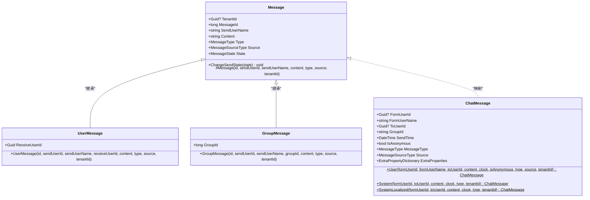
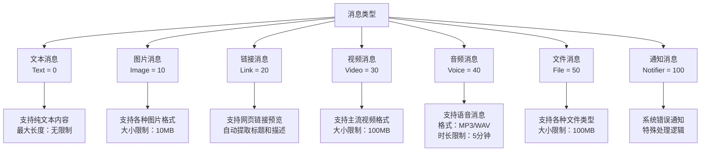
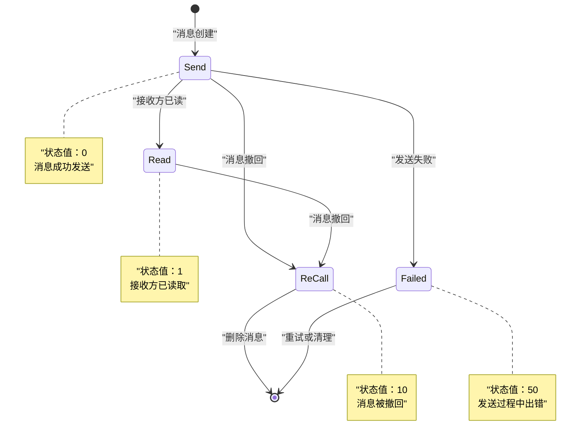
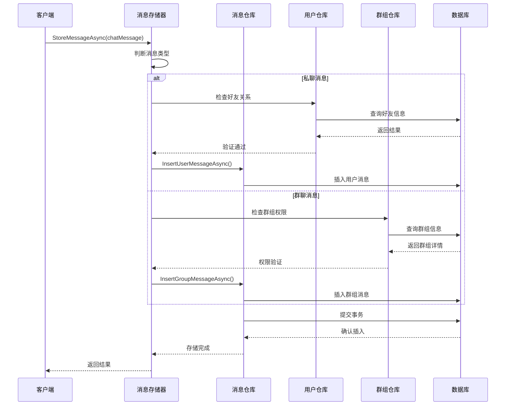
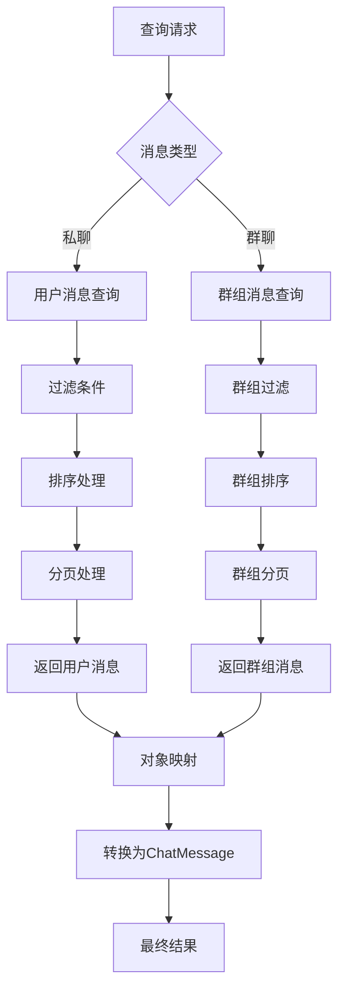
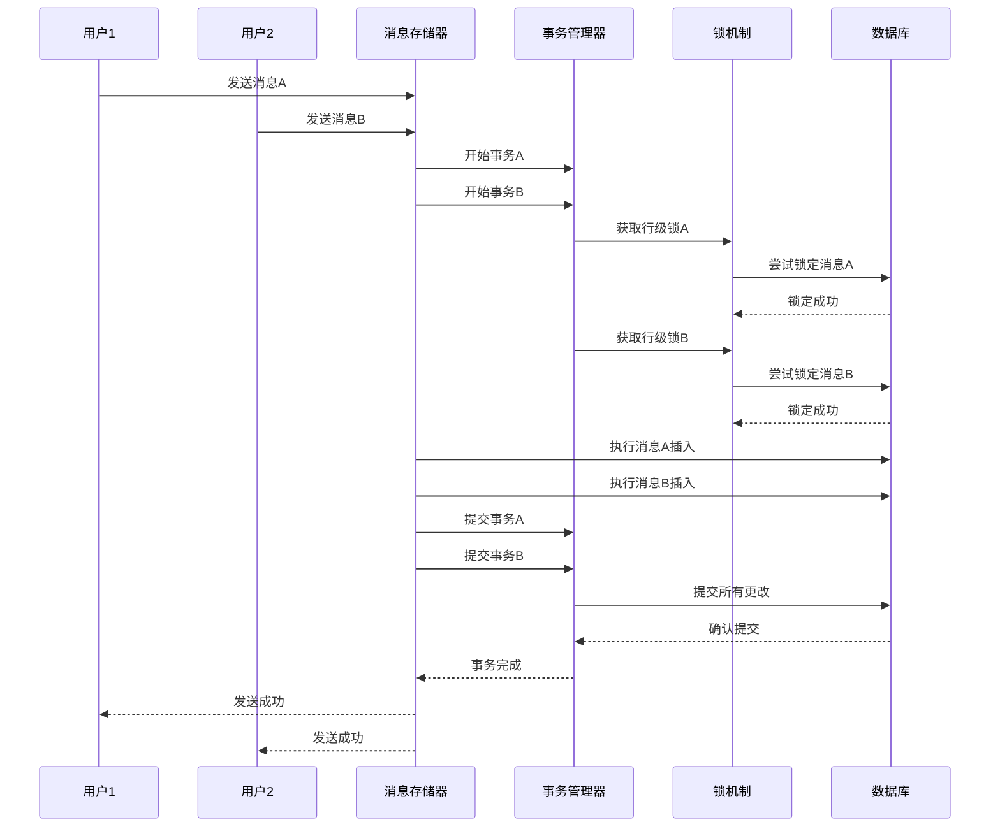

基于我对代码库的深入分析，我现在可以创建关于实时消息模块数据模型的详细文档。

<docs>
# 实时消息数据模型

<cite>
**本文档中引用的文件**
- [Message.cs](file://aspnet-core/modules/realtime-message/LINGYUN.Abp.MessageService.Domain/LINGYUN/Abp/MessageService/Chat/Message.cs)
- [UserMessage.cs](file://aspnet-core/modules/realtime-message/LINGYUN.Abp.MessageService.Domain/LINGYUN/Abp/MessageService/Chat/UserMessage.cs)
- [GroupMessage.cs](file://aspnet-core/modules/realtime-message/LINGYUN.Abp.MessageService.Domain/LINGYUN/Abp/MessageService/Groups/GroupMessage.cs)
- [MessageState.cs](file://aspnet-core/modules/realtime-message/LINGYUN.Abp.IM/LINGYUN/Abp/IM/Messages/MessageState.cs)
- [MessageType.cs](file://aspnet-core/modules/realtime-message/LINGYUN.Abp.IM/LINGYUN/Abp/IM/Messages/MessageType.cs)
- [MessageSourceType.cs](file://aspnet-core/modules/realtime-message/LINGYUN.Abp.IM/LINGYUN/Abp/IM/Messages/MessageSourceType.cs)
- [IMessageRepository.cs](file://aspnet-core/modules/realtime-message/LINGYUN.Abp.MessageService.Domain/LINGYUN/Abp/MessageService/Chat/IMessageRepository.cs)
- [EfCoreMessageRepository.cs](file://aspnet-core/modules/realtime-message/LINGYUN.Abp.MessageService.EntityFrameworkCore/LINGYUN/Abp/MessageService/Chat/EfCoreMessageRepository.cs)
- [MessageStore.cs](file://aspnet-core/modules/realtime-message/LINGYUN.Abp.MessageService.Domain/LINGYUN/Abp/MessageService/Chat/MessageStore.cs)
- [IMessageStore.cs](file://aspnet-core/modules/realtime-message/LINGYUN.Abp.IM/LINGYUN/Abp/IM/Messages/IMessageStore.cs)
- [ChatMessage.cs](file://aspnet-core/modules/realtime-message/LINGYUN.Abp.IM/LINGYUN/Abp/IM/Messages/ChatMessage.cs)
- [LastChatMessage.cs](file://aspnet-core/modules/realtime-message/LINGYUN.Abp.IM/LINGYUN/Abp/IM/Messages/LastChatMessage.cs)
- [InitialRealtimeMessage.cs](file://aspnet-core/migrations/LY.MicroService.RealtimeMessage.EntityFrameworkCore/Migrations/20230110063428_Initial-Realtime-Message.cs)
- [MessageServiceErrorCodes.cs](file://aspnet-core/modules/realtime-message/LINGYUN.Abp.MessageService.Domain.Shared/LINGYUN/Abp/MessageService/MessageServiceErrorCodes.cs)
</cite>

## 目录
1. [简介](#简介)
2. [核心实体设计](#核心实体设计)
3. [消息类型与状态](#消息类型与状态)
4. [数据库表结构](#数据库表结构)
5. [消息存储与检索](#消息存储与检索)
6. [索引优化策略](#索引优化策略)
7. [高并发处理机制](#高并发处理机制)
8. [消息分片策略](#消息分片策略)
9. [扩展性设计](#扩展性设计)
10. [最佳实践指南](#最佳实践指南)

## 简介

实时消息模块是ABP Next Admin框架中的核心组件，专门设计用于处理高并发的即时通讯场景。该模块采用领域驱动设计（DDD）原则，通过抽象的消息模型、灵活的存储策略和完善的索引优化，确保在大规模用户场景下仍能保持高性能和数据一致性。

## 核心实体设计

### 消息基类架构



**图表来源**
- [Message.cs](file://aspnet-core/modules/realtime-message/LINGYUN.Abp.MessageService.Domain/LINGYUN/Abp/MessageService/Chat/Message.cs#L1-L65)
- [UserMessage.cs](file://aspnet-core/modules/realtime-message/LINGYUN.Abp.MessageService.Domain/LINGYUN/Abp/MessageService/Chat/UserMessage.cs#L1-L28)
- [GroupMessage.cs](file://aspnet-core/modules/realtime-message/LINGYUN.Abp.MessageService.Domain/LINGYUN/Abp/MessageService/Groups/GroupMessage.cs#L1-L29)
- [ChatMessage.cs](file://aspnet-core/modules/realtime-message/LINGYUN.Abp.IM/LINGYUN/Abp/IM/Messages/ChatMessage.cs#L1-L234)

### 实体关系图

```mermaid
erDiagram
MESSAGE {
bigint Id PK
char(36)_TenantId
bigint_MessageId
varchar(64)_SendUserName
longtext_Content
int_Type
int_Source
tinyint_State
datetime_CreationTime
char(36)_CreatorId
varchar(40)_ConcurrencyStamp
}
USER_MESSAGE {
bigint Id PK
char(36)_ReceiveUserId
longtext_ExtraProperties
char(36)_TenantId
bigint_MessageId
varchar(64)_SendUserName
longtext_Content
int_Type
int_Source
tinyint_State
}
GROUP_MESSAGE {
bigint Id PK
bigint_GroupId
longtext_ExtraProperties
char(36)_TenantId
bigint_MessageId
varchar(64)_SendUserName
longtext_Content
int_Type
int_Source
tinyint_State
}
LAST_CHAT_MESSAGE {
bigint Id PK
char(36)_FormUserId
varchar(256)_FormUserName
char(36)_ToUserId
varchar(20)_GroupId
datetime_SendTime
tinyint_IsAnonymous
int_MessageType
int_Source
json_ExtraProperties
}
MESSAGE ||--|| USER_MESSAGE : "包含"
MESSAGE ||--|| GROUP_MESSAGE : "包含"
USER_MESSAGE ||--|| LAST_CHAT_MESSAGE : "映射"
GROUP_MESSAGE ||--|| LAST_CHAT_MESSAGE : "映射"
```

**图表来源**
- [InitialRealtimeMessage.cs](file://aspnet-core/migrations/LY.MicroService.RealtimeMessage.EntityFrameworkCore/Migrations/20230110063428_Initial-Realtime-Message.cs#L30-L483)

**章节来源**
- [Message.cs](file://aspnet-core/modules/realtime-message/LINGYUN.Abp.MessageService.Domain/LINGYUN/Abp/MessageService/Chat/Message.cs#L1-L65)
- [UserMessage.cs](file://aspnet-core/modules/realtime-message/LINGYUN.Abp.MessageService.Domain/LINGYUN/Abp/MessageService/Chat/UserMessage.cs#L1-L28)
- [GroupMessage.cs](file://aspnet-core/modules/realtime-message/LINGYUN.Abp.MessageService.Domain/LINGYUN/Abp/MessageService/Groups/GroupMessage.cs#L1-L29)

## 消息类型与状态

### 消息类型体系

系统支持多种消息类型，每种类型都有特定的用途和处理逻辑：



**图表来源**
- [MessageType.cs](file://aspnet-core/modules/realtime-message/LINGYUN.Abp.IM/LINGYUN/Abp/IM/Messages/MessageType.cs#L1-L33)

### 消息状态管理



**图表来源**
- [MessageState.cs](file://aspnet-core/modules/realtime-message/LINGYUN.Abp.IM/LINGYUN/Abp/IM/Messages/MessageState.cs#L1-L27)

**章节来源**
- [MessageType.cs](file://aspnet-core/modules/realtime-message/LINGYUN.Abp.IM/LINGYUN/Abp/IM/Messages/MessageType.cs#L1-L33)
- [MessageState.cs](file://aspnet-core/modules/realtime-message/LINGYUN.Abp.IM/LINGYUN/Abp/IM/Messages/MessageState.cs#L1-L27)

## 数据库表结构

### 主要表结构设计

系统采用分离式存储策略，将用户消息和群组消息分别存储在不同的表中，以优化查询性能：

```mermaid
erDiagram
APP_USER_MESSAGES {
bigint Id PK
char(36)_ReceiveUserId
longtext_ExtraProperties
varchar(40)_ConcurrencyStamp
datetime_CreationTime
char(36)_CreatorId
char(36)_TenantId
bigint_MessageId
varchar(64)_SendUserName
longtext_Content
int_Type
int_Source
tinyint_State
}
APP_GROUP_MESSAGES {
bigint Id PK
bigint_GroupId
longtext_ExtraProperties
varchar(40)_ConcurrencyStamp
datetime_CreationTime
char(36)_CreatorId
char(36)_TenantId
bigint_MessageId
varchar(64)_SendUserName
longtext_Content
int_Type
int_Source
tinyint_State
}
APP_USER_CHAT_CARDS {
bigint Id PK
char(36)_UserId
varchar(256)_UserName
int_Sex
varchar(30)_Sign
varchar(256)_NickName
varchar(50)_Description
varchar(512)_AvatarUrl
datetime_Birthday
int_Age
datetime_LastOnlineTime
int_State
longtext_ExtraProperties
varchar(40)_ConcurrencyStamp
datetime_CreationTime
char(36)_CreatorId
char(36)_TenantId
}
APP_CHAT_GROUPS {
bigint Id PK
char(36)_AdminUserId
bigint_GroupId
varchar(20)_Name
varchar(512)_Tag
varchar(256)_Address
varchar(64)_Notice
int_MaxUserCount
tinyint_AllowAnonymous
tinyint_AllowSendMessage
varchar(128)_Description
varchar(128)_AvatarUrl
datetime_CreationTime
char(36)_CreatorId
char(36)_TenantId
}
APP_USER_CHAT_FRIENDS {
bigint Id PK
char(36)_UserId
char(36)_FrientId
tinyint_IsStatic
tinyint_Black
tinyint_DontDisturb
tinyint_SpecialFocus
varchar(256)_RemarkName
varchar(50)_Description
tinyint_unsigned_Status
longtext_ExtraProperties
varchar(40)_ConcurrencyStamp
datetime_CreationTime
char(36)_CreatorId
char(36)_TenantId
}
APP_USER_CHAT_SETTINGS {
bigint Id PK
char(36)_UserId
tinyint_AllowAnonymous
tinyint_AllowAddFriend
tinyint_RequireAddFriendValition
tinyint_AllowReceiveMessage
tinyint_AllowSendMessage
char(36)_TenantId
}
APP_USER_CHAT_GROUPS {
bigint Id PK
char(36)_UserId
bigint_GroupId
datetime_CreationTime
char(36)_CreatorId
char(36)_TenantId
}
APP_GROUP_CHAT_BLACKS {
bigint Id PK
bigint_GroupId
char(36)_ShieldUserId
datetime_CreationTime
char(36)_CreatorId
char(36)_TenantId
}
APP_USER_GROUP_CARDS {
bigint Id PK
char(36)_UserId
varchar(256)_NickName
tinyint_IsAdmin
datetime_SilenceEnd
longtext_ExtraProperties
varchar(40)_ConcurrencyStamp
datetime_CreationTime
char(36)_CreatorId
char(36)_TenantId
}
APP_USER_NOTIFICATIONS {
bigint Id PK
char(36)_UserId
bigint_NotificationId
int_ReadStatus
char(36)_TenantId
}
APP_NOTIFICATION_DEFINITIONS {
char(36)_Id PK
varchar(64)_Name
varchar(64)_GroupName
varchar(255)_DisplayName
varchar(255)_Description
int_NotificationLifetime
int_NotificationType
int_ContentType
varchar(200)_Providers
tinyint_AllowSubscriptionToClients
longtext_ExtraProperties
}
APP_NOTIFICATION_DEFINITION_GROUPS {
char(36)_Id PK
varchar(64)_Name
varchar(255)_DisplayName
varchar(255)_Description
tinyint_AllowSubscriptionToClients
longtext_ExtraProperties
}
APP_NOTIFICATIONS {
bigint Id PK
char(36)_TenantId
tinyint_Severity
int_Type
int_ContentType
bigint_NotificationId
varchar(100)_NotificationName
varchar(512)_NotificationTypeName
datetime_ExpirationTime
datetime_CreationTime
longtext_ExtraProperties
}
APP_USER_SUBSCRIBES {
bigint Id PK
char(36)_UserId
varchar(128)_UserName
char(36)_TenantId
datetime_CreationTime
varchar(100)_NotificationName
}
APP_USER_MESSAGES ||--|| APP_USER_CHAT_CARDS : "关联用户"
APP_GROUP_MESSAGES ||--|| APP_CHAT_GROUPS : "关联群组"
APP_USER_CHAT_FRIENDS ||--|| APP_USER_CHAT_CARDS : "好友关系"
APP_USER_CHAT_GROUPS ||--|| APP_CHAT_GROUPS : "用户群组关系"
APP_GROUP_CHAT_BLACKS ||--|| APP_CHAT_GROUPS : "黑名单"
APP_USER_GROUP_CARDS ||--|| APP_CHAT_GROUPS : "群组成员"
APP_USER_NOTIFICATIONS ||--|| APP_NOTIFICATIONS : "通知状态"
APP_NOTIFICATION_DEFINITIONS ||--|| APP_NOTIFICATION_DEFINITION_GROUPS : "通知分类"
```

**图表来源**
- [InitialRealtimeMessage.cs](file://aspnet-core/migrations/LY.MicroService.RealtimeMessage.EntityFrameworkCore/Migrations/20230110063428_Initial-Realtime-Message.cs#L30-L483)

**章节来源**
- [InitialRealtimeMessage.cs](file://aspnet-core/migrations/LY.MicroService.RealtimeMessage.EntityFrameworkCore/Migrations/20230110063428_Initial-Realtime-Message.cs#L30-L483)

## 消息存储与检索

### 存储架构设计



**图表来源**
- [MessageStore.cs](file://aspnet-core/modules/realtime-message/LINGYUN.Abp.MessageService.Domain/LINGYUN/Abp/MessageService/Chat/MessageStore.cs#L47-L77)
- [IMessageRepository.cs](file://aspnet-core/modules/realtime-message/LINGYUN.Abp.MessageService.Domain/LINGYUN/Abp/MessageService/Chat/IMessageRepository.cs#L1-L45)

### 查询优化策略

系统实现了多层次的查询优化机制：



**图表来源**
- [EfCoreMessageRepository.cs](file://aspnet-core/modules/realtime-message/LINGYUN.Abp.MessageService.EntityFrameworkCore/LINGYUN/Abp/MessageService/Chat/EfCoreMessageRepository.cs#L38-L277)

**章节来源**
- [MessageStore.cs](file://aspnet-core/modules/realtime-message/LINGYUN.Abp.MessageService.Domain/LINGYUN/Abp/MessageService/Chat/MessageStore.cs#L47-L189)
- [EfCoreMessageRepository.cs](file://aspnet-core/modules/realtime-message/LINGYUN.Abp.MessageService.EntityFrameworkCore/LINGYUN/Abp/MessageService/Chat/EfCoreMessageRepository.cs#L38-L277)

## 索引优化策略

### 多维索引设计

为了支持高效的查询操作，系统在关键字段上建立了复合索引：

```mermaid
erDiagram
APP_USER_MESSAGES {
bigint Id PK
char(36)_TenantId
char(36)_ReceiveUserId
bigint_MessageId
varchar(64)_SendUserName
int_Type
tinyint_State
datetime_CreationTime
}
APP_GROUP_MESSAGES {
bigint Id PK
char(36)_TenantId
bigint_GroupId
bigint_MessageId
varchar(64)_SendUserName
int_Type
tinyint_State
datetime_CreationTime
}
APP_USER_CHAT_CARDS {
bigint Id PK
char(36)_TenantId
char(36)_UserId
varchar(256)_UserName
datetime_LastOnlineTime
}
APP_CHAT_GROUPS {
bigint Id PK
char(36)_TenantId
bigint_GroupId
varchar(20)_Name
datetime_CreationTime
}
APP_USER_CHAT_FRIENDS {
bigint Id PK
char(36)_TenantId
char(36)_UserId
char(36)_FrientId
tinyint_Status
}
APP_USER_CHAT_GROUPS {
bigint Id PK
char(36)_TenantId
bigint_GroupId
char(36)_UserId
datetime_CreationTime
}
INDEX_APP_USER_MESSAGES_TENANT_RECEIVEUSER["IX_AppUserMessages_TenantId_ReceiveUserId<br/>复合索引：租户+接收用户"]
INDEX_APP_GROUP_MESSAGES_TENANT_GROUP["IX_AppGroupMessages_TenantId_GroupId<br/>复合索引：租户+群组ID"]
INDEX_APP_USER_CHAT_CARDS_TENANT_USER["IX_AppUserChatCards_TenantId_UserId<br/>复合索引：租户+用户ID"]
INDEX_APP_CHAT_GROUPS_TENANT_NAME["IX_AppChatGroups_TenantId_Name<br/>复合索引：租户+群组名称"]
INDEX_APP_USER_CHAT_FRIENDS_TENANT_USER_FRIEND["IX_AppUserChatFriends_TenantId_UserId_FrientId<br/>三列复合索引：租户+用户+好友"]
INDEX_APP_USER_CHAT_GROUPS_TENANT_GROUP_USER["IX_AppUserChatGroups_TenantId_GroupId_UserId<br/>三列复合索引：租户+群组+用户"]
```

**图表来源**
- [InitialRealtimeMessage.cs](file://aspnet-core/migrations/LY.MicroService.RealtimeMessage.EntityFrameworkCore/Migrations/20230110063428_Initial-Realtime-Message.cs#L440-L483)

### 查询性能优化

系统采用了多种查询优化技术：

1. **延迟加载优化**：使用`AsNoTracking()`避免不必要的跟踪开销
2. **投影查询**：只选择需要的字段，减少数据传输量
3. **分页查询**：支持大结果集的分页处理
4. **缓存策略**：对频繁访问的数据建立缓存层

**章节来源**
- [InitialRealtimeMessage.cs](file://aspnet-core/migrations/LY.MicroService.RealtimeMessage.EntityFrameworkCore/Migrations/20230110063428_Initial-Realtime-Message.cs#L440-L483)
- [EfCoreMessageRepository.cs](file://aspnet-core/modules/realtime-message/LINGYUN.Abp.MessageService.EntityFrameworkCore/LINGYUN/Abp/MessageService/Chat/EfCoreMessageRepository.cs#L38-L277)

## 高并发处理机制

### 事务隔离与锁机制



### 并发控制策略

系统采用以下策略确保高并发场景下的数据一致性：

1. **乐观锁机制**：使用`ConcurrencyStamp`字段防止并发更新冲突
2. **事务隔离**：合理设置事务隔离级别，平衡性能和一致性
3. **批量处理**：对大量消息采用批量插入和更新
4. **异步处理**：非关键路径的操作采用异步执行

**章节来源**
- [MessageStore.cs](file://aspnet-core/modules/realtime-message/LINGYUN.Abp.MessageService.Domain/LINGYUN/Abp/MessageService/Chat/MessageStore.cs#L47-L77)

## 消息分片策略

### 租户隔离设计

系统采用租户维度的分片策略，确保不同租户间的数据完全隔离：

```mermaid
graph TB
    subgraph "租户A"
        TA_DB[(租户A数据库)]
        TA_UserMsg[用户消息表]
        TA_GroupMsg[群组消息表]
        TA_ChatCards[聊天卡片表]
        TA_Friends[好友关系表]
    end
    
    subgraph "租户B"
        TB_DB[(租户B数据库)]
        TB_UserMsg[用户消息表]
        TB_GroupMsg[群组消息表]
        TB_ChatCards[聊天卡片表]
        TB_Friends[好友关系表]
    end
    
    subgraph "租户C"
        TC_DB[(租户C数据库)]
        TC_UserMsg[用户消息表]
        TC_GroupMsg[群组消息表]
        TC_ChatCards[聊天卡片表]
        TC_Friends[好友关系表]
    end
    
    TA_DB --> TA_UserMsg
    TA_DB --> TA_GroupMsg
    TA_DB --> TA_ChatCards
    TA_DB --> TA_Friends
    
    TB_DB --> TB_UserMsg
    TB_DB --> TB_GroupMsg
    TB_DB --> TB_ChatCards
    TB_DB --> TB_F