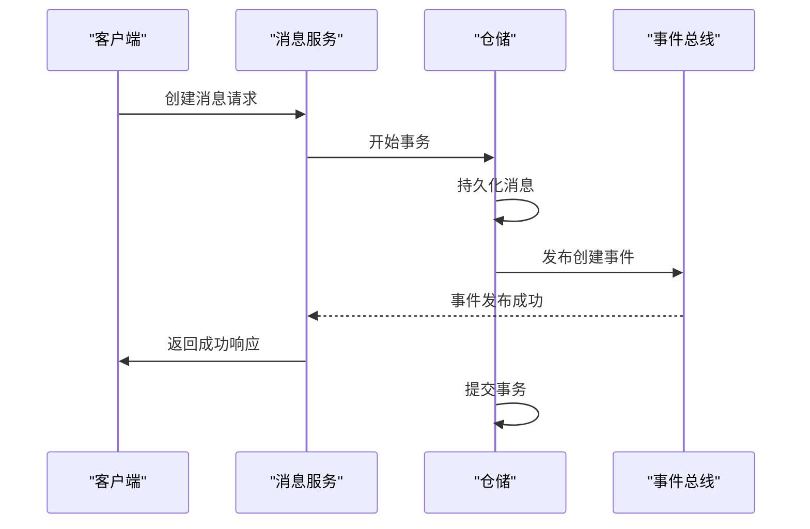
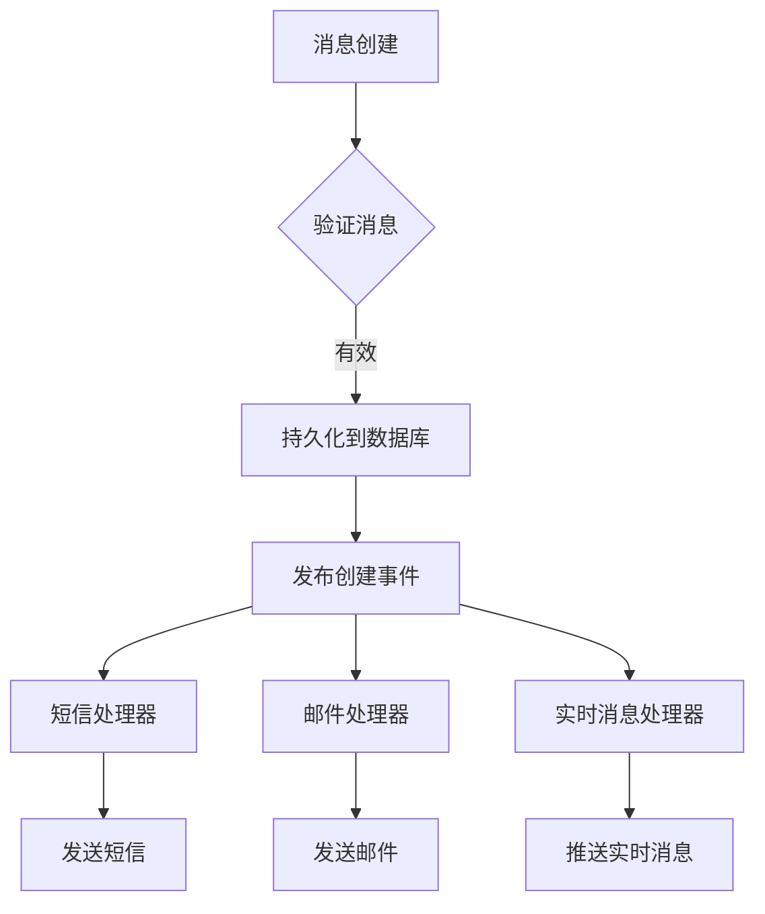
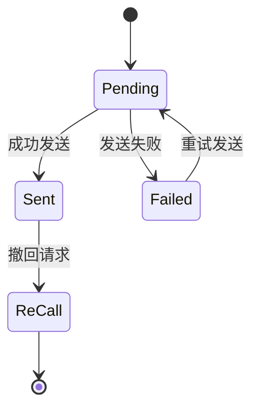
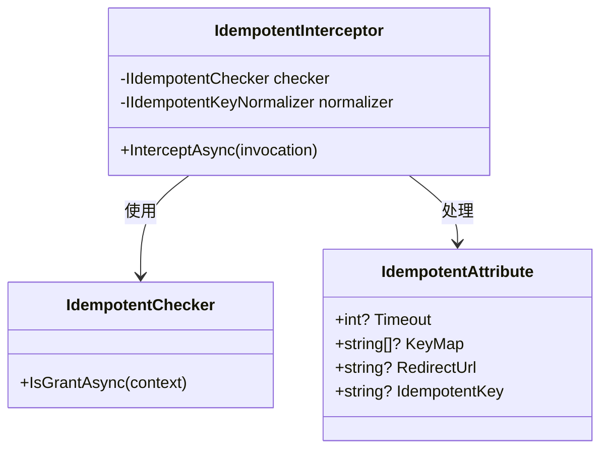
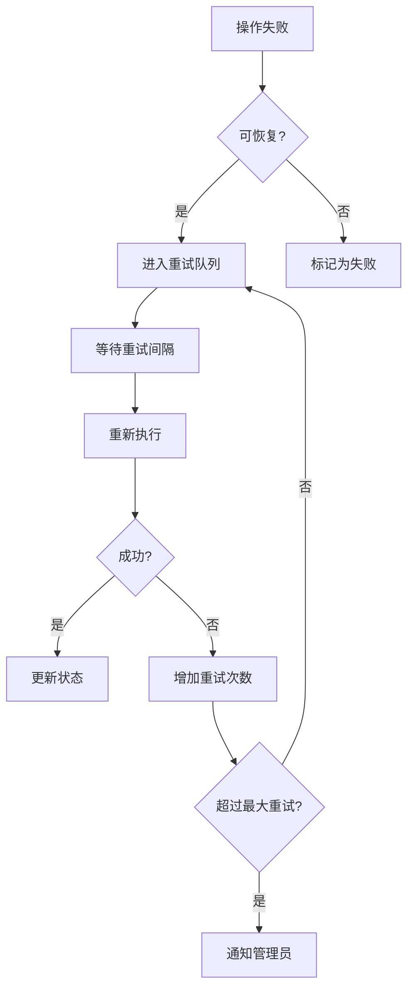

# 数据一致性机制

<cite>
**本文档中引用的文件**   
- [Message.cs](file://aspnet-core/modules/platform/LINGYUN.Platform.Domain/LINGYUN/Platform/Messages/Message.cs)
- [MessageCreatedEventHandler.cs](file://aspnet-core/services/LY.MicroService.Applications.Single/EventBus/Distributed/MessageCreatedEventHandler.cs)
- [IdempotentAttribute.cs](file://aspnet-core/framework/common/LINGYUN.Abp.Idempotent/LINGYUN/Abp/Idempotent/IdempotentAttribute.cs)
- [IdempotentInterceptor.cs](file://aspnet-core/framework/common/LINGYUN.Abp.Idempotent/LINGYUN/Abp/Idempotent/IdempotentInterceptor.cs)
- [CAPDistributedEventBus.cs](file://aspnet-core/framework/common/LINGYUN.Abp.EventBus.CAP/LINGYUN/Abp/EventBus/CAP/CAPDistributedEventBus.cs)
- [MessageProcessor.cs](file://aspnet-core/modules/realtime-message/LINGYUN.Abp.MessageService.Domain/LINGYUN/Abp/MessageService/Chat/MessageProcessor.cs)
- [MessageServiceSettingNames.cs](file://aspnet-core/modules/realtime-message/LINGYUN.Abp.MessageService.Domain.Shared/LINGYUN/Abp/MessageService/Settings/MessageServiceSettingNames.cs)
- [MessageServiceErrorCodes.cs](file://aspnet-core/modules/realtime-message/LINGYUN.Abp.MessageService.Domain.Shared/LINGYUN/Abp/MessageService/MessageServiceErrorCodes.cs)
</cite>

## 目录
1. [引言](#引言)
2. [数据一致性机制概述](#数据一致性机制概述)
3. [分布式事务处理](#分布式事务处理)
4. [事件驱动架构应用](#事件驱动架构应用)
5. [补偿机制设计](#补偿机制设计)
6. [消息幂等性处理](#消息幂等性处理)
7. [重复消息过滤](#重复消息过滤)
8. [事务边界定义](#事务边界定义)
9. [异常恢复策略](#异常恢复策略)
10. [一致性机制扩展指导](#一致性机制扩展指导)

## 引言
本文档详细阐述了实时消息模块中的数据一致性机制。通过分析消息发送、接收和状态更新等操作，说明了如何在分布式系统中保证数据的一致性。文档涵盖了分布式事务处理、事件驱动架构的应用以及补偿机制的设计，并提供了代码示例来展示核心逻辑。

## 数据一致性机制概述
实时消息模块采用多种技术手段确保数据一致性。系统通过事件驱动架构实现松耦合的组件通信，利用分布式事务和补偿机制处理跨服务的操作。同时，引入幂等性处理和重复消息过滤机制防止数据重复处理。整个系统设计遵循清晰的事务边界，确保每个操作的原子性和一致性。

**Section sources**
- [Message.cs](file://aspnet-core/modules/platform/LINGYUN.Platform.Domain/LINGYUN/Platform/Messages/Message.cs)
- [MessageCreatedEventHandler.cs](file://aspnet-core/services/LY.MicroService.Applications.Single/EventBus/Distributed/MessageCreatedEventHandler.cs)

## 分布式事务处理
系统采用基于事件的最终一致性模型而非传统的两阶段提交。当消息创建时，通过发布领域事件触发后续处理流程。关键操作使用[UnitOfWork]属性确保数据库事务的一致性，在单个事务中完成数据持久化和事件发布。

**Diagram sources **
- [MessageCreatedEventHandler.cs](file://aspnet-core/services/LY.MicroService.Applications.Single/EventBus/Distributed/MessageCreatedEventHandler.cs)
- [Message.cs](file://aspnet-core/modules/platform/LINGYUN.Platform.Domain/LINGYUN/Platform/Messages/Message.cs)

**Section sources**
- [MessageCreatedEventHandler.cs](file://aspnet-core/services/LY.MicroService.Applications.Single/EventBus/Distributed/MessageCreatedEventHandler.cs)

## 事件驱动架构应用
系统采用CAP作为分布式事件总线实现事件驱动架构。消息状态变更通过事件传播，确保各服务间的数据同步。事件处理器监听特定事件类型并执行相应的业务逻辑，实现了系统的松耦合和可扩展性。

**Diagram sources **
- [CAPDistributedEventBus.cs](file://aspnet-core/framework/common/LINGYUN.Abp.EventBus.CAP/LINGYUN/Abp/EventBus/CAP/CAPDistributedEventBus.cs)
- [MessageCreatedEventHandler.cs](file://aspnet-core/services/LY.MicroService.Applications.Single/EventBus/Distributed/MessageCreatedEventHandler.cs)

**Section sources**
- [CAPDistributedEventBus.cs](file://aspnet-core/framework/common/LINGYUN.Abp.EventBus.CAP/LINGYUN/Abp/EventBus/CAP/CAPDistributedEventBus.cs)

## 补偿机制设计
对于失败的操作，系统提供完善的补偿机制。消息实体包含状态字段（Status）跟踪生命周期，支持从失败状态恢复。通过重试机制和人工干预接口，确保最终一致性。消息状态转换遵循严格的规则，防止非法状态迁移。

**Diagram sources **
- [Message.cs](file://aspnet-core/modules/platform/LINGYUN.Platform.Domain/LINGYUN/Platform/Messages/Message.cs)

**Section sources**
- [Message.cs](file://aspnet-core/modules/platform/LINGYUN.Platform.Domain/LINGYUN/Platform/Messages/Message.cs)

## 消息幂等性处理
系统通过IdempotentAttribute实现接口幂等性。该特性基于请求参数生成唯一标识，在操作执行前检查是否已处理相同请求。通过分布式锁机制确保同一幂等键的操作不会并发执行，有效防止重复处理。

**Diagram sources **
- [IdempotentAttribute.cs](file://aspnet-core/framework/common/LINGYUN.Abp.Idempotent/LINGYUN/Abp/Idempotent/IdempotentAttribute.cs)
- [IdempotentInterceptor.cs](file://aspnet-core/framework/common/LINGYUN.Abp.Idempotent/LINGYUN/Abp/Idempotent/IdempotentInterceptor.cs)

**Section sources**
- [IdempotentAttribute.cs](file://aspnet-core/framework/common/LINGYUN.Abp.Idempotent/LINGYUN/Abp/Idempotent/IdempotentAttribute.cs)
- [IdempotentInterceptor.cs](file://aspnet-core/framework/common/LINGYUN.Abp.Idempotent/LINGYUN/Abp/Idempotent/IdempotentInterceptor.cs)

## 重复消息过滤
系统在多个层面实现重复消息过滤。应用层通过消息ID去重，存储层通过唯一约束防止重复记录。对于外部系统集成，提供时间窗口内的重复检查功能。消息处理器会验证消息的唯一性标识，避免重复处理相同内容。

**Section sources**
- [MessageProcessor.cs](file://aspnet-core/modules/realtime-message/LINGYUN.Abp.MessageService.Domain/LINGYUN/Abp/MessageService/Chat/MessageProcessor.cs)

## 事务边界定义
事务边界明确定义在服务方法级别。使用[UnitOfWork]属性标记需要事务管理的方法，确保数据库操作的原子性。事件发布与数据持久化在同一事务中完成，保证操作的一致性。长事务被分解为多个短事务，通过事件驱动实现最终一致性。

**Section sources**
- [MessageCreatedEventHandler.cs](file://aspnet-core/services/LY.MicroService.Applications.Single/EventBus/Distributed/MessageCreatedEventHandler.cs)

## 异常恢复策略
系统提供多层次的异常恢复机制。业务异常通过错误码体系进行分类处理，内部异常通过日志记录和监控告警。对于可恢复的失败操作，提供自动重试和手动重发功能。消息状态历史记录支持问题追溯和人工干预。

**Diagram sources **
- [Message.cs](file://aspnet-core/modules/platform/LINGYUN.Platform.Domain/LINGYUN/Platform/Messages/Message.cs)
- [MessageServiceErrorCodes.cs](file://aspnet-core/modules/realtime-message/LINGYUN.Abp.MessageService.Domain.Shared/LINGYUN/Abp/MessageService/MessageServiceErrorCodes.cs)

**Section sources**
- [Message.cs](file://aspnet-core/modules/platform/LINGYUN.Platform.Domain/LINGYUN/Platform/Messages/Message.cs)
- [MessageServiceErrorCodes.cs](file://aspnet-core/modules/realtime-message/LINGYUN.Abp.MessageService.Domain.Shared/LINGYUN/Abp/MessageService/MessageServiceErrorCodes.cs)

## 一致性机制扩展指导
开发者可通过以下方式扩展一致性机制：集成外部一致性检查工具，实现自定义的IdempotentChecker；配置不同的事件存储后端以提高可靠性；扩展错误码体系支持更多业务场景；添加新的事件处理器实现额外的业务逻辑。建议保持事务边界清晰，避免过度复杂的补偿逻辑。

**Section sources**
- [MessageServiceSettingNames.cs](file://aspnet-core/modules/realtime-message/LINGYUN.Abp.MessageService.Domain.Shared/LINGYUN/Abp/MessageService/Settings/MessageServiceSettingNames.cs)
- [IdempotentChecker.cs](file://aspnet-core/framework/common/LINGYUN.Abp.Idempotent/LINGYUN/Abp/Idempotent/IIdempotentChecker.cs)