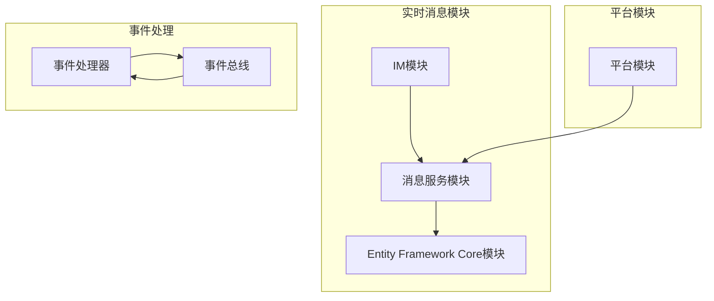
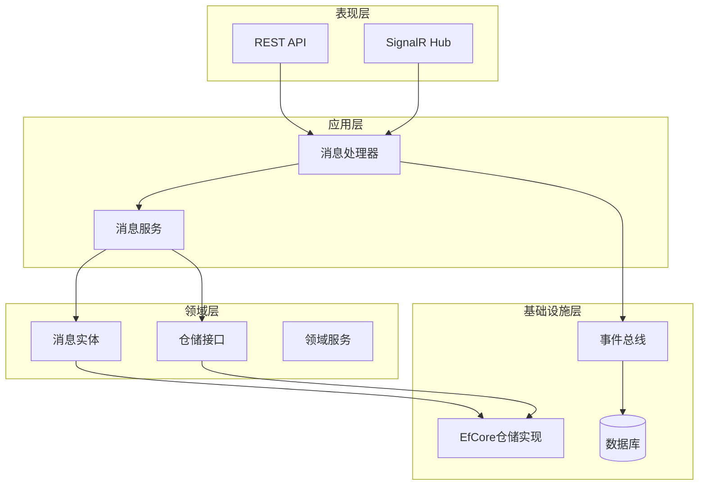
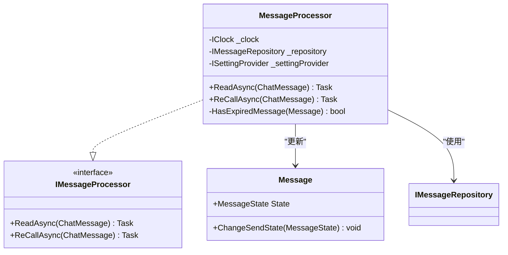
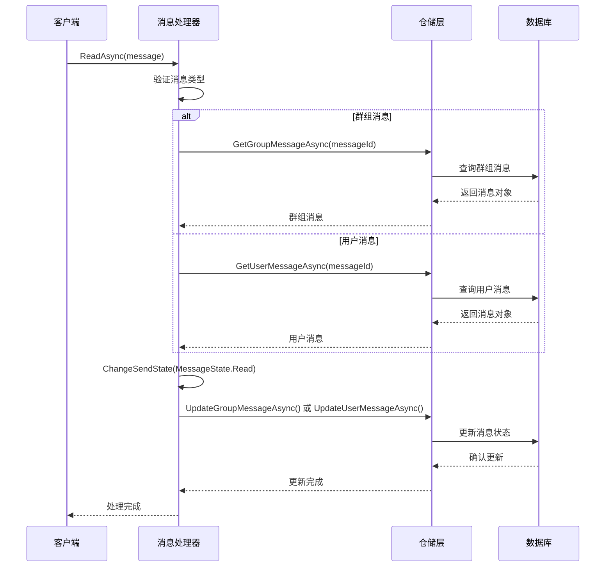
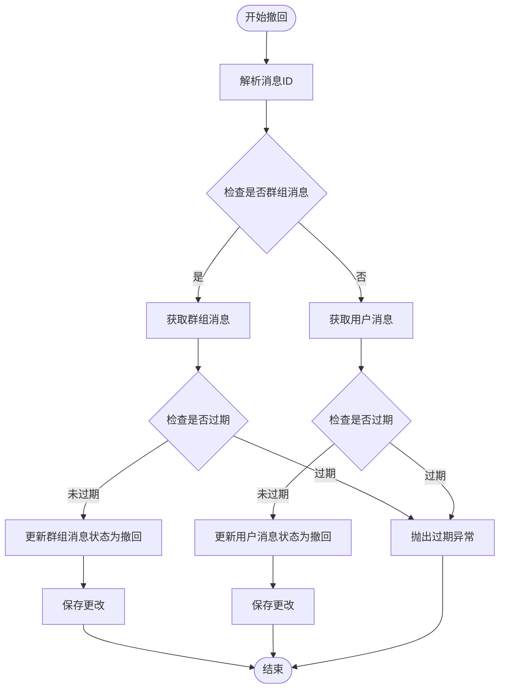
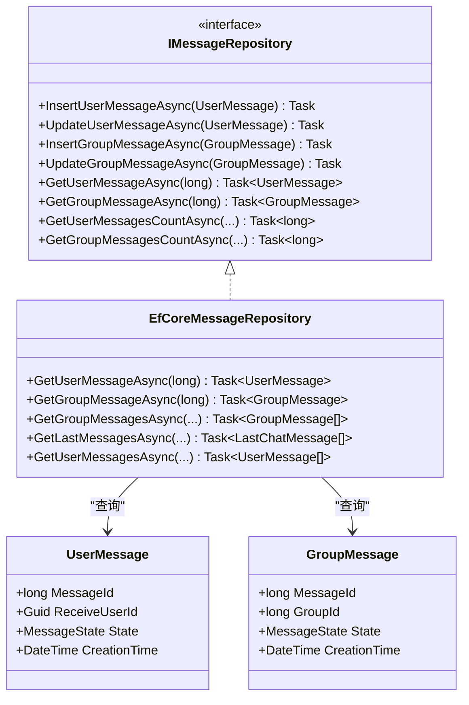
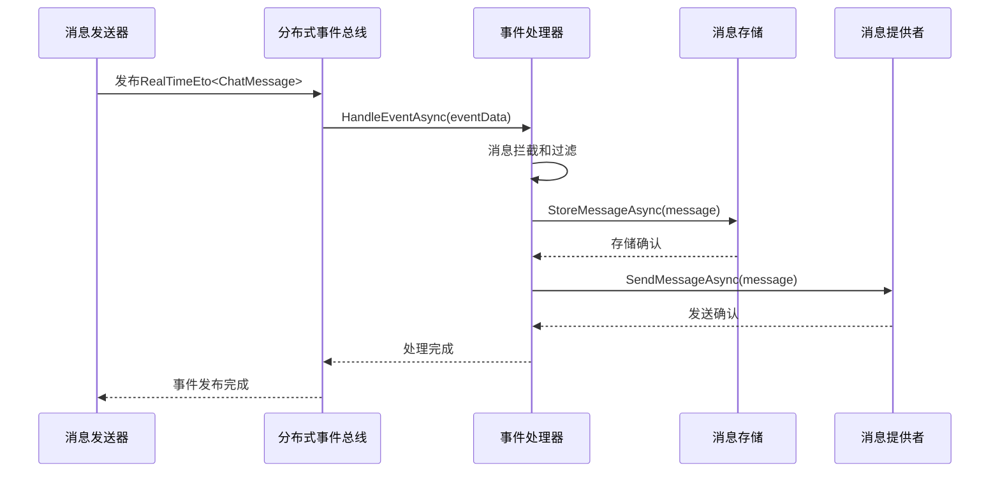
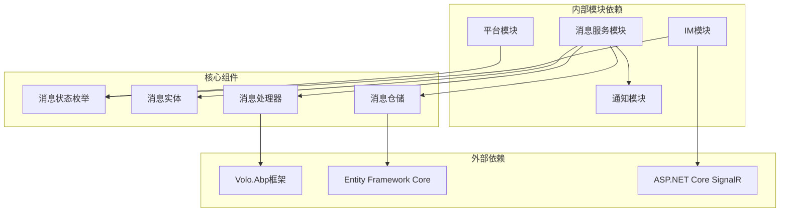

# 消息状态管理

<cite>
**本文档引用的文件**
- [MessageState.cs](file://aspnet-core/modules/realtime-message/LINGYUN.Abp.IM/LINGYUN/Abp/IM/Messages/MessageState.cs)
- [MessageStatus.cs](file://aspnet-core/modules/platform/LINGYUN.Platform.Domain.Shared/LINGYUN/Platform/Messages/MessageStatus.cs)
- [Message.cs](file://aspnet-core/modules/realtime-message/LINGYUN.Abp.MessageService.Domain/LINGYUN/Abp/MessageService/Chat/Message.cs)
- [MessageProcessor.cs](file://aspnet-core/modules/realtime-message/LINGYUN.Abp.MessageService.Domain/LINGYUN/Abp/MessageService/Chat/MessageProcessor.cs)
- [IMessageRepository.cs](file://aspnet-core/modules/realtime-message/LINGYUN.Abp.MessageService.Domain/LINGYUN/Abp/MessageService/Chat/IMessageRepository.cs)
- [EfCoreMessageRepository.cs](file://aspnet-core/modules/realtime-message/LINGYUN.Abp.MessageService.EntityFrameworkCore/LINGYUN/Abp/MessageService/Chat/EfCoreMessageRepository.cs)
- [IMessageProcessor.cs](file://aspnet-core/modules/realtime-message/LINGYUN.Abp.IM/LINGYUN/Abp/IM/Messages/IMessageProcessor.cs)
- [MessageSender.cs](file://aspnet-core/modules/realtime-message/LINGYUN.Abp.IM/LINGYUN/Abp/IM/Messages/MessageSender.cs)
- [ChatMessageEventHandler.cs](file://aspnet-core/services/LY.MicroService.RealtimeMessage.HttpApi.Host/EventBus/Distributed/ChatMessageEventHandler.cs)
</cite>

## 目录
1. [简介](#简介)
2. [项目结构](#项目结构)
3. [核心组件](#核心组件)
4. [架构概览](#架构概览)
5. [详细组件分析](#详细组件分析)
6. [依赖关系分析](#依赖关系分析)
7. [性能考虑](#性能考虑)
8. [故障排除指南](#故障排除指南)
9. [结论](#结论)

## 简介

实时消息模块中的消息状态管理系统是一个复杂而精密的架构，负责跟踪和管理消息在整个生命周期中的各种状态变化。该系统设计了两套不同的状态枚举：`MessageState`用于表示消息的发送状态（如已发送、已读、撤回等），以及`MessageStatus`用于表示消息的传输状态（如未发送、已发送、发送失败）。

系统采用事件驱动架构，通过分布式事件总线实现消息状态的异步更新和传播。在高并发场景下，系统通过原子性操作、事务管理和分布式锁机制确保数据一致性。同时，系统还提供了丰富的查询接口、批量更新能力和状态同步策略，以满足不同业务场景的需求。

## 项目结构

消息状态管理系统主要分布在以下模块中：



**图表来源**
- [MessageState.cs](file://aspnet-core/modules/realtime-message/LINGYUN.Abp.IM/LINGYUN/Abp/IM/Messages/MessageState.cs#L1-L27)
- [Message.cs](file://aspnet-core/modules/realtime-message/LINGYUN.Abp.MessageService.Domain/LINGYUN/Abp/MessageService/Chat/Message.cs#L1-L65)

**章节来源**
- [MessageState.cs](file://aspnet-core/modules/realtime-message/LINGYUN.Abp.IM/LINGYUN/Abp/IM/Messages/MessageState.cs#L1-L27)
- [MessageStatus.cs](file://aspnet-core/modules/platform/LINGYUN.Platform.Domain.Shared/LINGYUN/Platform/Messages/MessageStatus.cs#L1-L15)

## 核心组件

### 消息状态枚举

系统定义了两个核心的状态枚举：

#### MessageState 枚举
```csharp
public enum MessageState : sbyte
{
    Send = 0,      // 已发送
    Read = 1,      // 已读
    ReCall = 10,   // 撤回
    Failed = 50,   // 发送失败
    BackTo = 100   // 退回
}
```

#### MessageStatus 枚举
```csharp
public enum MessageStatus
{
    Pending = -1,  // 未发送
    Sent = 0,      // 已发送
    Failed = 10    // 发送失败
}
```

### 消息实体类

```csharp
public abstract class Message : CreationAuditedAggregateRoot<long>, IMultiTenant
{
    public virtual long MessageId { get; protected set; }
    public virtual string SendUserName { get; protected set; }
    public virtual string Content { get; protected set; }
    public virtual MessageType Type { get; protected set; }
    public virtual MessageSourceType Source { get; protected set; }
    public virtual MessageState State { get; protected set; }
    public virtual Guid? TenantId { get; protected set; }
}
```

**章节来源**
- [MessageState.cs](file://aspnet-core/modules/realtime-message/LINGYUN.Abp.IM/LINGYUN/Abp/IM/Messages/MessageState.cs#L1-L27)
- [MessageStatus.cs](file://aspnet-core/modules/platform/LINGYUN.Platform.Domain.Shared/LINGYUN/Platform/Messages/MessageStatus.cs#L1-L15)
- [Message.cs](file://aspnet-core/modules/realtime-message/LINGYUN.Abp.MessageService.Domain/LINGYUN/Abp/MessageService/Chat/Message.cs#L1-L65)

## 架构概览

消息状态管理系统采用分层架构设计，包含以下核心层次：



**图表来源**
- [MessageProcessor.cs](file://aspnet-core/modules/realtime-message/LINGYUN.Abp.MessageService.Domain/LINGYUN/Abp/MessageService/Chat/MessageProcessor.cs#L1-L85)
- [EfCoreMessageRepository.cs](file://aspnet-core/modules/realtime-message/LINGYUN.Abp.MessageService.EntityFrameworkCore/LINGYUN/Abp/MessageService/Chat/EfCoreMessageRepository.cs#L1-L277)

## 详细组件分析

### 消息状态处理器

消息状态处理器是整个系统的核心组件，负责处理消息状态的各种变更操作：



**图表来源**
- [MessageProcessor.cs](file://aspnet-core/modules/realtime-message/LINGYUN.Abp.MessageService.Domain/LINGYUN/Abp/MessageService/Chat/MessageProcessor.cs#L1-L85)
- [IMessageProcessor.cs](file://aspnet-core/modules/realtime-message/LINGYUN.Abp.IM/LINGYUN/Abp/IM/Messages/IMessageProcessor.cs#L1-L21)

#### 消息已读处理流程



**图表来源**
- [MessageProcessor.cs](file://aspnet-core/modules/realtime-message/LINGYUN.Abp.MessageService.Domain/LINGYUN/Abp/MessageService/Chat/MessageProcessor.cs#L30-L45)

#### 消息撤回处理流程



**图表来源**
- [MessageProcessor.cs](file://aspnet-core/modules/realtime-message/LINGYUN.Abp.MessageService.Domain/LINGYUN/Abp/MessageService/Chat/MessageProcessor.cs#L47-L85)

**章节来源**
- [MessageProcessor.cs](file://aspnet-core/modules/realtime-message/LINGYUN.Abp.MessageService.Domain/LINGYUN/Abp/MessageService/Chat/MessageProcessor.cs#L1-L85)

### 仓储层设计

仓储层提供了完整的消息状态查询和更新接口：



**图表来源**
- [IMessageRepository.cs](file://aspnet-core/modules/realtime-message/LINGYUN.Abp.MessageService.Domain/LINGYUN/Abp/MessageService/Chat/IMessageRepository.cs#L1-L45)
- [EfCoreMessageRepository.cs](file://aspnet-core/modules/realtime-message/LINGYUN.Abp.MessageService.EntityFrameworkCore/LINGYUN/Abp/MessageService/Chat/EfCoreMessageRepository.cs#L1-L277)

**章节来源**
- [IMessageRepository.cs](file://aspnet-core/modules/realtime-message/LINGYUN.Abp.MessageService.Domain/LINGYUN/Abp/MessageService/Chat/IMessageRepository.cs#L1-L45)
- [EfCoreMessageRepository.cs](file://aspnet-core/modules/realtime-message/LINGYUN.Abp.MessageService.EntityFrameworkCore/LINGYUN/Abp/MessageService/Chat/EfCoreMessageRepository.cs#L1-L277)

### 事件驱动架构

系统采用事件驱动架构，通过分布式事件总线实现消息状态的异步更新：



**图表来源**
- [ChatMessageEventHandler.cs](file://aspnet-core/services/LY.MicroService.RealtimeMessage.HttpApi.Host/EventBus/Distributed/ChatMessageEventHandler.cs#L32-L60)
- [MessageSender.cs](file://aspnet-core/modules/realtime-message/LINGYUN.Abp.IM/LINGYUN/Abp/IM/Messages/MessageSender.cs#L1-L33)

**章节来源**
- [ChatMessageEventHandler.cs](file://aspnet-core/services/LY.MicroService.RealtimeMessage.HttpApi.Host/EventBus/Distributed/ChatMessageEventHandler.cs#L32-L60)
- [MessageSender.cs](file://aspnet-core/modules/realtime-message/LINGYUN.Abp.IM/LINGYUN/Abp/IM/Messages/MessageSender.cs#L1-L33)

## 依赖关系分析

消息状态管理系统的依赖关系如下：



**图表来源**
- [MessageState.cs](file://aspnet-core/modules/realtime-message/LINGYUN.Abp.IM/LINGYUN/Abp/IM/Messages/MessageState.cs#L1-L27)
- [Message.cs](file://aspnet-core/modules/realtime-message/LINGYUN.Abp.MessageService.Domain/LINGYUN/Abp/MessageService/Chat/Message.cs#L1-L65)

**章节来源**
- [MessageState.cs](file://aspnet-core/modules/realtime-message/LINGYUN.Abp.IM/LINGYUN/Abp/IM/Messages/MessageState.cs#L1-L27)
- [Message.cs](file://aspnet-core/modules/realtime-message/LINGYUN.Abp.MessageService.Domain/LINGYUN/Abp/MessageService/Chat/Message.cs#L1-L65)

## 性能考虑

### 原子性保证

系统通过以下机制确保消息状态更新的原子性：

1. **数据库事务**：所有消息状态更新操作都在事务中执行
2. **乐观锁**：使用版本号或时间戳防止并发更新冲突
3. **分布式锁**：在高并发场景下使用分布式锁保护关键资源

### 查询优化

```csharp
// 使用索引优化的查询
var groupMessages = await dbContext.Set<GroupMessage>()
    .Where(x => x.GroupId.Equals(groupId))
    .Where(x => x.State == MessageState.Send || x.State == MessageState.Read)
    .WhereIf(type.HasValue, x => x.Type.Equals(type))
    .WhereIf(!filter.IsNullOrWhiteSpace(), x => x.Content.Contains(filter))
    .OrderBy(sorting)
    .PageBy(skipCount, maxResultCount)
    .AsNoTracking()
    .ToListAsync();
```

### 缓存策略

系统采用多级缓存策略：
- **内存缓存**：缓存热点消息状态
- **分布式缓存**：跨实例共享状态信息
- **查询结果缓存**：缓存常用查询结果

## 故障排除指南

### 常见问题及解决方案

#### 1. 消息状态不一致
**问题描述**：消息状态在不同系统间显示不一致
**解决方案**：
- 检查事件总线连接状态
- 验证消息处理器是否正常工作
- 查看数据库事务日志

#### 2. 并发更新冲突
**问题描述**：多个请求同时更新同一消息状态导致冲突
**解决方案**：
- 实现乐观锁机制
- 使用分布式锁保护关键操作
- 重试机制处理临时冲突

#### 3. 性能问题
**问题描述**：大量消息查询时响应缓慢
**解决方案**：
- 优化数据库索引
- 实现分页查询
- 启用查询结果缓存

**章节来源**
- [EfCoreMessageRepository.cs](file://aspnet-core/modules/realtime-message/LINGYUN.Abp.MessageService.EntityFrameworkCore/LINGYUN/Abp/MessageService/Chat/EfCoreMessageRepository.cs#L38-L101)

## 结论

实时消息模块的消息状态管理系统是一个设计精良、功能完备的架构体系。它通过清晰的分层设计、完善的事件驱动机制和强大的查询能力，为现代通信应用提供了可靠的消息状态管理解决方案。

系统的主要优势包括：
- **双状态模型**：区分消息发送状态和传输状态，满足不同业务需求
- **事件驱动架构**：实现松耦合和高可扩展性
- **高并发支持**：通过原子性操作和分布式锁确保数据一致性
- **性能优化**：多层次缓存和查询优化提升系统性能
- **易于扩展**：清晰的接口设计支持自定义状态和通知机制

对于开发人员而言，该系统提供了丰富的扩展点和配置选项，可以根据具体业务需求进行定制和优化。建议在使用过程中重点关注性能监控和错误处理，确保系统在高负载下的稳定运行。