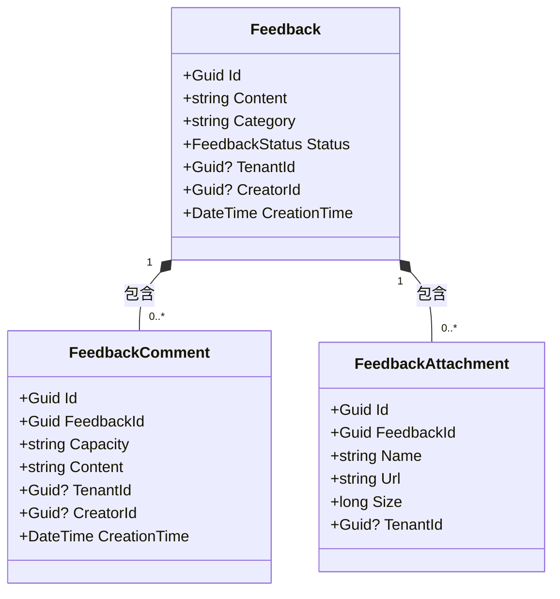
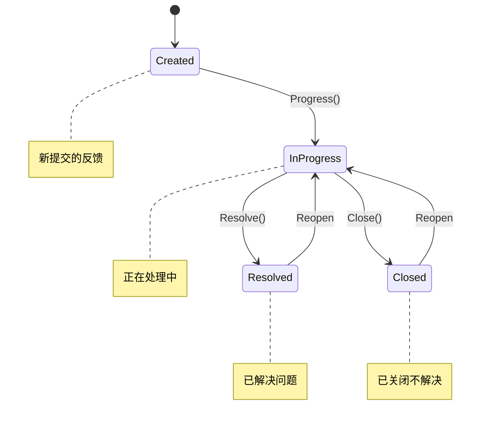

# 反馈管理模型

<cite>
**本文档引用的文件**
- [Feedback.cs](file://aspnet-core/modules/platform/LINGYUN.Platform.Domain/LINGYUN/Platform/Feedbacks/Feedback.cs)
- [FeedbackStatus.cs](file://aspnet-core/modules/platform/LINGYUN.Platform.Domain.Shared/LINGYUN/Platform/Feedbacks/FeedbackStatus.cs)
- [FeedbackConsts.cs](file://aspnet-core/modules/platform/LINGYUN.Platform.Domain.Shared/LINGYUN/Platform/Feedbacks/FeedbackConsts.cs)
- [FeedbackAttachmentConsts.cs](file://aspnet-core/modules/platform/LINGYUN.Platform.Domain.Shared/LINGYUN/Platform/Feedbacks/FeedbackAttachmentConsts.cs)
- [FeedbackCommentConsts.cs](file://aspnet-core/modules/platform/LINGYUN.Platform.Domain.Shared/LINGYUN/Platform/Feedbacks/FeedbackCommentConsts.cs)
- [FeedbackDto.cs](file://aspnet-core/modules/platform/LINGYUN.Platform.Application.Contracts/LINGYUN/Platform/Feedbacks/Dto/FeedbackDto.cs)
- [FeedbackCreateDto.cs](file://aspnet-core/modules/platform/LINGYUN.Platform.Application.Contracts/LINGYUN/Platform/Feedbacks/Dto/FeedbackCreateDto.cs)
- [FeedbackGetListInput.cs](file://aspnet-core/modules/platform/LINGYUN.Platform.Application.Contracts/LINGYUN/Platform/Feedbacks/Dto/FeedbackGetListInput.cs)
- [IFeedbackAppService.cs](file://aspnet-core/modules/platform/LINGYUN.Platform.Application.Contracts/LINGYUN/Platform/Feedbacks/IFeedbackAppService.cs)
- [FeedbackController.cs](file://aspnet-core/modules/platform/LINGYUN.Platform.HttpApi/LINGYUN/Platform/Feedbacks/FeedbackController.cs)
- [PlatformErrorCodes.cs](file://aspnet-core/modules/platform/LINGYUN.Platform.Domain.Shared/LINGYUN/Platform/PlatformErrorCodes.cs)
- [PlatformPermissionDefinitionProvider.cs](file://aspnet-core/modules/platform/LINGYUN.Platform.Application.Contracts/LINGYUN/Platform/Permissions/PlatformPermissionDefinitionProvider.cs)
</cite>

## 目录
1. [简介](#简介)
2. [反馈实体结构](#反馈实体结构)
3. [状态机实现](#状态机实现)
4. [数据隐私与安全](#数据隐私与安全)
5. [使用示例](#使用示例)

## 简介
本文档详细说明了平台模块中的反馈管理实体(Feedback)的设计与实现。反馈实体用于收集用户意见、问题报告和功能建议，支持附件上传、评论互动和状态跟踪。系统实现了完整的多租户支持，确保不同租户的数据隔离。

## 反馈实体结构

### 核心属性
反馈实体包含以下核心属性：

| 属性 | 类型 | 必填 | 最大长度 | 描述 |
|------|------|------|----------|------|
| Id | Guid | 是 | - | 唯一标识符 |
| Content | string | 是 | 255 | 反馈内容 |
| Category | string | 是 | 64 | 分类（如：Bug报告、功能建议） |
| Status | FeedbackStatus | 是 | - | 处理状态 |
| TenantId | Guid? | 是 | - | 租户ID（支持多租户） |
| CreatorId | Guid? | 是 | - | 创建者用户ID |
| CreationTime | DateTime | 是 | - | 创建时间 |

**Section sources**
- [Feedback.cs](file://aspnet-core/modules/platform/LINGYUN.Platform.Domain/LINGYUN/Platform/Feedbacks/Feedback.cs#L0-L162)
- [FeedbackConsts.cs](file://aspnet-core/modules/platform/LINGYUN.Platform.Domain.Shared/LINGYUN/Platform/Feedbacks/FeedbackConsts.cs#L0-L5)

### 关联实体
反馈实体与其他实体存在以下关联关系：



**Diagram sources**
- [Feedback.cs](file://aspnet-core/modules/platform/LINGYUN.Platform.Domain/LINGYUN/Platform/Feedbacks/Feedback.cs#L0-L162)
- [FeedbackComment.cs](file://aspnet-core/modules/platform/LINGYUN.Platform.Domain/LINGYUN/Platform/Feedbacks/FeedbackComment.cs#L0-L30)
- [FeedbackAttachment.cs](file://aspnet-core/modules/platform/LINGYUN.Platform.Domain/LINGYUN/Platform/Feedbacks/FeedbackAttachment.cs#L0-L33)

### 数据约束
系统定义了以下数据约束常量：

| 常量 | 值 | 描述 |
|------|-----|------|
| MaxCategoryLength | 64 | 分类最大长度 |
| MaxContentLength | 255 | 内容最大长度 |
| MaxNameLength | 64 | 附件名称最大长度 |
| MaxUrlLength | 255 | 附件URL最大长度 |
| MaxCapacityLength | 64 | 评论容量最大长度 |

**Section sources**
- [FeedbackConsts.cs](file://aspnet-core/modules/platform/LINGYUN.Platform.Domain.Shared/LINGYUN/Platform/Feedbacks/FeedbackConsts.cs#L0-L5)
- [FeedbackAttachmentConsts.cs](file://aspnet-core/modules/platform/LINGYUN.Platform.Domain.Shared/LINGYUN/Platform/Feedbacks/FeedbackAttachmentConsts.cs#L0-L5)
- [FeedbackCommentConsts.cs](file://aspnet-core/modules/platform/LINGYUN.Platform.Domain.Shared/LINGYUN/Platform/Feedbacks/FeedbackCommentConsts.cs#L0-L5)

## 状态机实现

### 状态定义
反馈实体支持四种处理状态：



**Diagram sources**
- [FeedbackStatus.cs](file://aspnet-core/modules/platform/LINGYUN.Platform.Domain.Shared/LINGYUN/Platform/Feedbacks/FeedbackStatus.cs#L0-L25)
- [Feedback.cs](file://aspnet-core/modules/platform/LINGYUN.Platform.Domain/LINGYUN/Platform/Feedbacks/Feedback.cs#L76-L140)

### 状态转换规则
系统通过方法调用来实现状态转换：

| 方法 | 当前状态 | 新状态 | 权限要求 |
|------|----------|--------|----------|
| Progress() | Created | InProgress | Feedback.ManageComments |
| Resolve() | InProgress | Resolved | Feedback.ManageComments |
| Close() | InProgress | Closed | Feedback.ManageComments |

状态验证逻辑防止在已关闭或已解决的状态下添加新评论：

```csharp
public Feedback ValidateStatus()
{
    if (Status == FeedbackStatus.Closed)
    {
        throw new FeedbackStatusException(PlatformErrorCodes.UnableFeedbackCommentInStatus, FeedbackStatus.Closed);
    }
    if (Status == FeedbackStatus.Resolved)
    {
        throw new FeedbackStatusException(PlatformErrorCodes.UnableFeedbackCommentInStatus, FeedbackStatus.Resolved);
    }
    return this;
}
```

**Section sources**
- [Feedback.cs](file://aspnet-core/modules/platform/LINGYUN.Platform.Domain/LINGYUN/Platform/Feedbacks/Feedback.cs#L76-L140)
- [PlatformErrorCodes.cs](file://aspnet-core/modules/platform/LINGYUN.Platform.Domain.Shared/LINGYUN/Platform/PlatformErrorCodes.cs#L0-L72)

## 数据隐私与安全

### 权限控制
系统实现了细粒度的权限控制：

```mermaid
flowchart TD
A[反馈权限组] --> B[创建]
A --> C[更新]
A --> D[删除]
A --> E[管理附件]
A --> F[管理评论]
G[API端点] --> H[POST /api/platform/feedbacks]
H --> I[需要 Create 权限]
J[GET /api/platform/feedbacks/{id}] --> K[需要 Default 权限]
L[DELETE /api/platform/feedbacks/{id}] --> M[需要 Delete 权限]
```

**Diagram sources**
- [PlatformPermissionDefinitionProvider.cs](file://aspnet-core/modules/platform/LINGYUN.Platform.Application.Contracts/LINGYUN/Platform/Permissions/PlatformPermissionDefinitionProvider.cs#L0-L65)
- [FeedbackController.cs](file://aspnet-core/modules/platform/LINGYUN.Platform.HttpApi/LINGYUN/Platform/Feedbacks/FeedbackController.cs#L0-L50)

### 错误处理
系统定义了专门的错误代码：

| 错误代码 | 消息 | 触发条件 |
|----------|------|----------|
| Platform:05101 | 无法对处于{Status}状态的问题进行评论 | 在Closed或Resolved状态下尝试添加评论 |
| Platform:05102 | 不能添加重复的附件 {Name}! | 上传同名附件 |
| Platform:05103 | 用户反馈未找到名为 {Name} 的附件! | 删除不存在的附件 |

**Section sources**
- [PlatformErrorCodes.cs](file://aspnet-core/modules/platform/LINGYUN.Platform.Domain.Shared/LINGYUN/Platform/PlatformErrorCodes.cs#L0-L72)
- [Feedback.cs](file://aspnet-core/modules/platform/LINGYUN.Platform.Domain/LINGYUN/Platform/Feedbacks/Feedback.cs#L56)
- [FeedbackAttachmentNotFoundException.cs](file://aspnet-core/modules/platform/LINGYUN.Platform.Domain/LINGYUN/Platform/Feedbacks/FeedbackAttachmentNotFoundException.cs#L0-L15)

### 数据保留
- 所有反馈数据永久保留，除非被明确删除
- 删除操作会同时移除相关评论和附件
- 支持软删除（IsDeleted标记），可配置为物理删除

## 使用示例

### 提交反馈
```http
POST /api/platform/feedbacks HTTP/1.1
Content-Type: application/json
Authorization: Bearer <token>

{
  "content": "登录页面响应缓慢",
  "category": "性能问题"
}
```

### 查询反馈列表
```http
GET /api/platform/feedbacks?Status=1&Category=Bug报告&Filter=登录 HTTP/1.1
Authorization: Bearer <token>
```

### 更新处理状态
```http
POST /api/platform/feedbacks/{id}/progress HTTP/1.1
Content-Type: application/json
Authorization: Bearer <token>

{
  "capacity": "技术支持",
  "content": "正在调查问题..."
}
```

### 添加附件
```http
POST /api/platform/feedbacks/{id}/attachments HTTP/1.1
Content-Type: application/json
Authorization: Bearer <token>

{
  "name": "error_log.txt",
  "url": "/uploads/error_log_abc123.txt",
  "size": 10240
}
```

**Section sources**
- [IFeedbackAppService.cs](file://aspnet-core/modules/platform/LINGYUN.Platform.Application.Contracts/LINGYUN/Platform/Feedbacks/IFeedbackAppService.cs#L0-L15)
- [FeedbackController.cs](file://aspnet-core/modules/platform/LINGYUN.Platform.HttpApi/LINGYUN/Platform/Feedbacks/FeedbackController.cs#L0-L50)
- [FeedbackDto.cs](file://aspnet-core/modules/platform/LINGYUN.Platform.Application.Contracts/LINGYUN/Platform/Feedbacks/Dto/FeedbackDto.cs#L0-L12)
- [FeedbackGetListInput.cs](file://aspnet-core/modules/platform/LINGYUN.Platform.Application.Contracts/LINGYUN/Platform/Feedbacks/Dto/FeedbackGetListInput.cs#L0-L8)