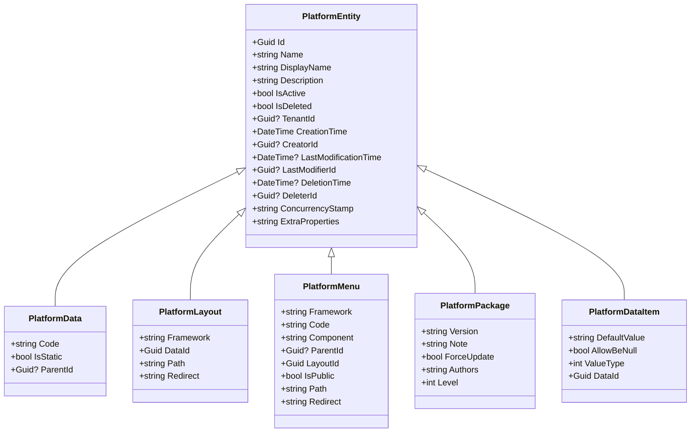

# 平台实体模型

<cite>
**本文档引用的文件**  
- [PlatformType.cs](file://aspnet-core/modules/platform/LINGYUN.Platform.Domain.Shared/LINGYUN/Platform/PlatformType.cs)
- [PlatformConsts.cs](file://aspnet-core/modules/platform/LINGYUN.Platform.Domain.Shared/LINGYUN/Platform/PlatformConsts.cs)
- [PlatformDomainModule.cs](file://aspnet-core/modules/platform/LINGYUN.Platform.Domain/LINGYUN/Platform/PlatformDomainModule.cs)
- [PlatformMigrationsDbContext.cs](file://aspnet-core/migrations/LY.MicroService.Platform.EntityFrameworkCore/PlatformMigrationsDbContext.cs)
- [20230110015904_Initial-Platform.cs](file://aspnet-core/migrations/LY.MicroService.Platform.EntityFrameworkCore/Migrations/20230110015904_Initial-Platform.cs)
- [PlatformApplicationCurdAppServiceBase.cs](file://aspnet-core/modules/platform/LINGYUN.Platform.Application/LINGYUN/Platform/PlatformApplicationCurdAppServiceBase.cs)
- [PlatformSettingDefinitionProvider.cs](file://aspnet-core/modules/platform/LINGYUN.Platform.Domain/LINGYUN/Platform/Settings/PlatformSettingDefinitionProvider.cs)
- [PlatformErrorCodes.cs](file://aspnet-core/modules/platform/LINGYUN.Platform.Domain.Shared/LINGYUN/Platform/PlatformErrorCodes.cs)
</cite>

## 目录
1. [引言](#引言)
2. [平台实体属性定义](#平台实体属性定义)
3. [平台与租户关系设计](#平台与租户关系设计)
4. [平台级别配置管理机制](#平台级别配置管理机制)
5. [实体生命周期管理](#实体生命周期管理)
6. [数据验证规则与业务约束](#数据验证规则与业务约束)
7. [实体使用示例与集成点](#实体使用示例与集成点)
8. [实体扩展指导](#实体扩展指导)
9. [结论](#结论)

## 引言
平台实体模型是ABP微服务架构中的核心组件，用于管理多平台、多租户环境下的系统配置、布局、菜单、数据包等资源。该模型支持Web、移动端、桌面端等多种平台类型，并提供灵活的配置管理和扩展机制。本文档详细说明平台实体的属性定义、生命周期管理、数据验证规则以及与其他模块的集成方式，为开发人员提供全面的使用和扩展指导。

## 平台实体属性定义
平台实体模型包含多个核心字段，用于描述平台的基本信息、状态和配置。主要实体包括平台数据（AppPlatformDatas）、布局（AppPlatformLayouts）、菜单（AppPlatformMenus）、数据包（AppPlatformPackages）等。

### 核心属性字段
平台实体的通用属性字段包括：

**基础信息字段**
- `Id`: 唯一标识符（GUID类型）
- `Name`: 名称（最大长度64字符，必填）
- `DisplayName`: 显示名称（最大长度128字符，必填）
- `Description`: 描述（最大长度1024字符，可选）
- `Code`: 编码（最大长度1024字符，必填）

**状态与控制字段**
- `IsActive`: 激活状态（布尔类型）
- `IsDeleted`: 删除状态（布尔类型，默认false）
- `IsStatic`: 静态标识（布尔类型）
- `TenantId`: 租户ID（GUID类型，可选，支持多租户）

**审计与版本字段**
- `CreationTime`: 创建时间（DateTime类型，必填）
- `CreatorId`: 创建者ID（GUID类型，可选）
- `LastModificationTime`: 最后修改时间（DateTime类型，可选）
- `LastModifierId`: 最后修改者ID（GUID类型，可选）
- `DeleterId`: 删除者ID（GUID类型，可选）
- `DeletionTime`: 删除时间（DateTime类型，可选）
- `ConcurrencyStamp`: 并发戳（最大长度40字符）
- `ExtraProperties`: 扩展属性（JSON格式字符串）

**平台类型字段**
- `Framework`: 框架类型（PlatformType枚举，最大长度64字符）
- `ParentId`: 父级ID（GUID类型，可选，用于构建层级结构）

**特定实体字段**
- **布局实体**: `Path`（路径）、`Redirect`（重定向地址）、`Component`（组件）
- **菜单实体**: `Component`（组件）、`LayoutId`（布局ID）、`IsPublic`（公开标识）
- **数据包实体**: `Version`（版本号）、`Note`（备注）、`ForceUpdate`（强制更新标识）
- **数据项实体**: `DefaultValue`（默认值）、`AllowBeNull`（允许为空）、`ValueType`（值类型）

**图示来源**
- [20230110015904_Initial-Platform.cs](file://aspnet-core/migrations/LY.MicroService.Platform.EntityFrameworkCore/Migrations/20230110015904_Initial-Platform.cs)

**节来源**
- [20230110015904_Initial-Platform.cs](file://aspnet-core/migrations/LY.MicroService.Platform.EntityFrameworkCore/Migrations/20230110015904_Initial-Platform.cs)
- [PlatformType.cs](file://aspnet-core/modules/platform/LINGYUN.Platform.Domain.Shared/LINGYUN/Platform/PlatformType.cs)

## 平台与租户关系设计
平台实体模型采用多租户架构设计，通过`TenantId`字段实现租户隔离，支持单实例多租户部署模式。

### 多租户支持机制
平台实体通过以下方式实现租户隔离：

1. **租户标识字段**: 所有支持多租户的实体都包含`TenantId`字段（GUID类型），用于标识所属租户
2. **数据隔离策略**: 在查询和操作数据时，自动添加租户过滤条件，确保各租户只能访问自己的数据
3. **共享资源管理**: 静态实体（`IsStatic = true`）可以被所有租户共享，非静态实体则属于特定租户
4. **租户级配置**: 支持为每个租户配置独立的平台设置，实现租户个性化

### 租户关系模型
平台实体与租户的关系通过以下方式体现：

- **平台数据（PlatformData）**: 可以是租户特定的配置数据，也可以是全局共享的静态数据
- **布局（Layout）**: 支持租户级布局定制，每个租户可以有自己的布局方案
- **菜单（Menu）**: 支持租户级菜单配置，允许不同租户拥有不同的菜单结构
- **数据包（Package）**: 支持租户级数据包管理，每个租户可以独立管理自己的数据包
- **用户菜单（UserMenu）**: 记录用户对菜单的个性化设置，