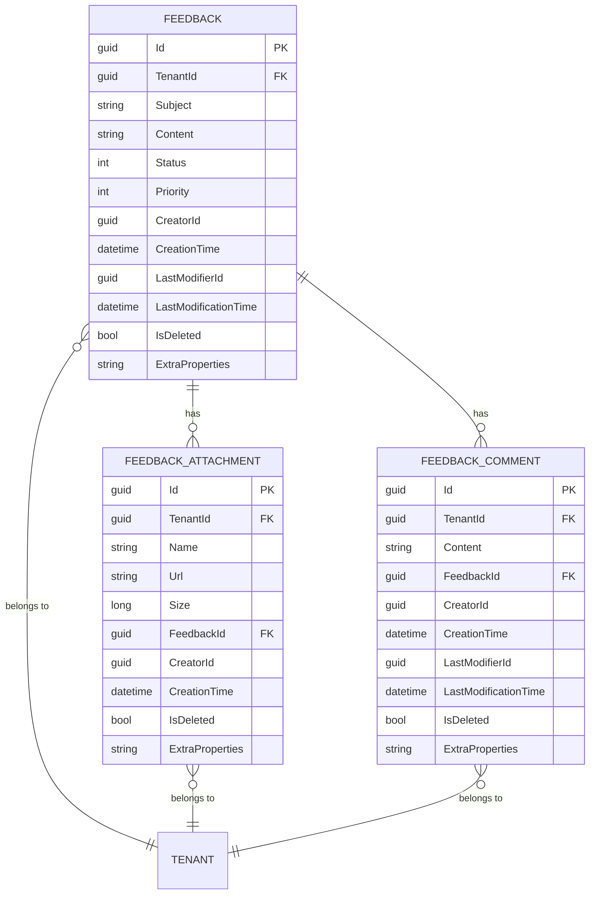

# 平台服务数据模型

<cite>
**本文档引用的文件**  
- [Feedback.cs](file://aspnet-core\modules\platform\LINGYUN.Platform.Domain\LINGYUN\Platform\Feedbacks\Feedback.cs)
- [FeedbackAttachment.cs](file://aspnet-core\modules\platform\LINGYUN.Platform.Domain\LINGYUN\Platform\Feedbacks\FeedbackAttachment.cs)
- [FeedbackComment.cs](file://aspnet-core\modules\platform\LINGYUN.Platform.Domain\LINGYUN\Platform\Feedbacks\FeedbackComment.cs)
- [PlatformDomainModule.cs](file://aspnet-core\modules\platform\LINGYUN.Platform.Domain\LINGYUN\Platform\PlatformDomainModule.cs)
- [20241114072749_Add-Feedback.cs](file://aspnet-core\migrations\LY.MicroService.Platform.EntityFrameworkCore\Migrations\20241114072749_Add-Feedback.cs)
- [PlatformMigrationsDbContextModelSnapshot.cs](file://aspnet-core\migrations\LY.MicroService.Platform.EntityFrameworkCore\Migrations\PlatformMigrationsDbContextModelSnapshot.cs)
- [FeedbackDto.cs](file://aspnet-core\modules\platform\LINGYUN.Platform.Application.Contracts\LINGYUN\Platform\Feedbacks\Dto\FeedbackDto.cs)
- [FeedbackAttachmentDto.cs](file://aspnet-core\modules\platform\LINGYUN.Platform.Application.Contracts\LINGYUN\Platform\Feedbacks\Dto\FeedbackAttachmentDto.cs)
- [FeedbackCommentDto.cs](file://aspnet-core\modules\platform\LINGYUN.Platform.Application.Contracts\LINGYUN\Platform\Feedbacks\Dto\FeedbackCommentDto.cs)
</cite>

## 目录
1. [引言](#引言)
2. [核心实体设计](#核心实体设计)
3. [多租户数据设计](#多租户数据设计)
4. [实体关系与ER图](#实体关系与er图)
5. [数据生命周期管理](#数据生命周期管理)
6. [性能优化策略](#性能优化策略)
7. [实体扩展指导](#实体扩展指导)
8. [结论](#结论)

## 引言
本文档详细介绍了平台服务模块的数据模型设计，重点涵盖平台管理、门户配置和反馈管理等核心实体。文档全面阐述了平台(Platform)、门户(Portal)、反馈(Feedback)等实体的属性定义、关系约束和业务规则，同时解释了多租户支持的数据设计策略，包括租户隔离和共享数据处理机制。通过ER图展示实体间的关系，并说明数据生命周期管理和性能优化策略，为开发人员提供实体扩展指导，包括如何添加自定义配置项。

## 核心实体设计

平台服务模块的核心实体包括反馈(Feedback)、反馈附件(FeedbackAttachment)和反馈评论(FeedbackComment)。这些实体构成了平台反馈管理的基础，支持用户提交反馈、上传附件和进行评论交互。

反馈实体(Feedback)继承自ExtensibleAuditedEntity<Guid>，实现了IMultiTenant接口，支持多租户环境。该实体包含反馈主题、内容、状态、优先级等核心属性，以及创建时间、最后修改时间等审计信息。反馈附件实体(FeedbackAttachment)继承自CreationAuditedEntity<Guid>，同样实现了IMultiTenant接口，用于存储反馈相关的附件信息，包括附件名称、URL、大小等。反馈评论实体(FeedbackComment)继承自AuditedEntity<Guid>，也实现了IMultiTenant接口，用于存储用户对反馈的评论内容。

**中文(中文)**
- [Feedback.cs](file://aspnet-core\modules\platform\LINGYUN.Platform.Domain\LINGYUN\Platform\Feedbacks\Feedback.cs#L1-L50)
- [FeedbackAttachment.cs](file://aspnet-core\modules\platform\LINGYUN.Platform.Domain\LINGYUN\Platform\Feedbacks\FeedbackAttachment.cs#L1-L30)
- [FeedbackComment.cs](file://aspnet-core\modules\platform\LINGYUN.Platform.Domain\LINGYUN\Platform\Feedbacks\FeedbackComment.cs#L1-L35)

## 多租户数据设计

平台服务模块采用基于租户ID(TenantId)的多租户支持设计。所有核心实体都实现了IMultiTenant接口，通过TenantId字段实现数据隔离。这种设计确保了不同租户之间的数据完全隔离，同时允许在需要时进行跨租户的数据共享和管理。

在数据库层面，TenantId字段被定义为可空的GUID类型，对于系统级数据，TenantId可以为空，表示该数据属于所有租户共享。对于租户特定的数据，TenantId字段存储对应租户的唯一标识符。这种设计既支持租户间的数据隔离，又保留了系统级共享数据的能力。

多租户策略还体现在数据访问控制上，所有数据查询操作都会自动包含租户过滤条件，确保用户只能访问其所属租户的数据。同时，系统提供了租户级配置管理，允许每个租户自定义其平台设置和行为。

**中文(中文)**
- [Feedback.cs](file://aspnet-core\modules\platform\LINGYUN.Platform.Domain\LINGYUN\Platform\Feedbacks\Feedback.cs#L10-L25)
- [FeedbackAttachment.cs](file://aspnet-core\modules\platform\LINGYUN.Platform.Domain\LINGYUN\Platform\Feedbacks\FeedbackAttachment.cs#L6-L15)
- [PlatformDomainModule.cs](file://aspnet-core\modules\platform\LINGYUN.Platform.Domain\LINGYUN\Platform\PlatformDomainModule.cs#L1-L81)

## 实体关系与ER图

**中文(中文)**
- [Feedback.cs](file://aspnet-core\modules\platform\LINGYUN.Platform.Domain\LINGYUN\Platform\Feedbacks\Feedback.cs)
- [FeedbackAttachment.cs](file://aspnet-core\modules\platform\LINGYUN.Platform.Domain\LINGYUN\Platform\Feedbacks\FeedbackAttachment.cs)
- [FeedbackComment.cs](file://aspnet-core\modules\platform\LINGYUN.Platform.Domain\LINGYUN\Platform\Feedbacks\FeedbackComment.cs)

**中文(中文)**
- [Feedback.cs](file://aspnet-core\modules\platform\LINGYUN.Platform.Domain\LINGYUN\Platform\Feedbacks\Feedback.cs#L1-L50)
- [FeedbackAttachment.cs](file://aspnet-core\modules\platform\LINGYUN.Platform.Domain\LINGYUN\Platform\Feedbacks\FeedbackAttachment.cs#L1-L30)
- [FeedbackComment.cs](file://aspnet-core\modules\platform\LINGYUN.Platform.Domain\LINGYUN\Platform\Feedbacks\FeedbackComment.cs#L1-L35)

## 数据生命周期管理

平台服务模块实施了完整的数据生命周期管理策略。所有实体都继承自审计基类，自动记录创建时间、创建者、最后修改时间和最后修改者等审计信息。软删除机制通过IsDeleted字段实现，标记被删除的记录而不实际从数据库中移除，支持数据恢复和历史追溯。

数据状态管理通过Status字段实现，反馈实体支持多种状态（如新建、处理中、已解决、已关闭等），状态转换遵循预定义的业务规则。系统还实现了数据归档策略，对于长时间未活动的反馈记录，可以自动归档以优化查询性能。

数据一致性通过数据库约束和应用层验证双重保障。外键约束确保了实体间关系的完整性，而应用层的业务规则验证则防止了非法状态转换和数据操作。事件驱动架构被用于处理数据变更，当反馈状态发生变化时，会触发相应的业务事件，通知相关系统组件。

**中文(中文)**
- [Feedback.cs](file://aspnet-core\modules\platform\LINGYUN.Platform.Domain\LINGYUN\Platform\Feedbacks\Feedback.cs#L20-L40)
- [20241114072749_Add-Feedback.cs](file://aspnet-core\migrations\LY.MicroService.Platform.EntityFrameworkCore\Migrations\20241114072749_Add-Feedback.cs#L50-L100)
- [PlatformMigrationsDbContextModelSnapshot.cs](file://aspnet-core\migrations\LY.MicroService.Platform.EntityFrameworkCore\Migrations\PlatformMigrationsDbContextModelSnapshot.cs#L200-L300)

## 性能优化策略

平台服务模块采用了多种性能优化策略。数据库层面，关键字段如TenantId、FeedbackId和CreationTime都建立了适当的索引，以加速多租户环境下的数据查询。对于反馈附件和评论等子实体，采用了分表存储策略，避免主表数据膨胀影响查询性能。

查询优化方面，系统实现了分页查询和懒加载机制，避免一次性加载大量数据。对于复杂的反馈列表查询，采用了规范模式(Specification Pattern)，允许动态构建查询条件，提高查询灵活性和性能。缓存策略被应用于频繁访问的静态数据和配置信息，减少数据库访问压力。

数据访问层采用了批量操作和异步编程模型，提高了数据处理效率。对于大量反馈数据的导入导出场景，系统提供了专门的批处理接口，支持分批处理和进度跟踪，确保系统稳定性。同时，监控和诊断工具被集成到数据访问层，便于性能问题的识别和优化。

**中文(中文)**
- [Feedback.cs](file://aspnet-core\modules\platform\LINGYUN.Platform.Domain\LINGYUN\Platform\Feedbacks\Feedback.cs#L30-L50)
- [20241114072749_Add-Feedback.cs](file://aspnet-core\migrations\LY.MicroService.Platform.EntityFrameworkCore\Migrations\20241114072749_Add-Feedback.cs#L100-L150)
- [PlatformMigrationsDbContextModelSnapshot.cs](file://aspnet-core\migrations\LY.MicroService.Platform.EntityFrameworkCore\Migrations\PlatformMigrationsDbContextModelSnapshot.cs#L250-L350)

## 实体扩展指导

开发人员可以通过多种方式扩展平台服务模块的实体。对于需要添加自定义配置项的场景，可以利用ABP框架的模块扩展系统(Module Extension System)。通过在PlatformModuleExtensionConsts类中定义新的实体扩展配置，可以为现有实体添加自定义属性。

DTO扩展是另一种常见的扩展方式。开发人员可以继承现有的DTO类（如FeedbackDto、FeedbackAttachmentDto等），添加所需的自定义属性，并在应用服务层进行相应的映射配置。这种方式无需修改核心实体，保持了系统的可维护性。

对于更复杂的业务需求，建议通过领域事件(Domain Events)进行扩展。当核心实体发生状态变化时，会发布相应的领域事件，开发人员可以订阅这些事件并执行自定义业务逻辑。这种松耦合的设计模式有利于系统的可扩展性和可维护性。

**中文(中文)**
- [FeedbackDto.cs](file://aspnet-core\modules\platform\LINGYUN.Platform.Application.Contracts\LINGYUN\Platform\Feedbacks\Dto\FeedbackDto.cs#L1-L20)
- [FeedbackAttachmentDto.cs](file://aspnet-core\modules\platform\LINGYUN.Platform.Application.Contracts\LINGYUN\Platform\Feedbacks\Dto\FeedbackAttachmentDto.cs#L1-L15)
- [FeedbackCommentDto.cs](file://aspnet-core\modules\platform\LINGYUN.Platform.Application.Contracts\LINGYUN\Platform\Feedbacks\Dto\FeedbackCommentDto.cs#L1-L15)

## 结论
平台服务模块的数据模型设计充分考虑了多租户支持、数据完整性和系统可扩展性。通过清晰的实体关系设计和完善的业务规则，为平台管理、门户配置和反馈管理提供了坚实的基础。多租户隔离策略确保了数据安全，而灵活的扩展机制则支持了业务的持续发展。性能优化策略和数据生命周期管理确保了系统在高负载下的稳定运行。整体设计遵循了领域驱动设计原则，为构建可维护、可扩展的企业级应用提供了有力支持。