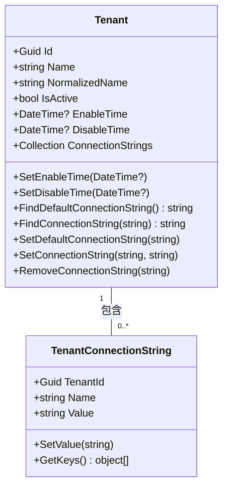
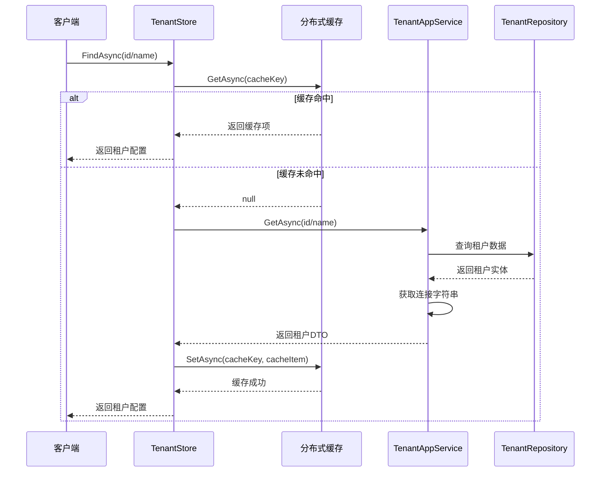
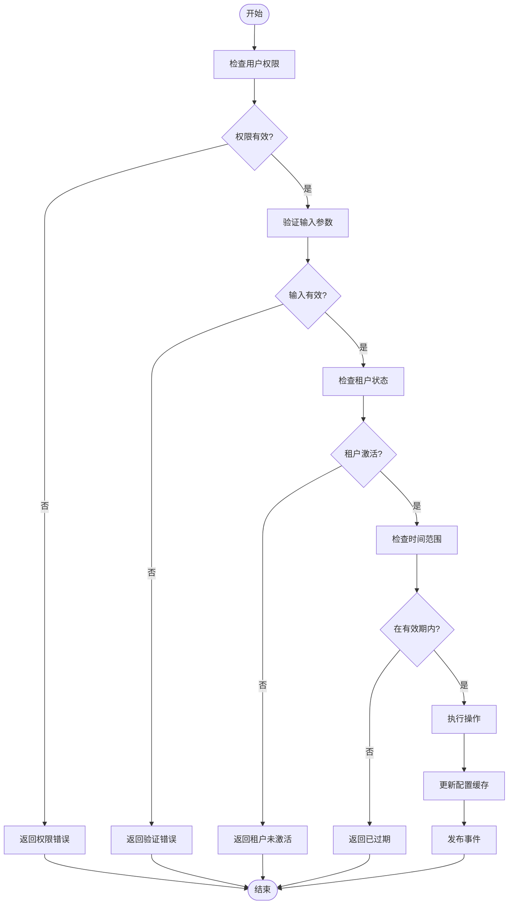
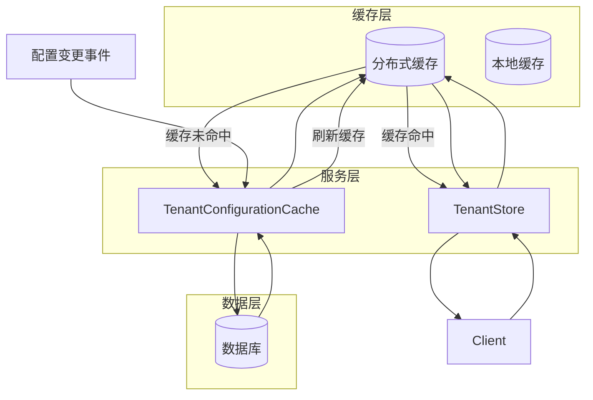
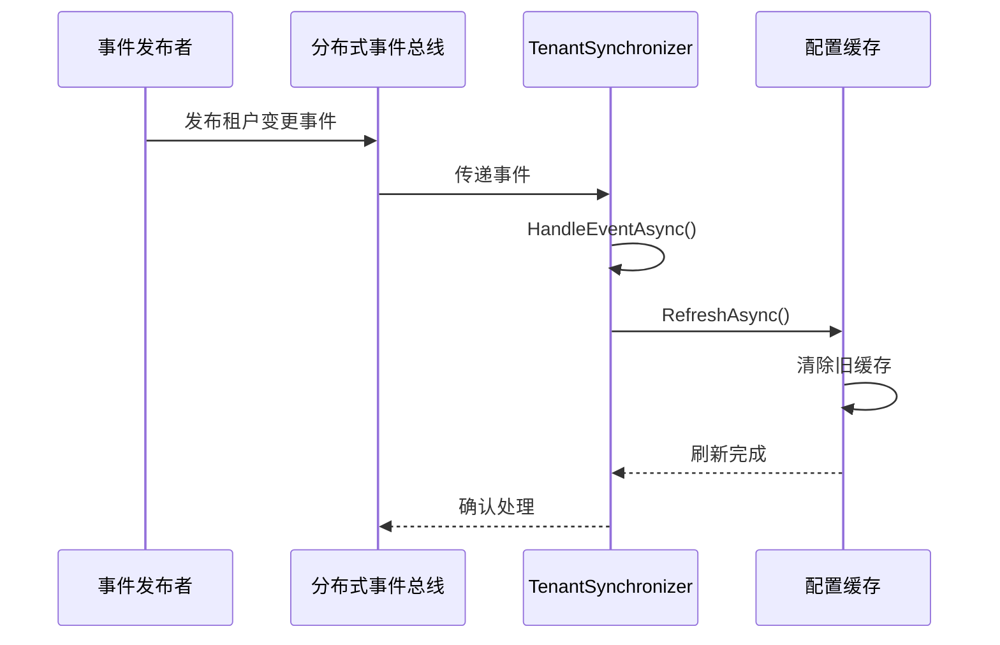
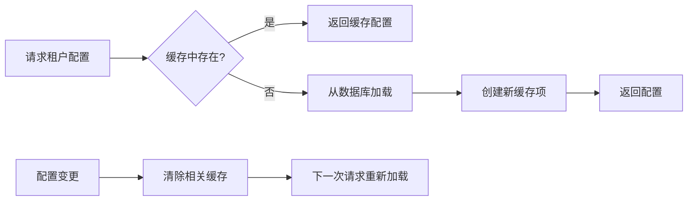
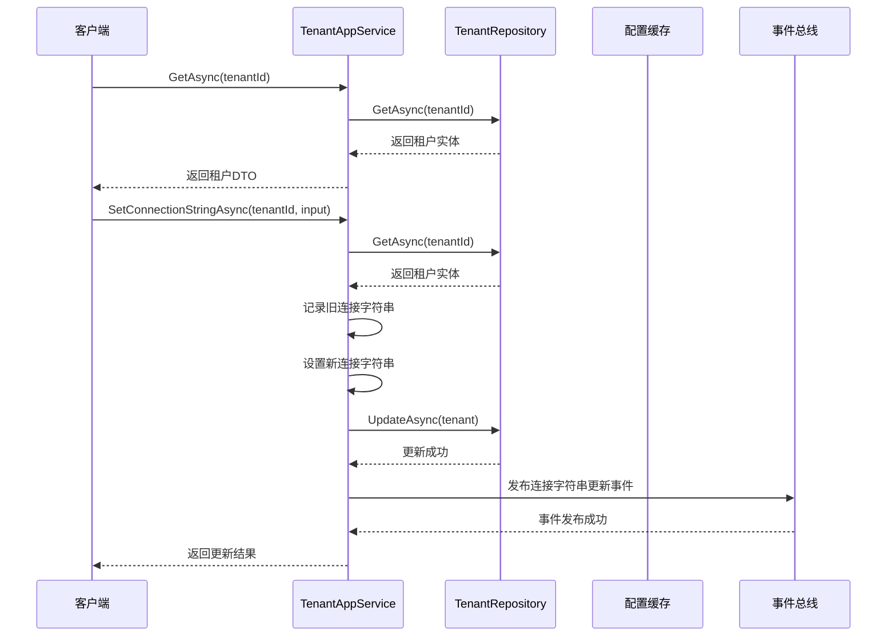

# 租户隔离策略

<cite>
**本文档引用的文件**
- [Tenant.cs](file://aspnet-core/modules/saas/LINGYUN.Abp.Saas.Domain/LINGYUN/Abp/Saas/Tenants/Tenant.cs)
- [TenantStore.cs](file://aspnet-core/modules/saas/LINGYUN.Abp.MultiTenancy.Saas/LINGYUN/Abp/MultiTenancy/Saas/TenantStore.cs)
- [TenantAppService.cs](file://aspnet-core/modules/saas/LINGYUN.Abp.Saas.Application/LINGYUN/Abp/Saas/Tenants/TenantAppService.cs)
- [TenantConfigurationCache.cs](file://aspnet-core/services/LY.MicroService.Applications.Single/MultiTenancy/TenantConfigurationCache.cs)
- [TenantSynchronizer.cs](file://aspnet-core/services/LY.MicroService.Applications.Single/EventBus/Distributed/TenantSynchronizer.cs)
- [TenantConnectionString.cs](file://aspnet-core/modules/saas/LINGYUN.Abp.Saas.Domain/LINGYUN/Abp/Saas/Tenants/TenantConnectionString.cs)
- [ITenantValidator.cs](file://aspnet-core/modules/saas/LINGYUN.Abp.Saas.Domain/LINGYUN/Abp/Saas/Tenants/ITenantValidator.cs)
</cite>

## 目录
1. [引言](#引言)
2. [租户数据存储策略](#租户数据存储策略)
3. [租户配置继承与覆盖机制](#租户配置继承与覆盖机制)
4. [访问控制与安全考虑](#访问控制与安全考虑)
5. [性能优化方法](#性能优化方法)
6. [跨租户数据共享实现](#跨租户数据共享实现)
7. [租户配置优先级规则](#租户配置优先级规则)
8. [实际代码示例](#实际代码示例)
9. [结论](#结论)

## 引言
本文档详细介绍了平台服务的多租户隔离策略，涵盖了租户级别的数据设计、存储策略、访问控制和性能优化方法。系统通过完善的租户配置继承与覆盖机制，确保了不同租户之间的数据隔离和安全性。文档还解释了租户配置的优先级规则和合并策略，并提供了跨租户数据共享的实现方式。

## 租户数据存储策略
平台采用基于租户ID的数据隔离策略，每个租户拥有独立的数据存储空间。系统通过`Tenant`实体类管理租户信息，包括租户名称、状态、启用时间、禁用时间等核心属性。租户连接字符串通过`TenantConnectionString`实体进行管理，实现了租户特定数据库连接的灵活配置。

**图源**
- [Tenant.cs](file://aspnet-core/modules/saas/LINGYUN.Abp.Saas.Domain/LINGYUN/Abp/Saas/Tenants/Tenant.cs)
- [TenantConnectionString.cs](file://aspnet-core/modules/saas/LINGYUN.Abp.Saas.Domain/LINGYUN/Abp/Saas/Tenants/TenantConnectionString.cs)

**章节来源**
- [Tenant.cs](file://aspnet-core/modules/saas/LINGYUN.Abp.Saas.Domain/LINGYUN/Abp/Saas/Tenants/Tenant.cs#L41-L89)
- [TenantConnectionString.cs](file://aspnet-core/modules/saas/LINGYUN.Abp.Saas.Domain/LINGYUN/Abp/Saas/Tenants/TenantConnectionString.cs#L0-L36)

## 租户配置继承与覆盖机制
系统实现了灵活的租户配置继承与覆盖机制。当租户需要特定配置时，可以在租户级别进行设置，这些设置会覆盖全局默认配置。`TenantStore`类负责管理租户配置的获取和缓存，通过分布式缓存提高配置读取性能。

**图源**
- [TenantStore.cs](file://aspnet-core/modules/saas/LINGYUN.Abp.MultiTenancy.Saas/LINGYUN/Abp/MultiTenancy/Saas/TenantStore.cs)
- [TenantAppService.cs](file://aspnet-core/modules/saas/LINGYUN.Abp.Saas.Application/LINGYUN/Abp/Saas/Tenants/TenantAppService.cs)

**章节来源**
- [TenantStore.cs](file://aspnet-core/modules/saas/LINGYUN.Abp.MultiTenancy.Saas/LINGYUN/Abp/MultiTenancy/Saas/TenantStore.cs#L43-L148)
- [TenantAppService.cs](file://aspnet-core/modules/saas/LINGYUN.Abp.Saas.Application/LINGYUN/Abp/Saas/Tenants/TenantAppService.cs#L109-L147)

## 访问控制与安全考虑
系统实施严格的访问控制机制，确保租户数据的安全性。`ITenantValidator`接口定义了租户验证契约，允许在租户创建或更新时执行自定义验证逻辑。所有敏感操作都受到权限控制，只有授权用户才能执行租户配置的修改。

**图源**
- [ITenantValidator.cs](file://aspnet-core/modules/saas/LINGYUN.Abp.Saas.Domain/LINGYUN/Abp/Saas/Tenants/ITenantValidator.cs)
- [TenantAppService.cs](file://aspnet-core/modules/saas/LINGYUN.Abp.Saas.Application/LINGYUN/Abp/Saas/Tenants/TenantAppService.cs)

**章节来源**
- [ITenantValidator.cs](file://aspnet-core/modules/saas/LINGYUN.Abp.Saas.Domain/LINGYUN/Abp/Saas/Tenants/ITenantValidator.cs#L0-L7)
- [TenantAppService.cs](file://aspnet-core/modules/saas/LINGYUN.Abp.Saas.Application/LINGYUN/Abp/Saas/Tenants/TenantAppService.cs#L146-L184)

## 性能优化方法
为提高系统性能，平台采用了多层次的缓存策略。`TenantConfigurationCache`类使用分布式缓存存储租户配置，减少数据库查询压力。当租户配置发生变化时，通过事件总线通知所有相关服务刷新本地缓存，确保配置的一致性。

**图源**
- [TenantConfigurationCache.cs](file://aspnet-core/services/LY.MicroService.Applications.Single/MultiTenancy/TenantConfigurationCache.cs)
- [TenantStore.cs](file://aspnet-core/modules/saas/LINGYUN.Abp.MultiTenancy.Saas/LINGYUN/Abp/MultiTenancy/Saas/TenantStore.cs)

**章节来源**
- [TenantConfigurationCache.cs](file://aspnet-core/services/LY.MicroService.Applications.Single/MultiTenancy/TenantConfigurationCache.cs#L0-L59)
- [TenantStore.cs](file://aspnet-core/modules/saas/LINGYUN.Abp.MultiTenancy.Saas/LINGYUN/Abp/MultiTenancy/Saas/TenantStore.cs#L79-L109)

## 跨租户数据共享实现
虽然系统主要强调数据隔离，但也支持有限的跨租户数据共享场景。通过事件总线机制，租户间的变更可以被其他服务订阅和处理。`TenantSynchronizer`类监听租户相关的分布式事件，并在配置变更时触发相应的同步操作。

**图源**
- [TenantSynchronizer.cs](file://aspnet-core/services/LY.MicroService.Applications.Single/EventBus/Distributed/TenantSynchronizer.cs)
- [TenantConfigurationCache.cs](file://aspnet-core/services/LY.MicroService.Applications.Single/MultiTenancy/TenantConfigurationCache.cs)

**章节来源**
- [TenantSynchronizer.cs](file://aspnet-core/services/LY.MicroService.Applications.Single/EventBus/Distributed/TenantSynchronizer.cs#L32-L52)
- [TenantConfigurationCache.cs](file://aspnet-core/services/LY.MicroService.Applications.Single/MultiTenancy/TenantConfigurationCache.cs#L0-L10)

## 租户配置优先级规则
系统遵循明确的配置优先级规则：租户级别配置 > 全局默认配置。当查询租户配置时，系统首先尝试从缓存中获取，如果缓存中不存在，则从数据库加载并建立新的缓存项。这种机制确保了配置读取的高效性和一致性。

**章节来源**
- [TenantStore.cs](file://aspnet-core/modules/saas/LINGYUN.Abp.MultiTenancy.Saas/LINGYUN/Abp/MultiTenancy/Saas/TenantStore.cs#L43-L82)
- [TenantConfigurationCache.cs](file://aspnet-core/services/LY.MicroService.Applications.Single/MultiTenancy/TenantConfigurationCache.cs#L0-L59)

## 实际代码示例
以下示例展示了租户数据的查询和更新操作：

**图源**
- [TenantAppService.cs](file://aspnet-core/modules/saas/LINGYUN.Abp.Saas.Application/LINGYUN/Abp/Saas/Tenants/TenantAppService.cs)
- [TenantRepository.cs](file://aspnet-core/modules/saas/LINGYUN.Abp.Saas.Domain/LINGYUN/Abp/Saas/Tenants/TenantRepository.cs)

**章节来源**
- [TenantAppService.cs](file://aspnet-core/modules/saas/LINGYUN.Abp.Saas.Application/LINGYUN/Abp/Saas/Tenants/TenantAppService.cs#L214-L255)
- [TenantAppService.cs](file://aspnet-core/modules/saas/LINGYUN.Abp.Saas.Application/LINGYUN/Abp/Saas/Tenants/TenantAppService.cs#L251-L291)

## 结论
本平台的多租户隔离策略通过完善的架构设计和实现，确保了租户数据的安全性、隔离性和高性能访问。系统采用分层缓存机制优化性能，通过事件驱动架构保证配置的一致性，并实施严格的访问控制保障数据安全。租户配置的继承与覆盖机制提供了灵活性，同时保持了系统的可维护性。