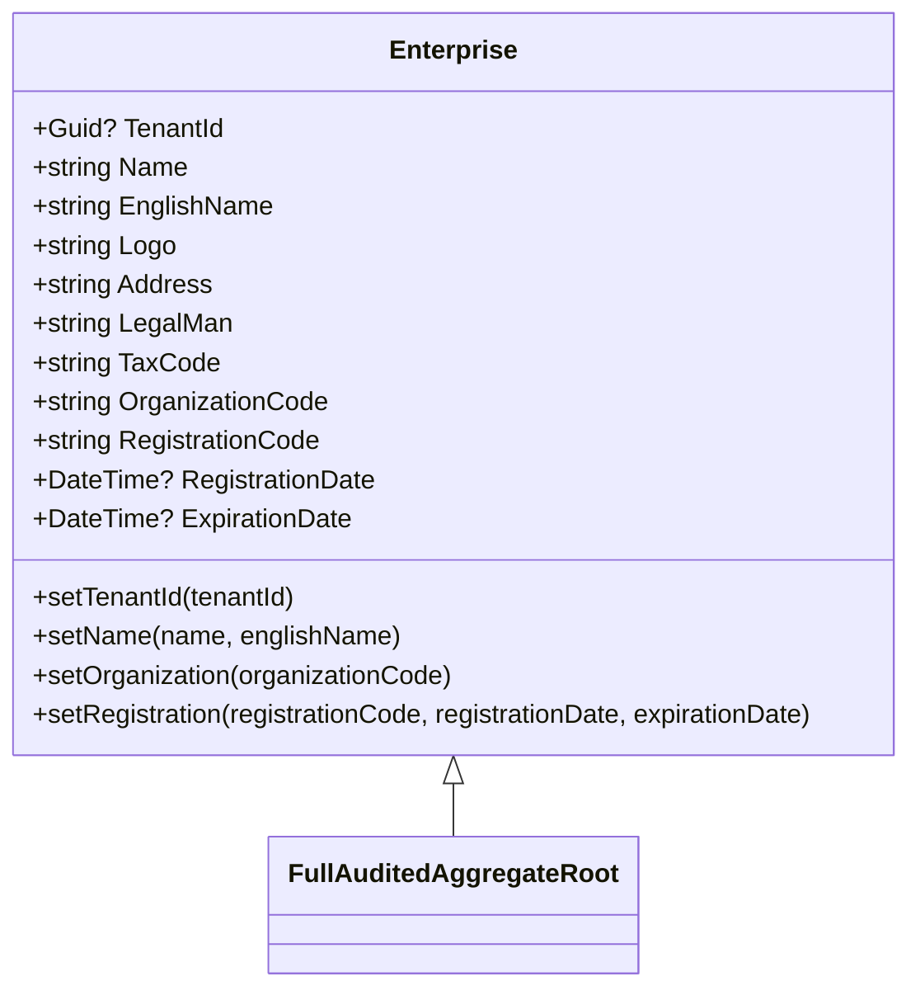
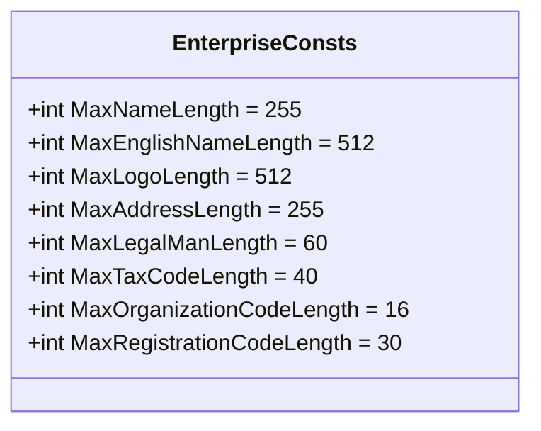
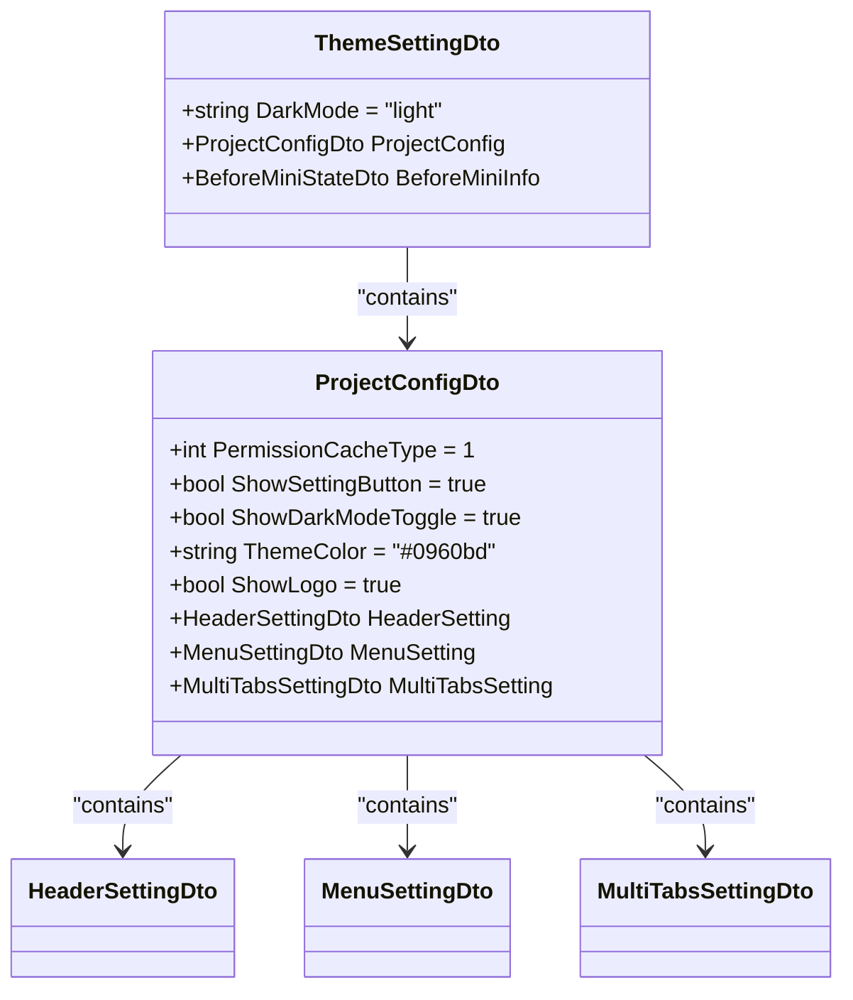
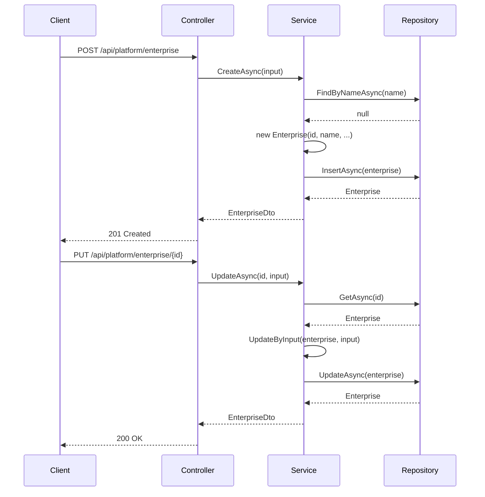
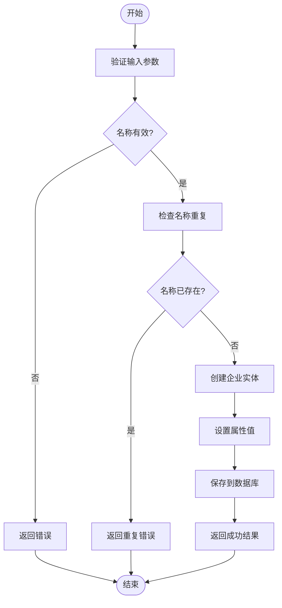

# 门户配置模型

<cite>
**本文档引用的文件**
- [Enterprise.cs](file://aspnet-core/modules/platform/LINGYUN.Platform.Domain/LINGYUN/Platform/Portal/Enterprise.cs)
- [EnterpriseDto.cs](file://aspnet-core/modules/platform/LINGYUN.Platform.Application.Contracts/LINGYUN/Platform/Portal/Dto/EnterpriseDto.cs)
- [EnterpriseCreateDto.cs](file://aspnet-core/modules/platform/LINGYUN.Platform.Application.Contracts/LINGYUN/Platform/Portal/Dto/EnterpriseCreateDto.cs)
- [EnterpriseCreateOrUpdateDto.cs](file://aspnet-core/modules/platform/LINGYUN.Platform.Application.Contracts/LINGYUN/Platform/Portal/Dto/EnterpriseCreateOrUpdateDto.cs)
- [EnterpriseUpdateDto.cs](file://aspnet-core/modules/platform/LINGYUN.Platform.Application.Contracts/LINGYUN/Platform/Portal/Dto/EnterpriseUpdateDto.cs)
- [EnterpriseAppService.cs](file://aspnet-core/modules/platform/LINGYUN.Platform.Application/LINGYUN/Platform/Portal/EnterpriseAppService.cs)
- [EnterpriseController.cs](file://aspnet-core/modules/platform/LINGYUN.Platform.HttpApi/LINGYUN/Platform/Portal/EnterpriseController.cs)
- [EnterpriseConsts.cs](file://aspnet-core/modules/platform/LINGYUN.Platform.Domain.Shared/LINGYUN/Platform/Portal/EnterpriseConsts.cs)
- [ThemeSettingDto.cs](file://aspnet-core/modules/platform/LINGYUN.Platform.Theme.VueVbenAdmin/LINGYUN/Platform/Theme/VueVbenAdmin/ThemeSettingDto.cs)
- [ProjectConfigDto.cs](file://aspnet-core/modules/platform/LINGYUN.Platform.Theme.VueVbenAdmin/LINGYUN/Platform/Theme/VueVbenAdmin/ProjectConfigDto.cs)
</cite>

## 目录
1. [介绍](#介绍)
2. [门户实体设计](#门户实体设计)
3. [核心属性详解](#核心属性详解)
4. [多门户支持与平台关联](#多门户支持与平台关联)
5. [配置继承与覆盖策略](#配置继承与覆盖策略)
6. [API管理与配置生效机制](#api管理与配置生效机制)
7. [实际应用场景示例](#实际应用场景示例)
8. [结论](#结论)

## 介绍

门户配置模型是平台管理系统中的核心实体，用于定义和管理企业门户的各项配置信息。该模型不仅包含基本的企业信息，还支持与平台的关联、主题配置以及多门户管理。通过该模型，系统能够实现灵活的门户配置管理，满足不同企业用户的个性化需求。

## 门户实体设计

门户实体（Enterprise）是平台管理系统中的核心数据模型，用于存储企业门户的配置信息。该实体继承自`FullAuditedAggregateRoot<Guid>`，具备完整的审计功能，包括创建时间、创建人、最后修改时间等。



**图源**
- [Enterprise.cs](file://aspnet-core/modules/platform/LINGYUN.Platform.Domain/LINGYUN/Platform/Portal/Enterprise.cs#L1-L112)

**本节来源**
- [Enterprise.cs](file://aspnet-core/modules/platform/LINGYUN.Platform.Domain/LINGYUN/Platform/Portal/Enterprise.cs#L1-L112)

## 核心属性详解

门户实体包含多个核心属性，每个属性都有明确的数据类型、默认值和验证规则。

### 基本信息属性

| 属性名 | 数据类型 | 最大长度 | 是否必填 | 描述 |
|--------|--------|--------|--------|--------|
| **名称** | string | 255 | 是 | 企业的中文名称 |
| **英文名称** | string | 512 | 否 | 企业的英文名称 |
| **Logo** | string | 512 | 否 | 企业Logo的URL地址 |
| **地址** | string | 255 | 是 | 企业注册地址 |
| **法人代表** | string | 60 | 否 | 企业法人代表姓名 |
| **税务登记号** | string | 40 | 是 | 企业税务登记号码 |
| **组织机构代码** | string | 16 | 否 | 企业组织机构代码 |
| **注册代码** | string | 30 | 否 | 企业注册代码 |
| **注册日期** | DateTime? | - | 否 | 企业注册日期 |
| **过期日期** | DateTime? | - | 否 | 企业信息过期日期 |

### 验证规则

门户实体的属性验证通过`EnterpriseConsts`类进行集中管理，确保所有验证规则的一致性：



**图源**
- [EnterpriseConsts.cs](file://aspnet-core/modules/platform/LINGYUN.Platform.Domain.Shared/LINGYUN/Platform/Portal/EnterpriseConsts.cs#L1-L13)

**本节来源**
- [EnterpriseConsts.cs](file://aspnet-core/modules/platform/LINGYUN.Platform.Domain.Shared/LINGYUN/Platform/Portal/EnterpriseConsts.cs#L1-L13)
- [Enterprise.cs](file://aspnet-core/modules/platform/LINGYUN.Platform.Domain/LINGYUN/Platform/Portal/Enterprise.cs#L1-L112)

## 多门户支持与平台关联

门户实体支持多门户配置，通过`TenantId`属性实现与不同租户的关联。这种设计允许平台为多个企业客户提供独立的门户配置服务。

### 关联关系

门户实体与平台的关联主要体现在以下几个方面：

1. **租户关联**：通过`TenantId`属性关联到特定租户，实现多租户支持
2. **权限控制**：基于平台权限系统进行访问控制
3. **数据隔离**：确保不同租户的门户配置数据相互隔离

### 数据结构设计

```mermaid
erDiagram
ENTERPRISE {
guid Id PK
guid? TenantId FK
string Name
string EnglishName
string Logo
string Address
string LegalMan
string TaxCode
string OrganizationCode
string RegistrationCode
datetime? RegistrationDate
datetime? ExpirationDate
}
TENANT {
guid Id PK
string Name
string Email
}
ENTERPRISE ||--o{ TENANT : "belongs to"
```

**图源**
- [Enterprise.cs](file://aspnet-core/modules/platform/LINGYUN.Platform.Domain/LINGYUN/Platform/Portal/Enterprise.cs#L1-L112)

**本节来源**
- [Enterprise.cs](file://aspnet-core/modules/platform/LINGYUN.Platform.Domain/LINGYUN/Platform/Portal/Enterprise.cs#L1-L112)

## 配置继承与覆盖策略

门户配置支持继承和覆盖机制，允许子配置继承父配置的默认值，并根据需要进行个性化覆盖。

### 主题配置继承

主题配置通过`ThemeSettingDto`和`ProjectConfigDto`实现继承和覆盖：



**图源**
- [ThemeSettingDto.cs](file://aspnet-core/modules/platform/LINGYUN.Platform.Theme.VueVbenAdmin/LINGYUN/Platform/Theme/VueVbenAdmin/ThemeSettingDto.cs#L1-L9)
- [ProjectConfigDto.cs](file://aspnet-core/modules/platform/LINGYUN.Platform.Theme.VueVbenAdmin/LINGYUN/Platform/Theme/VueVbenAdmin/ProjectConfigDto.cs#L1-L32)

**本节来源**
- [ThemeSettingDto.cs](file://aspnet-core/modules/platform/LINGYUN.Platform.Theme.VueVbenAdmin/LINGYUN/Platform/Theme/VueVbenAdmin/ThemeSettingDto.cs#L1-L9)
- [ProjectConfigDto.cs](file://aspnet-core/modules/platform/LINGYUN.Platform.Theme.VueVbenAdmin/LINGYUN/Platform/Theme/VueVbenAdmin/ProjectConfigDto.cs#L1-L32)

### 覆盖策略

当子配置需要覆盖父配置时，系统遵循以下策略：

1. **显式覆盖**：子配置中明确设置的属性值将覆盖继承的值
2. **空值继承**：如果子配置中某属性为空，则继承父配置的对应值
3. **类型安全**：确保覆盖的值符合属性的数据类型要求

## API管理与配置生效机制

门户配置通过标准的RESTful API进行管理，支持创建、读取、更新和删除操作。

### API端点



**图源**
- [EnterpriseController.cs](file://aspnet-core/modules/platform/LINGYUN.Platform.HttpApi/LINGYUN/Platform/Portal/EnterpriseController.cs#L1-L60)
- [EnterpriseAppService.cs](file://aspnet-core/modules/platform/LINGYUN.Platform.Application/LINGYUN/Platform/Portal/EnterpriseAppService.cs#L1-L148)

**本节来源**
- [EnterpriseController.cs](file://aspnet-core/modules/platform/LINGYUN.Platform.HttpApi/LINGYUN/Platform/Portal/EnterpriseController.cs#L1-L60)
- [EnterpriseAppService.cs](file://aspnet-core/modules/platform/LINGYUN.Platform.Application/LINGYUN/Platform/Portal/EnterpriseAppService.cs#L1-L148)

### 配置生效机制

当门户配置发生变更时，系统通过以下机制确保配置及时生效：

1. **并发控制**：使用`ConcurrencyStamp`属性防止并发修改冲突
2. **缓存更新**：配置变更后自动更新相关缓存
3. **事件通知**：发布配置变更事件，通知相关组件刷新状态

## 实际应用场景示例

### 企业门户创建流程



**图源**
- [EnterpriseAppService.cs](file://aspnet-core/modules/platform/LINGYUN.Platform.Application/LINGYUN/Platform/Portal/EnterpriseAppService.cs#L1-L148)

**本节来源**
- [EnterpriseAppService.cs](file://aspnet-core/modules/platform/LINGYUN.Platform.Application/LINGYUN/Platform/Portal/EnterpriseAppService.cs#L1-L148)

### 主题配置应用

在实际应用中，企业可以根据自身品牌需求定制门户主题：

1. **基础配置**：设置企业名称、Logo、主题色等基本信息
2. **布局选择**：选择适合的页面布局和导航模式
3. **功能开关**：启用或禁用特定功能模块
4. **权限配置**：设置不同用户角色的访问权限

## 结论

门户配置模型是平台管理系统的核心组成部分，通过精心设计的实体结构和配置机制，实现了灵活、可扩展的门户管理功能。该模型不仅支持基本的企业信息管理，还提供了强大的主题配置、多门户支持和继承覆盖机制，能够满足不同企业用户的个性化需求。通过标准的API接口，系统能够高效地管理门户配置，并确保配置变更的及时生效。