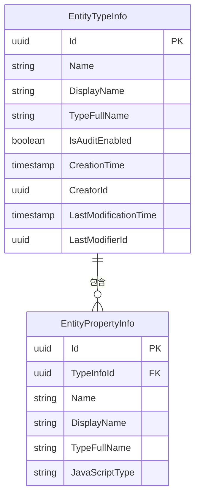
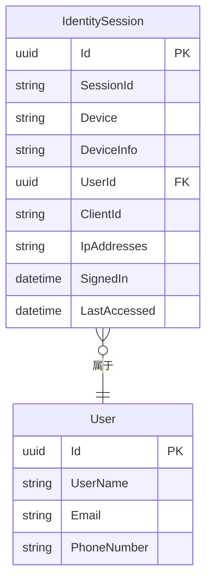
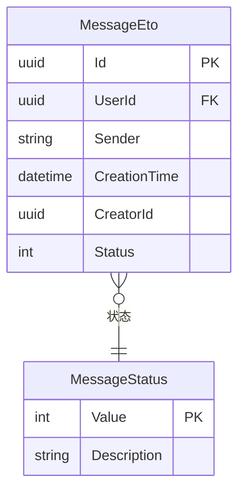
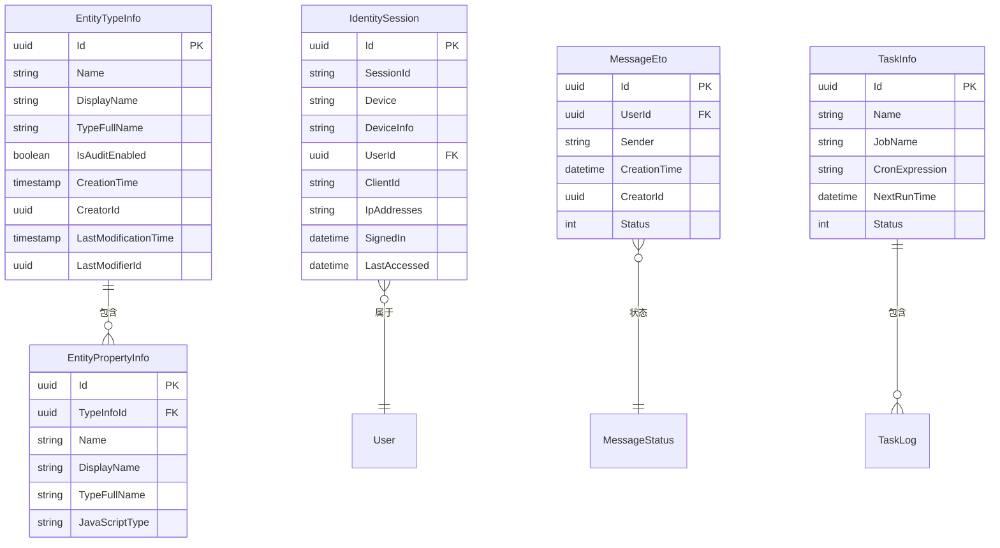

# 数据模型

<cite>
**本文档中引用的文件**  
- [EntityTypeInfo.cs](file://aspnet-core/modules/data-protection/LINGYUN.Abp.DataProtectionManagement.Domain/LINGYUN/Abp/DataProtectionManagement/EntityTypeInfo.cs)
- [EntityPropertyInfo.cs](file://aspnet-core/modules/data-protection/LINGYUN.Abp.DataProtectionManagement.Domain/LINGYUN/Abp/DataProtectionManagement/EntityPropertyInfo.cs)
- [IdentitySessionDto.cs](file://aspnet-core/modules/identity/LINGYUN.Abp.Identity.Application.Contracts/LINGYUN/Abp/Identity/Dto/IdentitySessionDto.cs)
- [MessageEto.cs](file://aspnet-core/modules/platform/LINGYUN.Platform.Domain.Shared/LINGYUN/Platform/Messages/MessageEto.cs)
- [MessageStatus.cs](file://aspnet-core/modules/platform/LINGYUN.Platform.Domain.Shared/LINGYUN/Platform/Messages/MessageStatus.cs)
- [RealtimeMessageMigrationsDbContext.cs](file://aspnet-core/migrations/LY.MicroService.RealtimeMessage.EntityFrameworkCore/RealtimeMessageMigrationsDbContext.cs)
- [TaskManagementMigrationsDbContext.cs](file://aspnet-core/migrations/LY.MicroService.TaskManagement.EntityFrameworkCore/TaskManagementMigrationsDbContext.cs)
</cite>

## 目录
1. [简介](#简介)
2. [核心实体模型](#核心实体模型)
3. [身份管理模块](#身份管理模块)
4. [平台服务模块](#平台服务模块)
5. [实时消息模块](#实时消息模块)
6. [任务管理模块](#任务管理模块)
7. [领域驱动设计应用](#领域驱动设计应用)
8. [实体扩展与自定义指导](#实体扩展与自定义指导)
9. [数据库ER图](#数据库er图)
10. [结论](#结论)

## 简介
本文档全面介绍ABP Next Admin项目中各核心模块的实体关系模型。项目基于ABP框架构建，采用领域驱动设计（DDD）原则，实现了身份管理、平台服务、实时消息和任务管理等核心功能模块。数据模型设计遵循模块化、可扩展和高内聚低耦合的原则，通过实体类型信息管理实现了灵活的数据保护和审计机制。

## 核心实体模型
项目中的核心实体模型主要围绕数据保护管理模块构建，通过`EntityTypeInfo`和`EntityPropertyInfo`两个核心实体实现了对系统中所有实体类型的元数据管理。

`EntityTypeInfo`实体作为实体类型信息的聚合根，负责管理实体的基本信息和属性集合。该实体继承自`AuditedAggregateRoot<Guid>`，具备完整的审计功能，包括创建人、创建时间、最后修改人和最后修改时间等字段。

`EntityPropertyInfo`实体表示实体的属性信息，与`EntityTypeInfo`形成一对多关系。每个属性包含名称、显示名称、类型全名、JavaScript类型等元数据信息，并通过`Enums`集合支持枚举值定义。



**图源**
- [EntityTypeInfo.cs](file://aspnet-core/modules/data-protection/LINGYUN.Abp.DataProtectionManagement.Domain/LINGYUN/Abp/DataProtectionManagement/EntityTypeInfo.cs)
- [EntityPropertyInfo.cs](file://aspnet-core/modules/data-protection/LINGYUN.Abp.DataProtectionManagement.Domain/LINGYUN/Abp/DataProtectionManagement/EntityPropertyInfo.cs)

**本节源**
- [EntityTypeInfo.cs](file://aspnet-core/modules/data-protection/LINGYUN.Abp.DataProtectionManagement.Domain/LINGYUN/Abp/DataProtectionManagement/EntityTypeInfo.cs#L1-L92)
- [EntityPropertyInfo.cs](file://aspnet-core/modules/data-protection/LINGYUN.Abp.DataProtectionManagement.Domain/LINGYUN/Abp/DataProtectionManagement/EntityPropertyInfo.cs#L1-L103)

## 身份管理模块
身份管理模块主要负责用户身份认证、会话管理和安全控制。核心实体为`IdentitySession`，用于跟踪用户的登录会话信息。

`IdentitySession`实体记录了用户的会话ID、设备信息、用户ID、客户端ID、IP地址、登录时间和最后访问时间等关键信息。该实体通过`UserId`外键与用户实体关联，实现了对用户会话的完整追踪。



**图源**
- [IdentitySessionDto.cs](file://aspnet-core/modules/identity/LINGYUN.Abp.Identity.Application.Contracts/LINGYUN/Abp/Identity/Dto/IdentitySessionDto.cs)

**本节源**
- [IdentitySessionDto.cs](file://aspnet-core/modules/identity/LINGYUN.Abp.Identity.Application.Contracts/LINGYUN/Abp/Identity/Dto/IdentitySessionDto.cs#L1-L22)

## 平台服务模块
平台服务模块提供了消息服务、通知和通用平台功能。核心实体为`MessageEto`，作为消息事件的基类，定义了消息的基本结构。

`MessageEto`是一个抽象实体，包含消息ID、用户ID、发送者、创建时间、创建人ID和消息状态等通用属性。消息状态通过`MessageStatus`枚举定义，包含待发送、已发送和发送失败三种状态。



**图源**
- [MessageEto.cs](file://aspnet-core/modules/platform/LINGYUN.Platform.Domain.Shared/LINGYUN/Platform/Messages/MessageEto.cs)
- [MessageStatus.cs](file://aspnet-core/modules/platform/LINGYUN.Platform.Domain.Shared/LINGYUN/Platform/Messages/MessageStatus.cs)

**本节源**
- [MessageEto.cs](file://aspnet-core/modules/platform/LINGYUN.Platform.Domain.Shared/LINGYUN/Platform/Messages/MessageEto.cs#L1-L12)
- [MessageStatus.cs](file://aspnet-core/modules/platform/LINGYUN.Platform.Domain.Shared/LINGYUN/Platform/Messages/MessageStatus.cs#L1-L16)

## 实时消息模块
实时消息模块基于ABP框架的通知和消息服务功能构建，支持实时通信和消息推送。该模块通过`RealtimeMessageMigrationsDbContext`管理数据模型。

`RealtimeMessageMigrationsDbContext`继承自`AbpDbContext`，配置了通知、消息服务和通知定义的实体模型。该上下文通过`OnModelCreating`方法调用`ConfigureNotifications`、`ConfigureNotificationsDefinition`和`ConfigureMessageService`扩展方法，实现了对相关实体的配置。

```mermaid
erDiagram
RealtimeMessageMigrationsDbContext {
DbContextOptions Options
}
NotificationDefinition {
string Name PK
string DisplayName
string Description
}
Notification {
uuid Id PK
string NotificationName
string Data
datetime CreationTime
}
UserNotification {
uuid Id PK
uuid UserId
uuid NotificationId
int State
}
RealtimeMessageMigrationsDbContext }|--|> NotificationDefinition : "配置"
RealtimeMessageMigrationsDbContext }|--|> Notification : "配置"
RealtimeMessageMigrationsDbContext }|--|> UserNotification : "配置"
```

**图源**
- [RealtimeMessageMigrationsDbContext.cs](file://aspnet-core/migrations/LY.MicroService.RealtimeMessage.EntityFrameworkCore/RealtimeMessageMigrationsDbContext.cs)

**本节源**
- [RealtimeMessageMigrationsDbContext.cs](file://aspnet-core/migrations/LY.MicroService.RealtimeMessage.EntityFrameworkCore/RealtimeMessageMigrationsDbContext.cs#L1-L22)

## 任务管理模块
任务管理模块负责后台任务的调度和执行。该模块通过`TaskManagementMigrationsDbContext`管理任务相关的数据模型。

`TaskManagementMigrationsDbContext`继承自`AbpDbContext`，在`OnModelCreating`方法中通过`ConfigureTaskManagement`扩展方法配置任务管理相关的实体模型。该设计模式实现了关注点分离，将任务管理的实体配置逻辑封装在独立的扩展方法中。

```mermaid
erDiagram
TaskManagementMigrationsDbContext {
DbContextOptions Options
}
TaskInfo {
uuid Id PK
string Name
string JobName
string CronExpression
datetime NextRunTime
int Status
}
TaskLog {
uuid Id PK
uuid TaskId FK
datetime ExecutionTime
int Duration
string Result
}
TaskManagementMigrationsDbContext }|--|> TaskInfo : "配置"
TaskManagementMigrationsDbContext }|--|> TaskLog : "配置"
```

**图源**
- [TaskManagementMigrationsDbContext.cs](file://aspnet-core/migrations/LY.MicroService.TaskManagement.EntityFrameworkCore/TaskManagementMigrationsDbContext.cs)

**本节源**
- [TaskManagementMigrationsDbContext.cs](file://aspnet-core/migrations/LY.MicroService.TaskManagement.EntityFrameworkCore/TaskManagementMigrationsDbContext.cs#L1-L22)

## 领域驱动设计应用
本项目在数据模型设计中充分应用了领域驱动设计（DDD）原则，主要体现在以下几个方面：

1. **聚合根设计**：`EntityTypeInfo`作为聚合根，管理`EntityPropertyInfo`和`EntityEnumInfo`等子实体，确保了业务规则的一致性和完整性。

2. **值对象应用**：通过`EntityPropertyInfo`和`EntityEnumInfo`等实体，将复杂的业务概念分解为可重用的值对象，提高了代码的可维护性。

3. **领域服务**：`EntityTypeInfo`类中定义了`AddProperty`、`RemoveProperty`等业务方法，封装了领域逻辑，确保了业务规则的正确执行。

4. **仓储模式**：通过`IEntityTypeInfoRepository`接口定义了对`EntityTypeInfo`实体的访问契约，实现了数据访问逻辑与业务逻辑的分离。

5. **事件驱动架构**：通过`RealTimeEto<T>`等事件传输对象，实现了模块间的松耦合通信，支持了系统的可扩展性。

## 实体扩展与自定义指导
为支持实体的扩展和自定义，项目提供了以下指导原则：

1. **继承扩展**：对于需要扩展的实体，建议通过继承方式创建子类，保持原有实体的完整性。

2. **接口实现**：通过实现特定接口（如`IEntityTypeInfoRepository`）来扩展实体的功能，遵循依赖倒置原则。

3. **配置扩展**：利用`AbpModelBuilderConfigurationOptions`等配置类，通过扩展方法模式实现实体模型的可配置性。

4. **事件订阅**：通过订阅领域事件（如`RealTimeEto<T>`）来实现业务逻辑的扩展，避免直接修改核心实体。

5. **元数据管理**：利用`EntityTypeInfo`和`EntityPropertyInfo`的元数据管理能力，实现动态属性的添加和管理。

## 数据库ER图
以下是项目核心实体的综合ER图：



**图源**
- [EntityTypeInfo.cs](file://aspnet-core/modules/data-protection/LINGYUN.Abp.DataProtectionManagement.Domain/LINGYUN/Abp/DataProtectionManagement/EntityTypeInfo.cs)
- [EntityPropertyInfo.cs](file://aspnet-core/modules/data-protection/LINGYUN.Abp.DataProtectionManagement.Domain/LINGYUN/Abp/DataProtectionManagement/EntityPropertyInfo.cs)
- [IdentitySessionDto.cs](file://aspnet-core/modules/identity/LINGYUN.Abp.Identity.Application.Contracts/LINGYUN/Abp/Identity/Dto/IdentitySessionDto.cs)
- [MessageEto.cs](file://aspnet-core/modules/platform/LINGYUN.Platform.Domain.Shared/LINGYUN/Platform/Messages/MessageEto.cs)
- [MessageStatus.cs](file://aspnet-core/modules/platform/LINGYUN.Platform.Domain.Shared/LINGYUN/Platform/Messages/MessageStatus.cs)
- [TaskManagementMigrationsDbContext.cs](file://aspnet-core/migrations/LY.MicroService.TaskManagement.EntityFrameworkCore/TaskManagementMigrationsDbContext.cs)

## 结论
本项目的数据模型设计充分体现了领域驱动设计的思想，通过合理的实体划分和关系设计，实现了高内聚、低耦合的系统架构。核心的元数据管理机制为系统的可扩展性和灵活性提供了坚实基础。各模块通过标准化的实体设计模式，确保了代码的一致性和可维护性。未来扩展时，建议遵循现有的设计模式和扩展指导原则，保持系统架构的统一性。