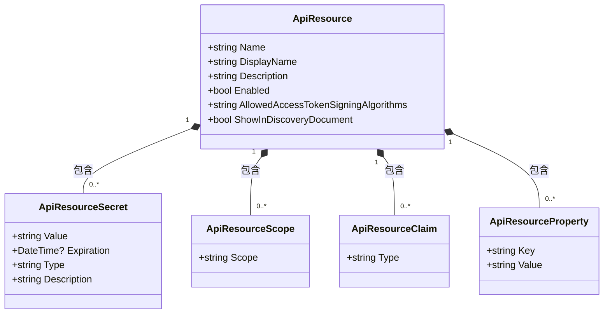
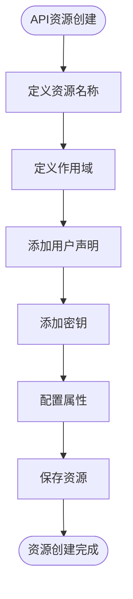
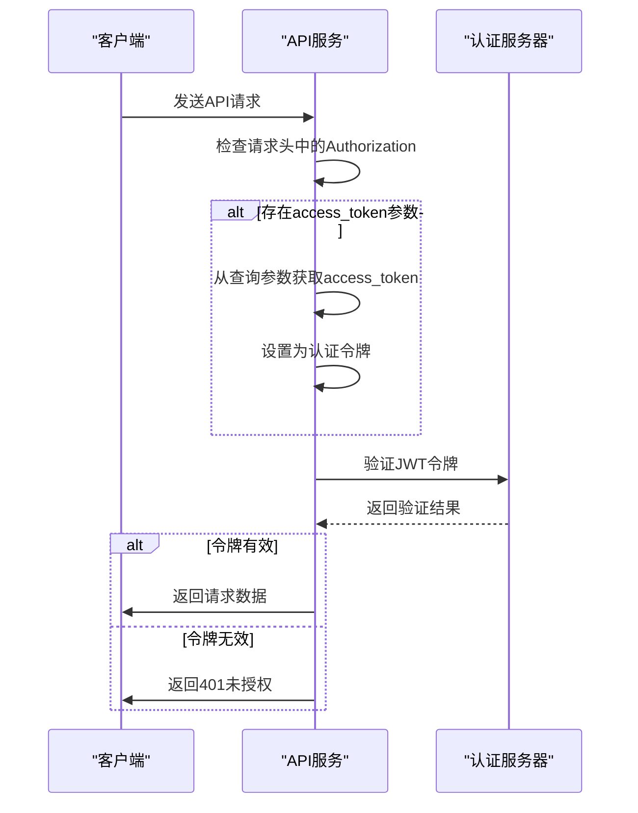
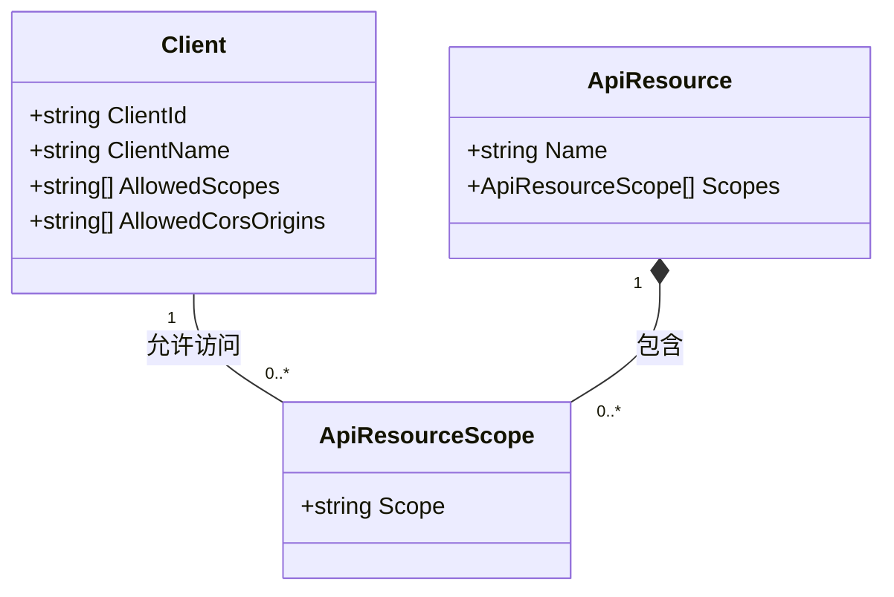
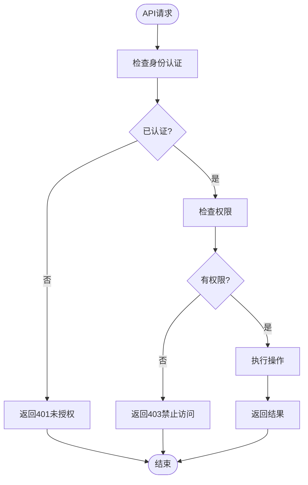

# API资源管理

<cite>
**本文档引用的文件**
- [ApiResourceDto.cs](file://aspnet-core/modules/identityServer/LINGYUN.Abp.IdentityServer.Application.Contracts/LINGYUN/Abp/IdentityServer/ApiResources/Dto/ApiResourceDto.cs)
- [ApiResourceCreateOrUpdateDto.cs](file://aspnet-core/modules/identityServer/LINGYUN.Abp.IdentityServer.Application.Contracts/LINGYUN/Abp/IdentityServer/ApiResources/Dto/ApiResourceCreateOrUpdateDto.cs)
- [ApiResourceAppService.cs](file://aspnet-core/modules/identityServer/LINGYUN.Abp.IdentityServer.Application/LINGYUN/Abp/IdentityServer/ApiResources/ApiResourceAppService.cs)
- [ApiResourceController.cs](file://aspnet-core/modules/identityServer/LINGYUN.Abp.IdentityServer.HttpApi/LINGYUN/Abp/IdentityServer/ApiResources/ApiResourceController.cs)
- [EfCoreApiResourceRepository.cs](file://aspnet-core/modules/identityServer/LINGYUN.Abp.IdentityServer.EntityFrameworkCore/LINGYUN/Abp/IdentityServer/ApiResources/EfCoreApiResourceRepository.cs)
- [IdentityServerDataSeedContributor.cs](file://aspnet-core/migrations/LY.MicroService.IdentityServer.EntityFrameworkCore/DataSeeder/IdentityServerDataSeedContributor.cs)
- [ClientAppService.cs](file://aspnet-core/modules/identityServer/LINGYUN.Abp.IdentityServer.Application/LINGYUN/Abp/IdentityServer/Clients/ClientAppService.cs)
- [ClientController.cs](file://aspnet-core/modules/identityServer/LINGYUN.Abp.IdentityServer.HttpApi/LINGYUN/Abp/IdentityServer/Clients/ClientController.cs)
- [RealtimeMessageHttpApiHostModule.Configure.cs](file://aspnet-core/services/LY.MicroService.RealtimeMessage.HttpApi.Host/RealtimeMessageHttpApiHostModule.Configure.cs)
- [AuthServerModule.Configure.cs](file://aspnet-core/services/LY.MicroService.AuthServer/AuthServerModule.Configure.cs)
</cite>

## 目录
1. [简介](#简介)
2. [API资源实体结构](#api资源实体结构)
3. [数据模型与受保护端点](#数据模型与受保护端点)
4. [JWT令牌验证配置](#jwt令牌验证配置)
5. [API资源与客户端关联](#api资源与客户端关联)
6. [细粒度访问控制](#细粒度访问控制)
7. [资源版本管理](#资源版本管理)
8. [多租户支持](#多租户支持)
9. [结论](#结论)

## 简介
本项目基于ABP框架实现了一套完整的API资源管理系统，用于管理IdentityServer4中的API资源。系统提供了对API资源的完整生命周期管理，包括创建、读取、更新和删除操作。API资源是IdentityServer4中的核心概念，用于定义受保护的API端点和访问权限。通过本系统，可以有效地管理API资源的名称、显示名称、描述、作用域等属性，并配置JWT令牌验证机制，实现安全的API访问控制。

## API资源实体结构
API资源实体包含多个核心属性，用于定义受保护API的元数据和行为特征。

### 核心属性
API资源实体的主要属性包括：

- **Name**: 资源名称，作为唯一标识符
- **DisplayName**: 显示名称，用于用户界面展示
- **Description**: 描述信息，说明资源用途
- **Enabled**: 启用状态，控制资源是否可用
- **AllowedAccessTokenSigningAlgorithms**: 允许的访问令牌签名算法
- **ShowInDiscoveryDocument**: 是否在发现文档中显示

### 关联实体
API资源与多个关联实体建立关系，形成完整的权限管理体系：

**图示来源**
- [ApiResourceDto.cs](file://aspnet-core/modules/identityServer/LINGYUN.Abp.IdentityServer.Application.Contracts/LINGYUN/Abp/IdentityServer/ApiResources/Dto/ApiResourceDto.cs#L10-L35)

**本节来源**
- [ApiResourceDto.cs](file://aspnet-core/modules/identityServer/LINGYUN.Abp.IdentityServer.Application.Contracts/LINGYUN/Abp/IdentityServer/ApiResources/Dto/ApiResourceDto.cs#L10-L35)
- [ApiResourceCreateOrUpdateDto.cs](file://aspnet-core/modules/identityServer/LINGYUN.Abp.IdentityServer.Application.Contracts/LINGYUN/Abp/IdentityServer/ApiResources/Dto/ApiResourceCreateOrUpdateDto.cs#L10-L35)

## 数据模型与受保护端点
系统的数据模型基于Entity Framework Core实现，为API资源提供了持久化存储和查询能力。

### 数据库表结构
API资源在数据库中映射为`IdentityServerApiResources`表，包含以下主要字段：

- **Name**: 资源名称，最大长度200字符
- **DisplayName**: 显示名称
- **Description**: 描述信息
- **Enabled**: 启用状态
- **ShowInDiscoveryDocument**: 是否在发现文档中显示
- **ExtraProperties**: 扩展属性，存储额外的JSON数据
- **IsDeleted**: 软删除标记

### 受保护端点定义
API资源通过作用域（Scope）来定义受保护的端点。每个API资源可以包含多个作用域，每个作用域对应一组特定的访问权限。

**图示来源**
- [ApiResourceAppService.cs](file://aspnet-core/modules/identityServer/LINGYUN.Abp.IdentityServer.Application/LINGYUN/Abp/IdentityServer/ApiResources/ApiResourceAppService.cs#L100-L180)
- [EfCoreApiResourceRepository.cs](file://aspnet-core/modules/identityServer/LINGYUN.Abp.IdentityServer.EntityFrameworkCore/LINGYUN/Abp/IdentityServer/ApiResources/EfCoreApiResourceRepository.cs#L10-L30)

**本节来源**
- [EfCoreApiResourceRepository.cs](file://aspnet-core/modules/identityServer/LINGYUN.Abp.IdentityServer.EntityFrameworkCore/LINGYUN/Abp/IdentityServer/ApiResources/EfCoreApiResourceRepository.cs#L10-L30)
- [IdentityServerDataSeedContributor.cs](file://aspnet-core/migrations/LY.MicroService.IdentityServer.EntityFrameworkCore/DataSeeder/IdentityServerDataSeedContributor.cs#L96-L139)

## JWT令牌验证配置
系统通过JWT Bearer认证机制实现API资源的访问控制，确保只有持有有效令牌的客户端才能访问受保护的端点。

### 认证配置
JWT令牌验证在多个服务模块中进行配置，主要包括：

- **Issuer验证**: 配置有效的发行者（Issuer）列表
- **Audience验证**: 配置有效的受众（Audience）列表
- **令牌获取**: 从查询参数中提取访问令牌

**图示来源**
- [RealtimeMessageHttpApiHostModule.Configure.cs](file://aspnet-core/services/LY.MicroService.RealtimeMessage.HttpApi.Host/RealtimeMessageHttpApiHostModule.Configure.cs#L458-L492)
- [AuthServerModule.Configure.cs](file://aspnet-core/services/LY.MicroService.AuthServer/AuthServerModule.Configure.cs#L391-L418)

**本节来源**
- [RealtimeMessageHttpApiHostModule.Configure.cs](file://aspnet-core/services/LY.MicroService.RealtimeMessage.HttpApi.Host/RealtimeMessageHttpApiHostModule.Configure.cs#L458-L492)
- [AuthServerModule.Configure.cs](file://aspnet-core/services/LY.MicroService.AuthServer/AuthServerModule.Configure.cs#L391-L418)
- [MicroServiceApplicationsSingleModule.Configure.cs](file://aspnet-core/services/LY.MicroService.Applications.Single/MicroServiceApplicationsSingleModule.Configure.cs#L855-L886)

## API资源与客户端关联
API资源与客户端之间存在明确的关联关系，通过这种关系实现对API访问权限的精确控制。

### 关联机制
客户端通过引用API资源的作用域来获得访问权限。系统提供了专门的接口来管理这种关联关系。

### 关联查询
系统提供了专门的API来查询可分配给客户端的API资源列表：

- **GetAssignableApiResourcesAsync**: 获取可分配给客户端的API资源名称列表
- **GetAssignableIdentityResourcesAsync**: 获取可分配给客户端的身份资源名称列表
- **GetAllDistinctAllowedCorsOriginsAsync**: 获取所有不同的允许CORS源列表

**图示来源**
- [ClientAppService.cs](file://aspnet-core/modules/identityServer/LINGYUN.Abp.IdentityServer.Application/LINGYUN/Abp/IdentityServer/Clients/ClientAppService.cs#L10-L35)
- [ClientController.cs](file://aspnet-core/modules/identityServer/LINGYUN.Abp.IdentityServer.HttpApi/LINGYUN/Abp/IdentityServer/Clients/ClientController.cs#L42-L80)

**本节来源**
- [ClientAppService.cs](file://aspnet-core/modules/identityServer/LINGYUN.Abp.IdentityServer.Application/LINGYUN/Abp/IdentityServer/Clients/ClientAppService.cs#L10-L35)
- [ClientController.cs](file://aspnet-core/modules/identityServer/LINGYUN.Abp.IdentityServer.HttpApi/LINGYUN/Abp/IdentityServer/Clients/ClientController.cs#L42-L80)
- [IClientAppService.cs](file://aspnet-core/modules/identityServer/LINGYUN.Abp.IdentityServer.Application.Contracts/LINGYUN/Abp/IdentityServer/Clients/IClientAppService.cs#L10-L22)

## 细粒度访问控制
系统实现了基于权限的细粒度访问控制机制，确保不同用户角色只能执行其被授权的操作。

### 权限体系
API资源管理的权限体系包括：

- **默认权限**: `AbpIdentityServer.ApiResources`
- **创建权限**: `AbpIdentityServer.ApiResources.Create`
- **更新权限**: `AbpIdentityServer.ApiResources.Update`
- **删除权限**: `AbpIdentityServer.ApiResources.Delete`
- **管理声明权限**: `AbpIdentityServer.ApiResources.ManageClaims`
- **管理密钥权限**: `AbpIdentityServer.ApiResources.ManageSecrets`
- **管理作用域权限**: `AbpIdentityServer.ApiResources.ManageScopes`
- **管理属性权限**: `AbpIdentityServer.ApiResources.ManageProperties`

### 权限验证流程

**图示来源**
- [ApiResourceAppService.cs](file://aspnet-core/modules/identityServer/LINGYUN.Abp.IdentityServer.Application/LINGYUN/Abp/IdentityServer/ApiResources/ApiResourceAppService.cs#L15-L20)
- [ApiResourceAppService.cs](file://aspnet-core/modules/identityServer/LINGYUN.Abp.IdentityServer.Application/LINGYUN/Abp/IdentityServer/ApiResources/ApiResourceAppService.cs#L60-L97)

**本节来源**
- [ApiResourceAppService.cs](file://aspnet-core/modules/identityServer/LINGYUN.Abp.IdentityServer.Application/LINGYUN/Abp/IdentityServer/ApiResources/ApiResourceAppService.cs#L15-L97)
- [ApiResourceController.cs](file://aspnet-core/modules/identityServer/LINGYUN.Abp.IdentityServer.HttpApi/LINGYUN/Abp/IdentityServer/ApiResources/ApiResourceController.cs#L15-L53)

## 资源版本管理
系统通过数据迁移机制实现API资源的版本管理，确保数据库结构的演进与应用代码的变更保持同步。

### 迁移策略
系统使用Entity Framework Core的迁移功能来管理数据库模式的变更：

- **初始迁移**: 创建基础的API资源表结构
- **增量迁移**: 添加新字段或修改现有字段
- **索引优化**: 为常用查询字段添加索引
- **约束更新**: 修改字段约束条件

### 版本控制实践
- 每次数据库模式变更都生成新的迁移文件
- 迁移文件包含Up和Down两个方向的操作
- 通过`dotnet ef migrations`命令管理迁移
- 生产环境使用`dotnet ef database update`应用迁移

**本节来源**
- [20231012032107_Initial-Single-Project.Designer