# 令牌管理

<cite>
**本文档中引用的文件**
- [OpenIddictTokenDto.cs](file://aspnet-core/modules/openIddict/LINGYUN.Abp.OpenIddict.Application.Contracts/LINGYUN/Abp/OpenIddict/Tokens/OpenIddictTokenDto.cs)
- [OpenIddictTokenExtensions.cs](file://aspnet-core/modules/openIddict/LINGYUN.Abp.OpenIddict.Application/LINGYUN/Abp/OpenIddict/Tokens/OpenIddictTokenExtensions.cs)
- [OpenIddictTokenAppService.cs](file://aspnet-core/modules/openIddict/LINGYUN.Abp.OpenIddict.Application/LINGYUN/Abp/OpenIddict/Tokens/OpenIddictTokenAppService.cs)
- [OpenIddictApplicationTokenLifetimeConsts.cs](file://aspnet-core/modules/openIddict/LINGYUN.Abp.OpenIddict.Application.Contracts/LINGYUN/Abp/OpenIddict/Applications/OpenIddictApplicationTokenLifetimeConsts.cs)
- [OpenIddictApplicationExtensions.cs](file://aspnet-core/modules/openIddict/LINGYUN.Abp.OpenIddict.Application/LINGYUN/Abp/OpenIddict/Applications/OpenIddictApplicationExtensions.cs)
- [AuthServerModule.Configure.cs](file://aspnet-core/services/LY.MicroService.AuthServer/AuthServerModule.Configure.cs)
- [WeChatWorkOAuthHandler.cs](file://aspnet-core/framework/authentication/LINGYUN.Abp.Authentication.WeChat/Microsoft/AspNetCore/Authentication/WeChat/Work/WeChatWorkOAuthHandler.cs)
- [DefaultTotpService.cs](file://aspnet-core/modules/identity/LINGYUN.Abp.Identity.Domain/LINGYUN/Abp/Identity/Security/DefaultTotpService.cs)
</cite>

## 目录
1. [简介](#简介)
2. [项目结构](#项目结构)
3. [核心组件](#核心组件)
4. [架构概览](#架构概览)
5. [详细组件分析](#详细组件分析)
6. [依赖关系分析](#依赖关系分析)
7. [性能考虑](#性能考虑)
8. [故障排除指南](#故障排除指南)
9. [结论](#结论)

## 简介

ABP Next Admin 项目采用 OpenIddict 作为主要的身份认证和授权框架，实现了完整的令牌管理系统。该系统支持多种类型的令牌，包括访问令牌（Access Token）、刷新令牌（Refresh Token）、授权码（Authorization Code）等，并提供了完善的令牌生命周期管理、存储策略和安全机制。

本文档详细说明了令牌的数据结构设计、生命周期管理、存储策略、过期机制、撤销流程以及安全特性，为开发者提供全面的技术参考。

## 项目结构

ABP Next Admin 的令牌管理功能分布在多个模块中，形成了一个层次化的架构：

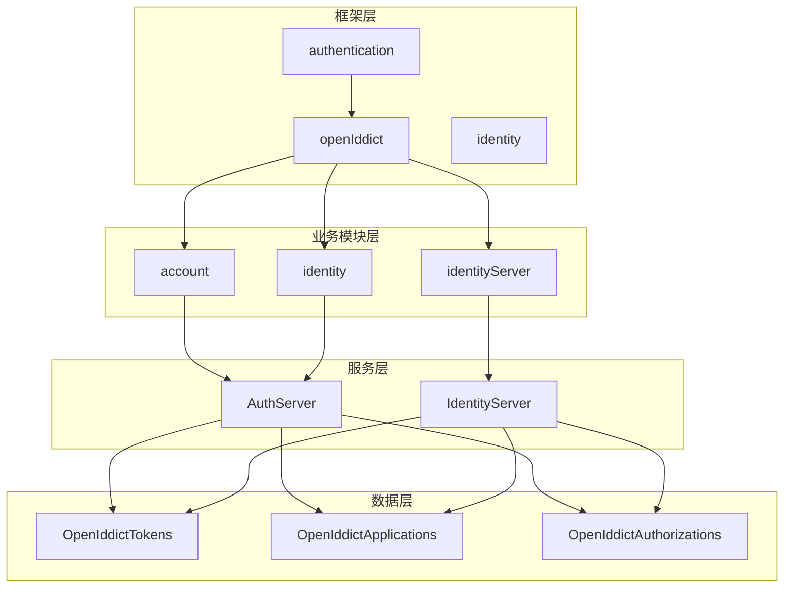

**图表来源**
- [AuthServerModule.Configure.cs](file://aspnet-core/services/LY.MicroService.AuthServer/AuthServerModule.Configure.cs#L364-L391)
- [OpenIddictApplicationExtensions.cs](file://aspnet-core/modules/openIddict/LINGYUN.Abp.OpenIddict.Application/LINGYUN/Abp/OpenIddict/Applications/OpenIddictApplicationExtensions.cs#L209-L235)

## 核心组件

### 令牌数据模型

系统的核心是基于 OpenIddict 的令牌数据模型，主要包括以下关键属性：

- **Id**: 唯一标识符
- **ApplicationId**: 关联的应用程序ID
- **AuthorizationId**: 关联的授权ID
- **CreationDate**: 创建时间
- **ExpirationDate**: 过期时间
- **Payload**: 令牌载荷
- **Properties**: 属性信息
- **RedemptionDate**: 兑换时间
- **ReferenceId**: 引用ID
- **Status**: 状态
- **Subject**: 主题
- **Type**: 类型

**章节来源**
- [OpenIddictTokenDto.cs](file://aspnet-core/modules/openIddict/LINGYUN.Abp.OpenIddict.Application.Contracts/LINGYUN/Abp/OpenIddict/Tokens/OpenIddictTokenDto.cs#L0-L33)

### 令牌类型分类

系统支持多种类型的令牌，每种都有特定的用途和生命周期：

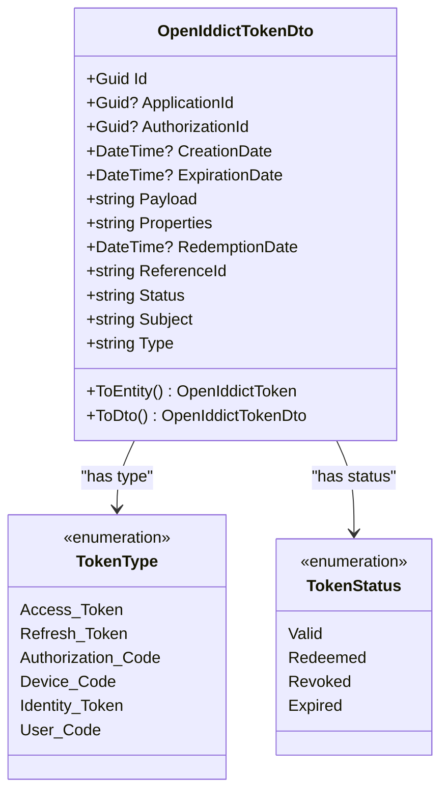

**图表来源**
- [OpenIddictTokenDto.cs](file://aspnet-core/modules/openIddict/LINGYUN.Abp.OpenIddict.Application.Contracts/LINGYUN/Abp/OpenIddict/Tokens/OpenIddictTokenDto.cs#L0-L33)
- [OpenIddictApplicationTokenLifetimeConsts.cs](file://aspnet-core/modules/openIddict/LINGYUN.Abp.OpenIddict.Application.Contracts/LINGYUN/Abp/OpenIddict/Applications/OpenIddictApplicationTokenLifetimeConsts.cs#L0-L21)

**章节来源**
- [OpenIddictTokenDto.cs](file://aspnet-core/modules/openIddict/LINGYUN.Abp.OpenIddict.Application.Contracts/LINGYUN/Abp/OpenIddict/Tokens/OpenIddictTokenDto.cs#L0-L33)
- [OpenIddictApplicationTokenLifetimeConsts.cs](file://aspnet-core/modules/openIddict/LINGYUN.Abp.OpenIddict.Application.Contracts/LINGYUN/Abp/OpenIddict/Applications/OpenIddictApplicationTokenLifetimeConsts.cs#L0-L21)

## 架构概览

### 令牌管理系统架构

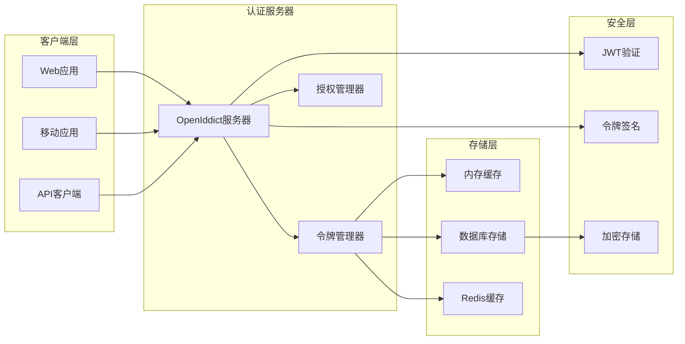

**图表来源**
- [AuthServerModule.Configure.cs](file://aspnet-core/services/LY.MicroService.AuthServer/AuthServerModule.Configure.cs#L364-L391)
- [OpenIddictTokenAppService.cs](file://aspnet-core/modules/openIddict/LINGYUN.Abp.OpenIddict.Application/LINGYUN/Abp/OpenIddict/Tokens/OpenIddictTokenAppService.cs#L0-L38)

## 详细组件分析

### 令牌生命周期管理

#### 令牌创建流程

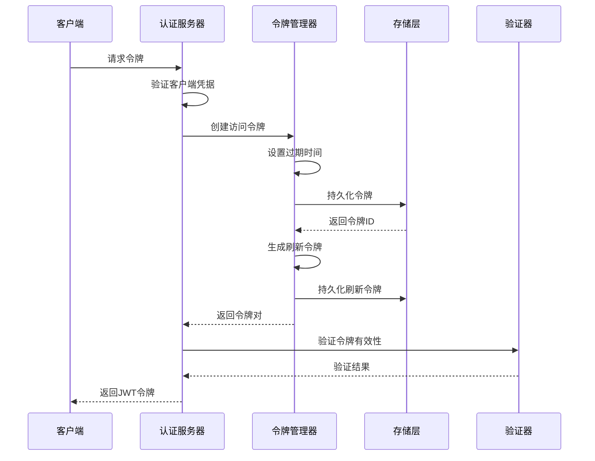

**图表来源**
- [WeChatWorkOAuthHandler.cs](file://aspnet-core/framework/authentication/LINGYUN.Abp.Authentication.WeChat/Microsoft/AspNetCore/Authentication/WeChat/Work/WeChatWorkOAuthHandler.cs#L284-L315)
- [OpenIddictTokenAppService.cs](file://aspnet-core/modules/openIddict/LINGYUN.Abp.OpenIddict.Application/LINGYUN/Abp/OpenIddict/Tokens/OpenIddictTokenAppService.cs#L35-L74)

#### 令牌过期机制

系统通过配置化的生命周期常量来管理不同类型的令牌：

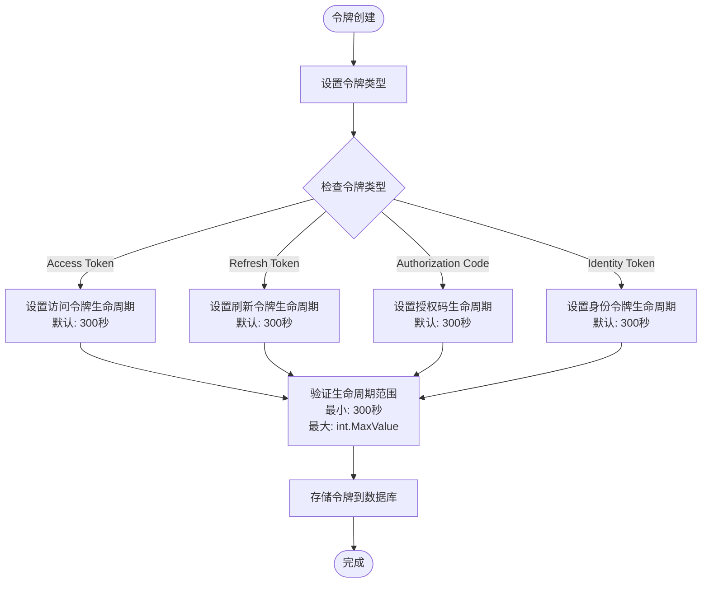

**图表来源**
- [OpenIddictApplicationTokenLifetimeConsts.cs](file://aspnet-core/modules/openIddict/LINGYUN.Abp.OpenIddict.Application.Contracts/LINGYUN/Abp/OpenIddict/Applications/OpenIddictApplicationTokenLifetimeConsts.cs#L0-L21)
- [OpenIddictApplicationExtensions.cs](file://aspnet-core/modules/openIddict/LINGYUN.Abp.OpenIddict.Application/LINGYUN/Abp/OpenIddict/Applications/OpenIddictApplicationExtensions.cs#L209-L235)

**章节来源**
- [OpenIddictApplicationTokenLifetimeConsts.cs](file://aspnet-core/modules/openIddict/LINGYUN.Abp.OpenIddict.Application.Contracts/LINGYUN/Abp/OpenIddict/Applications/OpenIddictApplicationTokenLifetimeConsts.cs#L0-L21)
- [OpenIddictApplicationExtensions.cs](file://aspnet-core/modules/openIddict/LINGYUN.Abp.OpenIddict.Application/LINGYUN/Abp/OpenIddict/Applications/OpenIddictApplicationExtensions.cs#L209-L235)

### 令牌存储策略

#### 数据库存储设计

系统使用关系型数据库存储令牌信息，支持多种数据库类型：

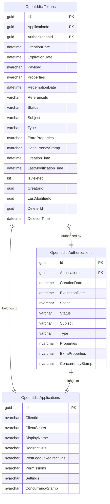

**图表来源**
- [OpenIddictTokenDto.cs](file://aspnet-core/modules/openIddict/LINGYUN.Abp.OpenIddict.Application.Contracts/LINGYUN/Abp/OpenIddict/Tokens/OpenIddictTokenDto.cs#L0-L33)
- [OpenIddictTokenExtensions.cs](file://aspnet-core/modules/openIddict/LINGYUN.Abp.OpenIddict.Application/LINGYUN/Abp/OpenIddict/Tokens/OpenIddictTokenExtensions.cs#L0-L64)

#### 令牌状态管理

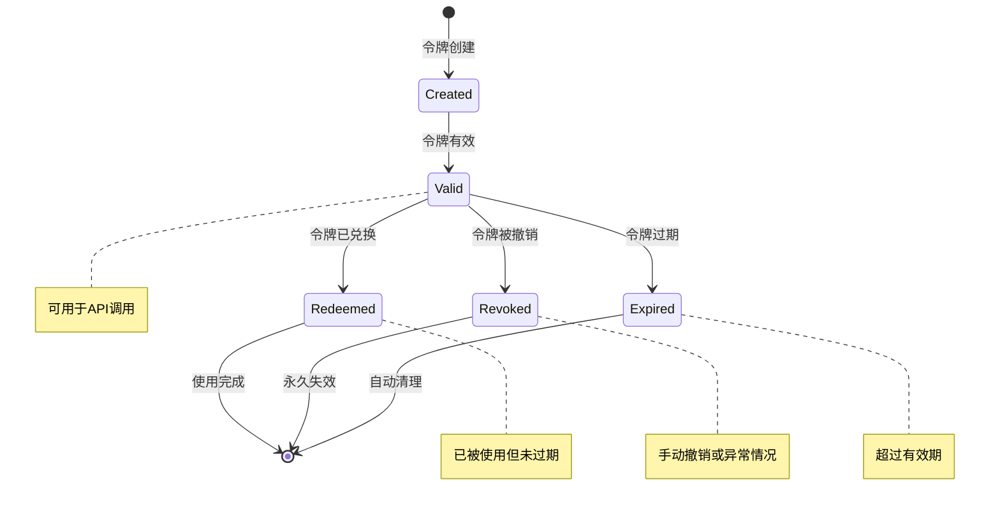

**章节来源**
- [OpenIddictTokenDto.cs](file://aspnet-core/modules/openIddict/LINGYUN.Abp.OpenIddict.Application.Contracts/LINGYUN/Abp/OpenIddict/Tokens/OpenIddictTokenDto.cs#L0-L33)
- [OpenIddictTokenExtensions.cs](file://aspnet-core/modules/openIddict/LINGYUN.Abp.OpenIddict.Application/LINGYUN/Abp/OpenIddict/Tokens/OpenIddictTokenExtensions.cs#L0-L64)

### 令牌管理服务

#### 令牌应用服务实现

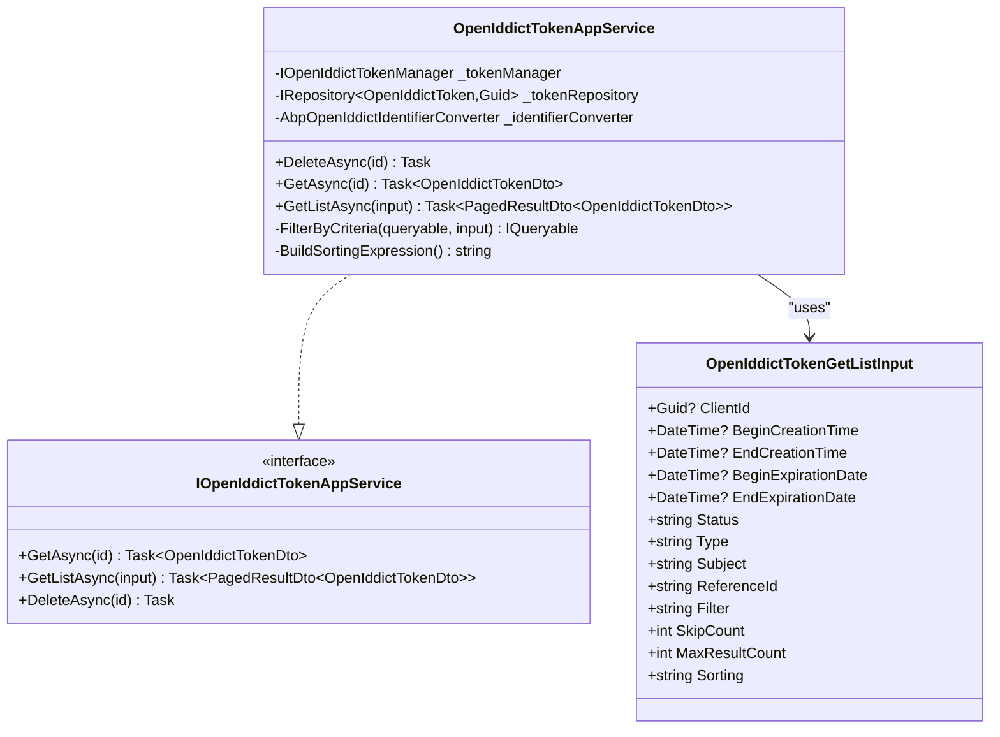

**图表来源**
- [OpenIddictTokenAppService.cs](file://aspnet-core/modules/openIddict/LINGYUN.Abp.OpenIddict.Application/LINGYUN/Abp/OpenIddict/Tokens/OpenIddictTokenAppService.cs#L0-L38)
- [OpenIddictTokenAppService.cs](file://aspnet-core/modules/openIddict/LINGYUN.Abp.OpenIddict.Application/LINGYUN/Abp/OpenIddict/Tokens/OpenIddictTokenAppService.cs#L35-L74)

**章节来源**
- [OpenIddictTokenAppService.cs](file://aspnet-core/modules/openIddict/LINGYUN.Abp.OpenIddict.Application/LINGYUN/Abp/OpenIddict/Tokens/OpenIddictTokenAppService.cs#L0-L110)

### JWT 令牌安全机制

#### 令牌验证和签名

系统实现了完整的 JWT 令牌验证机制，包括：

1. **签发者验证**: 支持通配符签发者验证
2. **受众验证**: 多个有效受众配置
3. **令牌接收事件**: 自定义令牌提取逻辑
4. **时间戳验证**: 确保令牌在有效期内

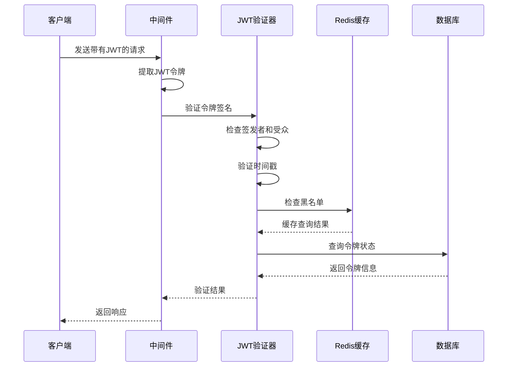

**图表来源**
- [AuthServerModule.Configure.cs](file://aspnet-core/services/LY.MicroService.AuthServer/AuthServerModule.Configure.cs#L391-L418)

**章节来源**
- [AuthServerModule.Configure.cs](file://aspnet-core/services/LY.MicroService.AuthServer/AuthServerModule.Configure.cs#L391-L418)

### 时间同步和TOTP支持

#### TOTP算法实现

系统集成了基于时间的一次性密码（TOTP）算法，用于增强安全性：

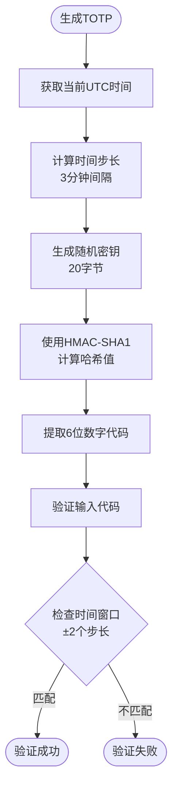

**图表来源**
- [DefaultTotpService.cs](file://aspnet-core/modules/identity/LINGYUN.Abp.Identity.Domain/LINGYUN/Abp/Identity/Security/DefaultTotpService.cs#L69-L119)

**章节来源**
- [DefaultTotpService.cs](file://aspnet-core/modules/identity/LINGYUN.Abp.Identity.Domain/LINGYUN/Abp/Identity/Security/DefaultTotpService.cs#L0-L119)

## 依赖关系分析

### 核心依赖图

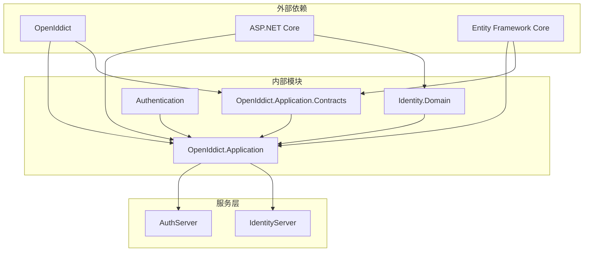

**图表来源**
- [OpenIddictTokenAppService.cs](file://aspnet-core/modules/openIddict/LINGYUN.Abp.OpenIddict.Application/LINGYUN/Abp/OpenIddict/Tokens/OpenIddictTokenAppService.cs#L0-L15)
- [AuthServerModule.Configure.cs](file://aspnet-core/services/LY.MicroService.AuthServer/AuthServerModule.Configure.cs#L364-L391)

**章节来源**
- [OpenIddictTokenAppService.cs](file://aspnet-core/modules/openIddict/LINGYUN.Abp.OpenIddict.Application/LINGYUN/Abp/OpenIddict/Tokens/OpenIddictTokenAppService.cs#L0-L110)
- [AuthServerModule.Configure.cs](file://aspnet-core/services/LY.MicroService.AuthServer/AuthServerModule.Configure.cs#L364-L418)

## 性能考虑

### 缓存策略

1. **Redis缓存**: 用于存储频繁访问的令牌信息
2. **内存缓存**: 临时存储令牌元数据
3. **数据库索引**: 优化查询性能

### 并发控制

- 使用并发戳（ConcurrencyStamp）防止并发更新冲突
- 实现乐观锁机制
- 支持分布式环境下的令牌同步

### 监控和审计

系统提供了完整的审计功能，包括：
- 令牌创建和销毁记录
- 访问日志跟踪
- 异常情况报警
- 性能指标监控

## 故障排除指南

### 常见问题及解决方案

#### 令牌验证失败

**问题症状**: JWT令牌无法通过验证
**可能原因**:
1. 签发者配置错误
2. 时间戳不正确
3. 密钥不匹配
4. 令牌格式错误

**解决步骤**:
1. 检查配置文件中的签发者设置
2. 验证系统时间同步
3. 确认密钥配置正确
4. 检查令牌格式是否符合JWT标准

#### 令牌过期问题

**问题症状**: 令牌频繁过期
**可能原因**:
1. 生命周期配置过短
2. 系统时间偏差
3. 时区设置错误

**解决步骤**:
1. 调整令牌生命周期配置
2. 同步系统时间
3. 检查时区设置
4. 更新应用程序配置

#### 性能问题

**问题症状**: 令牌操作响应缓慢
**可能原因**:
1. 数据库索引缺失
2. 缓存配置不当
3. 查询复杂度过高

**解决步骤**:
1. 添加必要的数据库索引
2. 优化缓存配置
3. 简化查询逻辑
4. 监控系统资源使用

**章节来源**
- [OpenIddictTokenAppService.cs](file://aspnet-core/modules/openIddict/LINGYUN.Abp.OpenIddict.Application/LINGYUN/Abp/OpenIddict/Tokens/OpenIddictTokenAppService.cs#L35-L74)
- [DefaultTotpService.cs](file://aspnet-core/modules/identity/LINGYUN.Abp.Identity.Domain/LINGYUN/Abp/Identity/Security/DefaultTotpService.cs#L69-L119)

## 结论

ABP Next Admin 的令牌管理系统是一个功能完善、安全可靠的解决方案。它通过 OpenIddict 框架提供了完整的 OAuth2 和 OpenID Connect 实现，支持多种令牌类型和灵活的配置选项。

### 主要优势

1. **安全性**: 实现了多层安全防护，包括 JWT 验证、TOTP 支持和加密存储
2. **灵活性**: 支持自定义令牌生命周期和配置
3. **可扩展性**: 模块化设计便于扩展和定制
4. **性能**: 优化的存储策略和缓存机制
5. **可观测性**: 完整的审计和监控功能

### 最佳实践建议

1. **定期轮换密钥**: 保持密钥的安全性
2. **监控令牌使用**: 及时发现异常行为
3. **合理配置生命周期**: 平衡安全性和用户体验
4. **实施备份策略**: 确保数据安全
5. **持续优化性能**: 根据实际使用情况调整配置

该系统为现代 Web 应用提供了企业级的令牌管理能力，能够满足各种复杂的业务场景需求。