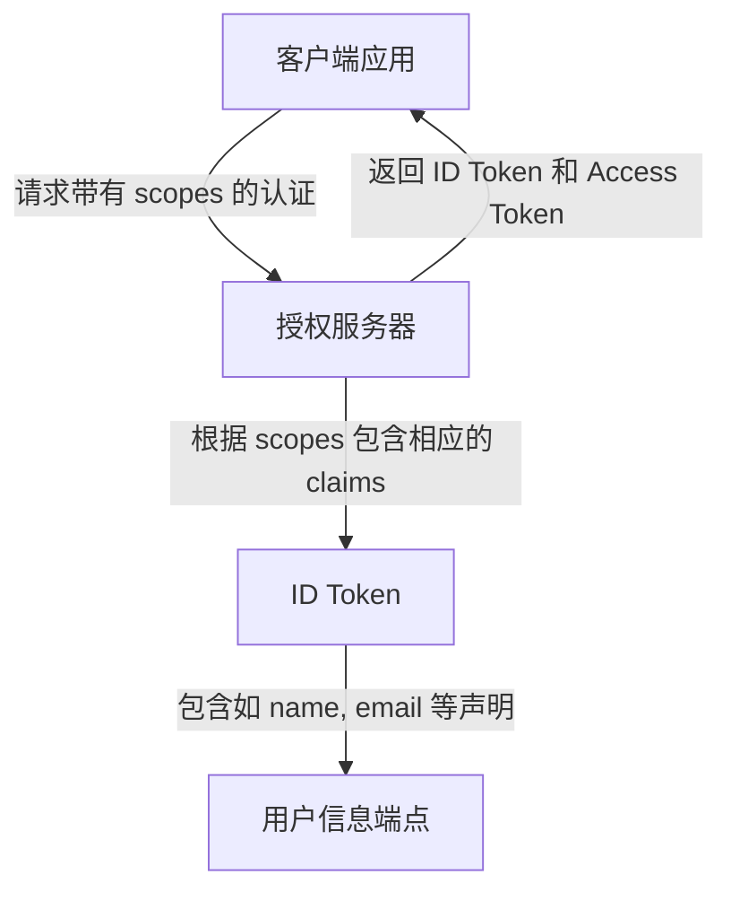
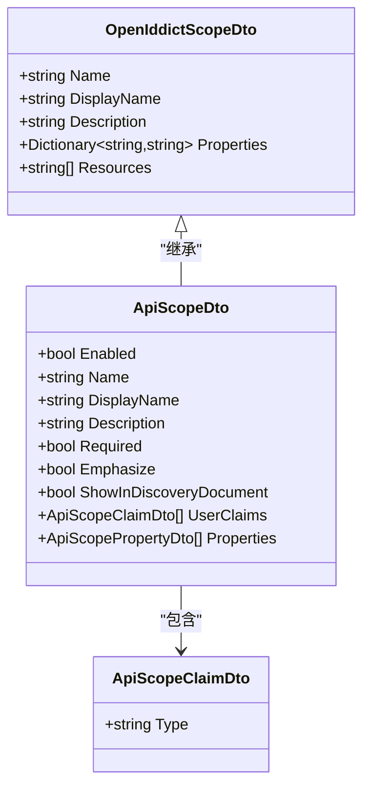

# 身份资源管理

<cite>
**本文档中引用的文件**
- [OpenIddictScopeAppService.cs](file://aspnet-core/modules/openIddict/LINGYUN.Abp.OpenIddict.Application/LINGYUN/Abp/OpenIddict/Scopes/OpenIddictScopeAppService.cs)
- [OpenIddictScopeDto.cs](file://aspnet-core/modules/openIddict/LINGYUN.Abp.OpenIddict.Application.Contracts/LINGYUN/Abp/OpenIddict/Scopes/OpenIddictScopeDto.cs)
- [ApiScopeAppService.cs](file://aspnet-core/modules/identityServer/LINGYUN.Abp.IdentityServer.Application/LINGYUN/Abp/IdentityServer/ApiScopes/ApiScopeAppService.cs)
- [ApiScopeDto.cs](file://aspnet-core/modules/identityServer/LINGYUN.Abp.IdentityServer.Application.Contracts/LINGYUN/Abp/IdentityServer/ApiScopes/Dto/ApiScopeDto.cs)
- [UserClaimDto.cs](file://aspnet-core/modules/identityServer/LINGYUN.Abp.IdentityServer.Application.Contracts/LINGYUN/Abp/IdentityServer/UserClaimDto.cs)
- [AuthServerDataSeedContributor.cs](file://aspnet-core/services/LY.MicroService.AuthServer/DataSeeder/AuthServerDataSeedContributor.cs)
</cite>

## 目录
1. [引言](#引言)
2. [身份资源在OpenID Connect中的作用](#身份资源在openid-connect中的作用)
3. [标准声明与自定义声明](#标准声明与自定义声明)
4. [数据模型配置与ID令牌内容控制](#数据模型配置与id令牌内容控制)
5. [身份资源的创建与管理](#身份资源的创建与管理)
6. [客户端关联机制](#客户端关联机制)
7. [隐私保护与声明最小化原则](#隐私保护与声明最小化原则)
8. [安全传输指导](#安全传输指导)
9. [结论](#结论)

## 引言
身份资源管理是现代身份认证系统中的核心组成部分，特别是在基于OpenID Connect协议的身份提供者（Identity Provider）实现中。本文档旨在深入解析身份资源的管理机制，涵盖其在协议中的角色、数据模型设计、实际操作流程以及相关的安全最佳实践。通过理解这些概念和实现细节，开发者可以更好地构建安全、灵活且符合隐私规范的身份认证解决方案。

## 身份资源在OpenID Connect中的作用
在OpenID Connect协议框架下，身份资源（Identity Resources）代表了用户的一组可被请求的属性集合。当客户端应用请求访问受保护的资源时，它可以通过指定特定的身份资源范围（scope）来表明需要获取哪些关于用户的声明（claims）。例如，`profile`范围通常包含用户的姓名、昵称等基本信息；`email`范围则用于获取用户的电子邮件地址。

身份资源的作用在于：
- **标准化信息交换**：通过预定义的标准范围，确保不同系统间用户信息交换的一致性和互操作性。
- **权限精细化控制**：允许用户或管理员对每个范围进行授权决策，从而实现对个人信息披露程度的精细控制。
- **简化客户端开发**：客户端无需了解底层数据库结构，只需按需请求标准或自定义范围即可获得所需用户信息。

**Diagram sources**
- [AuthServerDataSeedContributor.cs](file://aspnet-core/services/LY.MicroService.AuthServer/DataSeeder/AuthServerDataSeedContributor.cs#L203-L225)

## 标准声明与自定义声明
### 标准声明
OpenID Connect 定义了一组标准声明，这些声明对应于常见的用户属性，例如：
- `sub` (Subject Identifier): 唯一标识符
- `name`: 全名
- `given_name`: 名字
- `family_name`: 姓氏
- `email`: 电子邮件地址
- `picture`: 头像URL
- `phone_number`: 电话号码

这些标准声明通过预注册的身份资源范围（如 `openid`, `profile`, `email`, `phone`, `address`）进行分组和分发。

### 自定义声明的定义方式
除了标准声明外，系统还支持定义自定义声明以满足特定业务需求。在本项目中，自定义声明的定义主要通过以下途径实现：

1. **扩展用户声明类型**：利用 `IIdentityClaimTypeAppService` 接口提供的功能，可以创建新的用户声明类型。每个声明类型具有名称、是否必需、值类型等属性。
2. **将声明映射到身份资源**：在创建或更新身份资源（如 `ApiScope` 或 `OpenIddictScope`）时，可以通过其 `UserClaims` 属性添加所需的声明类型。这使得该资源在被请求时会自动包含对应的声明。

例如，在 `ApiScopeAppService` 中，`UpdateApiScopeByInputAsync` 方法负责处理用户声明的增删改逻辑，确保只有存在于输入参数 `input.UserClaims` 中的声明才会保留在最终的 `apiScope` 对象中。

**Section sources**
- [IIdentityClaimTypeAppService.cs](file://aspnet-core/modules/identity/LINGYUN.Abp.Identity.Application.Contracts/LINGYUN/Abp/Identity/IIdentityClaimTypeAppService.cs#L0-L17)
- [IdentityClaimTypeDto.cs](file://aspnet-core/modules/identity/LINGYUN.Abp.Identity.Application.Contracts/LINGYUN/Abp/Identity/Dto/IdentityClaimTypeDto.cs#L0-L22)
- [ApiScopeAppService.cs](file://aspnet-core/modules/identityServer/LINGYUN.Abp.IdentityServer.Application/LINGYUN/Abp/IdentityServer/ApiScopes/ApiScopeAppService.cs#L0-L141)

## 数据模型配置与ID令牌内容控制
身份资源的数据模型直接决定了ID令牌（ID Token）的内容。在本系统中，关键的数据模型包括 `OpenIddictScopeDto` 和 `ApiScopeDto`，它们都包含了描述资源特性的字段以及关联的声明列表。

### 数据模型结构
- **OpenIddictScopeDto**: 表示一个开放的ID字典范围，包含名称、显示名、描述、属性和资源列表等。
- **ApiScopeDto**: 特指API级别的范围，继承了基本的审计和可扩展性特性，并明确列出了 `UserClaims` 和 `Properties`。

通过配置这些模型实例，可以精确控制当某个范围被请求时，ID令牌中应包含哪些声明。例如，若某 `ApiScope` 配置了 `UserClaims` 包含 `name` 和 `custom_claim`，那么每当此范围被包含在认证请求中时，生成的ID令牌就会携带这两个声明。

**Diagram sources**
- [OpenIddictScopeDto.cs](file://aspnet-core/modules/openIddict/LINGYUN.Abp.OpenIddict.Application.Contracts/LINGYUN/Abp/OpenIddict/Scopes/OpenIddictScopeDto.cs#L0-L27)
- [ApiScopeDto.cs](file://aspnet-core/modules/identityServer/LINGYUN.Abp.IdentityServer.Application.Contracts/LINGYUN/Abp/IdentityServer/ApiScopes/Dto/ApiScopeDto.cs#L0-L32)
- [ApiScopeClaimDto.cs](file://aspnet-core/modules/identityServer/LINGYUN.Abp.IdentityServer.Application.Contracts/LINGYUN/Abp/IdentityServer/ApiScopes/Dto/ApiScopeClaimDto.cs#L0-L5)

## 身份资源的创建与管理
身份资源的生命周期管理主要通过应用程序服务（Application Service）完成，具体体现在 `OpenIddictScopeAppService` 和 `ApiScopeAppService` 这两个类中。

### 创建流程
1. **验证唯一性**：在创建新范围前，系统会检查同名范围是否已存在，防止重复定义。
2. **实例化对象**：使用唯一的GUID作为标识符，结合输入参数初始化一个新的范围实体。
3. **持久化存储**：调用相应的管理器（Manager）和仓库（Repository）接口将实体保存至数据库。

### 管理操作
- **查询**：支持分页查询所有范围，便于管理和展示。
- **更新**：允许修改范围的元数据（如名称、描述）及其关联的声明和属性。更新过程中同样会执行冲突检测。
- **删除**：提供安全的删除机制，通常会在删除前检查是否有依赖项存在。

这些操作均受到权限系统的保护，确保只有具备相应权限的角色才能执行敏感操作。

**Section sources**
- [OpenIddictScopeAppService.cs](file://aspnet-core/modules/openIddict/LINGYUN.Abp.OpenIddict.Application/LINGYUN/Abp/OpenIddict/Scopes/OpenIddictScopeAppService.cs#L0-L99)
- [ApiScopeAppService.cs](file://aspnet-core/modules/identityServer/LINGYUN.Abp.IdentityServer.Application/LINGYUN/Abp/IdentityServer/ApiScopes/ApiScopeAppService.cs#L0-L141)

## 客户端关联机制
身份资源必须与具体的客户端应用建立关联，才能在认证流程中发挥作用。这种关联通常是通过客户端的配置来完成的，即在注册客户端时指定其有权请求的范围列表。

在系统内部，这一过程涉及：
- **客户端配置**：每个客户端记录中包含一个允许的范围集合。
- **运行时验证**：当接收到认证请求时，授权服务器会校验请求的范围是否全部属于客户端所声明的许可范围内。
- **动态范围发现**：客户端可通过发现端点（Discovery Endpoint）获取服务器支持的所有范围列表，以便正确构造请求。

虽然具体的客户端管理代码未在此处详述，但其逻辑紧密依赖于上述身份资源的定义和存储。

## 隐私保护与声明最小化原则
隐私保护是身份管理系统设计的核心考量之一。遵循“声明最小化”原则，意味着只应在必要时才收集和传输用户信息。

### 实现策略
1. **显式同意机制**：在首次请求非基础范围时，应向用户展示明确的授权提示，说明将要获取的信息及其用途。
2. **范围分级**：将敏感信息划分为独立的范围（如 `phone`, `address`），避免一次性授予过多权限。
3. **动态范围请求**：鼓励客户端根据实际场景动态调整请求的范围，而不是始终请求最大权限集。
4. **审计日志**：记录所有与身份资源相关的操作，便于追踪潜在的滥用行为。

通过以上措施，可以在保障用户体验的同时，最大限度地减少隐私泄露风险。

## 安全传输指导
为了确保身份资源及相关声明的安全传输，必须采取一系列技术手段：

1. **强制HTTPS**：所有涉及身份认证和令牌交换的通信必须通过加密的HTTPS连接进行。
2. **令牌绑定**：使用DPoP（Demonstrating Proof-of-Possession at a Public Key）或其他绑定技术，防止令牌被劫持后重放。
3. **短期有效令牌**：为ID令牌设置较短的有效期，并结合刷新令牌机制维持长期会话。
4. **签名与加密**：对ID令牌进行数字签名以保证完整性，必要时还可对其进行加密以保护敏感声明。
5. **CORS策略**：严格配置跨域资源共享（CORS）策略，仅允许可信源访问敏感端点。

这些安全措施共同构成了一个纵深防御体系，有效抵御各类网络攻击。

## 结论
身份资源管理是构建健壮、安全的身份认证系统的关键环节。通过对OpenID Connect协议的深入理解和合理运用，结合本项目中提供的丰富API和数据模型，开发者能够灵活地定义和管理用户声明，精确控制ID令牌的内容，并实施严格的隐私保护和安全传输策略。未来的工作可进一步探索自动化范围审批、更细粒度的访问控制以及与其他安全标准（如FIDO2）的集成，持续提升系统的整体安全性与可用性。