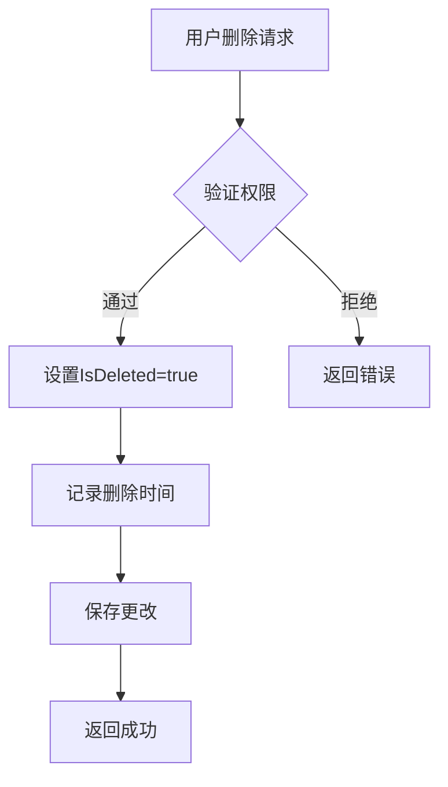

# 用户实体

<cite>
**本文档中引用的文件**  
- [IdentityUserWto.cs](file://aspnet-core/modules/webhooks/LINGYUN.Abp.Webhooks.Identity/LINGYUN/Abp/Webhooks/Identity/IdentityUserWto.cs)
- [IdentitySessionDto.cs](file://aspnet-core/modules/identity/LINGYUN.Abp.Identity.Application.Contracts/LINGYUN/Abp/Identity/Dto/IdentitySessionDto.cs)
- [AbpGdprIdentityUserDataProvider.cs](file://aspnet-core/modules/gdpr/LINGYUN.Abp.Gdpr.Domain.Identity/LINGYUN/Abp/Gdpr/Identity/AbpGdprIdentityUserDataProvider.cs)
- [20231012032107_Initial-Single-Project.Designer.cs](file://aspnet-core/migrations/LY.MicroService.Applications.Single.EntityFrameworkCore.MySql/Migrations/20231012032107_Initial-Single-Project.Designer.cs)
- [20240729102008_Upgrade-Abp-Framework-To-8-2-0.Designer.cs](file://aspnet-core/migrations/LY.MicroService.Applications.Single.EntityFrameworkCore.MySql/Migrations/20240729102008_Upgrade-Abp-Framework-To-8-2-0.Designer.cs)
- [SingleMigrationsDbContextModelSnapshot.cs](file://aspnet-core/migrations/LY.MicroService.Applications.Single.EntityFrameworkCore.PostgreSql/Migrations/SingleMigrationsDbContextModelSnapshot.cs)
- [20250217124909_Add-Gdpr-Module.Designer.cs](file://aspnet-core/migrations/LY.MicroService.Applications.Single.EntityFrameworkCore.MySql/Migrations/20250217124909_Add-Gdpr-Module.Designer.cs)
</cite>

## 目录
1. [简介](#简介)
2. [属性定义](#属性定义)
3. [账户状态与审计字段](#账户状态与审计字段)
4. [软删除机制](#软删除机制)
5. [数据验证规则](#数据验证规则)
6. [用户与角色及组织机构的关系](#用户与角色及组织机构的关系)
7. [索引与外键约束](#索引与外键约束)
8. [领域事件触发](#领域事件触发)
9. [扩展指导](#扩展指导)
10. [Entity Framework Core 映射配置](#entity-framework-core-映射配置)

## 简介
`IdentityUser` 实体是系统中用户管理的核心组成部分，负责存储用户的基本信息、认证数据、账户状态以及审计信息。该实体通过模块化设计支持多租户、软删除、数据保护和领域事件等高级功能。本文档详细说明 `IdentityUser` 实体的结构、行为及其在系统中的作用。

**Section sources**
- [IdentityUserWto.cs](file://aspnet-core/modules/webhooks/LINGYUN.Abp.Webhooks.Identity/LINGYUN/Abp/Webhooks/Identity/IdentityUserWto.cs)

## 属性定义
`IdentityUser` 实体包含以下主要属性分类：

### 基础信息
- **用户名 (UserName)**：用户的唯一登录名，用于身份验证。
- **姓名 (Name)**：用户的真实姓名。
- **姓氏 (Surname)**：用户的姓氏。
- **邮箱 (Email)**：用户的电子邮件地址，用于通信和验证。
- **电话号码 (PhoneNumber)**：用户的联系电话。

### 认证相关字段
- **密码哈希 (PasswordHash)**：存储经过哈希处理的密码，确保密码安全。
- **邮箱确认状态 (EmailConfirmed)**：布尔值，表示邮箱是否已验证。
- **电话号码确认状态 (PhoneNumberConfirmed)**：布尔值，表示电话号码是否已验证。
- **两步验证启用状态 (TwoFactorEnabled)**：指示是否启用了双因素认证。

### 账户状态
- **账户启用状态 (Enabled)**：布尔值，表示账户是否处于激活状态。
- **账户锁定状态 (LockoutEnabled)**：布尔值，表示是否允许账户被锁定。
- **锁定截止时间 (LockoutEnd)**：账户被锁定的结束时间。
- **失败登录尝试次数 (AccessFailedCount)**：记录连续失败的登录尝试次数。

### 审计字段
- **创建时间 (CreationTime)**：记录用户账户的创建时间。
- **最后修改时间 (LastModificationTime)**：记录用户信息最后一次修改的时间。
- **创建者ID (CreatorId)**：创建该用户账户的用户ID。
- **最后修改者ID (LastModifierId)**：最后修改该用户信息的用户ID。

**Section sources**
- [IdentityUserWto.cs](file://aspnet-core/modules/webhooks/LINGYUN.Abp.Webhooks.Identity/LINGYUN/Abp/Webhooks/Identity/IdentityUserWto.cs)
- [AbpGdprIdentityUserDataProvider.cs](file://aspnet-core/modules/gdpr/LINGYUN.Abp.Gdpr.Domain.Identity/LINGYUN/Abp/Gdpr/Identity/AbpGdprIdentityUserDataProvider.cs)

## 账户状态与审计字段
`IdentityUser` 实体通过多个字段来管理账户的状态和审计信息。账户状态字段如 `Enabled` 和 `LockoutEnabled` 允许系统管理员控制用户的访问权限。审计字段则提供了完整的操作历史记录，便于追踪和合规性检查。这些字段由框架自动维护，确保数据的一致性和完整性。

**Section sources**
- [IdentityUserWto.cs](file://aspnet-core/modules/webhooks/LINGYUN.Abp.Webhooks.Identity/LINGYUN/Abp/Webhooks/Identity/IdentityUserWto.cs)

## 软删除机制
软删除通过 `IsDeleted` 字段实现，该字段在数据库中默认值为 `false`。当用户被删除时，系统不会从数据库中物理移除记录，而是将 `IsDeleted` 设置为 `true`，并记录删除时间和删除者ID。这种方式保留了数据的历史记录，同时避免了因误删导致的数据丢失。

**Diagram sources**
- [20231012032107_Initial-Single-Project.Designer.cs](file://aspnet-core/migrations/LY.MicroService.Applications.Single.EntityFrameworkCore.MySql/Migrations/20231012032107_Initial-Single-Project.Designer.cs)
- [20240729102008_Upgrade-Abp-Framework-To-8-2-0.Designer.cs](file://aspnet-core/migrations/LY.MicroService.App