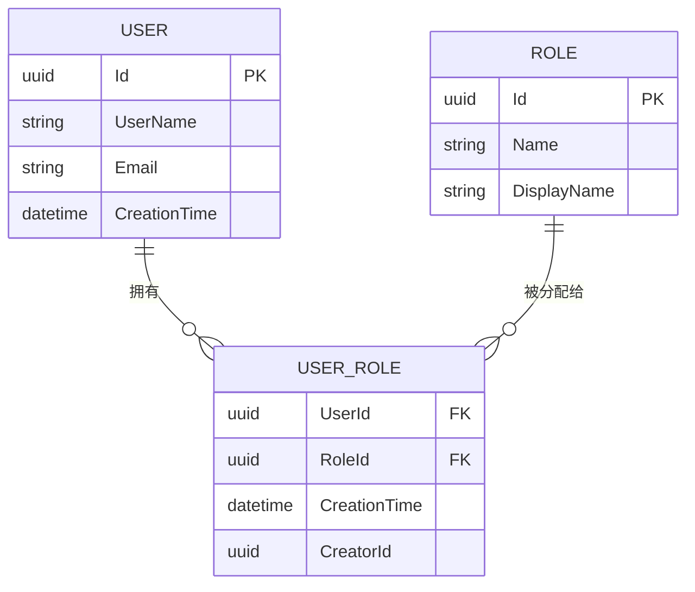

# 用户角色关系

<cite>
**本文档引用的文件**
- [20231012032107_Initial-Single-Project.Designer.cs](file://aspnet-core\migrations\LY.MicroService.Applications.Single.EntityFrameworkCore.MySql\Migrations\20231012032107_Initial-Single-Project.Designer.cs)
- [20231012032107_Initial-Single-Project.cs](file://aspnet-core\migrations\LY.MicroService.Applications.Single.EntityFrameworkCore.MySql\Migrations\20231012032107_Initial-Single-Project.cs)
- [EfCoreIdentityUserRepository.cs](file://aspnet-core\modules\identity\LINGYUN.Abp.Identity.EntityFrameworkCore\LINGYUN\Abp\Identity\EntityFrameworkCore\EfCoreIdentityUserRepository.cs)
- [OrganizationUnitAppService.cs](file://aspnet-core\modules\identity\LINGYUN.Abp.Identity.Application\LINGYUN\Abp\Identity\OrganizationUnitAppService.cs)
</cite>

## 目录
1. [引言](#引言)
2. [用户角色关系实体设计](#用户角色关系实体设计)
3. [多对多关系实现](#多对多关系实现)
4. [EF Core映射配置](#ef-core映射配置)
5. [业务逻辑与权限计算](#业务逻辑与权限计算)
6. [并发控制与数据一致性](#并发控制与数据一致性)
7. [查询优化建议](#查询优化建议)
8. [结论](#结论)

## 引言
本文档详细阐述了 abp-next-admin 项目中用户角色关系（UserRole）的设计与实现。该系统基于 ABP 框架，采用 Entity Framework Core (EF Core) 进行数据访问，并通过代码优先（Code First）的方式管理数据库模式。用户角色关系是身份验证和授权体系的核心组成部分，它实现了用户与角色之间的多对多关联，支持灵活的权限分配和管理。

## 用户角色关系实体设计
用户角色关系实体 `IdentityUserRole` 是一个连接实体（Join Entity），用于在用户（`IdentityUser`）和角色（`IdentityRole`）之间建立多对多关系。该实体本身不包含复杂的业务属性，但包含了关键的审计字段以确保数据的可追溯性。

### 复合主键结构
`IdentityUserRole` 实体采用复合主键设计，由两个外键组成：
- **UserId**: 指向 `AbpUsers` 表的 `Id` 字段。
- **RoleId**: 指向 `AbpRoles` 表的 `Id` 字段。

这种设计确保了每个用户-角色组合的唯一性，即同一个用户不能被重复赋予同一个角色。复合主键直接定义了表的主索引，提供了高效的查找性能。

### 创建时间戳与审计字段
尽管 `IdentityUserRole` 实体本身未显式定义创建时间戳，但其所在的 `AbpUserRoles` 数据库表继承了 ABP 框架提供的基础审计功能。相关的审计字段包括：
- **CreationTime**: 记录记录创建的时间戳。
- **CreatorId**: 记录创建此关联的用户ID。
- **LastModificationTime**: 记录最后一次修改的时间戳。
- **LastModifierId**: 记录最后一次修改此关联的用户ID。
- **IsDeleted**: 软删除标志位，用于标记该关联是否已被删除。

这些字段由 ABP 框架自动管理和填充，为系统的安全审计和数据追踪提供了坚实的基础。

**Section sources**
- [20231012032107_Initial-Single-Project.Designer.cs](file://aspnet-core\migrations\LY.MicroService.Applications.Single.EntityFrameworkCore.MySql\Migrations\20231012032107_Initial-Single-Project.Designer.cs#L3330-L3370)
- [20231012032107_Initial-Single-Project.cs](file://aspnet-core\migrations\LY.MicroService.Applications.Single.EntityFrameworkCore.MySql\Migrations\20231012032107_Initial-Single-Project.cs#L1980-L2010)

## 多对多关系实现
在数据库层面，用户与角色的多对多关系是通过一个名为 `AbpUserRoles` 的中间表来实现的。这是一种标准的数据库范式化设计。

### 中间表 `AbpUserRoles`
- **表名**: `AbpUserRoles`
- **主键**: 由 `(UserId, RoleId)` 组成的复合主键。
- **外键约束**:
  - `FK_AbpUserRoles_AbpRoles_RoleId`: 约束 `RoleId` 必须存在于 `AbpRoles` 表中。
  - `FK_AbpUserRoles_AbpUsers_UserId`: 约束 `UserId` 必须存在于 `AbpUsers` 表中。
- **索引**: 除了主键索引外，还存在一个 `(RoleId, UserId)` 的索引，这有助于根据角色快速查找所有关联的用户。

**Diagram sources**
- [20231012032107_Initial-Single-Project.Designer.cs](file://aspnet-core\migrations\LY.MicroService.Applications.Single.EntityFrameworkCore.MySql\Migrations\20231012032107_Initial-Single-Project.Designer.cs#L3330-L3370)
- [20231012032107_Initial-Single-Project.cs](file://aspnet-core\migrations\LY.MicroService.Applications.Single.EntityFrameworkCore.MySql\Migrations\20231012032107_Initial-Single-Project.cs#L1980-L2010)

## EF Core映射配置
Entity Framework Core 使用 Fluent API 对 `IdentityUserRole` 实体进行配置，确保其正确映射到数据库表。

### 关键配置项
- **HasKey("UserId", "RoleId")**: 明确指定复合主键。
- **HasIndex("RoleId", "UserId")**: 创建辅助索引以优化按角色查询用户的性能。
- **ToTable("AbpUserRoles", null)**: 将实体映射到 `AbpUserRoles` 表。
- **Property 配置**: 为 `UserId` 和 `RoleId` 配置了正确的数据类型（`char(36)` 对应 GUID）和列名。

这些配置通常在 `DbContext` 的 `OnModelCreating` 方法中通过迁移文件（如 `.Designer.cs` 文件）生成，确保了代码模型与数据库模式的一致性。

**Section sources**
- [20231012032107_Initial-Single-Project.Designer.cs](file://aspnet-core\migrations\LY.MicroService.Applications.Single.EntityFrameworkCore.MySql\Migrations\20231012032107_Initial-Single-Project.Designer.cs#L3330-L3370)

## 业务逻辑与权限计算
用户角色关系的业务逻辑主要体现在角色的分配、移除以及权限的计算上。

### 角色分配与管理
角色分配通常发生在以下场景：
- **用户注册后**：根据业务规则自动分配默认角色（如“普通用户”）。
- **管理员操作**：管理员通过管理界面手动为用户添加或移除角色。
- **组织单元继承**：当用户被加入某个组织单元时，可能会继承该组织单元所关联的角色。

相关业务逻辑在 `EfCoreIdentityUserRepository` 和 `OrganizationUnitAppService` 等服务类中实现。例如，`OrganizationUnitAppService.GetRoleNamesAsync` 方法可以获取特定组织单元下所有用户的角色名称。

### 权限计算机制
权限计算是一个动态过程。当用户发起请求时，系统会：
1. 查询该用户当前拥有的所有角色。
2. 根据这些角色查询其所拥有的所有权限。
3. 将这些权限合并，形成最终的权限集合。
4. 检查该权限集合是否包含执行当前操作所需的权限。

这个过程依赖于高效的角色-用户关联查询，这也是为什么为 `RoleId` 字段建立索引至关重要的原因。

**Section sources**
- [EfCoreIdentityUserRepository.cs](file://aspnet-core\modules\identity\LINGYUN.Abp.Identity.EntityFrameworkCore\LINGYUN\Abp\Identity\EntityFrameworkCore\EfCoreIdentityUserRepository.cs#L71-L99)
- [OrganizationUnitAppService.cs](file://aspnet-core\modules\identity\LINGYUN.Abp.Identity.Application\LINGYUN\Abp\Identity\OrganizationUnitAppService.cs#L96-L123)

## 并发控制与数据一致性
ABP 框架通过多种机制保障用户角色关系的数据一致性和并发安全。

### 并发令牌（Concurrency Token）
虽然 `IdentityUserRole` 实体本身没有显式的并发令牌，但其父实体（`IdentityUser` 和 `IdentityRole`）通常包含 `ConcurrencyStamp` 字段。当更新用户或角色信息时，EF Core 会检查此令牌，防止并发更新导致的数据覆盖。

### 数据库约束
- **外键约束**: 确保 `UserId` 和 `RoleId` 的有效性，防止出现孤立的关联记录。
- **主键约束**: 保证用户-角色组合的唯一性，避免重复赋权。
- **软删除**: `IsDeleted` 字段允许逻辑删除关联，而不是物理删除，便于数据恢复和审计。

这些约束在数据库层面强制执行，是维护数据完整性的最后一道防线。

## 查询优化建议
为了提高涉及用户角色关系的查询性能，建议采取以下措施：

### 索引策略
- **核心索引**: 确保 `(UserId)` 和 `(RoleId)` 上都有索引。复合主键 `(UserId, RoleId)` 已经提供了一个索引，但单独为 `RoleId` 建立索引对于“查找某角色下的所有用户”这类查询至关重要。
- **覆盖索引**: 如果经常需要同时查询 `UserId`, `RoleId` 和 `CreationTime`，可以考虑创建一个包含这三个字段的覆盖索引，以避免回表查询。

### 常见查询模式
- **查询用户的所有角色**: `SELECT r.* FROM AbpRoles r INNER JOIN AbpUserRoles ur ON r.Id = ur.RoleId WHERE ur.UserId = @userId`
- **查询角色的所有用户**: `SELECT u.* FROM AbpUsers u INNER JOIN AbpUserRoles ur ON u.Id = ur.UserId WHERE ur.RoleId = @roleId`
- **批量操作**: 在处理大量用户或角色时，使用批量插入/删除操作，而不是逐条执行，以减少数据库往返次数。

**Section sources**
- [20231012032107_Initial-Single-Project.Designer.cs](file://aspnet-core\migrations\LY.MicroService.Applications.Single.EntityFrameworkCore.MySql\Migrations\20231012032107_Initial-Single-Project.Designer.cs#L3330-L3370)

## 结论
用户角色关系（UserRole）是 abp-next-admin 项目权限管理体系的基石。通过精心设计的复合主键、完善的审计字段和标准的中间表模式，系统实现了灵活、安全且可追溯的用户-角色关联。EF Core 的映射配置确保了代码与数据库的一致性，而 ABP 框架提供的并发控制和数据完整性约束则保障了系统的稳定运行。通过合理的索引策略和查询优化，可以确保在高并发场景下的良好性能。理解这一核心关系的设计，对于开发和维护基于此框架的应用至关重要。