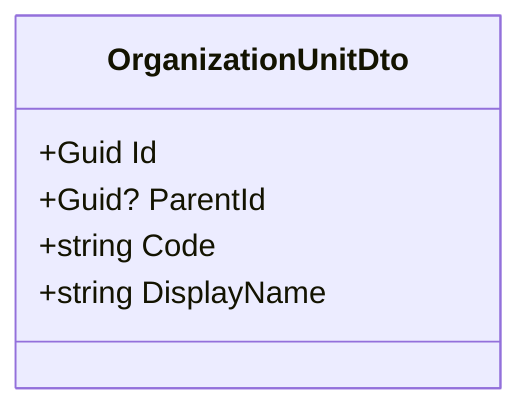
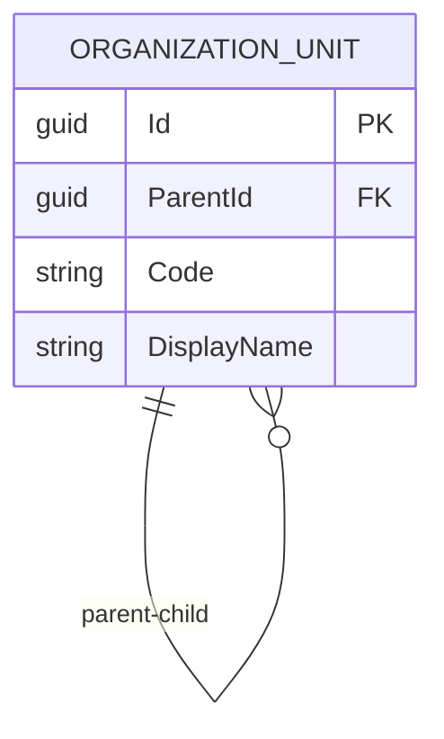
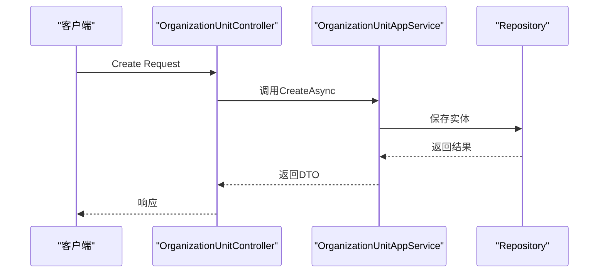
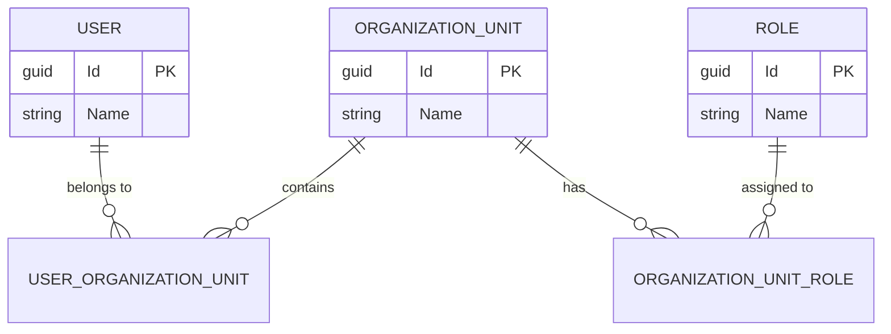
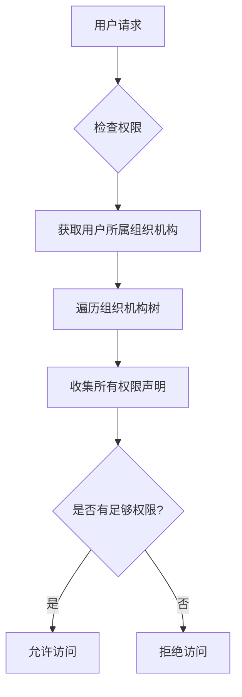
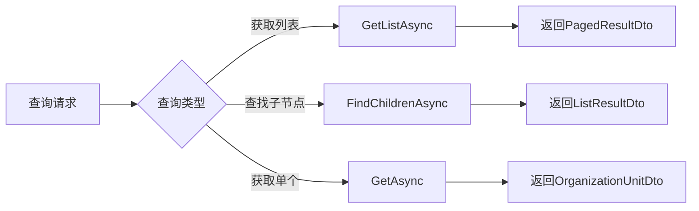
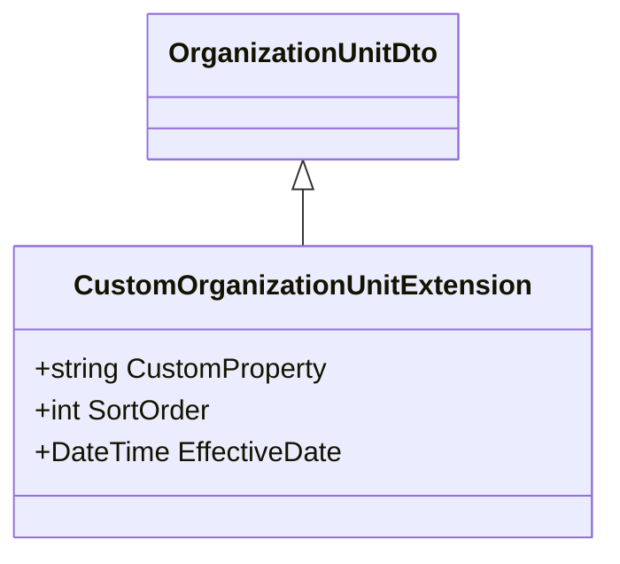

# 组织机构

<cite>
**本文档中引用的文件**
- [OrganizationUnitDto.cs](file://aspnet-core\modules\identity\LINGYUN.Abp.Identity.Application.Contracts\LINGYUN\Abp\Identity\Dto\OrganizationUnitDto.cs)
- [OrganizationUnitAppService.cs](file://aspnet-core\modules\identity\LINGYUN.Abp.Identity.Application\LINGYUN\Abp\Identity\OrganizationUnitAppService.cs)
- [OrganizationUnitController.cs](file://aspnet-core\modules\identity\LINGYUN.Abp.Identity.HttpApi\LINGYUN\Abp\Identity\OrganizationUnitController.cs)
- [AbpOrganizationUnitClaimTypes.cs](file://aspnet-core\framework\authorization\LINGYUN.Abp.Authorization.OrganizationUnits\LINGYUN\Abp\Authorization\OrganizationUnits\AbpOrganizationUnitClaimTypes.cs)
- [AbpDataProtectionDbContextModelBuilderExtensions.cs](file://aspnet-core\framework\data-protection\LINGYUN.Abp.DataProtection.EntityFrameworkCore\LINGYUN\Abp\DataProtection\EntityFrameworkCore\AbpDataProtectionDbContextModelBuilderExtensions.cs)
</cite>

## 目录
1. [简介](#简介)
2. [核心属性定义](#核心属性定义)
3. [树形结构实现](#树形结构实现)
4. [父子关系维护机制](#父子关系维护机制)
5. [与用户和角色的关系](#与用户和角色的关系)
6. [权限继承机制](#权限继承机制)
7. [Entity Framework Core中的层级查询优化](#entity-framework-core中的层级查询优化)
8. [扩展指导](#扩展指导)

## 简介
组织机构(OrganizationUnit)是系统中用于管理企业或组织内部结构的核心实体。它实现了树形层级结构，支持多对多关系管理，并提供了灵活的权限控制机制。本文档详细说明了组织机构实体的设计、实现和使用方式。

**Section sources**
- [OrganizationUnitDto.cs](file://aspnet-core\modules\identity\LINGYUN.Abp.Identity.Application.Contracts\LINGYUN\Abp\Identity\Dto\OrganizationUnitDto.cs)

## 核心属性定义
组织机构实体包含以下核心属性：

| 属性名称 | 类型 | 描述 |
|---------|------|------|
| Id | Guid | 组织机构唯一标识符 |
| ParentId | Guid? | 父级组织机构ID（可为空，表示根节点） |
| Code | string | 组织机构代码 |
| DisplayName | string | 显示名称 |

这些属性通过`OrganizationUnitDto`类进行传输和操作，该DTO继承自`ExtensibleAuditedEntityDto<Guid>`，包含了审计信息和扩展性支持。

**Diagram sources**
- [OrganizationUnitDto.cs](file://aspnet-core\modules\identity\LINGYUN.Abp.Identity.Application.Contracts\LINGYUN\Abp\Identity\Dto\OrganizationUnitDto.cs)

**Section sources**
- [OrganizationUnitDto.cs](file://aspnet-core\modules\identity\LINGYUN.Abp.Identity.Application.Contracts\LINGYUN\Abp\Identity\Dto\OrganizationUnitDto.cs)

## 树形结构实现
组织机构采用邻接表模型(Adjacency List Model)来存储树形结构。每个组织机构记录都包含一个指向其父级组织机构的外键(ParentId)，这种设计简单直观，易于理解和维护。

数据库存储方面，系统使用路径模式(Path Pattern)辅助查询性能优化。虽然直接的邻接表模型在处理递归查询时可能存在性能问题，但通过缓存和预计算等手段进行了优化。

**Diagram sources**
- [OrganizationUnitDto.cs](file://aspnet-core\modules\identity\LINGYUN.Abp.Identity.Application.Contracts\LINGYUN\Abp\Identity\Dto\OrganizationUnitDto.cs)

**Section sources**
- [OrganizationUnitDto.cs](file://aspnet-core\modules\identity\LINGYUN.Abp.Identity.Application.Contracts\LINGYUN\Abp\Identity\Dto\OrganizationUnitDto.cs)

## 父子关系维护机制
组织机构的父子关系通过应用服务层进行维护，主要操作包括创建、移动和删除。当创建新的组织机构时，需要指定其父级ID；移动操作则允许重新组织层级结构。

关键的维护方法包括：
- `CreateAsync`: 创建新组织机构
- `MoveAsync`: 移动组织机构到新的父级下
- `DeleteAsync`: 删除组织机构及其子树

这些操作由`OrganizationUnitAppService`统一管理，确保数据一致性和业务规则的执行。

**Diagram sources**
- [OrganizationUnitAppService.cs](file://aspnet-core\modules\identity\LINGYUN.Abp.Identity.Application\LINGYUN\Abp\Identity\OrganizationUnitAppService.cs)
- [OrganizationUnitController.cs](file://aspnet-core\modules\identity\LINGYUN.Abp.Identity.HttpApi\LINGYUN\Abp\Identity\OrganizationUnitController.cs)

**Section sources**
- [OrganizationUnitAppService.cs](file://aspnet-core\modules\identity\LINGYUN.Abp.Identity.Application\LINGYUN\Abp\Identity\OrganizationUnitAppService.cs)

## 与用户和角色的关系
组织机构与用户、角色之间存在多对多关系。一个用户可以属于多个组织机构，一个组织机构也可以包含多个用户。同样，角色也可以分配给特定的组织机构。

这种关系通过专门的关联表进行管理，支持灵活的成员管理和权限分配。通过`OrganizationUnitAddUserDto`和`OrganizationUnitAddRoleDto`等DTO对象来处理添加操作。

**Diagram sources**
- [OrganizationUnitDto.cs](file://aspnet-core\modules\identity\LINGYUN.Abp.Identity.Application.Contracts\LINGYUN\Abp\Identity\Dto\OrganizationUnitDto.cs)

**Section sources**
- [OrganizationUnitDto.cs](file://aspnet-core\modules\identity\LINGYUN.Abp.Identity.Application.Contracts\LINGYUN\Abp\Identity\Dto\OrganizationUnitDto.cs)

## 权限继承机制
组织机构实现了基于路径的权限继承机制。子组织机构自动继承父组织机构的权限设置，同时可以拥有自己的特殊权限。

系统通过声明类型"ou_code"来标识组织机构相关的权限声明，这在`AbpOrganizationUnitClaimTypes`类中定义。权限检查时会沿着组织机构树向上遍历，收集所有有效的权限声明。

**Diagram sources**
- [AbpOrganizationUnitClaimTypes.cs](file://aspnet-core\framework\authorization\LINGYUN.Abp.Authorization.OrganizationUnits\LINGYUN\Abp\Authorization\OrganizationUnits\AbpOrganizationUnitClaimTypes.cs)

**Section sources**
- [AbpOrganizationUnitClaimTypes.cs](file://aspnet-core\framework\authorization\LINGYUN.Abp.Authorization.OrganizationUnits\LINGYUN\Abp\Authorization\OrganizationUnits\AbpOrganizationUnitClaimTypes.cs)

## Entity Framework Core中的层级查询优化
为了优化组织机构树形结构的查询性能，系统采用了多种策略：

1. **懒加载(Lazy Loading)**：按需加载子节点
2. **预加载(Eager Loading)**：一次性加载整个子树
3. **分页查询**：对于大型组织机构，使用分页获取数据

查询操作通过`OrganizationUnitRepository`提供支持，常见的查询方法包括`GetListAsync`、`FindChildrenAsync`等，这些方法都经过优化以提高查询效率。

**Diagram sources**
- [OrganizationUnitAppService.cs](file://aspnet-core\modules\identity\LINGYUN.Abp.Identity.Application\LINGYUN\Abp\Identity\OrganizationUnitAppService.cs)

**Section sources**
- [OrganizationUnitAppService.cs](file://aspnet-core\modules\identity\LINGYUN.Abp.Identity.Application\LINGYUN\Abp\Identity\OrganizationUnitAppService.cs)

## 扩展指导
要扩展组织机构实体的功能，可以通过以下方式进行：

### 添加自定义属性
通过继承或使用扩展对象模式来添加自定义属性。建议使用ABP框架提供的`ExtensibleObject`基类来支持动态属性扩展。

### 添加层级操作方法
可以在`OrganizationUnitAppService`中添加新的业务方法，例如：
- 批量移动组织机构
- 导出组织机构结构
- 导入组织机构数据

### 自定义查询
通过在仓储层添加新的查询方法来支持特定的业务需求，例如按特定条件搜索组织机构或生成组织机构报告。

**Diagram sources**
- [OrganizationUnitDto.cs](file://aspnet-core\modules\identity\LINGYUN.Abp.Identity.Application.Contracts\LINGYUN\Abp\Identity\Dto\OrganizationUnitDto.cs)

**Section sources**
- [OrganizationUnitDto.cs](file://aspnet-core\modules\identity\LINGYUN.Abp.Identity.Application.Contracts\LINGYUN\Abp\Identity\Dto\OrganizationUnitDto.cs)