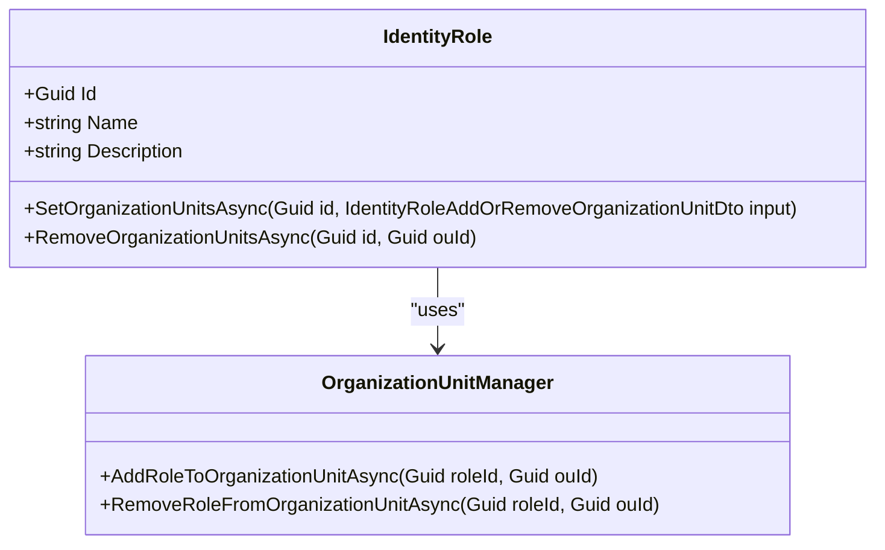

# 角色实体

<cite>
**本文档引用的文件**   
- [IdentityRoleWto.cs](file://aspnet-core/modules/webhooks/LINGYUN.Abp.Webhooks.Identity/LINGYUN/Abp/Webhooks/Identity/IdentityRoleWto.cs)
- [AbpDataProtectionDbContextModelBuilderExtensions.cs](file://aspnet-core/framework/data-protection/LINGYUN.Abp.DataProtection.EntityFrameworkCore/LINGYUN/Abp/DataProtection/EntityFrameworkCore/AbpDataProtectionDbContextModelBuilderExtensions.cs)
- [IdentityRoleAppService.cs](file://aspnet-core/modules/identity/LINGYUN.Abp.Identity.Application/LINGYUN/Abp/Identity/IdentityRoleAppService.cs)
- [IIdentityRoleAppService.cs](file://aspnet-core/modules/identity/LINGYUN.Abp.Identity.Application.Contracts/LINGYUN/Abp/Identity/IIdentityRoleAppService.cs)
- [RoleEntityRuleAppService.cs](file://aspnet-core/modules/data-protection/LINGYUN.Abp.DataProtectionManagement.Application/LINGYUN/Abp/DataProtectionManagement/RoleEntityRuleAppService.cs)
</cite>

## 目录
1. [简介](#简介)
2. [角色实体属性定义](#角色实体属性定义)
3. [角色与用户关系实现](#角色与用户关系实现)
4. [角色权限管理机制](#角色权限管理机制)
5. [数据验证规则](#数据验证规则)
6. [审计字段设计](#审计字段设计)
7. [扩展指导](#扩展指导)
8. [查询优化策略](#查询优化策略)

## 简介
角色实体（IdentityRole）是系统权限管理的核心组成部分，用于定义系统中的角色及其权限。本文档详细说明了角色实体的属性定义、与用户之间的多对多关系实现、权限管理机制、数据验证规则和审计字段设计。同时，文档还提供了角色实体的扩展指导，包括如何添加自定义属性和权限管理逻辑，以及在Entity Framework Core中的查询优化策略。

## 角色实体属性定义
角色实体包含以下主要属性：
- **Id**: 角色的唯一标识符，类型为Guid。
- **Name**: 角色名称，字符串类型，用于标识角色。
- **Description**: 角色描述，字符串类型，提供角色的详细信息。
- **常规权限**: 角色所拥有的常规权限集合。
- **组织机构权限**: 角色在特定组织机构中的权限集合。

这些属性在`IdentityRoleWto.cs`文件中定义，其中`Id`和`Name`是基本属性，用于唯一标识和命名角色。

**Section sources**
- [IdentityRoleWto.cs](file://aspnet-core/modules/webhooks/LINGYUN.Abp.Webhooks.Identity/LINGYUN/Abp/Webhooks/Identity/IdentityRoleWto.cs#L0-L10)

## 角色与用户关系实现
角色与用户之间通过多对多关系进行关联。这种关系通常通过一个关联表来实现，该表包含用户ID和角色ID的组合键。在数据库中，这种关系可以通过外键约束来维护，确保数据的一致性和完整性。

在代码层面，这种关系通常通过集合属性来表示，例如在用户实体中包含一个角色集合，在角色实体中包含一个用户集合。Entity Framework Core会自动处理这些集合属性的映射和管理。

**Section sources**
- [IdentityRoleAppService.cs](file://aspnet-core/modules/identity/LINGYUN.Abp.Identity.Application/LINGYUN/Abp/Identity/IdentityRoleAppService.cs#L34-L69)
- [IIdentityRoleAppService.cs](file://aspnet-core/modules/identity/LINGYUN.Abp.Identity.Application.Contracts/LINGYUN/Abp/Identity/IIdentityRoleAppService.cs#L0-L30)

## 角色权限管理机制
角色权限管理机制允许为角色分配和管理权限。权限可以分为常规权限和组织机构权限。常规权限适用于整个系统，而组织机构权限则限定于特定的组织机构。

权限管理通常通过服务类来实现，如`IdentityRoleAppService`，它提供了设置和移除组织机构权限的方法。这些方法通过调用底层的数据访问层来更新数据库中的权限信息。

**Diagram sources**
- [IdentityRoleAppService.cs](file://aspnet-core/modules/identity/LINGYUN.Abp.Identity.Application/LINGYUN/Abp/Identity/IdentityRoleAppService.cs#L34-L69)

## 数据验证规则
为了确保数据的完整性和一致性，角色实体需要遵循一定的数据验证规则。其中最重要的规则之一是角色名称的唯一性。这意味着在同一系统中，不能有两个角色具有相同的名称。

数据验证通常在服务层或数据访问层实现，通过查询数据库来检查是否存在重复的角色名称。如果发现重复，则抛出相应的异常。

**Section sources**
- [RoleEntityRuleAppService.cs](file://aspnet-core/modules/data-protection/LINGYUN.Abp.DataProtectionManagement.Application/LINGYUN/Abp/DataProtectionManagement/RoleEntityRuleAppService.cs#L30-L55)

## 审计字段设计
审计字段用于记录角色实体的创建和修改信息，包括创建时间、创建者、最后修改时间、最后修改者等。这些字段有助于追踪角色的变化历史，对于系统的安全性和可追溯性至关重要。

审计字段通常在基类中定义，并由所有继承该基类的实体自动继承。在Entity Framework Core中，可以通过配置模型构建器来指定这些字段的映射和约束。

**Section sources**
- [AbpDataProtectionDbContextModelBuilderExtensions.cs](file://aspnet-core/framework/data-protection/LINGYUN.Abp.DataProtection.EntityFrameworkCore/LINGYUN/Abp/DataProtection/EntityFrameworkCore/AbpDataProtectionDbContextModelBuilderExtensions.cs#L33-L55)

## 扩展指导
### 添加自定义属性
要为角色实体添加自定义属性，可以在实体类中直接添加新的属性，并在数据库迁移中更新相应的表结构。例如，可以添加一个`CustomProperty`属性来存储额外的信息。

### 权限管理逻辑
权限管理逻辑可以通过扩展服务类来实现。例如，可以在`IdentityRoleAppService`中添加新的方法来处理特定的权限需求。这些方法可以调用现有的数据访问方法，或者直接操作数据库。

## 查询优化策略
在使用Entity Framework Core进行查询时，可以通过以下策略来优化性能：
- **懒加载与急加载**: 根据实际需求选择合适的加载策略。急加载可以在一次查询中获取所有相关数据，减少数据库往返次数。
- **投影查询**: 只查询需要的字段，避免加载不必要的数据。
- **索引优化**: 在经常用于查询的字段上创建索引，提高查询速度。
- **分页查询**: 对大量数据进行分页查询，避免一次性加载过多数据导致内存溢出。

通过合理运用这些策略，可以显著提升系统的响应速度和用户体验。

**Section sources**
- [IdentityRoleAppService.cs](file://aspnet-core/modules/identity/LINGYUN.Abp.Identity.Application/LINGYUN/Abp/Identity/IdentityRoleAppService.cs#L34-L69)
- [AbpDataProtectionDbContextModelBuilderExtensions.cs](file://aspnet-core/framework/data-protection/LINGYUN.Abp.DataProtection.EntityFrameworkCore/LINGYUN/Abp/DataProtection/EntityFrameworkCore/AbpDataProtectionDbContextModelBuilderExtensions.cs#L33-L55)