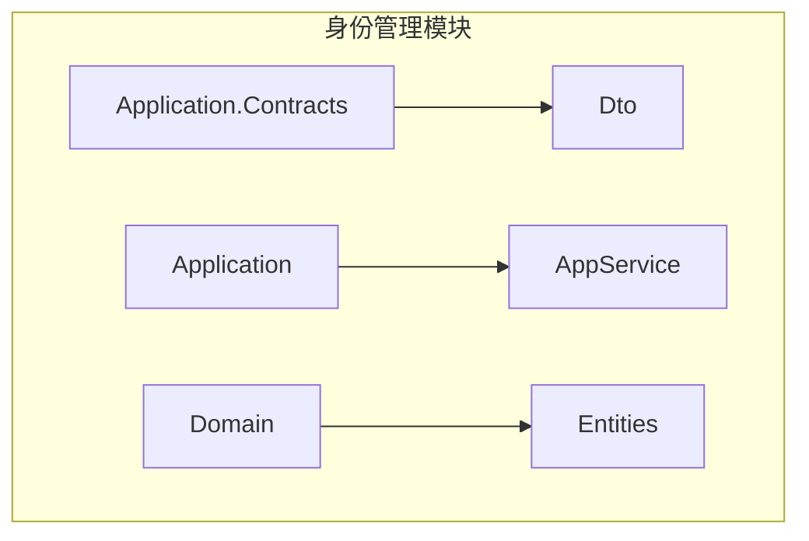
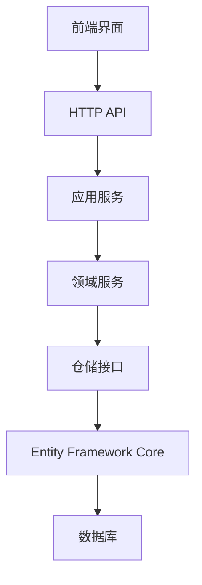
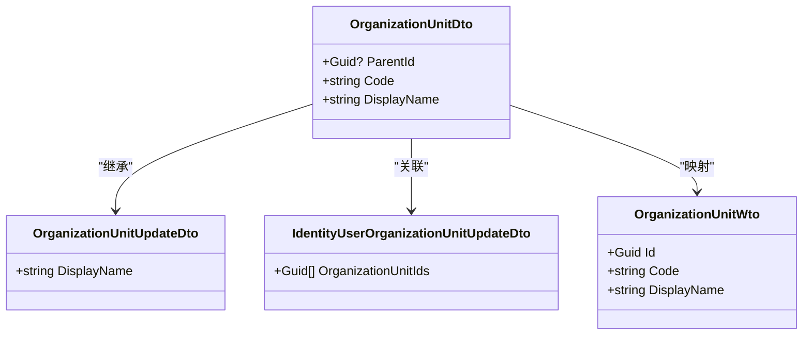
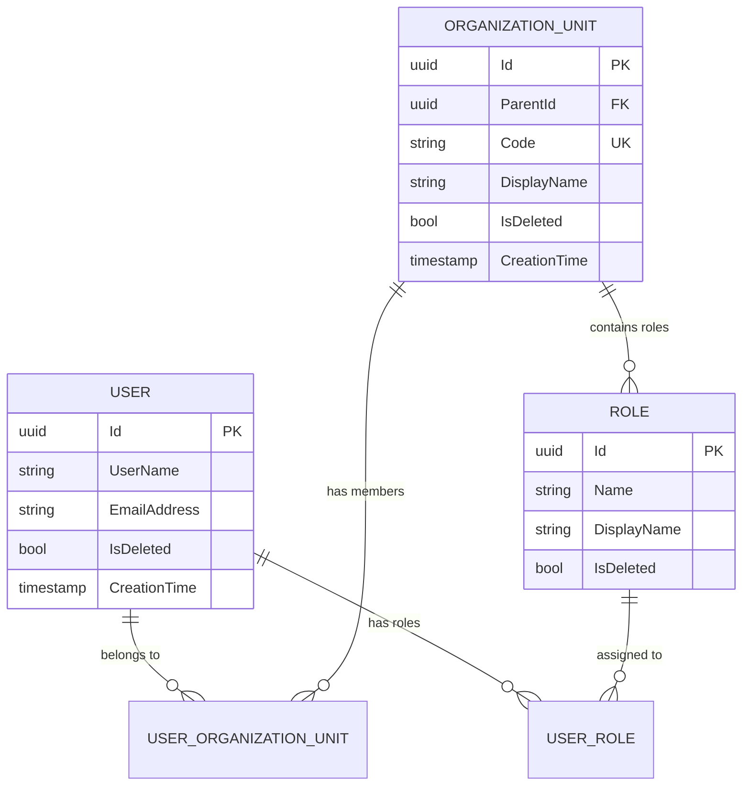

# 身份管理数据模型

<cite>
**本文档中引用的文件**  
- [OrganizationUnitDto.cs](file://aspnet-core/modules/identity/LINGYUN.Abp.Identity.Application.Contracts/LINGYUN/Abp/Identity/Dto/OrganizationUnitDto.cs)
- [IdentityUserOrganizationUnitUpdateDto.cs](file://aspnet-core/modules/identity/LINGYUN.Abp.Identity.Application.Contracts/LINGYUN/Abp/Identity/Dto/IdentityUserOrganizationUnitUpdateDto.cs)
- [OrganizationUnitUpdateDto.cs](file://aspnet-core/modules/identity/LINGYUN.Abp.Identity.Application.Contracts/LINGYUN/Abp/Identity/Dto/OrganizationUnitUpdateDto.cs)
- [OrganizationUnitAppService.cs](file://aspnet-core/modules/identity/LINGYUN.Abp.Identity.Application/LINGYUN/Abp/Identity/OrganizationUnitAppService.cs)
- [OrganizationUnitWto.cs](file://aspnet-core/modules/webhooks/LINGYUN.Abp.Webhooks.Identity/LINGYUN/Abp/Webhooks/Identity/OrganizationUnitWto.cs)
</cite>

## 目录
1. [引言](#引言)
2. [项目结构](#项目结构)
3. [核心组件](#核心组件)
4. [架构概述](#架构概述)
5. [详细组件分析](#详细组件分析)
6. [依赖分析](#依赖分析)
7. [性能考虑](#性能考虑)
8. [故障排除指南](#故障排除指南)
9. [结论](#结论)
10. [附录](#附录)（如有必要）

## 引言
本文档详细描述了基于 ABP 框架的身份管理模块数据模型设计。重点阐述用户（User）、角色（Role）、组织机构（OrganizationUnit）等核心实体的设计原则、关系模型及实现机制。文档涵盖实体属性定义、数据验证规则、软删除实现、审计字段设计等内容，并通过 ER 图展示实体间关系，说明领域驱动设计在身份管理中的应用。同时为开发人员提供实体扩展和自定义的指导建议。

## 项目结构
身份管理模块主要位于 `aspnet-core/modules/identity` 目录下，包含应用层契约（Application.Contracts）、应用服务（Application）和领域层（Domain）。组织机构相关实体分布在 DTO 和应用服务中，通过分层架构实现关注点分离。

**图表来源**  
- [OrganizationUnitDto.cs](file://aspnet-core/modules/identity/LINGYUN.Abp.Identity.Application.Contracts/LINGYUN/Abp/Identity/Dto/OrganizationUnitDto.cs)
- [OrganizationUnitAppService.cs](file://aspnet-core/modules/identity/LINGYUN.Abp.Identity.Application/LINGYUN/Abp/Identity/OrganizationUnitAppService.cs)

**章节来源**  
- [OrganizationUnitDto.cs](file://aspnet-core/modules/identity/LINGYUN.Abp.Identity.Application.Contracts/LINGYUN/Abp/Identity/Dto/OrganizationUnitDto.cs)
- [OrganizationUnitAppService.cs](file://aspnet-core/modules/identity/LINGYUN.Abp.Identity.Application/LINGYUN/Abp/Identity/OrganizationUnitAppService.cs)

## 核心组件
身份管理模块的核心组件包括用户（User）、角色（Role）和组织机构（OrganizationUnit）。这些实体通过 ABP 框架提供的基础类进行建模，支持多租户、审计和软删除功能。组织机构支持树形结构，通过 ParentId 实现层级关系。

**章节来源**  
- [OrganizationUnitDto.cs](file://aspnet-core/modules/identity/LINGYUN.Abp.Identity.Application.Contracts/LINGYUN/Abp/Identity/Dto/OrganizationUnitDto.cs)
- [OrganizationUnitAppService.cs](file://aspnet-core/modules/identity/LINGYUN.Abp.Identity.Application/LINGYUN/Abp/Identity/OrganizationUnitAppService.cs)

## 架构概述
系统采用分层架构，包括表现层、应用服务层、领域层和基础设施层。身份管理模块遵循领域驱动设计原则，将业务逻辑集中在领域模型中，应用服务负责协调用例执行。

**图表来源**  
- [OrganizationUnitAppService.cs](file://aspnet-core/modules/identity/LINGYUN.Abp.Identity.Application/LINGYUN/Abp/Identity/OrganizationUnitAppService.cs)
- [OrganizationUnitDto.cs](file://aspnet-core/modules/identity/LINGYUN.Abp.Identity.Application.Contracts/LINGYUN/Abp/Identity/Dto/OrganizationUnitDto.cs)

## 详细组件分析
本节深入分析身份管理模块中的关键组件，包括组织机构、用户和角色的实现细节。

### 组织机构分析
组织机构（OrganizationUnit）是身份管理中的核心实体之一，用于构建企业组织架构。它支持树形层级结构，允许无限级嵌套。

#### 类图

**图表来源**  
- [OrganizationUnitDto.cs](file://aspnet-core/modules/identity/LINGYUN.Abp.Identity.Application.Contracts/LINGYUN/Abp/Identity/Dto/OrganizationUnitDto.cs)
- [OrganizationUnitUpdateDto.cs](file://aspnet-core/modules/identity/LINGYUN.Abp.Identity.Application.Contracts/LINGYUN/Abp/Identity/Dto/OrganizationUnitUpdateDto.cs)
- [IdentityUserOrganizationUnitUpdateDto.cs](file://aspnet-core/modules/identity/LINGYUN.Abp.Identity.Application.Contracts/LINGYUN/Abp/Identity/Dto/IdentityUserOrganizationUnitUpdateDto.cs)
- [OrganizationUnitWto.cs](file://aspnet-core/modules/webhooks/LINGYUN.Abp.Webhooks.Identity/LINGYUN/Abp/Webhooks/Identity/OrganizationUnitWto.cs)

#### 实体属性定义
| 属性名 | 类型 | 是否必填 | 描述 |
|-------|------|---------|------|
| Id | Guid | 是 | 唯一标识符 |
| ParentId | Guid? | 否 | 父级组织机构ID |
| Code | string | 是 | 组织机构编码 |
| DisplayName | string | 是 | 显示名称 |

**章节来源**  
- [OrganizationUnitDto.cs](file://aspnet-core/modules/identity/LINGYUN.Abp.Identity.Application.Contracts/LINGYUN/Abp/Identity/Dto/OrganizationUnitDto.cs)

#### 数据验证规则
- DisplayName 长度限制为 128 个字符
- Code 必须唯一且符合特定格式规范
- ParentId 不能指向自身或子级（防止循环引用）

#### 软删除实现
组织机构实体继承自 `ExtensibleAuditedEntityDto<Guid>`，自动包含 `IsDeleted` 字段和软删除行为。删除操作实际上是将 `IsDeleted` 标记为 true，并记录删除时间和用户。

#### 审计字段设计
所有组织机构操作均记录审计信息，包括：
- CreatorId：创建者ID
- CreationTime：创建时间
- LastModifierId：最后修改者ID
- LastModificationTime：最后修改时间
- DeleterId：删除者ID
- DeletionTime：删除时间

## 依赖分析
身份管理模块依赖于 ABP 框架的核心功能，包括审计日志、多租户和对象映射。组织机构与用户、角色之间存在多对多关系，通过中间表进行关联。

**图表来源**  
- [OrganizationUnitDto.cs](file://aspnet-core/modules/identity/LINGYUN.Abp.Identity.Application.Contracts/LINGYUN/Abp/Identity/Dto/OrganizationUnitDto.cs)
- [IdentityUserOrganizationUnitUpdateDto.cs](file://aspnet-core/modules/identity/LINGYUN.Abp.Identity.Application.Contracts/LINGYUN/Abp/Identity/Dto/IdentityUserOrganizationUnitUpdateDto.cs)

**章节来源**  
- [OrganizationUnitAppService.cs](file://aspnet-core/modules/identity/LINGYUN.Abp.Identity.Application/LINGYUN/Abp/Identity/OrganizationUnitAppService.cs)

## 性能考虑
为提高查询性能，建议在以下字段上创建索引：
- OrganizationUnit.Code（唯一索引）
- OrganizationUnit.ParentId（普通索引）
- UserOrganizationUnit.UserId 和 UserOrganizationUnit.OrganizationUnitId（复合索引）

对于大规模组织机构树的遍历操作，建议使用闭包表模式或嵌套集模型优化查询效率。

## 故障排除指南
常见问题及解决方案：
- **组织机构无法删除**：检查是否存在子级组织机构或关联用户
- **权限分配不生效**：确认角色已正确分配给组织机构或用户
- **数据不同步**：检查领域事件发布与处理是否正常

**章节来源**  
- [OrganizationUnitAppService.cs](file://aspnet-core/modules/identity/LINGYUN.Abp.Identity.Application/LINGYUN/Abp/Identity/OrganizationUnitAppService.cs)

## 结论
本文档全面介绍了身份管理模块的数据模型设计，涵盖了核心实体的结构、关系、验证规则和扩展机制。通过遵循 ABP 框架的最佳实践，实现了灵活、可扩展的身份管理体系，支持复杂的企业组织架构需求。