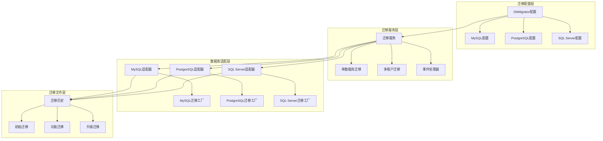
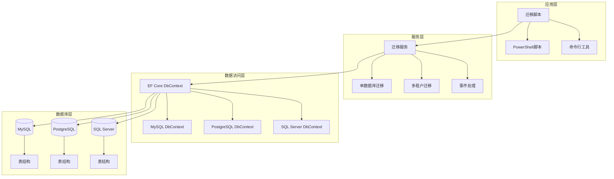
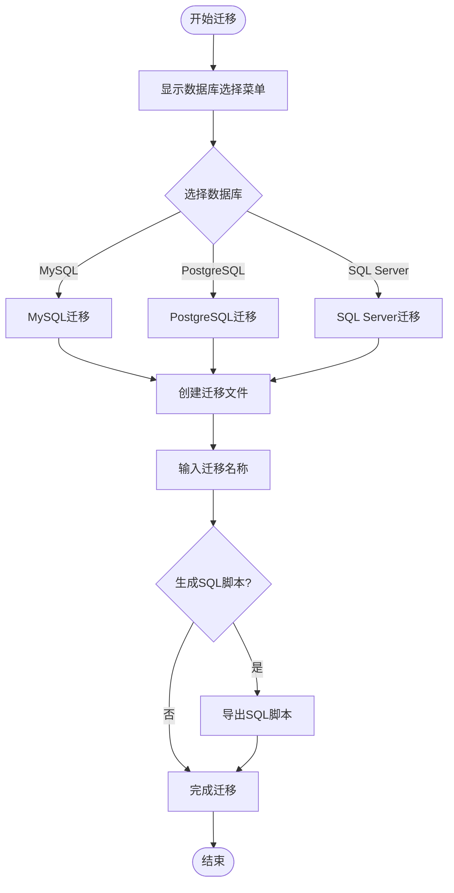
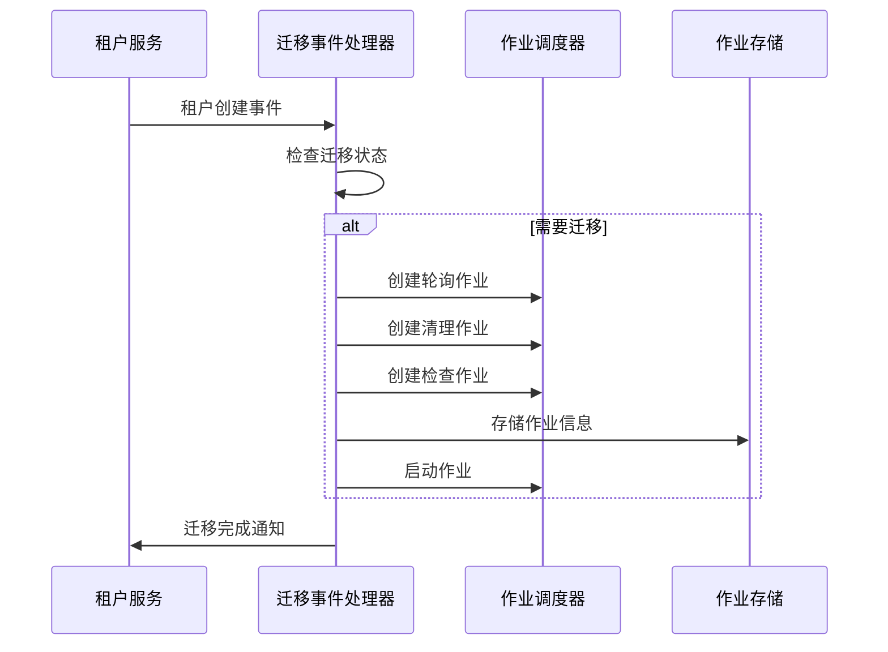
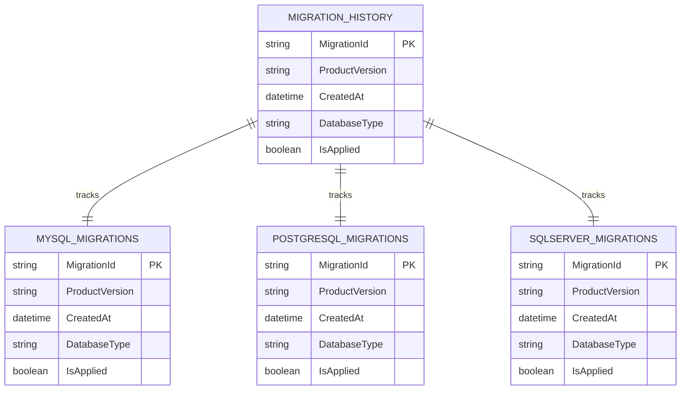

# 多数据库迁移系统

<cite>
**本文档引用的文件**
- [appsettings.MySql.json](file://aspnet-core/migrations/LY.MicroService.Applications.Single.DbMigrator/appsettings.MySql.json)
- [appsettings.PostgreSql.json](file://aspnet-core/migrations/LY.MicroService.Applications.Single.DbMigrator/appsettings.PostgreSql.json)
- [appsettings.SqlServer.json](file://aspnet-core/migrations/LY.MicroService.Applications.Single.DbMigrator/appsettings.SqlServer.json)
- [SingleDbMigrationService.cs](file://aspnet-core/migrations/LY.MicroService.Applications.Single.EntityFrameworkCore/SingleDbMigrationService.cs)
- [SingleMigrationsDbContext.cs](file://aspnet-core/migrations/LY.MicroService.Applications.Single.EntityFrameworkCore/SingleMigrationsDbContext.cs)
- [SingleMigrationsDbContextFactory.cs](file://aspnet-core/migrations/LY.MicroService.Applications.Single.EntityFrameworkCore.MySql/SingleMigrationsDbContextFactory.cs)
- [SingleMigrationsDbContextFactory.cs](file://aspnet-core/migrations/LY.MicroService.Applications.Single.EntityFrameworkCore.PostgreSql/SingleMigrationsDbContextFactory.cs)
- [SingleMigrationsDbContextFactory.cs](file://aspnet-core/migrations/LY.MicroService.Applications.Single.EntityFrameworkCore.SqlServer/SingleMigrationsDbContextFactory.cs)
- [Migrate.ps1](file://aspnet-core/migrations/Migrate.ps1)
- [20231012032107_Initial-Single-Project.cs](file://aspnet-core/migrations/LY.MicroService.Applications.Single.EntityFrameworkCore.MySql/Migrations/20231012032107_Initial-Single-Project.cs)
- [SingleDbMigrationEventHandler.cs](file://aspnet-core/migrations/LY.MicroService.Applications.Single.EntityFrameworkCore/SingleDbMigrationEventHandler.cs)
- [SingleMigrationsEntityFrameworkCoreModule.cs](file://aspnet-core/migrations/LY.MicroService.Applications.Single.EntityFrameworkCore/SingleMigrationsEntityFrameworkCoreModule.cs)
</cite>

## 目录
1. [简介](#简介)
2. [项目结构](#项目结构)
3. [核心组件](#核心组件)
4. [架构概览](#架构概览)
5. [详细组件分析](#详细组件分析)
6. [数据库特定实现](#数据库特定实现)
7. [迁移版本控制](#迁移版本控制)
8. [性能考虑](#性能考虑)
9. [故障排除指南](#故障排除指南)
10. [结论](#结论)

## 简介

ABP Next Admin 项目提供了一个完整的多数据库迁移系统，支持 MySQL、PostgreSQL 和 SQL Server 三种主流关系型数据库。该系统通过统一的迁移接口和数据库特定的适配器，实现了跨数据库平台的数据迁移和版本控制。

该系统的核心设计理念是：
- **统一抽象层**：通过单一的迁移服务接口支持多种数据库
- **数据库特定优化**：为每种数据库提供专门的配置和优化
- **分布式锁机制**：确保多实例环境下的迁移安全
- **租户隔离**：支持多租户应用的独立数据库迁移
- **事件驱动架构**：通过事件处理器自动处理迁移后的业务逻辑

## 项目结构

多数据库迁移系统的文件组织结构如下：



**图表来源**
- [appsettings.MySql.json](file://aspnet-core/migrations/LY.MicroService.Applications.Single.DbMigrator/appsettings.MySql.json#L1-L5)
- [SingleDbMigrationService.cs](file://aspnet-core/migrations/LY.MicroService.Applications.Single.EntityFrameworkCore/SingleDbMigrationService.cs#L1-L101)

**章节来源**
- [appsettings.MySql.json](file://aspnet-core/migrations/LY.MicroService.Applications.Single.DbMigrator/appsettings.MySql.json#L1-L5)
- [SingleDbMigrationService.cs](file://aspnet-core/migrations/LY.MicroService.Applications.Single.EntityFrameworkCore/SingleDbMigrationService.cs#L1-L101)

## 核心组件

### 迁移服务核心类

系统的核心是 `SingleDbMigrationService` 类，它继承自 `EfCoreRuntimeDatabaseMigratorBase`，提供了统一的数据库迁移接口。

```csharp
public class SingleDbMigrationService : EfCoreRuntimeDatabaseMigratorBase<SingleMigrationsDbContext>, ITransientDependency
{
    protected IDataSeeder DataSeeder { get; }
    protected ITenantRepository TenantRepository { get; }
    
    public SingleDbMigrationService(
        IUnitOfWorkManager unitOfWorkManager,
        IServiceProvider serviceProvider,
        ICurrentTenant currentTenant,
        IAbpDistributedLock abpDistributedLock,
        IDistributedEventBus distributedEventBus,
        ILoggerFactory loggerFactory,
        IDataSeeder dataSeeder,
        ITenantRepository tenantRepository)
        : base("SingleDbMigrator", unitOfWorkManager, serviceProvider, currentTenant, abpDistributedLock, distributedEventBus, loggerFactory)
    {
        DataSeeder = dataSeeder;
        TenantRepository = tenantRepository;
    }
}
```

### 数据库上下文配置

每个数据库都有对应的 DbContext 配置，定义了需要迁移的模块和实体：

```csharp
[ConnectionStringName("SingleDbMigrator")]
public class SingleMigrationsDbContext : AbpDbContext<SingleMigrationsDbContext>
{
    public SingleMigrationsDbContext(DbContextOptions<SingleMigrationsDbContext> options)
        : base(options)
    {

    }

    protected override void OnModelCreating(ModelBuilder modelBuilder)
    {
        base.OnModelCreating(modelBuilder);

        modelBuilder.ConfigureAuditLogging();
        modelBuilder.ConfigureIdentity();
        modelBuilder.ConfigureOpenIddict();
        modelBuilder.ConfigureSaas();
        // ... 其他模块配置
    }
}
```

**章节来源**
- [SingleDbMigrationService.cs](file://aspnet-core/migrations/LY.MicroService.Applications.Single.EntityFrameworkCore/SingleDbMigrationService.cs#L15-L40)
- [SingleMigrationsDbContext.cs](file://aspnet-core/migrations/LY.MicroService.Applications.Single.EntityFrameworkCore/SingleMigrationsDbContext.cs#L18-L58)

## 架构概览

多数据库迁移系统采用分层架构设计，确保了良好的可扩展性和维护性：



**图表来源**
- [Migrate.ps1](file://aspnet-core/migrations/Migrate.ps1#L1-L50)
- [SingleDbMigrationService.cs](file://aspnet-core/migrations/LY.MicroService.Applications.Single.EntityFrameworkCore/SingleDbMigrationService.cs#L15-L40)

## 详细组件分析

### PowerShell迁移脚本

系统提供了一个强大的 PowerShell 脚本来简化数据库迁移过程：



**图表来源**
- [Migrate.ps1](file://aspnet-core/migrations/Migrate.ps1#L1-L214)

### 分布式锁机制

为了确保在多实例环境下迁移的安全性，系统实现了分布式锁机制：

```csharp
protected async override Task LockAndApplyDatabaseMigrationsAsync()
{
    await base.LockAndApplyDatabaseMigrationsAsync();

    var tenants = await TenantRepository.GetListAsync();
    foreach (var tenant in tenants.Where(x => x.IsActive))
    {
        Logger.LogInformation($"Trying to acquire the distributed lock for database migration: {DatabaseName} with tenant: {tenant.Name}.");

        var schemaMigrated = false;

        await using (var handle = await DistributedLock.TryAcquireAsync("DatabaseMigration_" + DatabaseName + "_Tenant" + tenant.Id.ToString()))
        {
            if (handle is null)
            {
                Logger.LogInformation($"Distributed lock could not be acquired for database migration: {DatabaseName} with tenant: {tenant.Name}. Operation cancelled.");
                return;
            }

            Logger.LogInformation($"Distributed lock is acquired for database migration: {DatabaseName} with tenant: {tenant.Name}...");
            
            // 执行迁移逻辑...
        }
    }
}
```

### 事件驱动迁移处理

系统通过事件处理器自动处理迁移后的业务逻辑：



**图表来源**
- [SingleDbMigrationEventHandler.cs](file://aspnet-core/migrations/LY.MicroService.Applications.Single.EntityFrameworkCore/SingleDbMigrationEventHandler.cs#L60-L120)

**章节来源**
- [Migrate.ps1](file://aspnet-core/migrations/Migrate.ps1#L1-L214)
- [SingleDbMigrationService.cs](file://aspnet-core/migrations/LY.MicroService.Applications.Single.EntityFrameworkCore/SingleDbMigrationService.cs#L40-L80)
- [SingleDbMigrationEventHandler.cs](file://aspnet-core/migrations/LY.MicroService.Applications.Single.EntityFrameworkCore/SingleDbMigrationEventHandler.cs#L60-L120)

## 数据库特定实现

### MySQL 实现

MySQL 特定的迁移工厂配置：

```csharp
public class SingleMigrationsDbContextFactory : IDesignTimeDbContextFactory<SingleMigrationsDbContext>
{
    public SingleMigrationsDbContext CreateDbContext(string[] args)
    {
        var configuration = BuildConfiguration();
        var connectionString = configuration.GetConnectionString("Default");

        var builder = new DbContextOptionsBuilder<SingleMigrationsDbContext>()
            .UseMySql(connectionString, ServerVersion.AutoDetect(connectionString), 
                b => b.MigrationsAssembly("LY.MicroService.Applications.Single.EntityFrameworkCore.MySql"));

        return new SingleMigrationsDbContext(builder!.Options);
    }
}
```

MySQL 迁移文件示例（部分）：

```sql
CREATE TABLE `AbpAuditLogs` (
  `Id` char(36) NOT NULL COLLATE 'ascii_general_ci',
  `ApplicationName` varchar(96) DEFAULT NULL COLLATE 'utf8mb4_general_ci',
  `UserId` char(36) DEFAULT NULL COLLATE 'ascii_general_ci',
  `UserName` varchar(256) DEFAULT NULL COLLATE 'utf8mb4_general_ci',
  `TenantId` char(36) DEFAULT NULL COLLATE 'ascii_general_ci',
  `ExecutionTime` datetime(6) NOT NULL,
  `ExecutionDuration` int(11) NOT NULL,
  PRIMARY KEY (`Id`)
) ENGINE=InnoDB DEFAULT CHARSET=utf8mb4 COLLATE=utf8mb4_general_ci;
```

### PostgreSQL 实现

PostgreSQL 特定的迁移工厂配置：

```csharp
public class SingleMigrationsDbContextFactory : IDesignTimeDbContextFactory<SingleMigrationsDbContext>
{
    public SingleMigrationsDbContext CreateDbContext(string[] args)
    {
        var configuration = BuildConfiguration();
        var connectionString = configuration.GetConnectionString("Default");

        var builder = new DbContextOptionsBuilder<SingleMigrationsDbContext>()
            .UseNpgsql(connectionString,
                b => b.MigrationsAssembly("LY.MicroService.Applications.Single.EntityFrameworkCore.PostgreSql"));

        return new SingleMigrationsDbContext(builder!.Options);
    }
}
```

### SQL Server 实现

SQL Server 特定的迁移工厂配置：

```csharp
public class SingleMigrationsDbContextFactory : IDesignTimeDbContextFactory<SingleMigrationsDbContext>
{
    public SingleMigrationsDbContext CreateDbContext(string[] args)
    {
        var configuration = BuildConfiguration();
        var connectionString = configuration.GetConnectionString("Default");

        var builder = new DbContextOptionsBuilder<SingleMigrationsDbContext>()
            .UseSqlServer(connectionString,
                b => b.MigrationsAssembly("LY.MicroService.Applications.Single.EntityFrameworkCore.SqlServer"));

        return new SingleMigrationsDbContext(builder!.Options);
    }
}
```

**章节来源**
- [SingleMigrationsDbContextFactory.cs](file://aspnet-core/migrations/LY.MicroService.Applications.Single.EntityFrameworkCore.MySql/SingleMigrationsDbContextFactory.cs#L10-L20)
- [SingleMigrationsDbContextFactory.cs](file://aspnet-core/migrations/LY.MicroService.Applications.Single.EntityFrameworkCore.PostgreSql/SingleMigrationsDbContextFactory.cs#L10-L20)
- [SingleMigrationsDbContextFactory.cs](file://aspnet-core/migrations/LY.MicroService.Applications.Single.EntityFrameworkCore.SqlServer/SingleMigrationsDbContextFactory.cs#L10-L20)

## 迁移版本控制

### 迁移文件命名规范

系统采用时间戳加描述符的命名方式：

- `20231012032107_Initial-Single-Project.cs`
- `20231016100545_Add-Field-With-Text-Template-Definition.cs`
- `20231222014501_Upgrade-Abp-Framework-To-8.0.0.cs`

### 迁移历史管理

每个数据库都有独立的迁移历史记录：



### 数据库特定语法处理

系统通过不同的迁移工厂处理数据库特定的语法差异：

1. **MySQL 特定语法**：
   - 使用 `CHARSET=utf8mb4` 设置字符集
   - 使用 `COLLATE utf8mb4_general_ci` 设置排序规则
   - 使用 `tinyint(1)` 表示布尔值

2. **PostgreSQL 特定语法**：
   - 使用 `boolean` 类型表示布尔值
   - 使用 `uuid` 类型表示 GUID
   - 支持更复杂的 JSON 类型

3. **SQL Server 特定语法**：
   - 使用 `bit` 类型表示布尔值
   - 使用 `uniqueidentifier` 类型表示 GUID
   - 支持更多的数据类型和约束

**章节来源**
- [20231012032107_Initial-Single-Project.cs](file://aspnet-core/migrations/LY.MicroService.Applications.Single.EntityFrameworkCore.MySql/Migrations/20231012032107_Initial-Single-Project.cs#L1-L100)

## 性能考虑

### 迁移性能优化

1. **批量操作**：系统支持批量插入和更新操作，减少数据库往返次数
2. **索引优化**：在迁移过程中智能地添加和删除索引
3. **事务管理**：合理使用事务边界，平衡一致性和性能
4. **并发控制**：通过分布式锁避免并发迁移冲突

### 内存使用优化

- **流式处理**：对于大型数据迁移，采用流式处理避免内存溢出
- **分页查询**：对大数据量的查询使用分页机制
- **及时释放资源**：确保数据库连接和相关资源及时释放

### 网络优化

- **连接池**：使用数据库连接池提高连接复用效率
- **压缩传输**：支持数据库连接的压缩传输
- **本地缓存**：缓存频繁访问的元数据信息

## 故障排除指南

### 常见迁移问题

1. **分布式锁获取失败**
   - 检查 Redis 或其他分布式锁服务是否正常运行
   - 确认网络连接和防火墙设置
   - 查看日志中的具体错误信息

2. **数据库连接超时**
   - 检查数据库服务器状态和网络连通性
   - 调整连接字符串中的超时参数
   - 确认数据库用户权限设置

3. **迁移文件冲突**
   - 使用 `dotnet ef migrations remove` 删除最近的迁移
   - 重新生成迁移文件并解决冲突
   - 确保团队成员使用相同的 EF Core 版本

### 调试技巧

1. **启用详细日志**：在配置文件中设置日志级别为 Debug
2. **使用 SQL 脚本**：通过 PowerShell 脚本生成 SQL 脚本进行手动测试
3. **单元测试**：编写针对迁移逻辑的单元测试
4. **集成测试**：在测试环境中完整执行迁移流程

### 监控和告警

- **迁移进度监控**：跟踪迁移任务的执行状态
- **性能指标收集**：监控迁移过程中的资源使用情况
- **错误率统计**：统计迁移失败的频率和原因
- **告警机制**：设置迁移失败的自动告警

**章节来源**
- [SingleDbMigrationService.cs](file://aspnet-core/migrations/LY.MicroService.Applications.Single.EntityFrameworkCore/SingleDbMigrationService.cs#L40-L80)
- [Migrate.ps1](file://aspnet-core/migrations/Migrate.ps1#L180-L214)

## 结论

ABP Next Admin 的多数据库迁移系统是一个功能完善、设计精良的企业级解决方案。它成功地解决了跨数据库平台迁移的技术挑战，提供了以下核心优势：

### 技术优势

1. **统一抽象**：通过单一接口支持多种数据库，降低了开发和维护成本
2. **数据库特定优化**：针对每种数据库的特点进行了深度优化
3. **高可用性**：通过分布式锁和事件驱动架构确保系统的可靠性
4. **可扩展性**：模块化的设计使得添加新的数据库支持变得简单

### 最佳实践建议

1. **定期备份**：在执行重大迁移前务必备份数据库
2. **测试环境验证**：在生产环境部署前充分测试迁移流程
3. **监控告警**：建立完善的监控和告警机制
4. **文档维护**：保持迁移文档的及时更新

### 发展方向

随着技术的发展，该系统可以在以下方面进一步改进：

1. **云原生支持**：更好地支持容器化和微服务架构
2. **自动化程度**：提高迁移过程的自动化水平
3. **可视化界面**：提供图形化的迁移管理界面
4. **更多数据库支持**：扩展对其他数据库的支持

这个多数据库迁移系统为 ABP Next Admin 项目提供了坚实的数据基础，确保了应用能够在不同的数据库平台上稳定运行，满足了企业级应用对数据一致性和可靠性的要求。