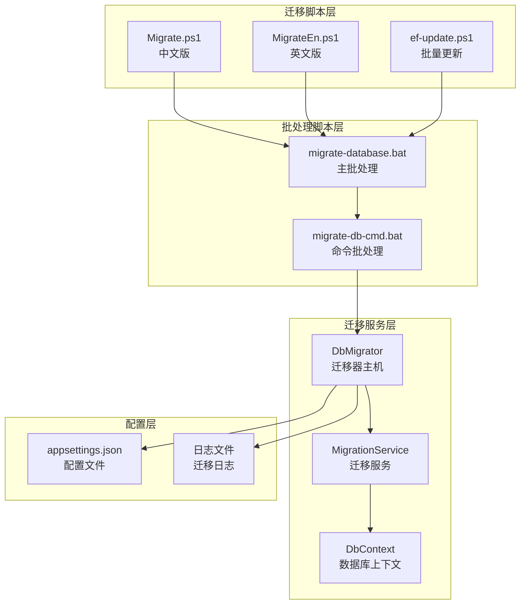
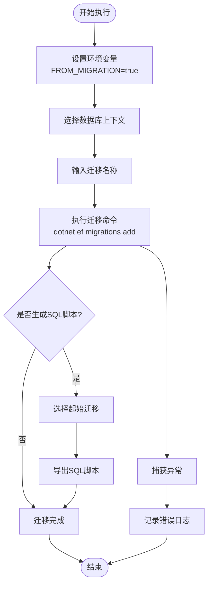
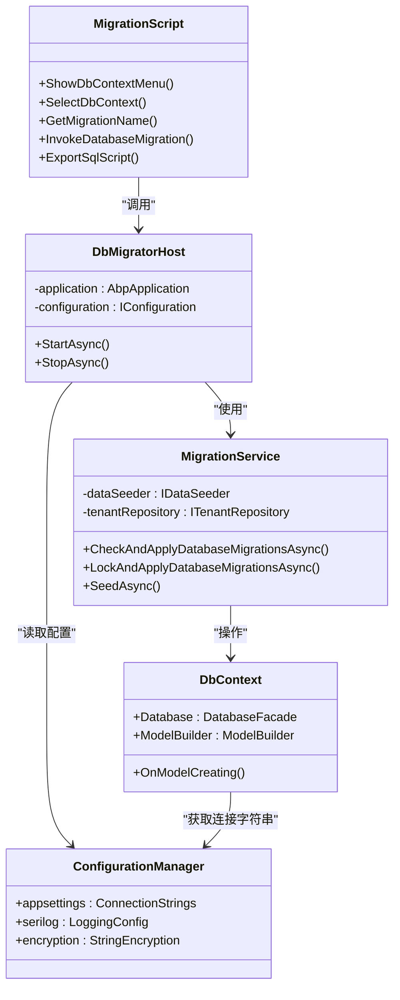
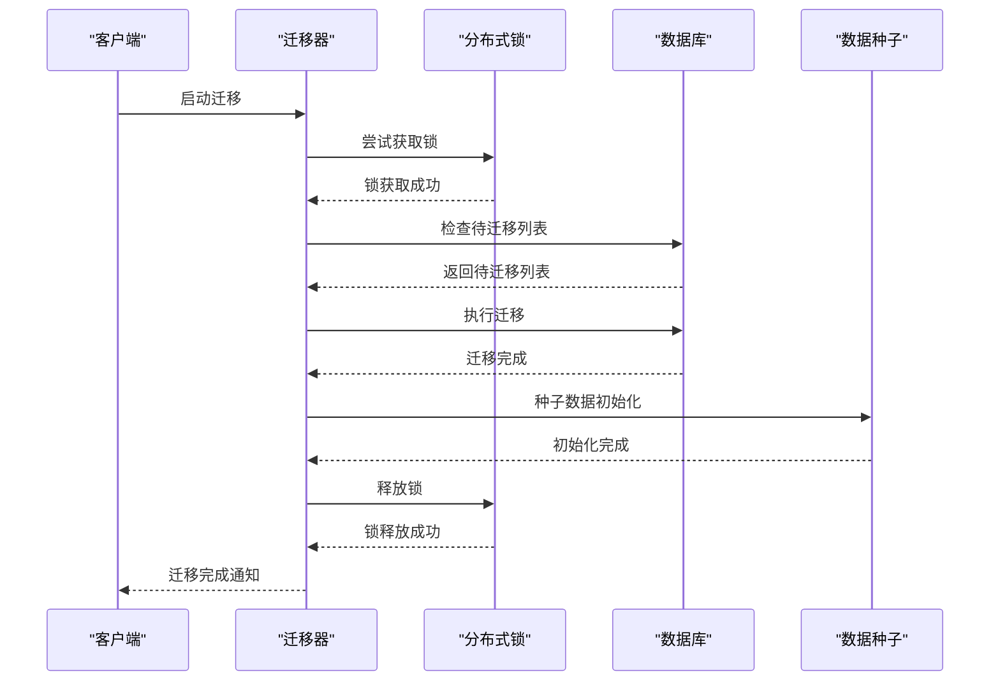
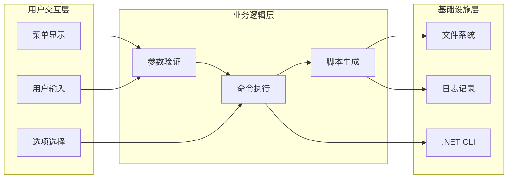
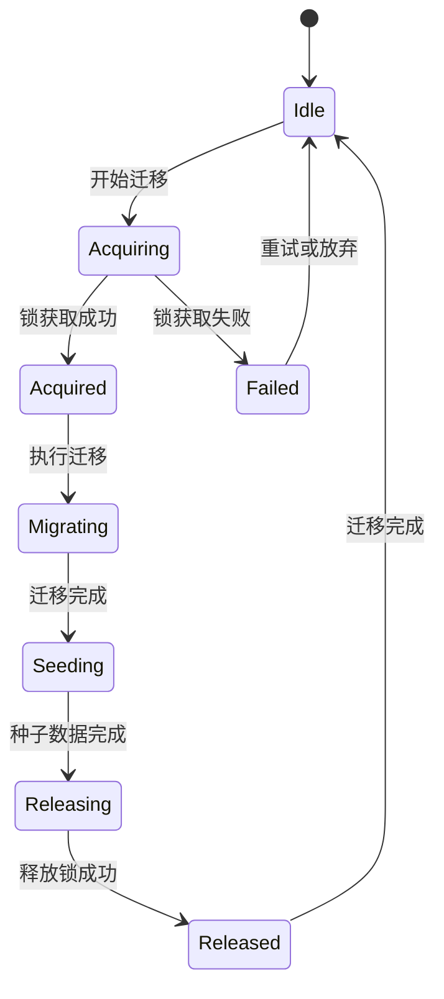
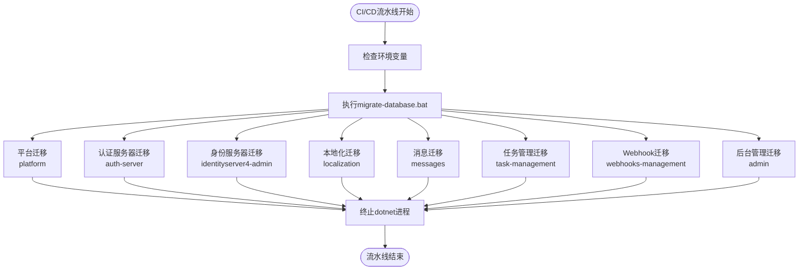
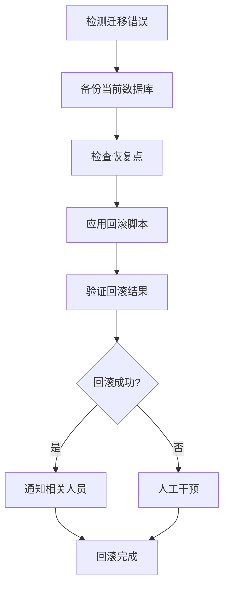

# 自动化迁移流程

<cite>
**本文档引用的文件**
- [Migrate.ps1](file://aspnet-core/migrations/Migrate.ps1)
- [MigrateEn.ps1](file://aspnet-core/migrations/MigrateEn.ps1)
- [Program.cs](file://aspnet-core/migrations/LY.MicroService.Applications.Single.DbMigrator/Program.cs)
- [SingleDbMigratorHostedService.cs](file://aspnet-core/migrations/LY.MicroService.Applications.Single.DbMigrator/SingleDbMigratorHostedService.cs)
- [SingleDbMigrationService.cs](file://aspnet-core/migrations/LY.MicroService.Applications.Single.EntityFrameworkCore/SingleDbMigrationService.cs)
- [SingleMigrationsDbContext.cs](file://aspnet-core/migrations/LY.MicroService.Applications.Single.EntityFrameworkCore/SingleMigrationsDbContext.cs)
- [migrate-database.bat](file://aspnet-core/migrate-database.bat)
- [migrate-db-cmd.bat](file://aspnet-core/migrate-db-cmd.bat)
- [appsettings.json](file://aspnet-core/migrations/LY.MicroService.Applications.Single.DbMigrator/appsettings.json)
- [ef-update.ps1](file://aspnet-core/ef-update.ps1)
</cite>

## 目录
1. [简介](#简介)
2. [项目结构概览](#项目结构概览)
3. [核心迁移脚本分析](#核心迁移脚本分析)
4. [架构设计](#架构设计)
5. [详细组件分析](#详细组件分析)
6. [CI/CD集成](#cicd集成)
7. [最佳实践指南](#最佳实践指南)
8. [故障排除](#故障排除)
9. [总结](#总结)

## 简介

本文档详细介绍了ABP Next Admin框架中的自动化迁移流程系统。该系统通过PowerShell脚本实现了数据库迁移的完全自动化，包括迁移脚本的生成、执行和验证。系统支持多种数据库类型（MySQL、PostgreSQL、SQL Server），并提供了完整的CI/CD集成方案。

自动化迁移流程的核心目标是：
- 提供统一的数据库迁移管理界面
- 支持多数据库上下文的迁移操作
- 自动生成SQL脚本用于生产环境部署
- 实现分布式锁机制确保迁移的安全性
- 集成日志记录和错误处理机制

## 项目结构概览

自动化迁移系统的项目结构如下：



**图表来源**
- [Migrate.ps1](file://aspnet-core/migrations/Migrate.ps1#L1-L214)
- [MigrateEn.ps1](file://aspnet-core/migrations/MigrateEn.ps1#L1-L214)
- [migrate-database.bat](file://aspnet-core/migrate-database.bat#L1-L13)

## 核心迁移脚本分析

### Migrate.ps1 和 MigrateEn.ps1 的功能对比

这两个脚本是系统的核心入口点，分别提供中文和英文界面：



**图表来源**
- [Migrate.ps1](file://aspnet-core/migrations/Migrate.ps1#L199-L212)
- [MigrateEn.ps1](file://aspnet-core/migrations/MigrateEn.ps1#L198-L212)

### 脚本功能特性

1. **多数据库上下文支持**
   - MySQL: `LY.MicroService.Applications.Single.EntityFrameworkCore.MySql`
   - PostgreSQL: `LY.MicroService.Applications.Single.EntityFrameworkCore.PostgreSql`
   - SQL Server: `LY.MicroService.Applications.Single.EntityFrameworkCore.SqlServer`

2. **智能迁移命名**
   - 默认格式：`AddNewMigration_yyyyMMdd_HHmmss`
   - 用户可自定义迁移名称

3. **SQL脚本生成功能**
   - 支持从指定迁移开始生成增量SQL
   - 支持生成完整迁移历史的SQL脚本
   - 支持仅生成最新迁移的SQL脚本

**章节来源**
- [Migrate.ps1](file://aspnet-core/migrations/Migrate.ps1#L1-L50)
- [MigrateEn.ps1](file://aspnet-core/migrations/MigrateEn.ps1#L1-L50)

## 架构设计

### 整体架构图



**图表来源**
- [SingleDbMigratorHostedService.cs](file://aspnet-core/migrations/LY.MicroService.Applications.Single.DbMigrator/SingleDbMigratorHostedService.cs#L1-L52)
- [SingleDbMigrationService.cs](file://aspnet-core/migrations/LY.MicroService.Applications.Single.EntityFrameworkCore/SingleDbMigrationService.cs#L1-L101)
- [SingleMigrationsDbContext.cs](file://aspnet-core/migrations/LY.MicroService.Applications.Single.EntityFrameworkCore/SingleMigrationsDbContext.cs#L1-L59)

### 分布式迁移架构

系统采用分布式锁机制确保迁移的安全性：



**图表来源**
- [SingleDbMigrationService.cs](file://aspnet-core/migrations/LY.MicroService.Applications.Single.EntityFrameworkCore/SingleDbMigrationService.cs#L30-L80)

**章节来源**
- [SingleDbMigratorHostedService.cs](file://aspnet-core/migrations/LY.MicroService.Applications.Single.DbMigrator/SingleDbMigratorHostedService.cs#L1-L52)
- [SingleDbMigrationService.cs](file://aspnet-core/migrations/LY.MicroService.Applications.Single.EntityFrameworkCore/SingleDbMigrationService.cs#L1-L101)

## 详细组件分析

### 1. 迁移脚本组件

#### 功能模块分解



**图表来源**
- [Migrate.ps1](file://aspnet-core/migrations/Migrate.ps1#L38-L100)
- [MigrateEn.ps1](file://aspnet-core/migrations/MigrateEn.ps1#L38-L100)

#### SQL脚本生成机制

脚本支持三种生成模式：

1. **增量生成模式**
   - 从指定迁移开始生成后续变更
   - 适用于生产环境的增量部署

2. **全量生成模式**
   - 生成完整的迁移历史SQL
   - 适用于新环境的初始化部署

3. **最新生成模式**
   - 仅生成最近一次迁移的SQL
   - 适用于快速验证和测试

### 2. 迁移服务组件

#### 分布式锁机制



**图表来源**
- [SingleDbMigrationService.cs](file://aspnet-core/migrations/LY.MicroService.Applications.Single.EntityFrameworkCore/SingleDbMigrationService.cs#L30-L80)

#### 多租户支持

系统支持多租户环境下的数据库迁移：

- 每个租户独立的分布式锁
- 租户隔离的数据迁移
- 统一的迁移事件发布机制

**章节来源**
- [SingleDbMigrationService.cs](file://aspnet-core/migrations/LY.MicroService.Applications.Single.EntityFrameworkCore/SingleDbMigrationService.cs#L30-L101)

### 3. 配置管理系统

#### 连接字符串配置

```json
{
  "ConnectionStrings": {
    "Default": "Server=127.0.0.1;Database=Platform-V70;User Id=root;Password=123456;SslMode=None"
  },
  "StringEncryption": {
    "DefaultPassPhrase": "s46c5q55nxpeS8Ra",
    "InitVectorBytes": "s83ng0abvd02js84",
    "DefaultSalt": "sf&5)s3#"
  }
}
```

#### 日志配置

系统集成了Serilog日志框架，支持：
- 多级别日志记录（Debug、Info、Warning、Error）
- 文件轮转机制
- 控制台输出
- 结构化日志格式

**章节来源**
- [appsettings.json](file://aspnet-core/migrations/LY.MicroService.Applications.Single.DbMigrator/appsettings.json#L1-L105)

## CI/CD集成

### 批处理脚本集成



**图表来源**
- [migrate-database.bat](file://aspnet-core/migrate-database.bat#L1-L13)
- [migrate-db-cmd.bat](file://aspnet-core/migrate-db-cmd.bat#L1-L32)

### 自动化部署流程

1. **环境准备阶段**
   - 设置工作目录
   - 验证.NET SDK版本
   - 检查数据库连接

2. **迁移执行阶段**
   - 并行执行多个服务的迁移
   - 监控迁移进度
   - 记录迁移结果

3. **清理阶段**
   - 终止相关进程
   - 清理临时文件
   - 生成部署报告

**章节来源**
- [migrate-database.bat](file://aspnet-core/migrate-database.bat#L1-L13)
- [migrate-db-cmd.bat](file://aspnet-core/migrate-db-cmd.bat#L1-L32)

## 最佳实践指南

### 1. 安全考虑

#### 数据库连接安全

- 使用加密的连接字符串
- 避免在脚本中硬编码敏感信息
- 使用环境变量存储凭据
- 定期轮换数据库密码

#### 权限控制

- 限制迁移脚本的执行权限
- 使用专用的数据库用户账户
- 实施最小权限原则
- 定期审计访问日志

### 2. 回滚策略

#### 迁移回滚机制



#### 回滚脚本生成

- 自动生成反向迁移脚本
- 手动验证回滚脚本的正确性
- 在测试环境中充分验证
- 准备应急回滚计划

### 3. 监控建议

#### 迁移监控指标

- 迁移执行时间
- 成功/失败率统计
- 数据库连接状态
- 磁盘空间使用情况

#### 告警机制

- 迁移失败自动告警
- 性能异常告警
- 存储空间不足告警
- 网络连接异常告警

### 4. 测试策略

#### 单元测试

- 测试迁移脚本的正确性
- 验证SQL脚本的生成质量
- 模拟各种错误场景

#### 集成测试

- 在隔离环境中测试迁移
- 验证多租户迁移行为
- 测试分布式锁机制

## 故障排除

### 常见问题及解决方案

#### 1. 迁移脚本执行失败

**问题症状：**
- PowerShell脚本运行时出现错误
- .NET CLI命令执行失败
- 数据库连接超时

**排查步骤：**
1. 检查.NET SDK版本兼容性
2. 验证数据库连接字符串
3. 查看详细的错误日志
4. 确认磁盘空间充足

**解决方案：**
```powershell
# 清理并重建项目
dotnet clean
dotnet build

# 验证数据库连接
dotnet ef dbcontext info

# 检查迁移状态
dotnet ef migrations list
```

#### 2. 分布式锁冲突

**问题症状：**
- 迁移过程中出现锁等待
- 多实例同时尝试迁移
- 锁超时异常

**解决方案：**
- 检查是否有残留的迁移进程
- 清理分布式锁状态
- 调整锁超时时间设置

#### 3. SQL脚本生成问题

**问题症状：**
- 生成的SQL脚本不完整
- 起始迁移选择错误
- 输出路径权限不足

**解决方案：**
- 确保项目构建成功
- 检查目标数据库的兼容性
- 验证输出目录的写权限

**章节来源**
- [SingleDbMigrationService.cs](file://aspnet-core/migrations/LY.MicroService.Applications.Single.EntityFrameworkCore/SingleDbMigrationService.cs#L30-L101)

## 总结

ABP Next Admin的自动化迁移流程系统是一个功能完善、设计精良的数据库迁移解决方案。它通过以下关键特性为企业级应用提供了可靠的数据库管理能力：

### 核心优势

1. **统一的用户界面**：提供中文和英文双语界面，满足国际化需求
2. **多数据库支持**：无缝支持MySQL、PostgreSQL和SQL Server
3. **智能脚本生成**：自动生成增量、全量和最新SQL脚本
4. **分布式安全保障**：采用分布式锁机制确保迁移安全性
5. **完善的CI/CD集成**：与主流CI/CD工具完美集成

### 技术亮点

- **模块化设计**：清晰的分层架构便于维护和扩展
- **错误处理机制**：完善的异常捕获和日志记录
- **多租户支持**：原生支持多租户环境下的数据库迁移
- **性能优化**：并行执行多个服务的迁移任务

### 应用价值

该自动化迁移流程系统不仅提高了开发效率，还降低了生产环境部署的风险。通过标准化的迁移流程和完善的监控机制，企业可以更加自信地进行应用升级和数据库变更，确保系统的稳定性和可靠性。

对于运维团队而言，这套系统提供了完整的自动化迁移解决方案，从开发环境的本地迁移到生产环境的批量部署，都有一套标准化的操作流程和最佳实践指导。这大大简化了数据库管理的复杂度，提高了系统的可维护性。