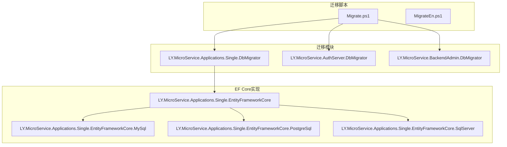
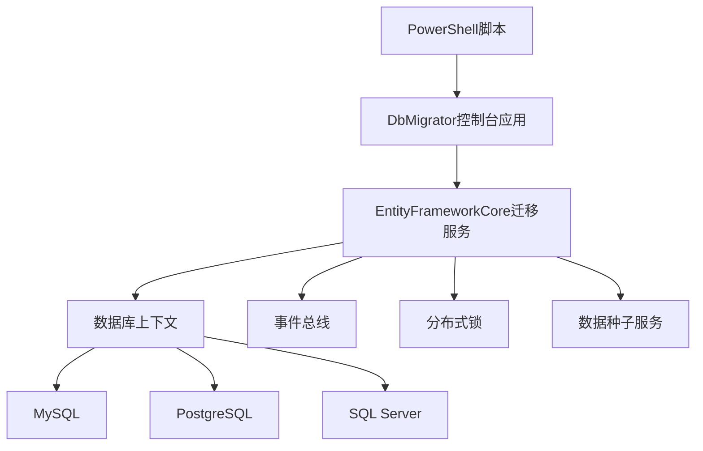
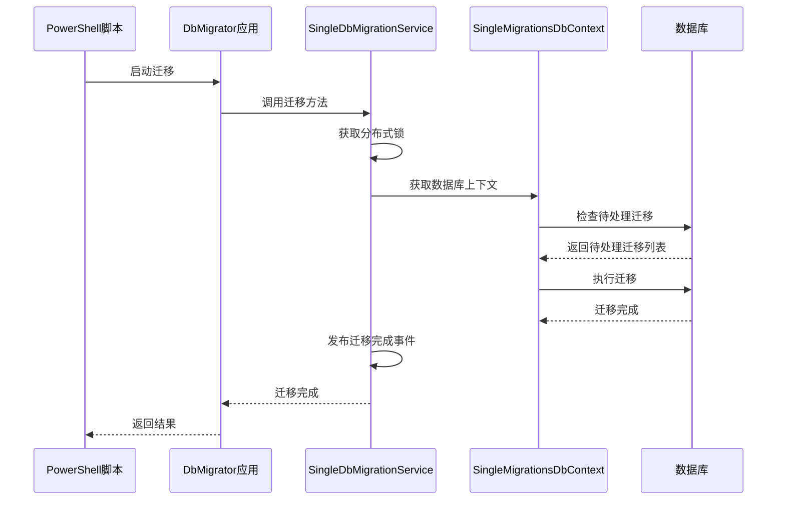
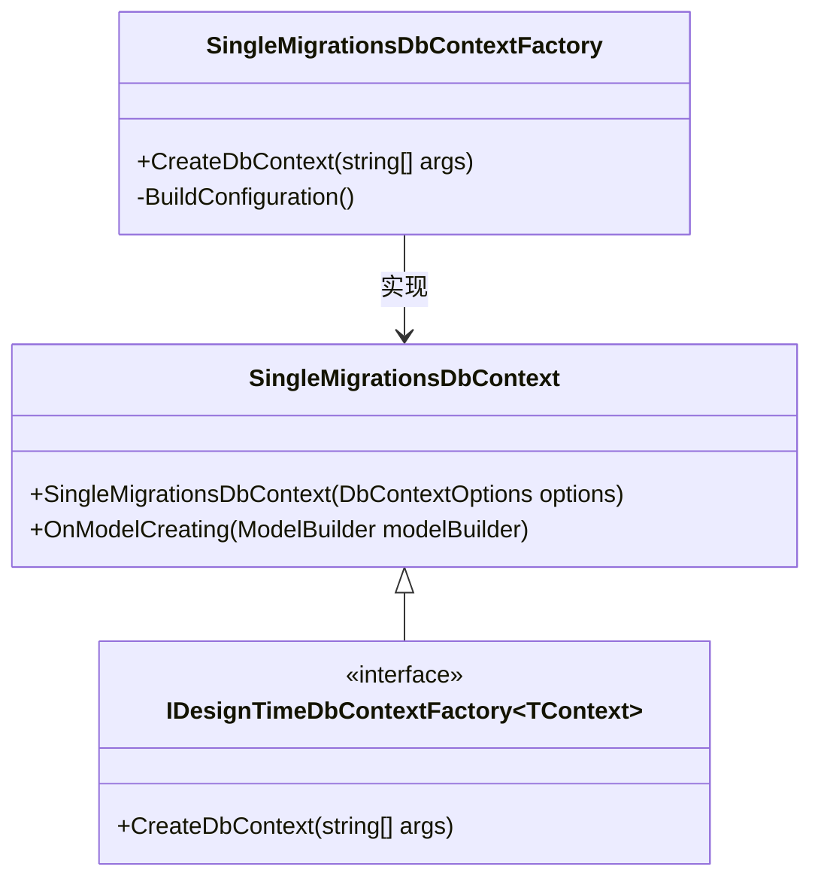
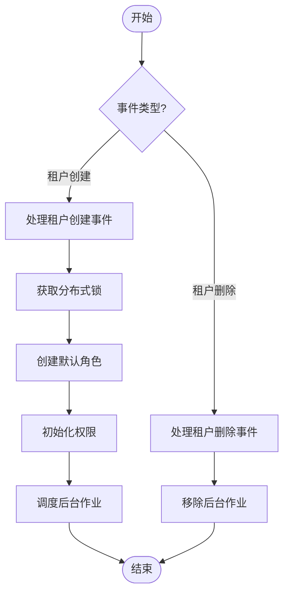
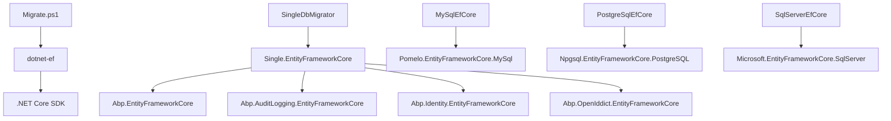

# 迁移策略

<cite>
**本文档中引用的文件**   
- [Migrate.ps1](file://aspnet-core/migrations/Migrate.ps1)
- [SingleDbMigrationService.cs](file://aspnet-core/migrations/LY.MicroService.Applications.Single.EntityFrameworkCore/SingleDbMigrationService.cs)
- [SingleMigrationsDbContext.cs](file://aspnet-core/migrations/LY.MicroService.Applications.Single.EntityFrameworkCore/SingleMigrationsDbContext.cs)
- [SingleMigrationsDbContextFactory.cs](file://aspnet-core/migrations/LY.MicroService.Applications.Single.EntityFrameworkCore.MySql/SingleMigrationsDbContextFactory.cs)
- [SingleMigrationsDbContextFactory.cs](file://aspnet-core/migrations/LY.MicroService.Applications.Single.EntityFrameworkCore.PostgreSql/SingleMigrationsDbContextFactory.cs)
- [SingleMigrationsDbContextFactory.cs](file://aspnet-core/migrations/LY.MicroService.Applications.Single.EntityFrameworkCore.SqlServer/SingleMigrationsDbContextFactory.cs)
- [SingleDbMigrationEventHandler.cs](file://aspnet-core/migrations/LY.MicroService.Applications.Single.EntityFrameworkCore/SingleDbMigrationEventHandler.cs)
- [appsettings.json](file://aspnet-core/migrations/LY.MicroService.Applications.Single.DbMigrator/appsettings.json)
- [appsettings.MySql.json](file://aspnet-core/migrations/LY.MicroService.Applications.Single.DbMigrator/appsettings.MySql.json)
- [appsettings.PostgreSql.json](file://aspnet-core/migrations/LY.MicroService.Applications.Single.DbMigrator/appsettings.PostgreSql.json)
- [appsettings.SqlServer.json](file://aspnet-core/migrations/LY.MicroService.Applications.Single.DbMigrator/appsettings.SqlServer.json)
- [RolePermissionDataSeedContributor.cs](file://aspnet-core/migrations/LY.MicroService.Applications.Single.EntityFrameworkCore/DataSeeder/RolePermissionDataSeedContributor.cs)
- [AuthServerDbMigratorModule.cs](file://aspnet-core/migrations/LY.MicroService.AuthServer.DbMigrator/AuthServerDbMigratorModule.cs)
- [BackendAdminDbMigratorModule.cs](file://aspnet-core/migrations/LY.MicroService.BackendAdmin.DbMigrator/BackendAdminDbMigratorModule.cs)
</cite>

## 目录
1. [简介](#简介)
2. [项目结构](#项目结构)
3. [核心组件](#核心组件)
4. [架构概述](#架构概述)
5. [详细组件分析](#详细组件分析)
6. [依赖分析](#依赖分析)
7. [性能考虑](#性能考虑)
8. [故障排除指南](#故障排除指南)
9. [结论](#结论)

## 简介
本项目采用Entity Framework Core进行数据库迁移管理，支持MySQL、PostgreSQL和SQL Server三种数据库。迁移策略通过专门的DbMigrator模块实现，每个微服务都有独立的迁移项目。系统使用PowerShell脚本Migrate.ps1作为主要的迁移入口，提供交互式界面来生成迁移脚本。迁移过程支持分布式锁机制，确保在多实例部署环境下的数据一致性。数据种子功能与迁移过程集成，能够在数据库结构更新后自动初始化基础数据。整个迁移流程已集成到部署脚本中，实现了自动化部署。

## 项目结构
项目采用微服务架构，每个服务都有独立的数据库迁移模块。迁移相关的代码主要位于aspnet-core/migrations目录下，包含多个DbMigrator项目，每个项目对应一个微服务。每个迁移项目包含EntityFrameworkCore模块，负责具体的数据库上下文和迁移逻辑。系统通过PowerShell脚本统一管理迁移流程，支持多数据库类型。配置文件分离，允许为不同数据库提供特定的连接字符串和配置。

**图示来源**
- [Migrate.ps1](file://aspnet-core/migrations/Migrate.ps1)
- [SingleDbMigratorModule.cs](file://aspnet-core/migrations/LY.MicroService.Applications.Single.DbMigrator/SingleDbMigratorModule.cs)

**章节来源**
- [Migrate.ps1](file://aspnet-core/migrations/Migrate.ps1)
- [SingleDbMigratorModule.cs](file://aspnet-core/migrations/LY.MicroService.Applications.Single.DbMigrator/SingleDbMigratorModule.cs)

## 核心组件
系统的核心迁移组件包括SingleDbMigrationService、SingleMigrationsDbContext和SingleDbMigrationEventHandler。SingleDbMigrationService负责执行数据库迁移和数据种子操作，支持租户级别的迁移。SingleMigrationsDbContext是主要的数据库上下文，集成了多个模块的实体模型。SingleDbMigrationEventHandler处理迁移过程中的事件，如租户创建和删除。系统通过IDesignTimeDbContextFactory实现多数据库支持，不同的数据库类型有各自的DbContextFactory实现。数据种子功能通过IDataSeedContributor接口实现，确保在迁移后初始化必要的基础数据。

**章节来源**
- [SingleDbMigrationService.cs](file://aspnet-core/migrations/LY.MicroService.Applications.Single.EntityFrameworkCore/SingleDbMigrationService.cs)
- [SingleMigrationsDbContext.cs](file://aspnet-core/migrations/LY.MicroService.Applications.Single.EntityFrameworkCore/SingleMigrationsDbContext.cs)
- [SingleDbMigrationEventHandler.cs](file://aspnet-core/migrations/LY.MicroService.Applications.Single.EntityFrameworkCore/SingleDbMigrationEventHandler.cs)

## 架构概述
系统的数据库迁移架构采用分层设计，上层是PowerShell脚本提供用户交互界面，中层是DbMigrator控制台应用负责协调迁移过程，底层是EntityFrameworkCore实现具体的数据库操作。每个微服务都有独立的迁移模块，通过依赖注入集成到主应用中。系统支持多数据库类型，通过不同的DbContextFactory实现数据库适配。迁移过程与事件总线集成，能够在迁移完成后触发相关事件。分布式锁机制确保在集群环境下的迁移操作安全。

**图示来源**
- [Migrate.ps1](file://aspnet-core/migrations/Migrate.ps1)
- [SingleDbMigrationService.cs](file://aspnet-core/migrations/LY.MicroService.Applications.Single.EntityFrameworkCore/SingleDbMigrationService.cs)

## 详细组件分析

### 迁移服务分析
迁移服务是系统的核心组件，负责协调整个迁移过程。服务通过继承EfCoreRuntimeDatabaseMigratorBase类获得基本的迁移功能，并重写LockAndApplyDatabaseMigrationsAsync方法实现租户级别的迁移逻辑。服务使用分布式锁确保同一时间只有一个实例执行迁移操作。在迁移完成后，服务会发布AppliedDatabaseMigrationsEto事件，通知其他组件数据库结构已更新。服务还集成了数据种子功能，确保在迁移后初始化必要的基础数据。

**图示来源**
- [Migrate.ps1](file://aspnet-core/migrations/Migrate.ps1)
- [SingleDbMigrationService.cs](file://aspnet-core/migrations/LY.MicroService.Applications.Single.EntityFrameworkCore/SingleDbMigrationService.cs)

**章节来源**
- [SingleDbMigrationService.cs](file://aspnet-core/migrations/LY.MicroService.Applications.Single.EntityFrameworkCore/SingleDbMigrationService.cs)

### 数据库上下文分析
SingleMigrationsDbContext是系统的主要数据库上下文，负责管理所有实体的数据库映射。上下文通过OnModelCreating方法配置各个模块的实体模型，使用扩展方法模式保持代码的整洁。上下文通过ConnectionStringName属性指定连接字符串名称，支持多数据库配置。系统为每种数据库类型提供了专门的DbContextFactory实现，通过IDesignTimeDbContextFactory接口在设计时创建数据库上下文实例。这种设计使得同一个上下文可以支持多种数据库类型，提高了代码的复用性。

**图示来源**
- [SingleMigrationsDbContext.cs](file://aspnet-core/migrations/LY.MicroService.Applications.Single.EntityFrameworkCore/SingleMigrationsDbContext.cs)
- [SingleMigrationsDbContextFactory.cs](file://aspnet-core/migrations/LY.MicroService.Applications.Single.EntityFrameworkCore.MySql/SingleMigrationsDbContextFactory.cs)

**章节来源**
- [SingleMigrationsDbContext.cs](file://aspnet-core/migrations/LY.MicroService.Applications.Single.EntityFrameworkCore/SingleMigrationsDbContext.cs)
- [SingleMigrationsDbContextFactory.cs](file://aspnet-core/migrations/LY.MicroService.Applications.Single.EntityFrameworkCore.MySql/SingleMigrationsDbContextFactory.cs)

### 事件处理器分析
SingleDbMigrationEventHandler是迁移过程中的事件处理器，负责处理与迁移相关的领域事件。处理器实现了IDistributedEventHandler接口，能够接收并处理分布式事件总线上的事件。主要处理两类事件：租户创建事件和租户删除事件。在租户创建时，处理器会为新租户创建默认角色和权限，并初始化后台作业。在租户删除时，处理器会清理相关的后台作业。处理器还集成了分布式锁机制，确保事件处理的线程安全。

**图示来源**
- [SingleDbMigrationEventHandler.cs](file://aspnet-core/migrations/LY.MicroService.Applications.Single.EntityFrameworkCore/SingleDbMigrationEventHandler.cs)

**章节来源**
- [SingleDbMigrationEventHandler.cs](file://aspnet-core/migrations/LY.MicroService.Applications.Single.EntityFrameworkCore/SingleDbMigrationEventHandler.cs)

## 依赖分析
系统的主要依赖关系包括Entity Framework Core、ABP框架的核心模块、分布式锁服务和事件总线。迁移模块依赖于各个业务模块的EntityFrameworkCore实现，通过模块依赖关系集成。每个数据库类型的迁移项目依赖于通用的迁移核心项目。PowerShell脚本依赖于.NET Core CLI工具执行ef命令。系统通过NuGet包管理所有外部依赖，确保版本的一致性。多数据库支持通过不同的NuGet包实现，如Pomelo.EntityFrameworkCore.MySql用于MySQL支持。

**图示来源**
- [Migrate.ps1](file://aspnet-core/migrations/Migrate.ps1)
- [SingleDbMigratorModule.cs](file://aspnet-core/migrations/LY.MicroService.Applications.Single.DbMigrator/SingleDbMigratorModule.cs)

**章节来源**
- [SingleDbMigratorModule.cs](file://aspnet-core/migrations/LY.MicroService.Applications.Single.DbMigrator/SingleDbMigratorModule.cs)

## 性能考虑
迁移过程的性能主要受数据库结构复杂度、数据量大小和网络延迟影响。系统通过分布式锁机制避免了多实例同时迁移导致的冲突，但这也意味着迁移操作是串行执行的。建议在低峰期执行大型迁移操作。对于包含大量数据变更的迁移，建议分批执行，避免长时间锁定数据库。生成SQL脚本功能允许在生产环境离线执行迁移，减少对在线服务的影响。系统还支持迁移脚本的版本控制，便于回滚和审计。

## 故障排除指南
常见的迁移问题包括连接字符串配置错误、数据库权限不足、迁移冲突和锁等待超时。检查appsettings.json文件中的连接字符串是否正确，特别是数据库名称、用户名和密码。确保数据库用户有足够的权限创建表和修改结构。当多个开发人员同时生成迁移时，可能出现迁移