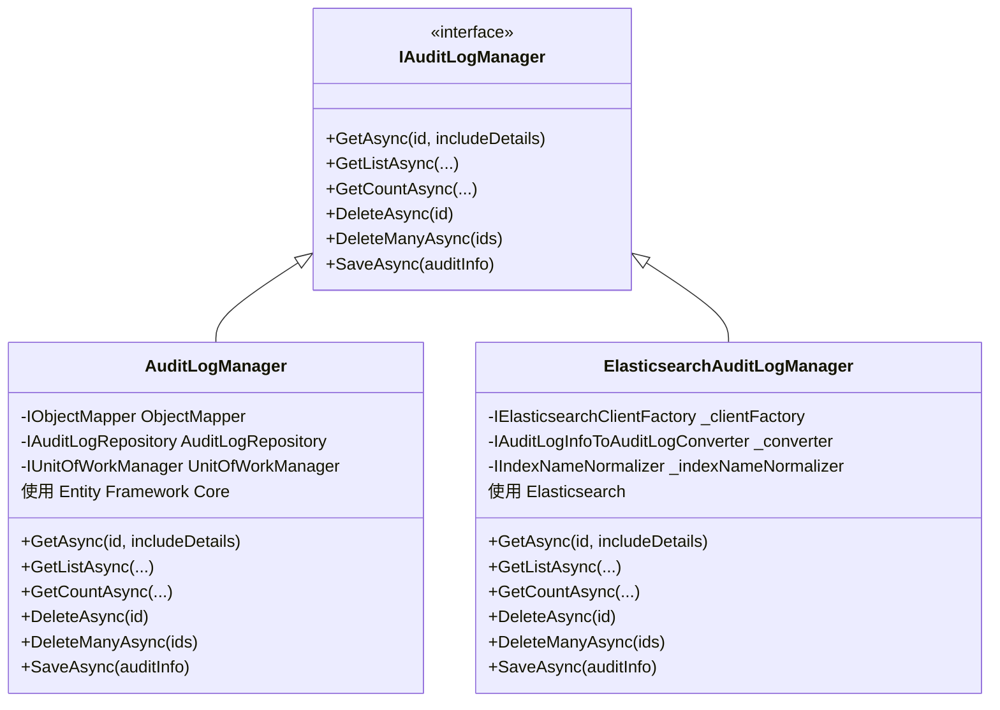

# 审计日志模块

<cite>
**本文档中引用的文件**  
- [AuditLog.cs](file://aspnet-core/framework/auditing/LINGYUN.Abp.AuditLogging/LINGYUN/Abp/AuditLogging/AuditLog.cs)
- [AuditLogAction.cs](file://aspnet-core/framework/auditing/LINGYUN.Abp.AuditLogging/LINGYUN/Abp/AuditLogging/AuditLogAction.cs)
- [EntityChange.cs](file://aspnet-core/framework/auditing/LINGYUN.Abp.AuditLogging/LINGYUN/Abp/AuditLogging/EntityChange.cs)
- [EntityPropertyChange.cs](file://aspnet-core/framework/auditing/LINGYUN.Abp.AuditLogging/LINGYUN/Abp/AuditLogging/EntityPropertyChange.cs)
- [SecurityLog.cs](file://aspnet-core/framework/auditing/LINGYUN.Abp.AuditLogging/LINGYUN/Abp/AuditLogging/SecurityLog.cs)
- [IAuditLogManager.cs](file://aspnet-core/framework/auditing/LINGYUN.Abp.AuditLogging/LINGYUN/Abp/AuditLogging/IAuditLogManager.cs)
- [ISecurityLogManager.cs](file://aspnet-core/framework/auditing/LINGYUN.Abp.AuditLogging/LINGYUN/Abp/AuditLogging/ISecurityLogManager.cs)
- [AuditLogManager.cs](file://aspnet-core/framework/auditing/LINGYUN.Abp.AuditLogging.EntityFrameworkCore/LINGYUN/Abp/AuditLogging/EntityFrameworkCore/AuditLogManager.cs)
- [EntityChangeStore.cs](file://aspnet-core/framework/auditing/LINGYUN.Abp.AuditLogging.EntityFrameworkCore/LINGYUN/Abp/AuditLogging/EntityFrameworkCore/EntityChangeStore.cs)
- [SecurityLogManager.cs](file://aspnet-core/framework/auditing/LINGYUN.Abp.AuditLogging.EntityFrameworkCore/LINGYUN/Abp/AuditLogging/EntityFrameworkCore/SecurityLogManager.cs)
- [ElasticsearchAuditLogManager.cs](file://aspnet-core/framework/auditing/LINGYUN.Abp.AuditLogging.Elasticsearch/LINGYUN/Abp/AuditLogging/Elasticsearch/ElasticsearchAuditLogManager.cs)
</cite>

## 目录
1. [引言](#引言)
2. [核心实体模型](#核心实体模型)
3. [审计日志服务接口](#审计日志服务接口)
4. [数据存储与持久化](#数据存储与持久化)
5. [基于Elasticsearch的扩展实现](#基于elasticsearch的扩展实现)
6. [开发者自定义指南](#开发者自定义指南)
7. [系统管理员最佳实践](#系统管理员最佳实践)
8. [结论](#结论)

## 引言
审计日志模块是系统安全与合规性的核心组件，负责记录所有关键操作，包括用户登录、数据修改、权限变更等敏感行为。该模块通过结构化的实体模型捕获操作上下文，并提供灵活的查询、分析和导出功能。本文档详细阐述审计日志的实体结构、服务接口、存储策略及扩展机制，为开发者和系统管理员提供全面的技术指导。

## 核心实体模型

审计日志模块定义了多个核心实体，用于精确记录系统操作的各个方面。

### 审计日志 (AuditLog)
`AuditLog` 实体是审计信息的顶层容器，记录了一次HTTP请求或应用操作的完整上下文。

**字段定义：**
- `Id`: 唯一标识符 (Guid)
- `ApplicationName`: 应用名称 (字符串)
- `UserId` / `UserName`: 执行操作的用户ID和用户名
- `TenantId` / `TenantName`: 租户ID和名称（支持多租户）
- `Impersonator*`: 代表其他用户操作的相关信息
- `ExecutionTime`: 操作执行时间 (DateTime)
- `ExecutionDuration`: 执行持续时间（毫秒）
- `ClientIpAddress` / `ClientName` / `ClientId`: 客户端IP、名称和ID
- `CorrelationId`: 请求关联ID，用于追踪分布式调用链
- `BrowserInfo`: 浏览器或客户端信息
- `HttpMethod` / `Url`: HTTP方法和请求URL
- `Exceptions`: 记录的异常堆栈信息
- `Comments`: 补充说明
- `HttpStatusCode`: HTTP响应状态码
- `EntityChanges`: 关联的实体变更列表
- `Actions`: 关联的服务方法调用列表
- `ExtraProperties`: 额外属性字典，支持动态扩展

**Section sources**
- [AuditLog.cs](file://aspnet-core/framework/auditing/LINGYUN.Abp.AuditLogging/LINGYUN/Abp/AuditLogging/AuditLog.cs#L1-L121)

### 审计日志操作 (AuditLogAction)
`AuditLogAction` 实体记录了在一次审计日志周期内调用的具体服务方法。

**字段定义：**
- `Id`: 唯一标识符 (Guid)
- `AuditLogId`: 关联的审计日志ID
- `ServiceName`: 服务类的全名
- `MethodName`: 被调用的方法名
- `Parameters`: 方法参数的序列化JSON字符串
- `ExecutionTime` / `ExecutionDuration`: 方法的执行时间和持续时间
- `ExtraProperties`: 额外属性字典

**Section sources**
- [AuditLogAction.cs](file://aspnet-core/framework/auditing/LINGYUN.Abp.AuditLogging/LINGYUN/Abp/AuditLogging/AuditLogAction.cs#L1-L48)

### 实体变更 (EntityChange)
`EntityChange` 实体记录了数据库中单个实体（如用户、角色）的变更。

**字段定义：**
- `Id`: 唯一标识符 (Guid)
- `AuditLogId`: 关联的审计日志ID
- `ChangeTime`: 变更发生时间
- `ChangeType`: 变更类型（插入、更新、删除）
- `EntityId`: 被变更实体的主键
- `EntityTypeFullName`: 实体的完整类型名
- `PropertyChanges`: 变更的属性列表
- `ExtraProperties`: 额外属性字典

**Section sources**
- [EntityChange.cs](file://aspnet-core/framework/auditing/LINGYUN.Abp.AuditLogging/LINGYUN/Abp/AuditLogging/EntityChange.cs#L1-L71)

### 实体属性变更 (EntityPropertyChange)
`EntityPropertyChange` 实体是 `EntityChange` 的子项，记录了单个属性的变更详情。

**字段定义：**
- `Id`: 唯一标识符 (Guid)
- `EntityChangeId`: 关联的实体变更ID
- `PropertyName`: 属性名称
- `PropertyTypeFullName`: 属性类型的完整名称
- `OriginalValue`: 属性的原始值（序列化）
- `NewValue`: 属性的新值（序列化）

**Section sources**
- [EntityPropertyChange.cs](file://aspnet-core/framework/auditing/LINGYUN.Abp.AuditLogging/LINGYUN/Abp/AuditLogging/EntityPropertyChange.cs#L1-L42)

### 安全日志 (SecurityLog)
`SecurityLog` 实体专门用于记录安全相关的事件，如登录成功/失败、密码修改等。

**字段定义：**
- `Id`: 唯一标识符 (Guid)
- `Action`: 安全操作类型（如 "Login"）
- `Identity`: 身份标识（如 "Account"）
- `UserId` / `UserName`: 涉及的用户
- `CreationTime`: 日志创建时间
- `ClientIpAddress` / `BrowserInfo`: 客户端信息
- `ExtraProperties`: 额外属性字典

**Section sources**
- [SecurityLog.cs](file://aspnet-core/framework/auditing/LINGYUN.Abp.AuditLogging/LINGYUN/Abp/AuditLogging/SecurityLog.cs#L1-L72)

## 审计日志服务接口

### 审计日志管理器 (IAuditLogManager)
`IAuditLogManager` 接口定义了审计日志的核心操作。

**主要方法：**
- `GetAsync(id, includeDetails)`: 根据ID获取单条审计日志，可选择是否包含详情（如Actions和EntityChanges）。
- `GetListAsync(...)`: 分页查询审计日志列表，支持多种过滤条件（时间范围、用户、URL、状态码等）。
- `GetCountAsync(...)`: 获取满足条件的审计日志总数，用于分页和统计。
- `DeleteAsync(id)` / `DeleteManyAsync(ids)`: 删除单条或多条审计日志。
- `SaveAsync(auditInfo)`: 保存由框架生成的 `AuditLogInfo` 对象。

**Section sources**
- [IAuditLogManager.cs](file://aspnet-core/framework/auditing/LINGYUN.Abp.AuditLogging/LINGYUN/Abp/AuditLogging/IAuditLogManager.cs#L1-L68)

### 安全日志管理器 (ISecurityLogManager)
`ISecurityLogManager` 接口提供了对安全日志的管理功能。

**主要方法：**
- `GetAsync(id, includeDetails)`: 获取单条安全日志。
- `GetListAsync(...)` / `GetCountAsync(...)`: 分页查询和统计安全日志，支持按操作类型、用户、客户端IP等过滤。
- `DeleteAsync(id)` / `DeleteManyAsync(ids)`: 删除安全日志。
- `SaveAsync(securityLogInfo)`: 保存安全日志信息。

**Section sources**
- [ISecurityLogManager.cs](file://aspnet-core/framework/auditing/LINGYUN.Abp.AuditLogging/LINGYUN/Abp/AuditLogging/ISecurityLogManager.cs#L1-L60)

## 数据存储与持久化

### Entity Framework Core 实现
审计日志模块提供了基于Entity Framework Core的默认实现，通过替换服务的方式注入。

#### 审计日志管理器实现
`AuditLogManager` 类实现了 `IAuditLogManager` 接口，它依赖于 `IAuditLogRepository` 进行数据访问，并使用 `IObjectMapper` 将框架的 `Volo.Abp.AuditLogging.AuditLog` 实体映射到模块自定义的 `AuditLog` 实体。

**关键特性：**
- **事务管理**：`DeleteAsync` 和 `DeleteManyAsync` 方法使用 `IUnitOfWorkManager` 确保操作在事务中完成。
- **异常处理**：`SaveAsync` 方法在配置允许时会捕获并记录保存失败的异常，避免因日志问题影响主业务流程。
- **对象映射**：利用ABP的对象映射功能，实现DTO与持久化实体之间的转换。

**Section sources**
- [AuditLogManager.cs](file://aspnet-core/framework/auditing/LINGYUN.Abp.AuditLogging.EntityFrameworkCore/LINGYUN/Abp/AuditLogging/EntityFrameworkCore/AuditLogManager.cs#L1-L190)

#### 实体变更存储实现
`EntityChangeStore` 类实现了 `IEntityChangeStore` 接口，提供了对实体变更记录的查询功能。

**关键特性：**
- **关联查询**：支持根据审计日志ID、变更类型、实体ID等条件查询变更记录。
- **用户名关联**：提供 `GetWithUsernameAsync` 方法，直接返回包含操作用户名的变更记录，避免额外查询。

**Section sources**
- [EntityChangeStore.cs](file://aspnet-core/framework/auditing/LINGYUN.Abp.AuditLogging.EntityFrameworkCore/LINGYUN/Abp/AuditLogging/EntityFrameworkCore/EntityChangeStore.cs#L1-L116)

#### 安全日志管理器实现
`SecurityLogManager` 类实现了 `ISecurityLogManager` 接口，直接操作 `IdentitySecurityLog` 仓储。

**关键特性：**
- **条件保存**：`SaveAsync` 方法会检查 `AbpSecurityLogOptions.IsEnabled` 配置，决定是否实际保存日志。
- **事务隔离**：所有写操作都在独立的新事务中执行 (`requiresNew: true`)，确保日志记录的原子性。

**Section sources**
- [SecurityLogManager.cs](file://aspnet-core/framework/auditing/LINGYUN.Abp.AuditLogging.EntityFrameworkCore/LINGYUN/Abp/AuditLogging/EntityFrameworkCore/SecurityLogManager.cs#L1-L156)

## 基于Elasticsearch的扩展实现

### Elasticsearch 审计日志管理器
`ElasticsearchAuditLogManager` 提供了将审计日志存储到Elasticsearch的高性能实现，同样实现了 `IAuditLogManager` 接口。



**Diagram sources**
- [ElasticsearchAuditLogManager.cs](file://aspnet-core/framework/auditing/LINGYUN.Abp.AuditLogging.Elasticsearch/LINGYUN/Abp/AuditLogging/Elasticsearch/ElasticsearchAuditLogManager.cs#L1-L386)
- [IAuditLogManager.cs](file://aspnet-core/framework/auditing/LINGYUN.Abp.AuditLogging/LINGYUN/Abp/AuditLogging/IAuditLogManager.cs#L1-L68)

**关键特性：**
- **高性能查询**：利用Elasticsearch的倒排索引和DSL查询，实现对海量日志的快速检索。
- **灵活的查询构建**：`BuildQueryDescriptor` 方法将各种过滤条件转换为Elasticsearch的 `QueryContainer`，支持复杂的布尔查询。
- **批量写入**：`SaveAsync` 方法使用 `Bulk` API 批量写入日志，显著提升写入性能。
- **索引管理**：通过 `IIndexNameNormalizer` 和 `AbpElasticsearchOptions` 管理索引名称和字段映射。
- **字段映射**：`_fieldMaps` 字典处理了C# PascalCase与Elasticsearch推荐的camelCase之间的转换。

**Section sources**
- [ElasticsearchAuditLogManager.cs](file://aspnet-core/framework/auditing/LINGYUN.Abp.AuditLogging.Elasticsearch/LINGYUN/Abp/AuditLogging/Elasticsearch/ElasticsearchAuditLogManager.cs#L1-L386)

## 开发者自定义指南

### 自定义审计规则
开发者可以通过实现 `IAuditingStore` 接口来定义自定义的审计存储逻辑，或通过 `AuditingStore` 类的扩展点来修改审计行为。例如，可以创建一个 `IPLocationAuditingStore` 来自动记录操作的地理位置。

### 扩展审计字段
利用 `ExtraProperties` 字典，开发者可以在运行时为 `AuditLog`、`AuditLogAction` 等实体添加自定义字段，而无需修改数据库模式。
```csharp
auditLogInfo.ExtraProperties["CustomField"] = "CustomValue";
```

### 配置审计策略
在模块的 `ConfigureServices` 方法中，可以通过 `AbpAuditingOptions` 配置审计策略，例如：
- 启用/禁用审计功能
- 设置是否记录方法参数
- 配置异常处理行为（`HideErrors`）

## 系统管理员最佳实践

### 审计日志分析
- **定期审查**：定期审查 `SecurityLog` 中的 "Login" 操作，识别异常登录模式（如非工作时间、非常用IP）。
- **异常检测**：监控 `AuditLog` 中的 `Exceptions` 字段和 `HttpStatusCode` 为5xx的记录，快速定位系统错误。
- **数据变更追踪**：利用 `EntityChange` 和 `EntityPropertyChange` 精确追踪关键数据（如财务、用户信息）的修改历史。

### 安全审查
- **权限变更审计**：重点关注对角色、权限的修改操作，确保权限变更经过授权。
- **敏感操作监控**：对删除、批量更新等高风险操作设置更严格的日志保留策略和告警机制。
- **日志完整性**：确保审计日志存储在安全、防篡改的位置，并定期备份。

### 性能优化
- **存储选型**：对于日志量巨大的系统，推荐使用 `ElasticsearchAuditLogManager` 以获得更好的查询性能。
- **索引优化**：为常用的查询字段（如 `UserName`, `Url`, `ExecutionTime`）建立合适的数据库索引或Elasticsearch映射。
- **数据归档**：制定日志归档策略，将历史日志移至成本更低的存储，保持在线库的性能。

## 结论
本审计日志模块提供了一个功能完备、可扩展的解决方案，能够有效记录和追踪系统中的所有关键操作。通过清晰的实体模型、灵活的服务接口和多种存储实现，它满足了从开发到运维的多层次需求。开发者可以轻松地进行自定义和扩展，而系统管理员则可以利用其强大的查询和分析能力来保障系统的安全与合规性。