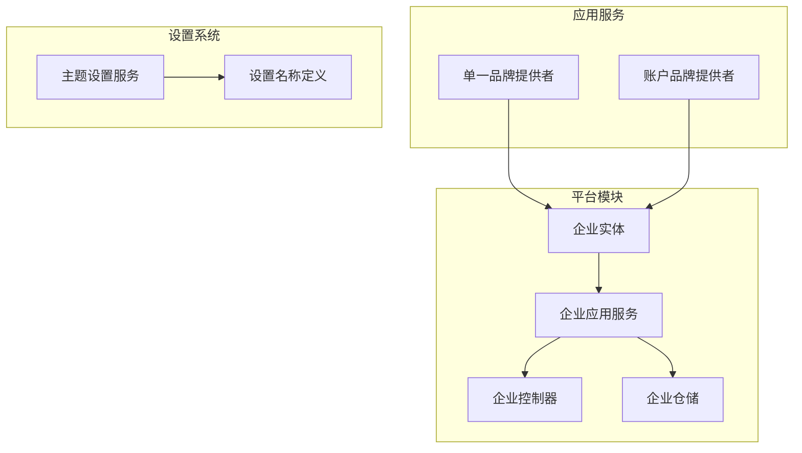
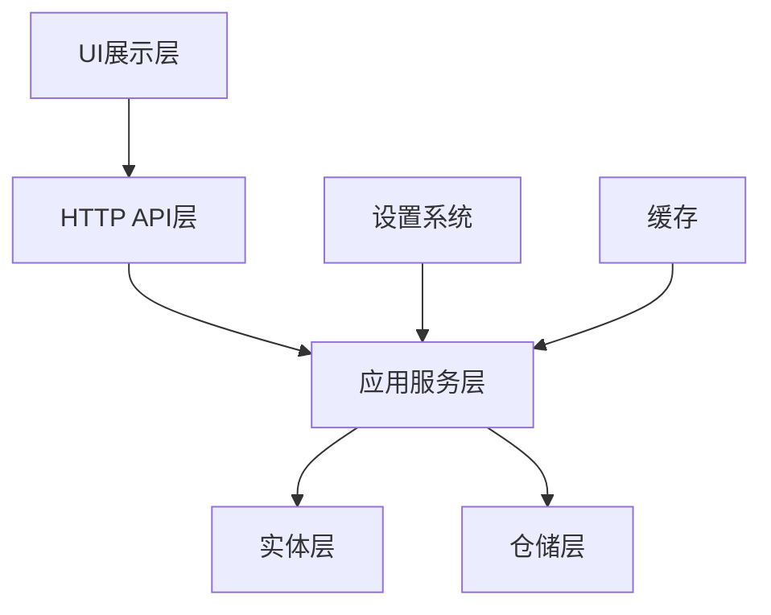
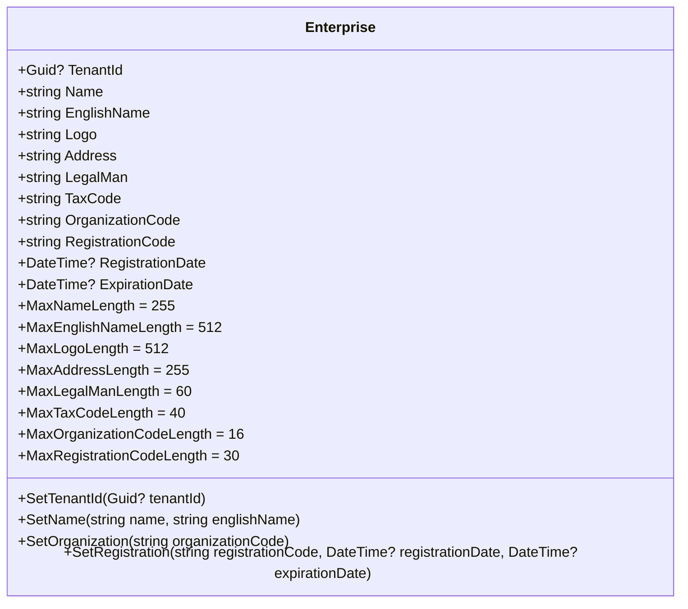
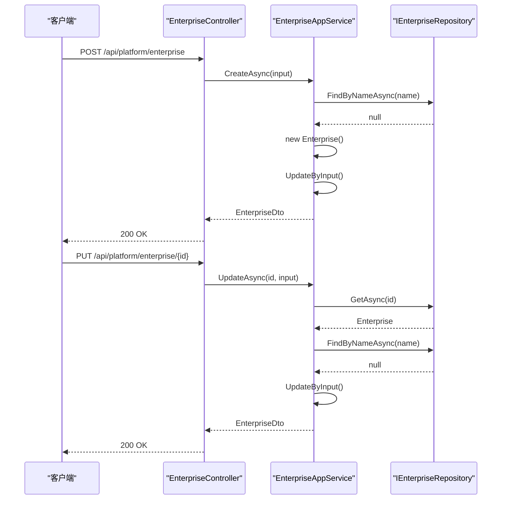
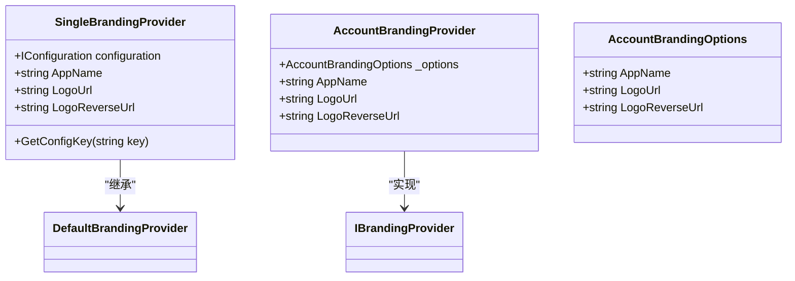
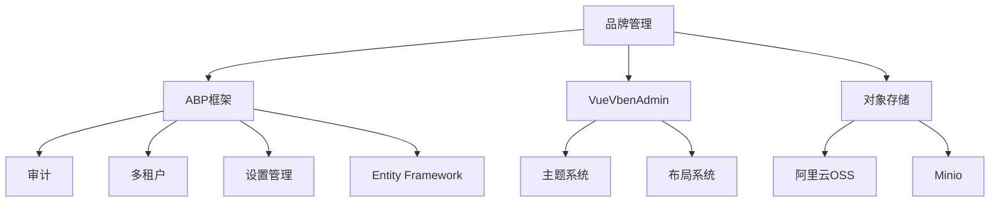

# 品牌管理

<cite>
**本文档引用的文件**   
- [Enterprise.cs](file://aspnet-core/modules/platform/LINGYUN.Platform.Domain/LINGYUN/Platform/Portal/Enterprise.cs)
- [EnterpriseConsts.cs](file://aspnet-core/modules/platform/LINGYUN.Platform.Domain.Shared/LINGYUN/Platform/Portal/EnterpriseConsts.cs)
- [EnterpriseAppService.cs](file://aspnet-core/modules/platform/LINGYUN.Platform.Application/LINGYUN/Platform/Portal/EnterpriseAppService.cs)
- [EnterpriseCreateOrUpdateDto.cs](file://aspnet-core/modules/platform/LINGYUN.Platform.Application.Contracts/LINGYUN/Platform/Portal/Dto/EnterpriseCreateOrUpdateDto.cs)
- [EnterpriseController.cs](file://aspnet-core/modules/platform/LINGYUN.Platform.HttpApi/LINGYUN/Platform/Portal/EnterpriseController.cs)
- [SingleBrandingProvider.cs](file://aspnet-core/services/LY.MicroService.Applications.Single/Branding/SingleBrandingProvider.cs)
- [AccountBrandingProvider.cs](file://aspnet-core/services/LY.MicroService.AuthServer/Ui/Branding/AccountBrandingProvider.cs)
- [AccountBrandingOptions.cs](file://aspnet-core/services/LY.MicroService.AuthServer/Ui/Branding/AccountBrandingOptions.cs)
- [ThemeSettingAppService.cs](file://aspnet-core/modules/Platform/LINGYUN.Platform.Theme.VueVbenAdmin/LINGYUN/Platform/Theme/VueVbenAdmin/ThemeSettingAppService.cs)
- [VueVbenAdminSettingNames.cs](file://aspnet-core/modules/Platform/LINGYUN.Platform.Settings.VueVbenAdmin/LINGYUN/Platform/Settings/VueVbenAdmin/VueVbenAdminSettingNames.cs)
</cite>

## 目录
1. [简介](#简介)
2. [项目结构](#项目结构)
3. [核心组件](#核心组件)
4. [架构概述](#架构概述)
5. [详细组件分析](#详细组件分析)
6. [依赖分析](#依赖分析)
7. [性能考虑](#性能考虑)
8. [故障排除指南](#故障排除指南)
9. [结论](#结论)

## 简介
本项目中的品牌管理功能主要通过企业实体（Enterprise）来实现，该实体包含了品牌名称、Logo、配色方案、版权信息等关键字段。系统支持多租户环境下的品牌隔离，并提供了灵活的品牌样式配置。品牌信息通过ABP框架的设置系统进行管理，允许用户自定义前端主题和布局。API服务提供了完整的CRUD操作，支持品牌信息的创建、读取、更新和删除。系统还实现了品牌信息缓存和版本管理，确保数据的一致性和高性能访问。

## 项目结构
品牌管理功能分布在多个模块中，主要包括平台模块（Platform）、应用服务模块和身份认证服务模块。平台模块包含了企业实体的定义、应用服务和HTTP API，而应用服务模块则负责品牌展示逻辑。身份认证服务模块提供了登录页面的品牌定制功能。

**图源**
- [Enterprise.cs](file://aspnet-core/modules/platform/LINGYUN.Platform.Domain/LINGYUN/Platform/Portal/Enterprise.cs)
- [EnterpriseAppService.cs](file://aspnet-core/modules/platform/LINGYUN.Platform.Application/LINGYUN/Platform/Portal/EnterpriseAppService.cs)
- [EnterpriseController.cs](file://aspnet-core/modules/platform/LINGYUN.Platform.HttpApi/LINGYUN/Platform/Portal/EnterpriseController.cs)
- [SingleBrandingProvider.cs](file://aspnet-core/services/LY.MicroService.Applications.Single/Branding/SingleBrandingProvider.cs)
- [AccountBrandingProvider.cs](file://aspnet-core/services/LY.MicroService.AuthServer/Ui/Branding/AccountBrandingProvider.cs)
- [ThemeSettingAppService.cs](file://aspnet-core/modules/Platform/LINGYUN.Platform.Theme.VueVbenAdmin/LINGYUN/Platform/Theme/VueVbenAdmin/ThemeSettingAppService.cs)
- [VueVbenAdminSettingNames.cs](file://aspnet-core/modules/Platform/LINGYUN.Platform.Settings.VueVbenAdmin/LINGYUN/Platform/Settings/VueVbenAdmin/VueVbenAdminSettingNames.cs)

**本节来源**
- [Enterprise.cs](file://aspnet-core/modules/platform/LINGYUN.Platform.Domain/LINGYUN/Platform/Portal/Enterprise.cs)
- [EnterpriseAppService.cs](file://aspnet-core/modules/platform/LINGYUN.Platform.Application/LINGYUN/Platform/Portal/EnterpriseAppService.cs)
- [EnterpriseController.cs](file://aspnet-core/modules/platform/LINGYUN.Platform.HttpApi/LINGYUN/Platform/Portal/EnterpriseController.cs)

## 核心组件
品牌管理的核心组件包括企业实体（Enterprise）、企业应用服务（EnterpriseAppService）和品牌提供者（BrandingProvider）。企业实体定义了品牌的所有属性，如名称、Logo、地址等。企业应用服务提供了对品牌信息的业务逻辑处理，包括创建、更新和查询操作。品牌提供者则负责在UI层面展示品牌信息，如应用名称和Logo。

**本节来源**
- [Enterprise.cs](file://aspnet-core/modules/platform/LINGYUN.Platform.Domain/LINGYUN/Platform/Portal/Enterprise.cs)
- [EnterpriseAppService.cs](file://aspnet-core/modules/platform/LINGYUN.Platform.Application/LINGYUN/Platform/Portal/EnterpriseAppService.cs)
- [SingleBrandingProvider.cs](file://aspnet-core/services/LY.MicroService.Applications.Single/Branding/SingleBrandingProvider.cs)

## 架构概述
品牌管理功能采用分层架构设计，包括实体层、应用服务层、HTTP API层和UI展示层。实体层定义了企业信息的数据结构，应用服务层处理业务逻辑，HTTP API层暴露RESTful接口，UI展示层则通过品牌提供者显示品牌信息。系统还集成了ABP的设置管理功能，允许动态配置前端主题。

**图源**
- [Enterprise.cs](file://aspnet-core/modules/platform/LINGYUN.Platform.Domain/LINGYUN/Platform/Portal/Enterprise.cs)
- [EnterpriseAppService.cs](file://aspnet-core/modules/platform/LINGYUN.Platform.Application/LINGYUN/Platform/Portal/EnterpriseAppService.cs)
- [EnterpriseController.cs](file://aspnet-core/modules/platform/LINGYUN.Platform.HttpApi/LINGYUN/Platform/Portal/EnterpriseController.cs)
- [SingleBrandingProvider.cs](file://aspnet-core/services/LY.MicroService.Applications.Single/Branding/SingleBrandingProvider.cs)

## 详细组件分析
### 企业实体分析
企业实体（Enterprise）是品牌管理的核心数据模型，继承自FullAuditedAggregateRoot<Guid>，包含了品牌的所有关键信息。

**图源**
- [Enterprise.cs](file://aspnet-core/modules/platform/LINGYUN.Platform.Domain/LINGYUN/Platform/Portal/Enterprise.cs)
- [EnterpriseConsts.cs](file://aspnet-core/modules/platform/LINGYUN.Platform.Domain.Shared/LINGYUN/Platform/Portal/EnterpriseConsts.cs)

#### 企业应用服务分析
企业应用服务（EnterpriseAppService）继承自PlatformApplicationCurdAppServiceBase，提供了对品牌信息的完整CRUD操作。

**图源**
- [EnterpriseAppService.cs](file://aspnet-core/modules/platform/LINGYUN.Platform.Application/LINGYUN/Platform/Portal/EnterpriseAppService.cs)
- [EnterpriseController.cs](file://aspnet-core/modules/platform/LINGYUN.Platform.HttpApi/LINGYUN/Platform/Portal/EnterpriseController.cs)

#### 品牌提供者分析
品牌提供者负责在UI层面展示品牌信息，包括应用名称和Logo。

**图源**
- [SingleBrandingProvider.cs](file://aspnet-core/services/LY.MicroService.Applications.Single/Branding/SingleBrandingProvider.cs)
- [AccountBrandingProvider.cs](file://aspnet-core/services/LY.MicroService.AuthServer/Ui/Branding/AccountBrandingProvider.cs)
- [AccountBrandingOptions.cs](file://aspnet-core/services/LY.MicroService.AuthServer/Ui/Branding/AccountBrandingOptions.cs)

**本节来源**
- [Enterprise.cs](file://aspnet-core/modules/platform/LINGYUN.Platform.Domain/LINGYUN/Platform/Portal/Enterprise.cs)
- [EnterpriseAppService.cs](file://aspnet-core/modules/platform/LINGYUN.Platform.Application/LINGYUN/Platform/Portal/EnterpriseAppService.cs)
- [EnterpriseController.cs](file://aspnet-core/modules/platform/LINGYUN.Platform.HttpApi/LINGYUN/Platform/Portal/EnterpriseController.cs)
- [SingleBrandingProvider.cs](file://aspnet-core/services/LY.MicroService.Applications.Single/Branding/SingleBrandingProvider.cs)
- [AccountBrandingProvider.cs](file://aspnet-core/services/LY.MicroService.AuthServer/Ui/Branding/AccountBrandingProvider.cs)

## 依赖分析
品牌管理功能依赖于ABP框架的核心模块，包括审计、多租户、设置管理等。平台模块依赖于ABP的领域实体和仓储模式，应用服务依赖于ABP的应用服务基类。前端主题设置依赖于VueVbenAdmin框架的配置系统。

**图源**
- [Enterprise.cs](file://aspnet-core/modules/platform/LINGYUN.Platform.Domain/LINGYUN/Platform/Portal/Enterprise.cs)
- [EnterpriseAppService.cs](file://aspnet-core/modules/platform/LINGYUN.Platform.Application/LINGYUN/Platform/Portal/EnterpriseAppService.cs)
- [ThemeSettingAppService.cs](file://aspnet-core/modules/Platform/LINGYUN.Platform.Theme.VueVbenAdmin/LINGYUN/Platform/Theme/VueVbenAdmin/ThemeSettingAppService.cs)

**本节来源**
- [Enterprise.cs](file://aspnet-core/modules/platform/LINGYUN.Platform.Domain/LINGYUN/Platform/Portal/Enterprise.cs)
- [EnterpriseAppService.cs](file://aspnet-core/modules/platform/LINGYUN.Platform.Application/LINGYUN/Platform/Portal/EnterpriseAppService.cs)
- [ThemeSettingAppService.cs](file://aspnet-core/modules/Platform/LINGYUN.Platform.Theme.VueVbenAdmin/LINGYUN/Platform/Theme/VueVbenAdmin/ThemeSettingAppService.cs)

## 性能考虑
品牌管理功能在设计时考虑了性能优化。企业信息查询支持分页和过滤，避免了大数据量的全表扫描。系统实现了品牌信息缓存，减少数据库访问频率。对于频繁访问的品牌设置，如主题配置，使用了ABP的设置缓存机制。文件上传（如Logo）通过OSS存储，减轻了应用服务器的负载。

## 故障排除指南
当品牌管理功能出现问题时，可以检查以下方面：1) 确认数据库连接正常，企业表是否存在；2) 检查品牌提供者的配置是否正确；3) 验证前端主题设置是否已正确应用；4) 查看日志中是否有权限相关的错误；5) 确认OSS存储配置是否正确，特别是Logo上传功能。

**本节来源**
- [EnterpriseAppService.cs](file://aspnet-core/modules/platform/LINGYUN.Platform.Application/LINGYUN/Platform/Portal/EnterpriseAppService.cs)
- [ThemeSettingAppService.cs](file://aspnet-core/modules/Platform/LINGYUN.Platform.Theme.VueVbenAdmin/LINGYUN/Platform/Theme/VueVbenAdmin/ThemeSettingAppService.cs)

## 结论
本项目中的品牌管理功能提供了完整的品牌信息管理解决方案，包括实体模型、API服务、UI展示和主题配置。系统支持多租户环境，允许不同租户拥有独立的品牌信息。通过ABP框架的设置系统，实现了灵活的前端主题配置。开发者可以基于现有架构扩展品牌功能，如添加品牌版本管理、品牌资产库等。系统管理员可以根据业务需求调整品牌配置，确保品牌形象的一致性。