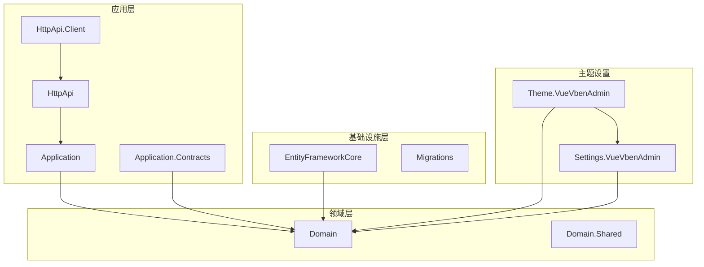
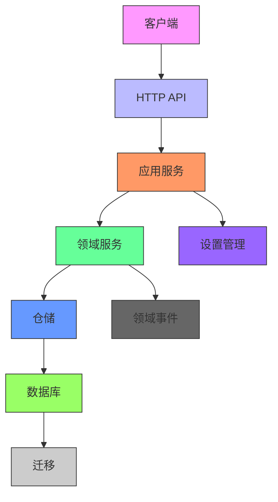

# 平台管理模块

<cite>
**本文档引用的文件**
- [Enterprise.cs](file://aspnet-core/modules/platform/LINGYUN.Platform.Domain/LINGYUN/Platform/Portal/Enterprise.cs)
- [EnterpriseAppService.cs](file://aspnet-core/modules/platform/LINGYUN.Platform.Application/LINGYUN/Platform/Portal/EnterpriseAppService.cs)
- [IEnterpriseAppService.cs](file://aspnet-core/modules/platform/LINGYUN.Platform.Application.Contracts/LINGYUN/Platform/Portal/IEnterpriseAppService.cs)
- [ThemeSettingAppService.cs](file://aspnet-core/modules/platform/LINGYUN.Platform.Theme.VueVbenAdmin/LINGYUN/Platform/Theme/VueVbenAdmin/ThemeSettingAppService.cs)
- [ThemeSettingController.cs](file://aspnet-core/modules/platform/LINGYUN.Platform.Theme.VueVbenAdmin/LINGYUN/Platform/Theme/VueVbenAdmin/ThemeSettingController.cs)
- [VueVbenAdminSettingDefinitionProvider.cs](file://aspnet-core/modules/platform/LINGYUN.Platform.Settings.VueVbenAdmin/LINGYUN/Platform/Settings/VueVbenAdmin/VueVbenAdminSettingDefinitionProvider.cs)
- [VueVbenAdminSettingNames.cs](file://aspnet-core/modules/platform/LINGYUN.Platform.Settings.VueVbenAdmin/LINGYUN/Platform/Settings/VueVbenAdmin/VueVbenAdminSettingNames.cs)
- [PlatformEntityFrameworkCoreModule.cs](file://aspnet-core/modules/platform/LINGYUN.Platform.EntityFrameworkCore/LINGYUN/Platform/EntityFrameworkCore/PlatformEntityFrameworkCoreModule.cs)
- [PlatformDbContextModelBuilderExtensions.cs](file://aspnet-core/modules/platform/LINGYUN.Platform.EntityFrameworkCore/LINGYUN/Platform/EntityFrameworkCore/PlatformDbContextModelBuilderExtensions.cs)
- [PlatformConsts.cs](file://aspnet-core/modules/platform/LINGYUN.Platform.Domain.Shared/LINGYUN/Platform/PlatformConsts.cs)
- [PlatformType.cs](file://aspnet-core/modules/platform/LINGYUN.Platform.Domain.Shared/LINGYUN/Platform/PlatformType.cs)
- [PlatformErrorCodes.cs](file://aspnet-core/modules/platform/LINGYUN.Platform.Domain.Shared/LINGYUN/Platform/PlatformErrorCodes.cs)
</cite>

## 目录
1. [简介](#简介)
2. [项目结构](#项目结构)
3. [核心组件](#核心组件)
4. [架构概述](#架构概述)
5. [详细组件分析](#详细组件分析)
6. [依赖分析](#依赖分析)
7. [性能考虑](#性能考虑)
8. [故障排除指南](#故障排除指南)
9. [结论](#结论)
10. [附录](#附录)（如有必要）

## 简介
平台管理模块为VueVbenAdmin前端框架提供企业级平台管理功能，包括门户管理、品牌管理、系统设置等。该模块通过ABP框架的模块化设计，实现了多租户环境下的平台配置管理、个性化设置等功能。模块提供了完整的门户实体模型、品牌配置、主题设置等数据结构，并通过应用程序服务暴露了门户创建、品牌更新、主题切换等API操作。领域服务处理了复杂的业务逻辑，如企业信息验证、权限控制等。实体框架核心模块负责数据库映射和迁移策略，确保数据持久化的一致性和可靠性。

## 项目结构
平台管理模块采用分层架构设计，包含应用层、领域层、共享层和基础设施层。各层职责分明，通过依赖注入实现松耦合。

**图示来源**
- [PlatformApplicationModule.cs](file://aspnet-core/modules/platform/LINGYUN.Platform.Application/LINGYUN/Platform/PlatformApplicationModule.cs)
- [PlatformEntityFrameworkCoreModule.cs](file://aspnet-core/modules/platform/LINGYUN.Platform.EntityFrameworkCore/LINGYUN/Platform/EntityFrameworkCore/PlatformEntityFrameworkCoreModule.cs)
- [PlatformDomainModule.cs](file://aspnet-core/modules/platform/LINGYUN.Platform.Domain/LINGYUN/Platform/PlatformDomainModule.cs)

**本节来源**
- [PlatformApplicationModule.cs](file://aspnet-core/modules/platform/LINGYUN.Platform.Application/LINGYUN/Platform/PlatformApplicationModule.cs)
- [PlatformEntityFrameworkCoreModule.cs](file://aspnet-core/modules/platform/LINGYUN.Platform.EntityFrameworkCore/LINGYUN/Platform/EntityFrameworkCore/PlatformEntityFrameworkCoreModule.cs)
- [PlatformDomainModule.cs](file://aspnet-core/modules/platform/LINGYUN.Platform.Domain/LINGYUN/Platform/PlatformDomainModule.cs)

## 核心组件
平台管理模块的核心组件包括门户管理、品牌管理、主题设置和系统配置。门户管理组件负责企业信息的CRUD操作，包括企业名称、地址、法人代表、税务登记号等信息的管理。品牌管理组件提供企业品牌标识的配置，包括Logo、品牌色等。主题设置组件允许用户自定义前端界面的外观，包括暗黑模式、布局设置、菜单配置等。系统配置组件管理平台级别的设置，如权限模式、会话超时处理等。这些组件通过ABP框架的模块化设计相互协作，共同提供完整的平台管理功能。

**本节来源**
- [Enterprise.cs](file://aspnet-core/modules/platform/LINGYUN.Platform.Domain/LINGYUN/Platform/Portal/Enterprise.cs)
- [ThemeSettingAppService.cs](file://aspnet-core/modules/platform/LINGYUN.Platform.Theme.VueVbenAdmin/LINGYUN/Platform/Theme/VueVbenAdmin/ThemeSettingAppService.cs)
- [VueVbenAdminSettingNames.cs](file://aspnet-core/modules/platform/LINGYUN.Platform.Settings.VueVbenAdmin/LINGYUN/Platform/Settings/VueVbenAdmin/VueVbenAdminSettingNames.cs)

## 架构概述
平台管理模块采用典型的分层架构，包括表现层、应用层、领域层和基础设施层。表现层通过HTTP API暴露服务接口，应用层实现业务逻辑的编排，领域层包含核心业务实体和领域服务，基础设施层负责数据持久化和外部集成。

**图示来源**
- [ThemeSettingController.cs](file://aspnet-core/modules/platform/LINGYUN.Platform.Theme.VueVbenAdmin/LINGYUN/Platform/Theme/VueVbenAdmin/ThemeSettingController.cs)
- [ThemeSettingAppService.cs](file://aspnet-core/modules/platform/LINGYUN.Platform.Theme.VueVbenAdmin/LINGYUN/Platform/Theme/VueVbenAdmin/ThemeSettingAppService.cs)
- [EnterpriseAppService.cs](file://aspnet-core/modules/platform/LINGYUN.Platform.Application/LINGYUN/Platform/Portal/EnterpriseAppService.cs)
- [PlatformDbContextModelBuilderExtensions.cs](file://aspnet-core/modules/platform/LINGYUN.Platform.EntityFrameworkCore/LINGYUN/Platform/EntityFrameworkCore/PlatformDbContextModelBuilderExtensions.cs)

## 详细组件分析

### 门户管理分析
门户管理组件