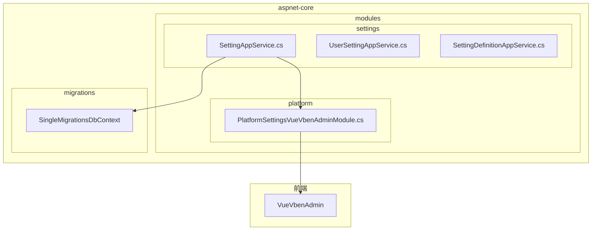
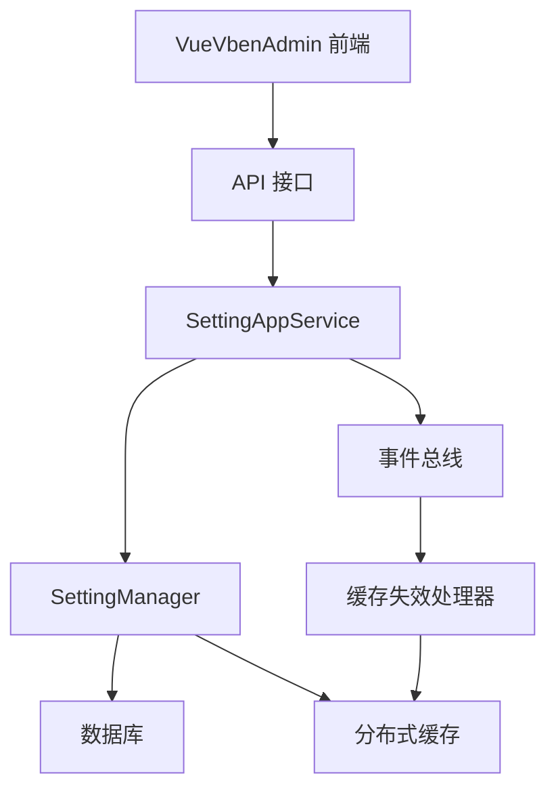

# 系统设置

<cite>
**本文档引用的文件**  
- [SettingAppService.cs](file://aspnet-core/modules/settings/LINGYUN.Abp.SettingManagement.Application/LINGYUN/Abp/SettingManagement/SettingAppService.cs)
- [PlatformSettingsVueVbenAdminModule.cs](file://aspnet-core/modules/platform/LINGYUN.Platform.Settings.VueVbenAdmin/LINGYUN/Platform/Settings/VueVbenAdmin/PlatformSettingsVueVbenAdminModule.cs)
- [DynamicSettingDefinitionStoreCacheInvalidator.cs](file://aspnet-core/modules/settings/LINGYUN.Abp.SettingManagement.Application/LINGYUN/Abp/SettingManagement/DynamicSettingDefinitionStoreCacheInvalidator.cs)
- [CacheAppService.cs](file://aspnet-core/modules/caching-management/LINGYUN.Abp.CachingManagement.Application/LINGYUN/Abp/CachingManagement/CacheAppService.cs)
- [20250813012035_Upgrade-Abp-Framework-To-9.3.1.Designer.cs](file://aspnet-core/migrations/LY.MicroService.Applications.Single.EntityFrameworkCore.MySql/Migrations/20250813012035_Upgrade-Abp-Framework-To-9.3.1.Designer.cs)
</cite>

## 目录
1. [简介](#简介)
2. [项目结构](#项目结构)
3. [核心组件](#核心组件)
4. [架构概述](#架构概述)
5. [详细组件分析](#详细组件分析)
6. [依赖分析](#依赖分析)
7. [性能考虑](#性能考虑)
8. [故障排除指南](#故障排除指南)
9. [结论](#结论)
10. [附录](#附录)（如有必要）

## 简介
本文档详细描述了 abp-next-admin_vben5 项目中系统设置功能的设计与实现。系统设置模块提供了基础设置、安全设置、邮件设置、短信设置等配置项的管理功能，通过 ABP 框架的设置管理机制实现。系统采用模块化设计，支持与 VueVbenAdmin 前端框架的集成，实现了设置的动态加载和实时更新。设置数据持久化存储在数据库中，并通过分布式缓存机制提高访问性能。本文档将深入分析系统设置的模型设计、API 实现、前端集成、持久化策略和缓存机制，并为开发者提供扩展指导和为系统管理员提供最佳实践建议。

## 项目结构
系统设置功能主要分布在 aspnet-core 模块下的 settings 和 platform 目录中。settings 模块负责设置的定义、存储和管理，而 platform 模块则负责与 VueVbenAdmin 前端框架的集成。

**图表来源**  
- [SettingAppService.cs](file://aspnet-core/modules/settings/LINGYUN.Abp.SettingManagement.Application/LINGYUN/Abp/SettingManagement/SettingAppService.cs)
- [PlatformSettingsVueVbenAdminModule.cs](file://aspnet-core/modules/platform/LINGYUN.Platform.Settings.VueVbenAdmin/LINGYUN/Platform/Settings/VueVbenAdmin/PlatformSettingsVueVbenAdminModule.cs)

**章节来源**
- [SettingAppService.cs](file://aspnet-core/modules/settings/LINGYUN.Abp.SettingManagement.Application/LINGYUN/Abp/SettingManagement/SettingAppService.cs)
- [PlatformSettingsVueVbenAdminModule.cs](file://aspnet-core/modules/platform/LINGYUN.Platform.Settings.VueVbenAdmin/LINGYUN/Platform/Settings/VueVbenAdmin/PlatformSettingsVueVbenAdminModule.cs)

## 核心组件
系统设置的核心组件包括设置定义管理、设置值管理、设置分组和设置缓存。设置定义管理负责定义系统中所有可用的设置项，包括其名称、默认值、显示名称和描述。设置值管理负责存储和检索特定提供者（如全局、租户、用户）的设置值。设置分组将相关的设置项组织在一起，便于前端展示。设置缓存通过分布式缓存提高设置读取性能。

**章节来源**
- [SettingAppService.cs](file://aspnet-core/modules/settings/LINGYUN.Abp.SettingManagement.Application/LINGYUN/Abp/SettingManagement/SettingAppService.cs)
- [DynamicSettingDefinitionStoreCacheInvalidator.cs](file://aspnet-core/modules/settings/LINGYUN.Abp.SettingManagement.Application/LINGYUN/Abp/SettingManagement/DynamicSettingDefinitionStoreCacheInvalidator.cs)

## 架构概述
系统设置的架构基于 ABP 框架的设置管理模块，采用分层设计。前端通过 API 调用与后端交互，后端服务处理设置的读取、更新和重置操作。设置定义和设置值存储在数据库中，通过 Entity Framework Core 进行数据访问。为了提高性能，系统使用分布式缓存（如 Redis）来缓存设置数据。当设置被更新时，会触发缓存失效事件，确保缓存数据的一致性。

**图表来源**  
- [SettingAppService.cs](file://aspnet-core/modules/settings/LINGYUN.Abp.SettingManagement.Application/LINGYUN/Abp/SettingManagement/SettingAppService.cs)
- [DynamicSettingDefinitionStoreCacheInvalidator.cs](file://aspnet-core/modules/settings/LINGYUN.Abp.SettingManagement.Application/LINGYUN/Abp/SettingManagement/DynamicSettingDefinitionStoreCacheInvalidator.cs)

## 详细组件分析

### 系统设置模型设计
系统设置模型设计围绕 `SettingDefinition` 和 `Setting` 两个核心概念展开。`SettingDefinition` 定义了设置项的元数据，如名称、默认值、是否可见、是否加密等。`Setting` 则代表具体的设置值，与特定的提供者（Provider）关联。系统支持多种提供者，包括全局提供者（Global）、租户提供者（Tenant）和用户提供者（User），允许不同层级的设置覆盖。

#### 设置分组与配置项
系统设置被组织成多个逻辑分组，