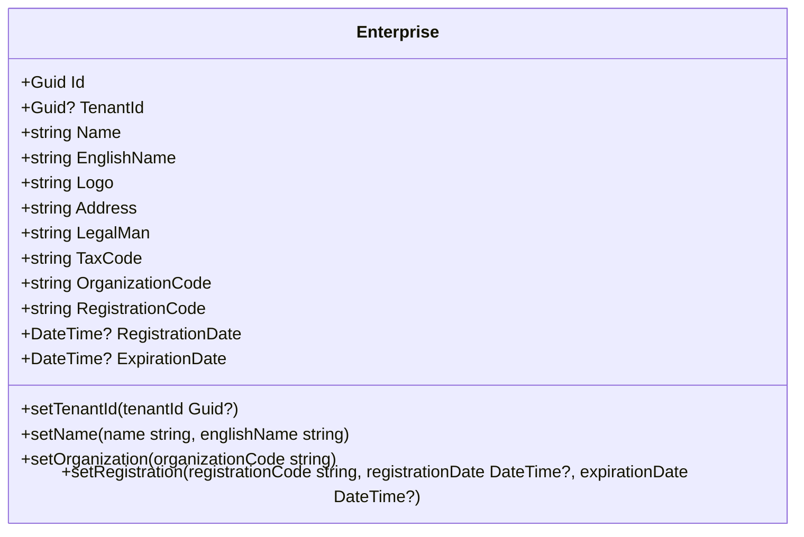
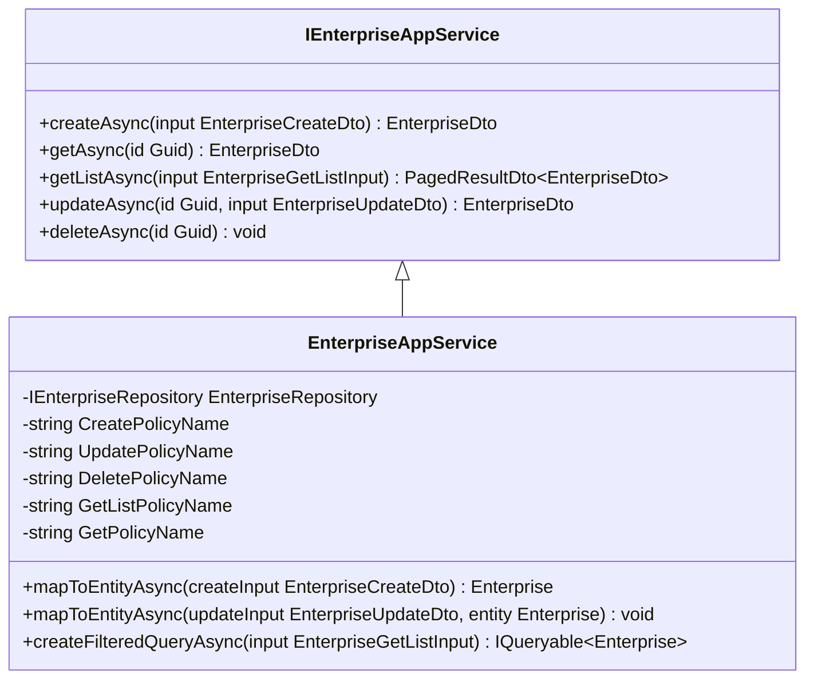
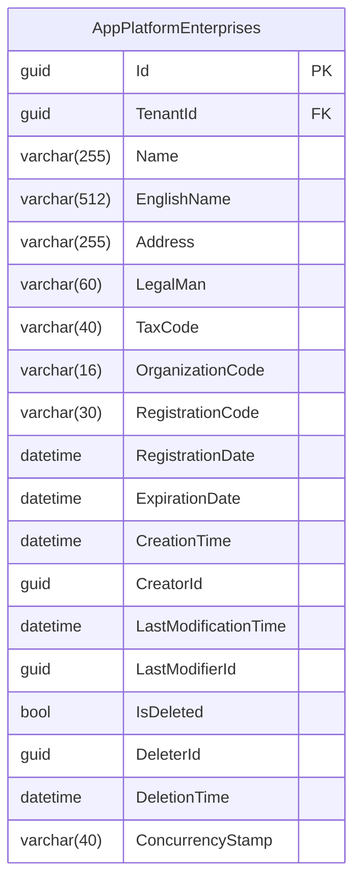
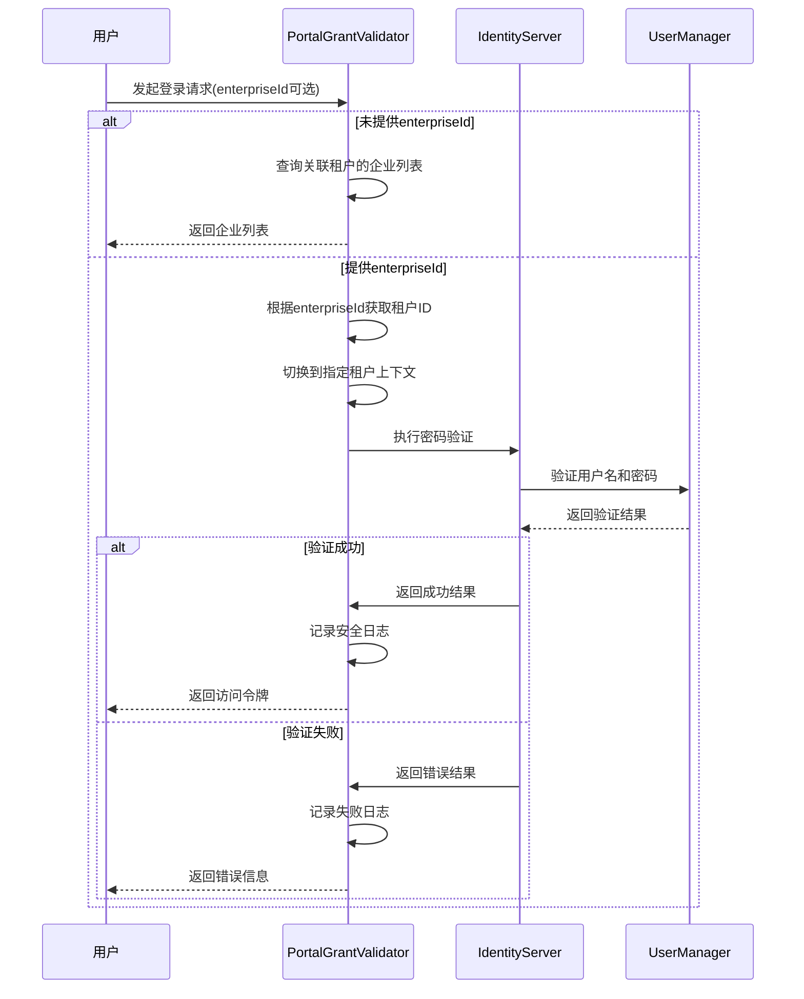

# 门户管理

<cite>
**本文档引用的文件**   
- [Enterprise.cs](file://aspnet-core/modules/platform/LINGYUN.Platform.Domain/LINGYUN/Platform/Portal/Enterprise.cs)
- [EnterpriseConsts.cs](file://aspnet-core/modules/platform/LINGYUN.Platform.Domain.Shared/LINGYUN/Platform/Portal/EnterpriseConsts.cs)
- [EnterpriseAppService.cs](file://aspnet-core/modules/platform/LINGYUN.Platform.Application/LINGYUN/Platform/Portal/EnterpriseAppService.cs)
- [IEnterpriseAppService.cs](file://aspnet-core/modules/platform/LINGYUN.Platform.Application.Contracts/LINGYUN/Platform/Portal/IEnterpriseAppService.cs)
- [EnterpriseDto.cs](file://aspnet-core/modules/platform/LINGYUN.Platform.Application.Contracts/LINGYUN/Platform/Portal/Dto/EnterpriseDto.cs)
- [EnterpriseCreateDto.cs](file://aspnet-core/modules/platform/LINGYUN.Platform.Application.Contracts/LINGYUN/Platform/Portal/Dto/EnterpriseCreateDto.cs)
- [EnterpriseUpdateDto.cs](file://aspnet-core/modules/platform/LINGYUN.Platform.Application.Contracts/LINGYUN/Platform/Portal/Dto/EnterpriseUpdateDto.cs)
- [EnterpriseGetListInput.cs](file://aspnet-core/modules/platform/LINGYUN.Platform.Application.Contracts/LINGYUN/Platform/Portal/Dto/EnterpriseGetListInput.cs)
- [PortalGrantValidator.cs](file://aspnet-core/modules/identityServer/LINGYUN.Abp.IdentityServer.Portal/LINGYUN/Abp/IdentityServer/Portal/PortalGrantValidator.cs)
- [PlatformPermissionDefinitionProvider.cs](file://aspnet-core/modules/platform/LINGYUN.Platform.Application.Contracts/LINGYUN/Platform/Permissions/PlatformPermissionDefinitionProvider.cs)
- [Add-Portal-Login.cs](file://aspnet-core/migrations/LY.MicroService.Platform.EntityFrameworkCore/Migrations/20230506071509_Add-Portal-Login.cs)
</cite>

## 目录
1. [介绍](#介绍)
2. [门户实体模型设计](#门户实体模型设计)
3. [应用程序服务实现](#应用程序服务实现)
4. [领域服务与业务逻辑](#领域服务与业务逻辑)
5. [数据库映射与迁移策略](#数据库映射与迁移策略)
6. [门户认证流程](#门户认证流程)
7. [权限管理](#权限管理)
8. [开发者扩展指南](#开发者扩展指南)
9. [系统管理员最佳实践](#系统管理员最佳实践)
10. [附录](#附录)

## 介绍
门户管理功能是平台的核心组成部分，提供企业门户的全生命周期管理。该功能支持多租户环境下的门户创建、更新、删除和查询操作，同时提供门户认证功能，允许用户通过门户标识进行登录。门户实体包含企业基本信息，如名称、地址、法人代表等，并与租户系统集成，实现租户隔离和自动切换。

**Section sources**
- [Enterprise.cs](file://aspnet-core/modules/platform/LINGYUN.Platform.Domain/LINGYUN/Platform/Portal/Enterprise.cs)
- [PortalGrantValidator.cs](file://aspnet-core/modules/identityServer/LINGYUN.Abp.IdentityServer.Portal/LINGYUN/Abp/IdentityServer/Portal/PortalGrantValidator.cs)

## 门户实体模型设计
门户实体模型`Enterprise`继承自`FullAuditedAggregateRoot<Guid>`，实现了完整的审计功能。实体包含以下核心字段：

- **Id**: 唯一标识符，类型为Guid
- **TenantId**: 关联租户标识，支持多租户
- **Name**: 门户名称，最大长度255字符
- **EnglishName**: 英文名称，最大长度512字符
- **Logo**: Logo地址
- **Address**: 地址，最大长度255字符
- **LegalMan**: 法人代表，最大长度60字符
- **TaxCode**: 税务登记号，最大长度40字符
- **OrganizationCode**: 组织机构代码，最大长度16字符
- **RegistrationCode**: 注册代码，最大长度30字符
- **RegistrationDate**: 注册日期
- **ExpirationDate**: 过期日期

实体提供了安全的属性设置方法，如`SetName`、`SetOrganization`和`SetRegistration`，这些方法在设置属性值前会进行空值和长度验证。实体构造函数强制要求提供名称、地址和税务登记号等关键信息。



**Diagram sources **
- [Enterprise.cs](file://aspnet-core/modules/platform/LINGYUN.Platform.Domain/LINGYUN/Platform/Portal/Enterprise.cs)
- [EnterpriseConsts.cs](file://aspnet-core/modules/platform/LINGYUN.Platform.Domain.Shared/LINGYUN/Platform/Portal/EnterpriseConsts.cs)

**Section sources**
- [Enterprise.cs](file://aspnet-core/modules/platform/LINGYUN.Platform.Domain/LINGYUN/Platform/Portal/Enterprise.cs)
- [EnterpriseConsts.cs](file://aspnet-core/modules/platform/LINGYUN.Platform.Domain.Shared/LINGYUN/Platform/Portal/EnterpriseConsts.cs)

## 应用程序服务实现
门户管理API通过`IEnterpriseAppService`接口提供标准的CRUD操作，该接口继承自`ICrudAppService`，支持创建、读取、更新和删除操作。应用程序服务`EnterpriseAppService`实现了该接口，并集成了权限验证和业务逻辑。

### 门户创建
创建门户时，服务会验证门户名称的唯一性，防止重复创建。创建操作需要`PlatformPermissions.Enterprise.Create`权限。

### 门户更新
更新门户时，服务会检查英文名称是否发生变化，如果变化则验证新名称的唯一性。更新操作需要`PlatformPermissions.Enterprise.Update`权限。

### 门户删除
删除门户操作需要`PlatformPermissions.Enterprise.Delete`权限，并通过`DeleteByIdAsync`方法执行删除。

### 门户查询
查询操作支持分页、排序和过滤。过滤条件包括名称、地址、法人代表、税务登记号等字段的模糊匹配，以及注册日期和过期日期的范围查询。



**Diagram sources **
- [IEnterpriseAppService.cs](file://aspnet-core/modules/platform/LINGYUN.Platform.Application.Contracts/LINGYUN/Platform/Portal/IEnterpriseAppService.cs)
- [EnterpriseAppService.cs](file://aspnet-core/modules/platform/LINGYUN.Platform.Application/LINGYUN/Platform/Portal/EnterpriseAppService.cs)

**Section sources**
- [IEnterpriseAppService.cs](file://aspnet-core/modules/platform/LINGYUN.Platform.Application.Contracts/LINGYUN/Platform/Portal/IEnterpriseAppService.cs)
- [EnterpriseAppService.cs](file://aspnet-core/modules/platform/LINGYUN.Platform.Application/LINGYUN/Platform/Portal/EnterpriseAppService.cs)

## 领域服务与业务逻辑
门户管理的业务逻辑主要集中在`EnterpriseAppService`中，该服务继承自`PlatformApplicationCurdAppServiceBase`，提供了基础的CRUD功能。

### 门户状态管理
门户实体本身不包含显式的状态字段，但通过`ExpirationDate`字段实现过期状态管理。系统可以通过定期任务检查过期的门户并执行相应的业务逻辑。

### 域名验证
虽然当前实现中没有直接的域名验证逻辑，但门户信息中的`Name`字段可以用于标识门户的域名。在实际应用中，可以在`SetName`方法中添加域名格式验证。

### 多租户环境下的门户隔离
门户实体通过`TenantId`字段与租户系统集成，实现多租户环境下的数据隔离。在查询和操作门户时，服务会自动考虑当前租户上下文，确保数据安全。

### 并发控制
门户实体实现了`IHasConcurrencyStamp`接口，使用`ConcurrencyStamp`字段进行乐观并发控制，防止并发更新冲突。

**Section sources**
- [EnterpriseAppService.cs](file://aspnet-core/modules/platform/LINGYUN.Platform.Application/LINGYUN/Platform/Portal/EnterpriseAppService.cs)
- [EnterpriseDto.cs](file://aspnet-core/modules/platform/LINGYUN.Platform.Application.Contracts/LINGYUN/Platform/Portal/Dto/EnterpriseDto.cs)

## 数据库映射与迁移策略
门户实体的数据库映射通过Entity Framework Core实现，支持多种数据库系统，包括MySQL、SQL Server和PostgreSQL。

### 数据库表结构
门户实体映射到`AppPlatformEnterprises`表，主要字段包括：
- `Id`: 主键，char(36)类型
- `TenantId`: 租户标识，char(36)类型
- `Name`: 名称，varchar(255)类型
- `EnglishName`: 英文名称，varchar(512)类型
- `Address`: 地址，varchar(255)类型
- `LegalMan`: 法人代表，varchar(60)类型
- `TaxCode`: 税务登记号，varchar(40)类型
- `OrganizationCode`: 组织机构代码，varchar(16)类型
- `RegistrationCode`: 注册代码，varchar(30)类型

### 迁移策略
门户功能的数据库迁移通过`Add-Portal-Login`迁移实现，该迁移创建了`AppPlatformEnterprises`表并定义了主键约束。迁移脚本支持多数据库平台，使用数据库特定的类型和字符集。



**Diagram sources **
- [Add-Portal-Login.cs](file://aspnet-core/migrations/LY.MicroService.Platform.EntityFrameworkCore/Migrations/20230506071509_Add-Portal-Login.cs)
- [Enterprise.cs](file://aspnet-core/modules/platform/LINGYUN.Platform.Domain/LINGYUN/Platform/Portal/Enterprise.cs)

**Section sources**
- [Add-Portal-Login.cs](file://aspnet-core/migrations/LY.MicroService.Platform.EntityFrameworkCore/Migrations/20230506071509_Add-Portal-Login.cs)
- [Enterprise.cs](file://aspnet-core/modules/platform/LINGYUN.Platform.Domain/LINGYUN/Platform/Portal/Enterprise.cs)

## 门户认证流程
门户认证通过`PortalGrantValidator`实现，这是一个自定义的IdentityServer扩展授权验证器。

### 认证流程
1. 用户发起门户登录请求
2. 系统检查请求中是否包含`enterpriseId`参数
   - 未提供`enterpriseId`: 返回关联了租户信息的企业列表
   - 提供`enterpriseId`: 检索关联的租户信息并切换到指定租户
3. 使用用户名和密码进行身份验证
4. 认证成功后返回访问令牌

### 认证参数
- `grant_type`: "portal" (必填)
- `enterpriseId`: 企业标识 (可选)
- `username`: 用户名 (必填)
- `password`: 密码 (必填)
- `scope`: 请求范围 (可选)

### 认证响应
- 未提供enterpriseId时:
```json
{
    "error": "invalid_grant",
    "enterprises": [
        {
            "id": "企业标识",
            "name": "企业名称",
            "logo": "Logo地址"
        }
    ]
}
```

- 认证成功:
```json
{
    "access_token": "访问令牌",
    "expires_in": 有效期,
    "token_type": "Bearer",
    "refresh_token": "刷新令牌"
}
```



**Diagram sources **
- [PortalGrantValidator.cs](file://aspnet-core/modules/identityServer/LINGYUN.Abp.IdentityServer.Portal/LINGYUN/Abp/IdentityServer/Portal/PortalGrantValidator.cs)

**Section sources**
- [PortalGrantValidator.cs](file://aspnet-core/modules/identityServer/LINGYUN.Abp.IdentityServer.Portal/LINGYUN/Abp/IdentityServer/Portal/PortalGrantValidator.cs)

## 权限管理
门户管理功能集成了基于ABP框架的权限管理系统，通过`PlatformPermissions`类定义了细粒度的权限控制。

### 权限定义
- `PlatformPermissions.Enterprise.Default`: 门户管理默认权限
- `PlatformPermissions.Enterprise.Create`: 创建门户权限
- `PlatformPermissions.Enterprise.Update`: 更新门户权限
- `PlatformPermissions.Enterprise.Delete`: 删除门户权限

### 权限应用
权限通过`[Authorize]`属性应用到控制器和应用程序服务：
- `EnterpriseController`类级别授权使用`PlatformPermissions.Enterprise.Default`
- `CreateAsync`方法授权使用`PlatformPermissions.Enterprise.Create`
- `DeleteAsync`方法授权使用`PlatformPermissions.Enterprise.Delete`

权限定义在`PlatformPermissionDefinitionProvider`中注册，支持多租户场景，其中创建、更新和删除权限仅限宿主端使用。

**Section sources**
- [PlatformPermissionDefinitionProvider.cs](file://aspnet-core/modules/platform/LINGYUN.Platform.Application.Contracts/LINGYUN/Platform/Permissions/PlatformPermissionDefinitionProvider.cs)
- [EnterpriseAppService.cs](file://aspnet-core/modules/platform/LINGYUN.Platform.Application/LINGYUN/Platform/Portal/EnterpriseAppService.cs)

## 开发者扩展指南
开发者可以通过以下方式扩展门户功能：

### 自定义门户属性
通过继承`Enterprise`实体并添加自定义属性，可以扩展门户信息。建议使用ABP框架的扩展属性功能，避免修改核心实体。

### 自定义验证逻辑
在`EnterpriseAppService`的`MapToEntityAsync`方法中添加自定义验证逻辑，如域名格式验证、企业信用代码验证等。

### 自定义查询
通过重写`CreateFilteredQueryAsync`方法，可以添加自定义的查询条件和过滤逻辑。

### 事件处理
订阅门户创建、更新和删除事件，实现自定义的业务逻辑，如发送通知、更新缓存等。

**Section sources**
- [EnterpriseAppService.cs](file://aspnet-core/modules/platform/LINGYUN.Platform.Application/LINGYUN/Platform/Portal/EnterpriseAppService.cs)
- [Enterprise.cs](file://aspnet-core/modules/platform/LINGYUN.Platform.Domain/LINGYUN/Platform/Portal/Enterprise.cs)

## 系统管理员最佳实践
### 门户配置建议
- 为每个门户设置唯一的名称和英文名称
- 定期检查门户的过期日期，及时更新或停用过期门户
- 合理设置门户的Logo和地址信息，确保用户识别

### 安全管理
- 严格控制门户创建、更新和删除权限，仅授权给可信管理员
- 定期审查门户列表，清理不再使用的门户
- 监控门户认证日志，及时发现异常登录行为

### 性能优化
- 为门户名称、英文名称等常用查询字段创建数据库索引
- 使用缓存机制减少频繁的数据库查询
- 定期清理已删除的门户数据，保持数据库性能

**Section sources**
- [Enterprise.cs](file://aspnet-core/modules/platform/LINGYUN.Platform.Domain/LINGYUN/Platform/Portal/Enterprise.cs)
- [PortalGrantValidator.cs](file://aspnet-core/modules/identityServer/LINGYUN.Abp.IdentityServer.Portal/LINGYUN/Abp/IdentityServer/Portal/PortalGrantValidator.cs)

## 附录
### 数据传输对象定义
#### EnterpriseDto
```csharp
public class EnterpriseDto : ExtensibleAuditedEntityDto<Guid>, IHasConcurrencyStamp
{
    public Guid? TenantId { get; set; }
    public string Name { get; set; }
    public string EnglishName { get; set; }
    public string Logo { get; set; }
    public string Address { get; set; }
    public string LegalMan { get; set; }
    public string TaxCode { get; set; }
    public string OrganizationCode { get; set; }
    public string RegistrationCode { get; set; }
    public DateTime? RegistrationDate { get; set; }
    public DateTime? ExpirationDate { get; set; }
    public string ConcurrencyStamp { get; set; }
}
```

#### EnterpriseCreateDto
```csharp
public class EnterpriseCreateDto : EnterpriseCreateOrUpdateDto
{
    [Required]
    [DynamicStringLength(typeof(EnterpriseConsts), nameof(EnterpriseConsts.MaxNameLength))]
    public string Name { get; set; }
}
```

#### EnterpriseUpdateDto
```csharp
public class EnterpriseUpdateDto : Enterprise