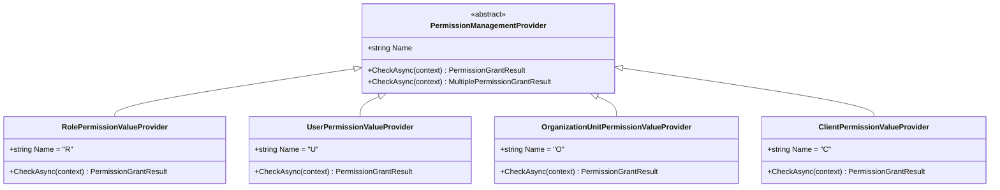

# 权限管理模块

<cite>
**本文档中引用的文件**
- [MultiplePermissionManager.cs](file://aspnet-core/modules/permissions-management/LINGYUN.Abp.PermissionManagement.Application/LINGYUN/Abp/PermissionManagement/MultiplePermissionManager.cs)
- [PermissionDefinitionAppService.cs](file://aspnet-core/modules/permissions-management/LINGYUN.Abp.PermissionManagement.Application/LINGYUN/Abp/PermissionManagement/Definitions/PermissionDefinitionAppService.cs)
- [PermissionGroupDefinitionAppService.cs](file://aspnet-core/modules/permissions-management/LINGYUN.Abp.PermissionManagement.Application/LINGYUN/Abp/PermissionManagement/Definitions/PermissionGroupDefinitionAppService.cs)
- [PermissionAppService.cs](file://aspnet-core/modules/permissions-management/LINGYUN.Abp.PermissionManagement.Application/LINGYUN/Abp/PermissionManagement/PermissionAppService.cs)
- [PermissionDefinitionController.cs](file://aspnet-core/modules/permissions-management/LINGYUN.Abp.PermissionManagement.HttpApi/LINGYUN/Abp/PermissionManagement/HttpApi/Definitions/PermissionDefinitionController.cs)
- [PermissionManagementPermissionDefinitionProvider.cs](file://aspnet-core/modules/permissions-management/LINGYUN.Abp.PermissionManagement.Application.Contracts/LINGYUN/Abp/PermissionManagement/Permissions/PermissionManagementPermissionDefinitionProvider.cs)
- [PermissionManagementErrorCodes.cs](file://aspnet-core/modules/permissions-management/LINGYUN.Abp.PermissionManagement.Application.Contracts/LINGYUN/Abp/PermissionManagement/PermissionManagementErrorCodes.cs)
- [OrganizationUnitPermissionManagementProvider.cs](file://aspnet-core/modules/permissions-management/LINGYUN.Abp.PermissionManagement.Domain.OrganizationUnits/LINGYUN/Abp/PermissionManagement/OrganizationUnits/OrganizationUnitPermissionManagementProvider.cs)
- [OrganizationUnitPermissionValueProvider.cs](file://aspnet-core/framework/authorization/LINGYUN.Abp.Authorization.OrganizationUnits/LINGYUN/Abp/Authorization/Permissions/OrganizationUnitPermissionValueProvider.cs)
- [PermissionChangeState.cs](file://aspnet-core/modules/permissions-management/LINGYUN.Abp.PermissionManagement.Application/LINGYUN/Abp/PermissionManagement/PermissionChangeState.cs)
- [DataAccessResource.cs](file://aspnet-core/framework/data-protection/LINGYUN.Abp.DataProtection.Abstractions/LINGYUN/Abp/DataProtection/DataAccessResource.cs)
- [IDataAuthorizationService.cs](file://aspnet-core/framework/data-protection/LINGYUN.Abp.DataProtection.Abstractions/LINGYUN/Abp/DataProtection/IDataAuthorizationService.cs)
</cite>

## 目录
1. [简介](#简介)
2. [项目结构](#项目结构)
3. [核心组件](#核心组件)
4. [架构概览](#架构概览)
5. [详细组件分析](#详细组件分析)
6. [依赖关系分析](#依赖关系分析)
7. [性能考虑](#性能考虑)
8. [故障排除指南](#故障排除指南)
9. [结论](#结论)

## 简介

权限管理模块是ABP Next Admin框架中的核心安全组件，提供了细粒度的权限控制能力。该模块实现了功能权限、数据权限、字段权限等多种权限类型的统一管理，支持基于角色的访问控制(RBAC)和基于属性的访问控制(ABAC)等现代权限管理策略。

该模块的主要特点包括：
- 统一的权限定义和管理接口
- 多租户权限支持
- 组织单元权限集成
- 动态权限存储
- 数据保护和字段级权限控制
- 完整的RESTful API接口

## 项目结构

权限管理模块采用分层架构设计，包含以下主要组件：

**图表来源**
- [MultiplePermissionManager.cs](file://aspnet-core/modules/permissions-management/LINGYUN.Abp.PermissionManagement.Application/LINGYUN/Abp/PermissionManagement/MultiplePermissionManager.cs#L1-L107)
- [PermissionDefinitionAppService.cs](file://aspnet-core/modules/permissions-management/LINGYUN.Abp.PermissionManagement.Application/LINGYUN/Abp/PermissionManagement/Definitions/PermissionDefinitionAppService.cs#L1-L302)

**章节来源**
- [README.md](file://aspnet-core/modules/permissions-management/LINGYUN.Abp.PermissionManagement.Application/README.md#L1-L63)
- [AbpPermissionManagementApplicationModule.cs](file://aspnet-core/modules/permissions-management/LINGYUN.Abp.PermissionManagement.Application/LINGYUN/Abp/PermissionManagement/AbpPermissionManagementApplicationModule.cs#L1-L11)

## 核心组件

### 权限定义模型

权限定义模型是权限管理系统的基础，支持层次化的权限结构：

**图表来源**
- [PermissionDefinitionDto.cs](file://aspnet-core/modules/permissions-management/LINGYUN.Abp.PermissionManagement.Application.Contracts/LINGYUN/Abp/PermissionManagement/Definitions/Dto/PermissionDefinitionDto.cs#L1-L27)
- [PermissionDefinitionRecord.cs](file://aspnet-core/modules/permissions-management/LINGYUN.Abp.PermissionManagement.Domain.OrganizationUnits/LINGYUN/Abp/PermissionManagement/OrganizationUnits/PermissionDefinitionRecord.cs#L1-L50)

### 权限分配策略

权限分配策略支持多种提供者类型：

**图表来源**
- [OrganizationUnitPermissionValueProvider.cs](file://aspnet-core/framework/authorization/LINGYUN.Abp.Authorization.OrganizationUnits/LINGYUN/Abp/Authorization/Permissions/OrganizationUnitPermissionValueProvider.cs#L1-L81)

**章节来源**
- [PermissionDefinitionAppService.cs](file://aspnet-core/modules/permissions-management/LINGYUN.Abp.PermissionManagement.Application/LINGYUN/Abp/PermissionManagement/Definitions/PermissionDefinitionAppService.cs#L30-L53)
- [PermissionGroupDefinitionAppService.cs](file://aspnet-core/modules/permissions-management/LINGYUN.Abp.PermissionManagement.Application/LINGYUN/Abp/PermissionManagement/Definitions/PermissionGroupDefinitionAppService.cs#L27-L50)

## 架构概览

权限管理模块采用分层架构，实现了清晰的关注点分离：

**图表来源**
- [PermissionDefinitionController.cs](file://aspnet-core/modules/permissions-management/LINGYUN.Abp.PermissionManagement.HttpApi/LINGYUN/Abp/PermissionManagement/HttpApi/Definitions/PermissionDefinitionController.cs#L1-L61)
- [PermissionAppService.cs](file://aspnet-core/modules/permissions-management/LINGYUN.Abp.PermissionManagement.Application/LINGYUN/Abp/PermissionManagement/PermissionAppService.cs#L1-L43)

## 详细组件分析

### 多权限管理器

多权限管理器是权限管理的核心组件，负责处理复杂的权限分配逻辑：

**图表来源**
- [MultiplePermissionManager.cs](file://aspnet-core/modules/permissions-management/LINGYUN.Abp.PermissionManagement.Application/LINGYUN/Abp/PermissionManagement/MultiplePermissionManager.cs#L35-L107)

**章节来源**
- [MultiplePermissionManager.cs](file://aspnet-core/modules/permissions-management/LINGYUN.Abp.PermissionManagement.Application/LINGYUN/Abp/PermissionManagement/MultiplePermissionManager.cs#L35-L107)

### 权限验证流程

权限验证流程确保权限分配的安全性和一致性：

**图表来源**
- [MultiplePermissionManager.cs](file://aspnet-core/modules/permissions-management/LINGYUN.Abp.PermissionManagement.Application/LINGYUN/Abp/PermissionManagement/MultiplePermissionManager.cs#L35-L107)

### 组织单元权限集成

组织单元权限集成提供了基于组织结构的权限控制：

**图表来源**
- [OrganizationUnitPermissionManagementProvider.cs](file://aspnet-core/modules/permissions-management/LINGYUN.Abp.PermissionManagement.Domain.OrganizationUnits/LINGYUN/Abp/PermissionManagement/OrganizationUnits/OrganizationUnitPermissionManagementProvider.cs#L1-L106)
- [OrganizationUnitPermissionValueProvider.cs](file://aspnet-core/framework/authorization/LINGYUN.Abp.Authorization.OrganizationUnits/LINGYUN/Abp/Authorization/Permissions/OrganizationUnitPermissionValueProvider.cs#L1-L81)

**章节来源**
- [OrganizationUnitPermissionManagementProvider.cs](file://aspnet-core/modules/permissions-management/LINGYUN.Abp.PermissionManagement.Domain.OrganizationUnits/LINGYUN/Abp/PermissionManagement/OrganizationUnits/OrganizationUnitPermissionManagementProvider.cs#L1-L106)

### 数据权限控制

数据权限控制提供了细粒度的数据访问控制：

**图表来源**
- [DataAccessResource.cs](file://aspnet-core/framework/data-protection/LINGYUN.Abp.DataProtection.Abstractions/LINGYUN/Abp/DataProtection/DataAccessResource.cs#L1-L58)
- [IDataAuthorizationService.cs](file://aspnet-core/framework/data-protection/LINGYUN.Abp.DataProtection.Abstractions/LINGYUN/Abp/DataProtection/IDataAuthorizationService.cs#L1-L18)

**章节来源**
- [DataAccessResource.cs](file://aspnet-core/framework/data-protection/LINGYUN.Abp.DataProtection.Abstractions/LINGYUN/Abp/DataProtection/DataAccessResource.cs#L1-L58)
- [IDataAuthorizationService.cs](file://aspnet-core/framework/data-protection/LINGYUN.Abp.DataProtection.Abstractions/LINGYUN/Abp/DataProtection/IDataAuthorizationService.cs#L1-L18)

## 依赖关系分析

权限管理模块具有清晰的依赖关系结构：

**图表来源**
- [AbpPermissionManagementApplicationModule.cs](file://aspnet-core/modules/permissions-management/LINGYUN.Abp.PermissionManagement.Application/LINGYUN/Abp/PermissionManagement/AbpPermissionManagementApplicationModule.cs#L1-L11)
- [AbpPermissionManagementHttpApiModule.cs](file://aspnet-core/modules/permissions-management/LINGYUN.Abp.PermissionManagement.HttpApi/LINGYUN/Abp/PermissionManagement/HttpApi/AbpPermissionManagementHttpApiModule.cs#L1-L38)

**章节来源**
- [AbpPermissionManagementApplicationModule.cs](file://aspnet-core/modules/permissions-management/LINGYUN.Abp.PermissionManagement.Application/LINGYUN/Abp/PermissionManagement/AbpPermissionManagementApplicationModule.cs#L1-L11)
- [AbpPermissionManagementHttpApiModule.cs](file://aspnet-core/modules/permissions-management/LINGYUN.Abp.PermissionManagement.HttpApi/LINGYUN/Abp/PermissionManagement/HttpApi/AbpPermissionManagementHttpApiModule.cs#L1-L38)

## 性能考虑

权限管理模块在设计时充分考虑了性能优化：

### 缓存策略
- 权限定义缓存：减少数据库查询次数
- 权限授权缓存：提高权限验证速度
- 组织单元权限缓存：优化大规模组织结构的权限查询

### 查询优化
- 延迟加载：按需加载权限定义
- 批量操作：支持批量权限分配
- 索引优化：为权限相关字段建立索引

### 内存管理
- 对象池：复用权限对象
- 弱引用：避免内存泄漏
- 分页查询：限制单次查询数据量

## 故障排除指南

### 常见错误代码

权限管理模块定义了完整的错误代码体系：

**图表来源**
- [PermissionManagementErrorCodes.cs](file://aspnet-core/modules/permissions-management/LINGYUN.Abp.PermissionManagement.Application.Contracts/LINGYUN/Abp/PermissionManagement/PermissionManagementErrorCodes.cs#L1-L30)

### 调试技巧

1. **启用详细日志**：配置权限管理的日志级别
2. **权限验证跟踪**：记录权限验证过程
3. **性能监控**：监控权限查询性能
4. **缓存状态检查**：验证缓存有效性

**章节来源**
- [PermissionManagementErrorCodes.cs](file://aspnet-core/modules/permissions-management/LINGYUN.Abp.PermissionManagement.Application.Contracts/LINGYUN/Abp/PermissionManagement/PermissionManagementErrorCodes.cs#L1-L30)

## 结论

权限管理模块是一个功能完整、设计精良的权限控制系统，它提供了：

1. **统一的权限管理接口**：支持多种权限类型和提供者
2. **灵活的权限分配策略**：支持RBAC和ABAC模型
3. **强大的数据保护能力**：实现字段级和记录级权限控制
4. **完善的API支持**：提供RESTful API接口
5. **优秀的性能表现**：通过缓存和优化提升性能

该模块为开发者提供了构建安全、可扩展的企业应用所需的权限管理基础，同时为系统管理员提供了直观的权限配置界面和管理工具。通过合理的架构设计和丰富的功能特性，权限管理模块能够满足各种复杂场景下的权限控制需求。